# Краткое руководство по использованию Multisim 14.1
[#Цель работы](#цель-работы)

**[`MultiSim`](https://onedrive.live.com/?authkey=%21AM%2DwBKXV%2D0kQXlE&id=A4E122951888DC80%2125389&cid=A4E122951888DC80)** – это эмулятор схем, который позволяет моделировать и тестировать электрические схемы с использованием виртуальных приборов.  
Дальнейшие настройки актуальны для версии Multisim 14.1.  

## Глобальные настройки

Глобальные настройки управляют свойствами среды Multisim. Доступ к ним открывается из диалогового окна `Установки (Options)`. Выберите пункт `Установки/Общие установки (Options/Global options)`, откроется окно `Общие установки (Global options)` со следующими закладками 
* `Paths (Директории)` – здесь вы можете указать путь к файлам баз данных и другие настройки 
* `Message prompts (Сообщения)` – здесь вы можете выбрать сообщения, которые будут отображаться в различных ситуациях 
* `Save (Сохранение)` – здесь вы можете настроить период автоматического сохранения и нужно ли записывать данные эмуляции вместе с прибором. 
* `Components (Компоненты)` – здесь вы можете выбрать режим размещения компонентов и стандарт символов (ANSI или IEC). Также здесь находятся настройки эмуляции по умолчанию.
* `General (Основные)` – здесь вы можете изменить поведение прямоугольника выбора, колеса мыши и инструментов соединения и автоматического соединения.
* `Simulation (Моделирование)` – здесь вы можете выбрать цвет фона для графиков при моделировании, а также выбрать действие при ошибках и предупреждениях
* `Preview (Просмотр)` – здесь вы можете выбрать режимы отображения

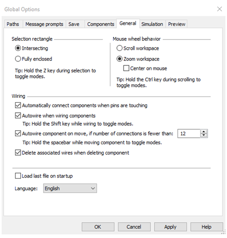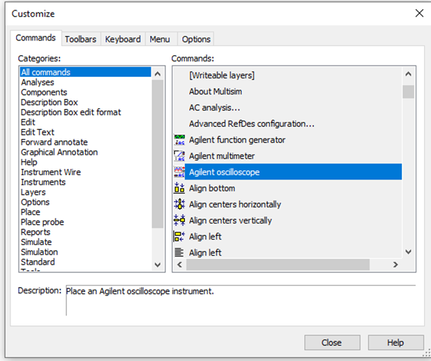

Рисунок 1 – Глобальные настройки

## Настройка пользовательского интерфейса  
Пользовательский интерфейс Multisim можно настроить на свой вкус, изменения зависят друг от друга. Панели инструментов можно закрепить в любом месте и изменить их форму. Инструменты всех панелей также можно изменять и создавать новые панели. Система меню также полностью настраивается, вплоть до контекстных меню разных объектов.
Горячие клавиши клавиатуры тоже можно настроить. Любой команде меню или панели инструментов можно назначить свою клавишу.  
> Чтобы назначенные клавиши не пересекались с командами интерактивных элементов, советуем назначать комбинации клавиш, например Ctrl-E.

Например, для листа схемы и описания можно назначить свою комбинацию горячих клавиш и дополнительных окон.
Для настройки пользовательского интерфейса выберите пункт `"Установки/Модифицировать интерфейс (Options/Customize interface)`. С помощью диалогового окна `Модификация (Customize)` вы можете создавать и изменять панели инструментов, назначать горячие клавиши, настраивать и создавать новые меню, а также изменять стиль пользовательского интерфейса.
  

 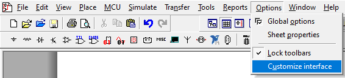

Рисунок 2 – Диалоговое окно "Модификация"
/
  

 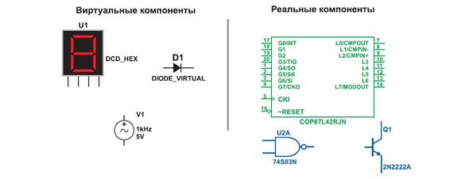

Рисунок 3 – Настройка меню

## Компоненты

### Общий обзор

`Компоненты` – это все элементы, из которых состоит схема. Multisim оперирует с двумя категориями компонентов: `реальными (real)` и `виртуальными (virtual)`. Необходимо ясно понимать различия между ними, чтобы в полной мере воспользоваться их преимуществами.  
У реальных компонентов, в отличие от виртуальных есть определенное, неизменяемое значение и свое соответствие на печатной плате.  
Виртуальные компоненты нужны только для эмуляции, пользователь может назначить им произвольные параметры. Например, сопротивление виртуального резистора может быть произвольным, даже 3,86654 Ома. Виртуальные компоненты помогают разработчикам при проверке с помощью схем с известными значениями компонентов. Виртуальные компоненты также могут не соответствовать реальным.  
В Multisim есть и другая классификация компонентов: аналоговые, цифровые, смешанные, анимированные, интерактивные, цифровые с мультивыбором, электромеханические и радиочастотные.  

 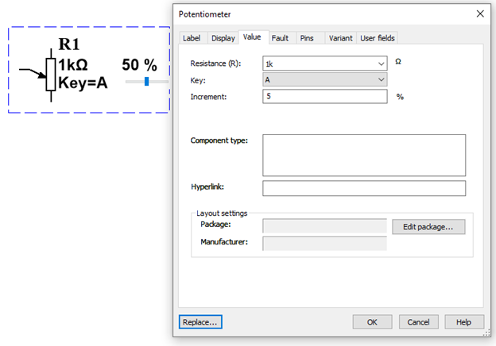

Рисунок 4 – Cимволы некоторых компонентов: 7-сегментный дисплей, диод D1, источник напряжения V1, логический элемент U2A, микроконтроллер и транзистор Q1 
  

### Интерактивные компоненты  
Некоторые элементы схемы Multisim могут реагировать на действия пользователя. Изменение этих элементов сразу отражается на результатах эмулирования. Компоненты управляются с помощью клавиш, указанных под каждым элементом.  
Например, на рисунке 5 клавиша А увеличивает сопротивление потенциометра до 100% от указанной величины (1 кОм). Чтобы уменьшить сопротивление, прижмите Shift и нажмите А.

 

Рисунок 5 – Пример интерактивных компонентов (потенциометр) 

Пробел открывает или закрывает выключатель на рисунке 6.  

 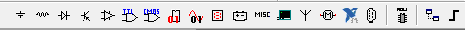

Рисунок 6 – Пример интерактивных компонентов (ключ) 

Горячую клавишу можно выбрать следующим образом: при двойном щелчке мыши откроется окно, в выпадающем меню которого можно выбрать нужную клавишу.

### Характеристики компонентов
В проводнике компонентов отображаются следующие поля:  

 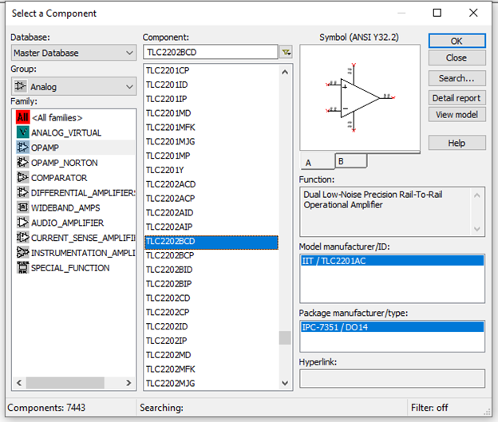

Рисунок 7 – Панель инструментов "Компоненты" (Component)
/

 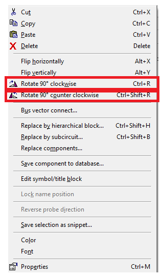

Рисунок 8 – Проводник "Компонентов"

### Выбор компонента  
Выбор компонента (Select a Component) – это место, где вы выбираете компоненты, чтобы разместить их на схеме. Горячая клавиша по умолчанию для размещения компонента – Ctrl-W. Курсор мыши примет форму компонента, пока вы не выберите место на схеме для компонента.  
Для поиска просто начните набирать название компонента и проводник автоматически подберет подходящие элементы. Кнопка Поиск (Search) открывает расширенный поиск.  
В Проводнике компонентов отображается текущая база данных, в которой хранятся отображаемые элементы. В Multisim они организованы в группы (groups) и семейства (families). Также в проводнике отображается описание компонента (поле Назначение Function), модель и печатная плата или производитель.
 
### Сдвиг, поворот и выделение  
После выбора компонентов из базы данных они размещаются на схеме и соединяются между собой. Двойной щелчок по компоненту в проводнике прикрепит его к курсору. После этого можно поместить элемент на схему, просто кликнув в желаемом месте.  
В это время и после установки компоненты можно повернуть. Чтобы это сделать в первом случае, нажмите Ctrl-R. Чтобы повернуть установленный компонент, выделите его и тоже нажмите Ctrl-R или выберите в контекстном пункте пункт повернуть на 90° по или против часовой стрелки.

 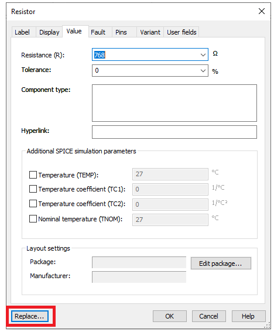

Рисунок 9 – Поворот компонента

Чтобы выбрать компонент, просто щелкните по нему мышью. Для выбора нескольких компонентов прижмите кнопку мыши и перемещайте ее, рисуя прямоугольник выбора вокруг нужных компонентов. Выбранные компоненты обозначаются пунктирной линией. Можно выбрать отдельные элементы, например значение или метку компонента. Выбор осуществляется одинарным щелчком мыши по нужному элементу. 
Клавиша Shift позволяет добавлять или снимать выделение с нескольких компонентов.  
Компоненты можно заменять на другие с помощью их контекстного меню, пункта Заменить компонент(ы) (Replace Component(s)). Новые компоненты выбираются в открывшемся дополнительном окне проводника компонентов. Соединения компонентов после замены Multisim восстановит.

 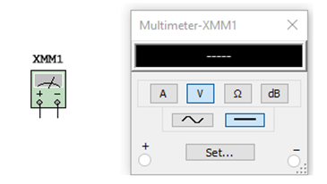

Рисунок 10 –Замена компонента

## Виртуальные приборы  
Виртуальные приборы – это модельные компоненты Multisim, которые соответствуют реальным приборам. Например, среди виртуальных приборов в Multisim есть осциллографы, генераторы сигналов, сетевые анализаторы и плоттеры боде.  
Виртуальные приборы – это простой и понятный метод взаимодействия со схемой, почти не отличающийся от традиционного при тестировании или создании прототипа.

### Мультиметр
Мультиметр предназначен для измерения переменного или постоянного тока или напряжения, сопротивления или затухания между двумя узлами схемы. Диапазон измерений мультиметра подбирается автоматически.  
Его внутреннее сопротивление и ток близки к идеальным значениям, но их можно изменить.

 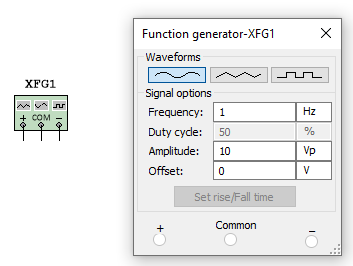

Рисунок 11 – Символ и лицевая панель мультиметра

### Генератор сигналов
Генератор сигналов (function generator) – это источник напряжения, который может генерировать синусоидальные, пилообразные и прямоугольные импульсы. Можно изменить форму сигнала, его частоту, амплитуду, коэффициент заполнения и постоянный сдвиг. Диапазон генератора достаточен, чтобы воспроизвести сигналы с частотами от несколько герц до аудио и радиочастотных.  
У генератора сигналов есть три терминала-источника импульсов. Общий центральный терминал определяет положение нуля.

 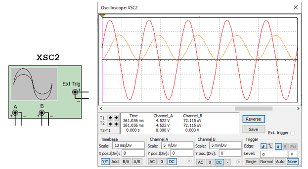

Рисунок 12 – Символ и лицевая панель генератора сигналов

### Осциллографы
В Multisim есть несколько модификаций осциллографов, которыми можно управлять как настоящими. Они позволяют устанавливать параметры временно развертки и напряжения, выбирать тип и уровень запуска измерений. Данные специальные осциллографов Multisim можно посмотреть после эмуляции с помощью самописца (Grapher) из меню Вид/Плоттер (View/Grapher).

 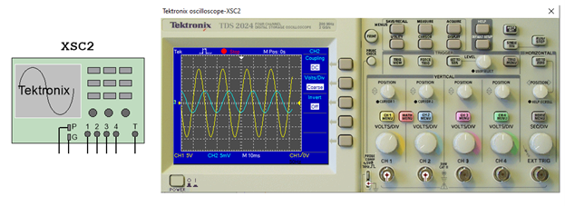

Рисунок 13 – Символ и лицевая панель осциллографа

В Multisim есть следующие осциллографы:
* 2-х канальный
* 4-х канальный
* Осциллограф смешанных сигналов Agilent 54622D
* 4-х канальный цифровой осциллограф с записью Tektronix TDS 2024

 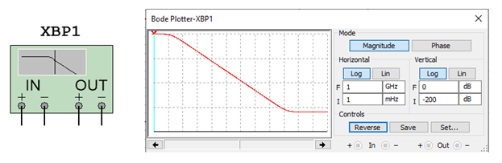

Рисунок 14 – Символ и лицевая панель осциллографа Tektronix

### Плоттер Боде

Плоттер Боде отображает относительный фазовый или амплитудный отклик входного и выходного сигнала. Это особенно удобно при анализе свойств полосовых фильтров.

 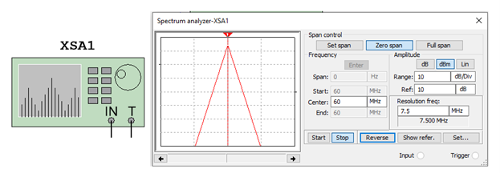

Рисунок 15 – Символ и лицевая панель Плоттер Боде

### Спектральный анализатор

Спектральный анализатор (spectrum analyzer) служит для измерения амплитуды гармоники с заданной частотой. Также он может измерить мощность сигнала и частотных компонент, определить наличие гармоник в сигнале.  
Результаты работы спектрального анализатора отображаются в спектральной области, а не временной. Обычно сигнал – это функция времени, для ее измерения используется осциллограф. Иногда ожидается синусоидальный сигнал, но он может содержать дополнительные гармоники. В результате, невозможно измерить уровень сигнала. Если же сигнал измеряется спектральным анализатором, получается частотный состав сигнала, т.е. амплитуда основной и дополнительных гармоник.

 

Рисунок 16 – Символ и лицевая панель спектрального анализатора

