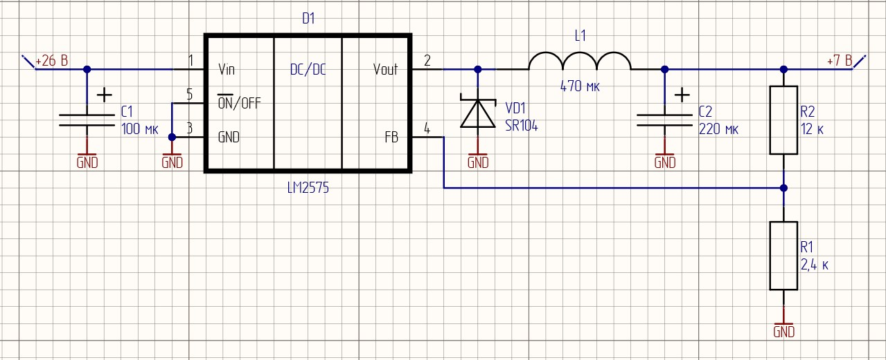

# Методические рекомендации по расчету импульсного преобразователя напряжения

## Теоретическая часть

Расчеты КПД линейных стабилизаторов показывают, что при преобразовании высокого входного напряжения в низкое выходное приходится сталкиваться с серьезными проблемами тепловыделения. Кроме того, возникают ситуации, когда необходимо организовать питание с напряжением питания выше, чем может обеспечить источник питания. В таких случаях на помощь приходят схемы на основе импульсных преобразователей напряжения.

Импульсные стабилизаторы подразделяются на повышающие, понижающие и инвертирующие преобразователи.
### Приницп работы
#### Повышающий преобразователь
#### Понижающий преобразователь
#### Инвертирующий преобразователь

## Практическая часть

### Пример

В рамках данной курсовой работы вам предстоит произвести расчеты для схемы на основе импульного преобразователя напряжения для формирования необходимого уровня напряжения для питания схемы. В качестве примера рассмотрим понижающий DC-DC преобразователь серии LM2575. [Cпецификация LM2575](https://static.chipdip.ru/lib/927/DOC012927213.pdf)

Компонент представлен в версиях с фиксированным выходным напряжением (3,3 В, 5 В, 12 В, 15 В) и с регулируемым. Последние могут формировать уровень напряжения в диапазоне от 1,23 В до 37 В. Разберем расчет LM2575 c регулируемым выходом, Uвых которого зависит от коэффициента обратной связи.

Для начала необходимо определиться, в каком именно корпусе будет импульсник (в спецификации предлагается 5 вариантов). Остановим выбор на компоненте в корпусе TO-220.

<p align="center" > </p>

<p align="center" >Рисунок 1 – LM2575 в корпусе TO-220 </p> 

Пусть для примера $U_{in}\ = 26 \ В,\  U_{out}\ = 7 \ В,\  R_{н}\ = 10 \ Ом,\  f \= 52 \ кГц $

Для формирования необходимого уровня напряжения на выходе, необходимо правильно подобрать компоненты обвязки, которые обеспечат необходимый коэффициент обратной связи. Обратимся к разделу спецификации `TEST CIRCUIT AND LAYOUT GUIDELINES`

<p align="center" > </p>

<p align="center" >Рисунок 2 – Подключение преобразователя с регулируемым выходом </p> 

#### Резисторы R_1, R_2

В спецификации приведено отношение номиналов резисторов обратной связи и выходного напряжения

```math
U_{out}= U_{ref} \cdot (1 + \frac{R_2}{R_1})
```
$R_{1}\$ нужно выбрать из диапазона (1 - 5) кОм, возьмем, допустим, $2,4 \ кОм$. $U_{ref}\$ для данного компонента составляет 1,23 В. Учитывая выходное напряжение проебразователя, вычисляем по формуле значение $R_{2}\$.

```math
R_{2}= R_{1} \cdot (\frac{U_{out}}{U_{ref}} - 1)
```

```math
R_{2}= 2,4 \cdot 10^3 \cdot (\frac{7}{1,23} - 1) ≈ 11,2\ кОм
```
Используя `номинальный ряд E24`, $R_{2}\ = 12\ кОм$.

#### Катушка индуктивности L

Используя формулу из спецификации, рассчитаем константу индуктивности
```math
V \cdot T (В \cdot мксек) = (U_{in} - U_{out}) \cdot \frac{U_{out}}{U_{in}} \cdot \frac{1000}{f (кГц)}
```
```math
V \cdot T = (26 - 7) \cdot \frac{7}{26} \cdot \frac{1000}{52} ≈ 98 \ (В \cdot мксек)
```
$R_{н}\ = 10 \ Ом$. По закону Ома выходной ток $I_{out}$ (или $I_{н}$) равен

```math
I_{out}= \frac{U_{R_{н}}}{R_{н}} = \frac {7}{10} = 0,7 \ А
```
Данное значение является максимальный током нагрузки.
По схеме из спецификации (по оси X - максимальный ток нагрузки, Y - константа индуктивности) на Рисунке 3 определим необходимый регион индуктивности и воспользуемся данными на Рисунке 4 для определения номинала катушки.

<p align="center" > </p>

<p align="center" >Рисунок 3 – Выбор области для катушки индуктивности </p> 

<p align="center" > </p>

<p align="center" >Рисунок 4 – Выбор номинала катушки индуктивности </p> 

Получаем $L = 470 \ мкГн$.

#### Диод Шоттки VD

Значение тока через диод должно быть хотя бы в 1,2 раза больше значения $I_{н}$ а максимальное обратное напряжение диода должно быть минимум в 1,25 раз больше входного напряжения. Тогда
```math
I_{f} > 1,2 \cdot 0,7 = 0,84 \ А
```
```math
V_{DC} > 1,25 \cdot 26 = 32,5 \ В
```
Воспользуемся подсказкой из даташита, учитывая полученные значения.
<p align="center" > </p>

<p align="center" >Рисунок 5 – Выбор диода Шоттки </p> 

Остановим выбор на SR104.

#### Конденсатор C_in

По спецификации рекомендуется устаовить обычный или танталовый конденсатор емкостью $100 \ мкФ$. $С_{in}\$ располагается максимально близко к микросхеме, чтобы минимизировать появление помех на входе преобразователя.

#### Конденсатор С_out

Значение выходного конденсатора вместе с катушкой индуктивности определяет доминирующую пару полюсов контура переключающего регулятора. Для стабильной работы конденсатор должен удовлетворять следующему требованию

```math
С_{out} > 7,785 \cdot  \frac{U_{in_{max}}}{U_{out}\cdot L(мкГн)}
```

```math
С_{out} > 7,785 \cdot  \frac{26}{7\cdot 470} = 61 \ мкФ
```

По этой формуле можно получить значение номинала $С_{out}\$ в диапазоне (10 - 2000) мкФ. Но не спешите подбирать ближайший по номинальному ряду значение конденсатора. В спецификации указан следующий нюанс: во избежание неприемлимых пульсаций на выходе рекомендуется брать $С_{out}$ номиналом не менее 220 мкФ. Итог: будем использовать в схеме танталовый конденсатор $С_{out}\ = 220 \ мкФ$.

#### Схема подключения LM2575

Номиналы компонентов обвязки получились следующие:

$R_{1}\ = 2,4\ кОм$

$R_{2}\ = 12\ кОм$

$L\ = 470\ мкГн$

$VD\  -\  SR104$

$С_{in}\ = 100 \ мкФ$

$С_{out}\ = 220 \ мкФ$

Изобразим подключенную схему согласно спецификации (Рисунок 2) в `САПР Altium Designer`:

<p align="center" > </p>

<p align="center" >Рисунок 6 – LM2575 с компонентами обвязки </p> 

Нумерация резисторов произведена как в даташите во избежание путаницы.
