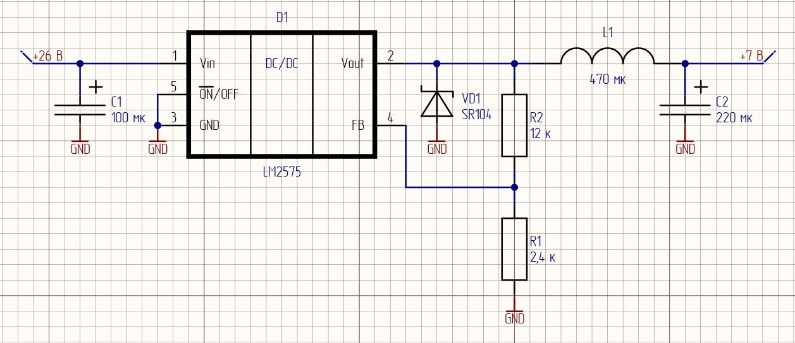

# Методические рекомендации по расчету импульсного преобразователя напряжения

## Теоретическая часть

Расчеты КПД линейных стабилизаторов показывают, что при преобразовании высокого входного напряжения в низкое выходное приходится сталкиваться с серьезными проблемами тепловыделения. Кроме того, возникают ситуации, когда необходимо организовать питание с напряжением питания выше, чем может обеспечить источник питания. В таких случаях на помощь приходят схемы на основе импульсных преобразователей напряжения.

### Приницп работы


## Практическая часть

### Пример

В рамках данной курсовой работы вам предстоит произвести расчеты для схемы на основе импульного преобразователя напряжения для формирования необходимого уровня напряжения для питания схемы. В качестве примера рассмотрим понижающий DC-DC преобразователь серии LM2575. [Cпецификация LM2575](https://static.chipdip.ru/lib/927/DOC012927213.pdf)

Компонент представлен в версиях с фиксированным выходным напряжением (3,3 В, 5 В, 12 В, 15 В) и с регулируемым. Последние могут формировать уровень напряжения в диапазоне от 1,23 В до 37 В. Разберем расчет LM2575 c регулируемым выходом, Uвых которого зависит от коэффициента обратной связи.

Для начала необходимо определиться, в каком именно корпусе будет импульсник (в спецификации предлагается 5 вариантов). Остановим выбор на компоненте в корпусе TO-220.

<p align="center" > </p>

<p align="center" >Рисунок 1 – LM2575 в корпусе TO-220 </p> 

Пусть для примера $U_{in}\ = 26 \ В,\  U_{out}\ = 7 \ В,\  R_{н}\ = 10 \ Ом,\  f \= 52 \ кГц $

Для формирования необходимого уровня напряжения на выходе, необходимо правильно подобрать компоненты обвязки, которые обеспечат необходимый коэффициент обратной связи. Обратимся к разделу спецификации `TEST CIRCUIT AND LAYOUT GUIDELINES`

<p align="center" > </p>

<p align="center" >Рисунок 2 – Подключение преобразователя с регулируемым выходом </p> 

Резисторы $R_{1}\$, $R_{2}\$

В спецификации приведено отношение номиналов резисторов обратной связи и выходного напряжения

```math
U_{out}= U_{ref} \cdot (1 + \frac{R_2}{R_1})
```
$R_{1}\$ нужно выбрать из диапазона (1 - 5) кОм, возьмем, допустим, $2,4 \ кОм$. $U_{ref}\$ для данного компонента составляет 1,23 В. Учитывая выходное напряжение проебразователя, вычисляем по формуле значение $R_{2}\$.

```math
R_{2}= R_{1} \cdot (\frac{U_{out}}{U_{ref}} - 1)
```

```math
R_{2}= 2,4 \cdot 10^3 \cdot (\frac{7}{1,23} - 1) ≈ 11,2\ кОм
```
Используя `номинальный ряд E24`, $R_{2}\ = 12\ кОм$

Катушка индуктивности $L$

Используя формулу из спецификации, рассчитаем константу индуктивности
```math
V \cdot T (В \cdot мксек) = (U_{in} - U_{out}) \cdot \frac{U_{out}}{U_{in}} \cdot \frac{1000}{f (кГц)}
```
```math
V \cdot T = (26 - 7) \cdot \frac{7}{26} \cdot \frac{1000}{52} ≈ 98 \ (В \cdot мксек)
```
$R_{н}\ = 10 \ Ом$. По закону Ома выходной ток $I_{out}$ (или $I_{н}$) равен

```math
I_{out}= \frac{U_{R_{н}}}{R_{н}} = \frac {7}{10} = 0,7 \ А
```
Данное значение является максимальный током нагрузки.
По схеме из спецификации (по оси X - максимальный ток нагрузки, Y - константа индуктивности) на Рисунке 3 определим необходимый регион индуктивности и воспользуемся данными на Рисунке 4 для определения номинала катушки.

<p align="center" > </p>

<p align="center" >Рисунок 3 – Выбор области для катушки индуктивности </p> 

<p align="center" > </p>

<p align="center" >Рисунок 4 – Выбор номинала катушки индуктивности </p> 

Получаем $L = 470 \ мкГн$

Диод Шоттки $VD$

Значение тока через диод должно быть хотя бы в 1,2 раза больше значения $I_{н}$ а максимальное обратное напряжение диода должно быть минимум в 1,25 раз больше входного напряжения. Тогда
```math
I_{f} > 1,2 \cdot 0,7 = 0,84 \ А
```
```math
V_{DC} > 1,25 \cdot 26 = 32,5 \ В
```
Воспользуемся подсказкой из даташита, учитывая полученные значения.
<p align="center" > </p>

<p align="center" >Рисунок 5 – Выбор диода Шоттки </p> 

Остановим выбор на SR104

Конденсатор $С_{in}\$

По спецификации рекомендуется устаовить обычный или танталовый конденсатор емкостью $100 \ мкФ$. $С_{in}\$ располагается максимально близко к микросхеме, чтобы минимизировать появление помех на входе преобразователя.

Конденсатор $С_{out}\$

Значение выходного конденсатора вместе с катушкой индуктивности определяет доминирующую пару полюсов контура переключающего регулятора. Для стабильной работы конденсатор должен удовлетворять следующему требованию

```math
С_{out} > 7,785 \cdot  \frac{U_{in_{max}}}{U_{out}\cdot L(мкГн)}
```

```math
С_{out} > 7,785 \cdot  \frac{26}{7\cdot 470} = 61 \ мкФ
```

По этой формуле можно получить значение номинала $С_{out}\$ в диапазоне (10 - 2000) мкФ. Но не спешите подбирать ближайший по номинальному ряду значение конденсатора. В спецификации указан следующий нюанс: во избежание неприемлимых пульсаций на выходе рекомендуется брать $С_{out}$ номиналом не менее 220 мкФ. Итог: будем использовать в схеме танталовый конденсатор $С_{out}\ = 220 \ мкФ$.

Схема подключения LM2575

<p align="center" > </p>

<p align="center" >Рисунок N – LM2575 с компонентами обвязки </p> 

### Задание 1. Линейный стабилизатор с регулируемым выходом  
Привести параметры индивидуального варианта в виде таблицы (шапка таблицы + параметры своего варианта).

#### 1.1 Выбор стабилизатора

Выбрать линейный стабилизатор напряжения с регулируемым выходным напряжением, удовлетворяющий параметрам, приведённым в таблице 1.1. Для подбора предлагается использовать сайты соответствующих производителей www.analog.com, www.ti.com или сайты дистрибьюторов электронных компонентов, например, www.chipdip.ru, www.mouser.com или любого другого дистрибьютора. Ознакомиться со спецификацией на выбранный стабилизатор (datasheet). В отчёт включить скрины с настройкой фильтров используемого сайта, а также P/N выбранного стабилизатора.

> Партномер (он же part number или P/N) – это номер детали или компонента, который присваивается производителем. Не путайте с артикулом (присваивается и используется продавцом для внутренней каталогизации)  

При выборе стабилизатора, необходимо учитывать диапазон входного напряжения в схеме питания. Например, если разрабатываемое устройство будет подключаться к источнику питания с напряжением (8 ÷ 10) В, то по данному параметру подойдет любой стабилизатор с диапазоном входного напряжения, покрывающий  диапазон  (8 ÷ 10) В, например (5 ÷ 15) В.  

С выходным напряжением аналогично. Для схемы питания, которая должна формировать выходное напряжение 4 В, подойдет, например, стабилизатор с диапазоном выходного напряжения (3 ÷ 9) В.  

Выход схемы питания будет подключаться к нагрузке, поэтому при выборе стабилизатора также необходимо учитывать ток, которым необходимо обеспечить нагрузку. Если известно, что ток, потребляемый нагрузкой, например, 120 мА,  подойдёт стабилизатор с выходным током, например, 200 мА. В рамках выполнения курсовой работы разрешается выбирать стабилизатор с запасом по току в диапазоне (20 ÷ 100) % от номинального. Например, для выбора стабилизатора на нагрузку, потребляющую 100 мА, необходимо ориентироваться на значения максимального выходного тока стабилизатора (120 ÷ 200) мА.  

В таблице 1.1 приведены параметры схемы питания для выбора и расчёта линейного стабилизатора. 

*Таблица 1.1 – Параметры для подбора линейного стабилизатора*
| $№$	|$U_{in\ min}\ ,\ В$| $U_{in\ max}\ ,\ В$|$U_{out\ nom}\ ,\ В$  | $I_{out}\ ,\ мА$	| $Company$         |  
|-------|-------------------|--------------------|----------------------|-------------------|-------------------|  
|1      |        7.5	    |        9	         | 5	                | 200               | Analog Devices    |  
|2      |        5          |        6           | 4                    | 100               | Analog Devices    |
|3      |        5.5        |        7           | 4                    | 200               | Texas Instruments |
|4      |        6          |        7           | 4                    | 100               | Analog Devices    |
|5      |        6.5        |        8           | 4                    | 200               | Texas Instruments |
|6      |        7          |        10          | 5                    | 160               | Analog Devices    |
|7      |        8          |        11          | 5                    | 300               | Texas Instruments |
|8      |        8.5        |        13          | 5                    | 300               | Analog Devices    |
|9      |        10         |        11          | 6                    | 230               | Texas Instruments |
|10     |        11         |        13          | 6                    | 300               | Analog Devices    |
|11     |        11.5       |        12          | 7                    | 300               | Texas Instruments |
|12     |        12         |        14          | 7                    | 200               | Analog Devices    |
|13     |        12.5       |        15          | 7                    | 220               | Texas Instruments |
|14     |        12         |        14          | 9                    | 200               | Analog Devices    |
|15     |        13         |        15          | 8                    | 300               | Texas Instruments |
|16     |        13.5       |        14          | 8                    | 300               | Analog Devices    |
|17     |        14         |        16          | 9                    | 400               | Texas Instruments |
|18     |        14.5       |        16          | 9                    | 300               | Analog Devices    |
|19     |        15         |        18          | 10                   | 250               | Texas Instruments |
|20     |        15.5       |        17          | 11                   | 300               | Analog Devices    |
|21     |        16         |        18          | 12                   | 300               | Texas Instruments |
|22     |        16.5       |        17          | 12                   | 170               | Analog Devices    | 
|23     |        17         |        18          | 13                   | 300               | Texas Instruments |
|24     |        17.5       |        18          | 11                   | 300               | Analog Devices    |
|25     |        18         |        20          | 12                   | 270               | Texas Instruments |
|26     |        18.5       |        20          | 15                   | 300               | Analog Devices    |
|27     |        19         |        20          | 17                   | 180               | Texas Instruments |
|28     |        10.5       |        11          | 6                    | 200               | Analog Devices    |
|29     |        9          |        13          | 5                    | 350               | Texas Instruments |
|30     |        9.5        |        11          | 6                    | 300               | Analog Devices    |

> П р и м е ч а н и е  
$№$ – номер индивидуального варианта  
$U_{in\ min}$ – минимальное входное напряжение схемы формирования питания  
$U_{in\ max}$ – максимальное входное напряжение схемы формирования питания  
$U_{out\ nom}$ – номинальное выходное напряжение схемы формирования питания  
$I_{out}$ – выходной ток схемы формирования питания  
$Company$ – производитель стабилизатора

#### 1.2 Расчёт параметров пассивных компонентов
Рассчитать схему для стабилизатора в соответствии со спецификацией на выбранный компонент. Расчёт схемы включает в себя расчёт номиналов резисторов, конденсаторов и прочих пассивных компонентов (если они требуются в схеме) в соответствии со спецификацией на выбранный стабилизатор.
> Зачастую производитель стабилизаторов приводит в спецификации перечень рекомендуемых пассивных компонентов для формирования стандартных выходных уровней напряжения.

#### 1.3 Выбор пассивных компонентов с учётом номинального ряда (E24)
В соответствии с рассчитанными параметрами пассивных компонентов на этапе 1.2, выбрать наиболее близкие значения сопротивления резисторов и конденсаторов с номиналами из [ряда E24](./../appendix_D/README.md). Пересчитать значение выходного напряжения $U_{out}$ в соответствии с выбранными компонентами.  Рассчитать абсолютное и относительное отклонение $U_{out}$ от $U_{out\ nom}$ в результате применения компонентов из ряда E24.

#### 1.4 Разработка схемы электрической принципиальной
Зарисовать схему электрическую принципиальную с учётом номиналов, выбранных на этапе 1.3.  с учётом требований перечня ГОСТов, приведённого в приложении А. При выполнении схемы рекомендуется воспользоваться САПР Altium Designer, а также соответствующей учебной библиотекой.
> Библиотека включает в себя УГО необходимых пассивных компонентов. УГО стабилизатора необходимо разработать самостоятельно по примерам, которые также приведены в библиотеке.
 
#### 1.5 Рассчёт тока потребления на фиксированную нагрузку
Назависимо от выбранного стабилизатора и его нагрузочной способности предлагается выполнить расчёт и сделать вывод о том, будет ли выбранный стабилизатор корректно работать в соответствии с указанными в спецификации условиями (иными словами, сможет ли обеспечить необходимый ток в нагрузку по заданному уровню напряжения). Для примера предлагается рассмотреть $R_{нагр}= 100\ Ом$.

```math
I_R=\frac{U_{out\ nom}}{R_{нагр}}
```

В данном задании будем считать работу стабилизатора корректной только в том случае, если рассчитанное значение $I_R$ не превышает значение выходного тока выбранного стабилизатора, указанное в спецификации.

#### 1.6 Рассчёт мощности, рассеиваемой на стабилизаторе
Оценить рассеиваемую на стабилизаторе мощность $P_{стаб}$ с учётом известных максимального входного напряжения $U_{in\ max}$, номинального выходного напряжения $U_{out\ nom}$  и выходного тока  $I_{out}$ из параметров индивидуального задания.

```math
P_{стаб}=(U_{in\ max}-U_{out\ nom}) \cdot I_{out}
```

### Задание 2. Линейный стабилизатор с фиксированным выходом

#### 2.1 Рассчёт потребляемого нагрузкой тока и мощности, рассеиваемой на нагрузке
C учётом $R_{нагр}$ и $U_{вых}$ из таблицы 1.2 рассчитать:
* ток I, протекаемый через нагрузку и стабилизатор
* мощность $P_{нагр}$ рассеиваемую на нагрузке
* мощность $P_{стаб}$ рассеиваемую на стабилизаторе

```math
I = \frac {U_{out\ nom}}{R_{нагр}}
```

```math
P_{нагр}=U_{out\ nom} \cdot I_{out}
```

```math
P_{стаб}=(U_{in\ max}-U_{out\ nom}) \cdot I
```

Выполнить проверку корректости выполненных расчётов с учётом того, что стабьилизатор подключен с нагрузкой последовательно, соответственно ток I в цепи одинаков, а полное падение напряжения складывается из падения напряжения на стабилизаторе и падения на нагрузке. Соответственно, мощность, потребляемая от источника питания равна сумме мощностей рассеиваемых на стабилизаторе и нагрузке.

```math
P=P_{стаб} + P_{нагр}
```

```math
U_{in\ max} \cdot I = (U_{in\ max}-U_{out\ nom}) \cdot I - (U_{in\ max}-U_{out\ nom}) \cdot I
```

*Таблица 1.2 – Параметры для подбора линейного стабилизатора* 
|$№$	|$U_{in\ min}\ ,\ В$|$U_{in\ max}\ ,\ В$|$U_{out\ nom}\ ,\ В$	|$R_{нагр}\ ,\ Ом$	| $Company$         |
|-------|-------------------|--------------------|----------------------|-------------------|-------------------|  
|1	    |16.5	            |17	                |5	                    |22	                |Texas Instruments  |
|2	    |5	                |6	                |3.3	                |6	                |Texas Instruments  |
|3	    |18.5	            |20	                |5	                    |11	                |Analog Devices     |
|4	    |6	                |7	                |3.3	                |12	                |Texas Instruments  |
|5	    |6.5	            |8	                |5	                    |5	                |Analog Devices     |
|6	    |13.5	            |14	                |5	                    |8	                |Texas Instruments  |
|7	    |7.5	            |9	                |5	                    |10	                |Analog Devices     |
|8	    |8	                |11	                |3.3	                |8	                |Texas Instruments  |
|9	    |8.5	            |13	                |5	                    |15	                |Analog Devices     |
|10	    |15.5	            |17	                |5	                    |8	                |Texas Instruments  |
|11	    |9.5	            |12	                |5	                    |6	                |Analog Devices     |
|12	    |10	                |11	                |3.3	                |8	                |Texas Instruments  |
|13	    |10.5	            |11	                |5	                    |7	                |Analog Devices     |
|14	    |11	                |13	                |3.3	                |20	                |Texas Instruments  |
|15	    |11.5	            |12	                |5	                    |13	                |Analog Devices     |
|16	    |12	                |15	                |3.3	                |15	                |Texas Instruments  |
|17	    |12.5	            |15	                |5	                    |14	                |Analog Devices     |
|18	    |13	                |15	                |3.3	                |10	                |Texas Instruments  |
|19	    |5.5	            |7	                |5	                    |8	                |Analog Devices     |
|20	    |14	                |16	                |3.3	                |9	                |Texas Instruments  |
|21	    |14.5	            |17	                |5	                    |16	                |Analog Devices     |
|22	    |15	                |18	                |3.3	                |12	                |Texas Instruments  |
|23	    |19	                |20	                |3.3	                |9	                |Analog Devices     |
|24	    |16	                |18	                |3.3	                |16	                |Texas Instruments  |
|25	    |7	                |10	                |3.3	                |12	                |Analog Devices     |
|26	    |17	                |18	                |3.3	                |12	                |Texas Instruments  |
|27	    |17.5	            |19	                |5	                    |11	                |Analog Devices     |
|28	    |18	                |20	                |3.3	                |8	                |Texas Instruments  |
|29	    |9	                |14	                |3.3	                |10	                |Analog Devices     |

> П р и м е ч а н и е  
$№$ – номер индивидуального варианта  
$U_{in\ min}$ – минимальное входное напряжение схемы формирования питания  
$U_{in\ max}$ – максимальное входное напряжение схемы формирования питания  
$U_{out\ nom}$ – номинальное выходное напряжение схемы формирования питания  
$R_{нагр}$ – сопротивление нагрузки  
$Company$ – производитель стабилизатора

#### 2.2 Выбор стабилизатора
Выбрать линейный стабилизатор напряжения с фиксированным  выходным напряжением, удовлетворяющий параметрам, приведённым в таблице 1.2. Для подбора использовать сайт любого дистрибьютора электронных компонентов. В отчёт включить скрины с настройкой фильтров используемого сайта, а также P/N выбранного стабилизатора.

#### 2.3 Расчёт температуры нагруженного стабилизатора
Рассчитать температуру $t_{стаб}$ стабилизатора в соответствии со спецификацией, учитывая рассеивающую способность корпуса выбранного стабилизатора (корпус стабилизатора для расчётов можно выбрать любой из предложенных в спецификации).

#### 2.4 Расчёт параметров пассивных компонентов
Рассчитать схему для стабилизатора в соответствии со спецификацией на выбранный компонент. В случае, если в спецификации приведена схема и расчёты не требуются, указать в данном пункте отчёта «Схема и соответствующие номиналы пассивных компонентов приведены в спецификации».

#### 2.5 Выбор пассивных компонентов с учётом номинального ряда (E96)
Если в пункте 2.4 схема и соответствующие номиналы были приведены в спецификации, то пропустить данный пункт. Иначе, в соответствии с рассчитанными значениями на этапе 2.4 пассивных компонентов, выбрать наиболее близкие по номинальным значениям резисторы и конденсаторы из [ряда E96](./../appendix_D/README.md). Пересчитать значение выходного напряжения $U_{out}$ в соответствии с выбранными компонентами.  Рассчитать абсолютное и относительное отклонение $U_{out}$ от $U_{out\ nom}$в результате применения компонентов из ряда E96.

#### 2.6 Разработка схемы электрической принципиальной
Зарисовать схему электрическую принципиальную с учётом номиналов, выбранных на этапе 2.5  с учётом требований перечня ГОСТов, приведённого в приложении А.

### Задание 3. Линейный стабилизатор с низким падением напряжения (LDO)
Одним из главных характеристик линейных стабилизаторов является минимальное падение напряжение на стабилизаторе. Например, минимальное падение напряжения составляет 1 В. Такой стабилизатор не получится приминить в случае, когда необходимо понизить уровень напряжения с 3,6 В до 3,3 В. Для решения таких задач выделяют отдельный класс LDO стабилизаторов (Low-DropOut regulator).

Регулятор c низким падением напряжения (LDO regulator) - это линейный регулятор напряжения постоянного тока, который в отличае от обычного линейного стабилизатора может работать при напряжении питания, очень близком к выходному.

> В современной практике в качестве линейных стабилизаторов применяются именно LDO стабилизаторы.

#### 3.1 Изучение спецификации
Вписать в отчёт полное название LDO стабилизатора в соответствии с вариантом из табл. 1.3.

*Таблица 1.3 – Перечень P/N LDO стабилизаторов* 
|№ИВ	|P/N	            |№ИВ	    |Part Number        |
|-------|-------------------|-----------|-------------------|
|1	    |LT3072EUFF#PBF	    |16	        |LTC3026EDD-1#PBF   |   
|2	    |LT3012EDE#PBF	    |17	        |ADP123ACPZ-R7      |
|3	    |LT3045EDD#PBF	    |18	        |LT3042EDD#PBF      |
|4	    |ADP1708ACPZ-R7	    |19	        |LT3029EDE#PBF      |
|5	    |LT3013BEDE#PBF	    |20	        |LT3083EDF#PBF      |
|6	    |ADP7157ACPZ-01-R7	|21	        |ADP225ACPZ-R7      |
|7	    |ADP171AUJZ-R7	    |22	        |LT3012BEDE#PBF     |
|8	    |ADP7159ACPZ-01-R7	|23	        |ADP163AUJZ-R7      |
|9	    |ADP1741ACPZ-R7	    |24	        |LT3024EDE#PBF      |
|10	    |ADM7155ACPZ-01-R7	|25	        |LT3028EFE#PBF      |
|11	    |LT3062EDCB#TRPBF	|26	        |LT3033EUDC#PBF     |
|12	    |ADM7151ACPZ-02-R7	|27	        |LT3014EDD#PBF      |
|13	    |LT3030EFE#PBF	    |28	        |LT1085CT#PBF       |
|14	    |LT3011EDD#PBF	    |29	        |LT3014EDD#PBF      |
|15	    |LT1084CT#PBF	    |30	        |LT3013BEDE#PBF     |   

Выделить из спецификации и отразить в отчёте основную информацию про LDO стабилизатор (минимальный перечень приведён ниже 3.2.1-3.2.8), необходимую на начальном этапе разработки (на русском языке).
> К каждому пункту приложить фрагмент из спецификации, из которого были взяты параметры. Фрагменты из спецификации НЕ ЗАМЕНЯЮТ ТЕКСТ ОТЧЁТА, А ДОПОЛНЯЮТ ЕГО. В тексте отчёта должны быть приведены ссылки на прилоагаемые фрагменты. Чтобы ссылаться на фрагменты, они должны быть пронумерованы и названы в отчёте.

##### 3.2.1	Наименование доступных корпусов с указанием максимальной рассеивающей мощности;
##### 3.2.2	Допустимый диапазон входных напряжений;
##### 3.2.3	Допустимый диапазон регулируемого выходного напряжения;
##### 3.2.4	Максимальный выходной ток;
##### 3.2.5	Зависимость падения напряжения на LDO стабилизаторе от какого-либо параметра;
##### 3.2.6	Описание каждого вывода стабилизатора LDO;
##### 3.2.7	Формульные соотношения, для определения номиналов «обвязки»;
##### 3.2.8	«ABSOLUTE MAXIMUM RATINGS» - допустимый рабочий диапазон.

#### 3.3 Выбор произвольных входного и выходного напряжения

С учётом параметров, указанных в спецификации выбрать ПРОИЗВОЛЬНЫЕ $U_{in}$ из допустимого диапазона и $U_{out}$ из допустимого диапазона (но с учётом выбранного $U_{in}$);

#### 3.4 Рассчёт сопротивления нагрузки

С учётом $U_{out}$ из 3.3 рассчитать сопротивление нагрузки, чтобы потребление тока составляло, например, половину от максимально допустимого для данного стабилизатора (в 2.1 рассчитывалось значение тока с учётом известного сопротивления нагрузки);

#### 3.5 Разработка схемы электрической принципиальной

Рассчитать и зарисовать схему электрическую принципиальную с учётом выбранного $U_{out}$ с учётом требований перечня ГОСТов, приведённого в приложении А. Номиналы пассивных компонентов выбирать в соответствии с [рядом E96](./../appendix_D/README.md).
