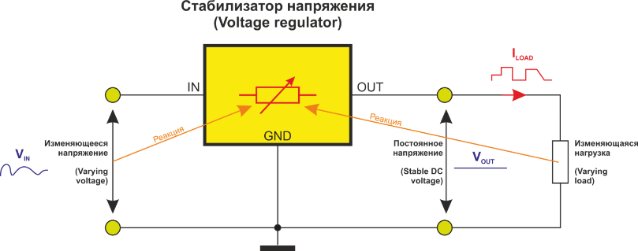
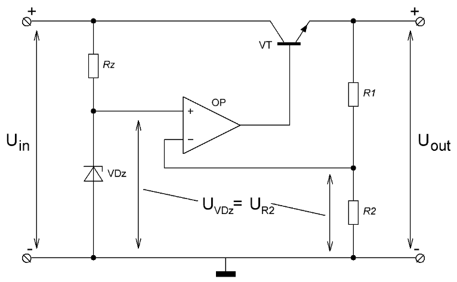

# Часть 1. Расчёт линейного стабилизатора  

## Теоретическая часть

### Принцип работы

Интегральные линейные стабилизаторы напряжения - специализированные микросхемы, предназначенные для стабилизации выходного напряжения на заданном уровне. Этот уровень может быть фиксированным, а может регулироваться. Интегральные стабилизаторы напряжения – стабилизаторы последовательного типа, то есть стабилизаторы, в которых избыток напряжения падает на самом стабилизаторе. Концепция работы последовательного линейного стабилизатора напряжения описана на рисунке 1: стабилизатор изменяет свое внутреннее сопротивление реагируя на изменения входного напряжения и тока нагрузки с целью обеспечения постоянства выходного напряжения.

<p align="center" > </p>

<p align="center" >Рисунок 1 – Принцип работы линейного интегрального стабилизатора напряжения</p> 

Принцип работы интегральных стабилизаторов понятен на примере последовательного компенсационного стабилизатора с применением операционного усилителя (рисунок 2).

<p align="center" > </p>

<p align="center" >Рисунок 2 – Схема последовательного компенсационного стабилизатора с применением операционного усилителя</p> 

Опорное напряжение задается маломощным параметрическим стабилизатором на стабилитроне VDz. Выходное напряжение через резисторный делитель $R_1/R_2$ сравнивается с опорным. Разность напряжений усиливается операционным усилителем, который управляет ключом, включенным последовательно с нагрузкой. Если выходное напряжение ниже заданного уровня – ключ приоткрывается, пропуская больше тока, соответственно падение напряжения на нем уменьшается. Если выходное напряжение становится больше некоторого уровня – ключ закрывается. Таким образом, осуществляется стабилизация выходного напряжения. Интегральные стабилизаторы напряжения работают по аналогичному принципу. Нестабильность выходного напряжения определяется, прежде всего, нестабильностью опорного напряжения параметрического стабилизатора.

### Коэффициент полезного действия стабилизаторов
Коэффициент полезного действия (КПД) линейных стабилизаторов напряжения является одной из важных характеристик, которая определяет эффективность работы устройства. КПД показывает, насколько эффективно устройство преобразует энергию входного напряжения в выходное напряжение без потерь.

Вычислить КПД можно по формуле:

```math
\eta = \frac {P_{вых}}{P_{вх}} \cdot 100 \%
```

```math
\eta = \frac {P_{нагр}}{P_{ист}} \cdot 100 \% = \frac {P_{нагр}}{P_{нагр}+P_{стаб}} \cdot 100 \%
```

Чем выше значение КПД, тем более эффективно устройство преобразует энергию. Идеальный линейный стабилизатор имеет КПД 100%, что означает, что весь входной ток и напряжение без потерь преобразуются в выходное напряжение.

Однако, на практике КПД линейных стабилизаторов напряжения значительно ниже 100%. Это объясняется наличием потерь энергии во время преобразования, которые связаны с различными физическими процессами, такими как тепловыделение во внутренних элементах стабилизатора.

Низкий КПД может привести к энергетическим потерям и повышенному нагреву устройства. Поэтому при выборе стабилизатора необходимо учитывать его КПД, особенно если требуется высокая энергоэффективность. Оптимальные значения КПД для линейных стабилизаторов обычно находятся в диапазоне от 70% до 90%, но могут варьироваться в зависимости от конкретной модели.

КПД линейных стабилизаторов также может варьироваться в зависимости от нагрузки. Обычно КПД устройств падает с увеличением нагрузки. Это связано с тем, что чем больше тока потребляет нагрузка, тем больше энергии теряется во внутренних элементах стабилизатора.

В целом, КПД является важным параметром при выборе линейного стабилизатора напряжения. Он позволяет оценить эффективность работы устройства и предоставляет информацию о том, насколько эффективно устройство преобразует энергию (энергоэффективность).

Факторы, влияющие на КПД линейных стабилизаторов
КПД (Коэффициент полезного действия) — это показатель, отражающий эффективность работы линейного стабилизатора напряжения. Чем выше значение КПД, тем более эффективно устройство преобразует электрическую энергию.

Существуют несколько факторов, которые влияют на КПД линейных стабилизаторов:

Разность входного и выходного напряжения: Чем больше разница между входным и выходным напряжением, тем ниже КПД стабилизатора. Энергия теряется в виде тепла при преобразовании напряжения. Поэтому желательно, чтобы входное напряжение было близким к выходному.
Ток потребления: КПД также зависит от тока потребления устройства, к которому подключен стабилизатор. Чем больше ток потребления, тем ниже КПД, так как больше энергии будет теряться.
Разница между тепловым сопротивлением и температурой окружающей среды: Чем выше разница между тепловым сопротивлением и окружающей средой, тем ниже КПД. Высокая температура окружающей среды приводит к увеличению потерь энергии в виде тепла.
Эффективность регулятора напряжения: Эффективность самого регулятора напряжения также влияет на общий КПД стабилизатора. Чем меньше потери энергии в самом регуляторе, тем выше коэффициент полезного действия.
В целом, для повышения КПД линейных стабилизаторов, необходимо стремиться к минимизации напряжения на входе, уменьшению тока потребления, снижению разницы между тепловым сопротивлением и окружающей средой, а также использовать более эффективные регуляторы напряжения.

Преимущества использования линейных стабилизаторов
Низкий уровень шума. Линейные стабилизаторы способны снижать уровень шума в электрической сети, что позволяет избежать искажений и помех в подключенных приборах. Это особенно важно для работы чувствительной электроники, такой как аудио- и видеооборудование.
Высокая точность стабилизации. Линейные стабилизаторы позволяют поддерживать выходное напряжение с высокой точностью, что особенно важно для устройств, требующих стабильного питания, таких как микропроцессоры и другая цифровая электроника.
Простота и надежность. Линейные стабилизаторы имеют простую схему работы, что делает их легкими в установке и эксплуатации. Благодаря этому, такие стабилизаторы обладают высокой надежностью и долгим сроком службы.
Отсутствие высокочастотных помех. В отличие от импульсных стабилизаторов, линейные стабилизаторы не создают высокочастотных помех, что позволяет избежать возникновения электромагнитных помех в других устройствах и линиях передачи данных.
Работа в широком диапазоне входных напряжений. Линейные стабилизаторы способны работать с различными входными напряжениями, что делает их универсальными и применимыми во многих ситуациях.
Отсутствие переключающего шума. Линейные стабилизаторы не создают переключающего шума, что позволяет избежать дополнительных помех и искажений в сигналах, проходящих через стабилизатор.
В целом, линейные стабилизаторы предлагают стабильное и чистое электропитание для различных электронных устройств. Они идеально подходят для использования в тех случаях, когда требуется высокая точность и надежность электропитания, а также минимальное воздействие на другие устройства и сети передачи данных.

Благодаря своим преимуществам линейные стабилизаторы остаются широко используемым решением во многих сферах, включая электронику, телекоммуникации и автомобильную промышленность.

Недостатки линейных стабилизаторов и их влияние на КПД
Линейные стабилизаторы напряжения являются одним из наиболее распространенных видов стабилизаторов. Они обладают рядом преимуществ, однако имеют и некоторые недостатки, которые снижают их эффективность и коэффициент полезного действия (КПД).

Низкая эффективность: В основе работы линейного стабилизатора лежит схема с использованием регулирующего элемента, который «разбирает» избыточное напряжение и преобразует его в тепловую энергию. В результате этого процесса происходит значительное потеря энергии, что влияет на КПД стабилизатора. Эффективность линейного стабилизатора обычно составляет от 20% до 50%, что означает, что большая часть энергии тратится на нагрев стабилизатора, а не на передачу нужного напряжения нагрузке.

Высокое тепловыделение: Из-за того, что линейные стабилизаторы преобразуют избыточное напряжение в тепловую энергию, они сильно нагреваются. Это может стать причиной перегрева самого стабилизатора, а также других электронных компонентов, расположенных рядом с ним. При высоких температурах возможны не только перегрев и выход из строя стабилизатора, но и снижение надежности всей системы.

Ограничения по току: Линейные стабилизаторы имеют ограничения по максимальному выходному току, которые зависят от их конструкции и мощности. В случае, если нагрузка превышает установленное ограничение, стабилизатор может не справиться с обеспечением постоянного напряжения и нагрузка будет работать с нестабильным питанием. Это может привести к сбою или выходу из строя нагрузки.

Большие габариты и вес: Линейные стабилизаторы обычно имеют крупные размеры и значительный вес, что может создавать определенные затруднения при установке и монтаже. Кроме того, большие габариты могут привести к проблемам с пространством внутри системы или корпуса, особенно если требуется установка нескольких стабилизаторов.

Высокая стоимость: В сравнении с другими типами стабилизаторов, линейные стабилизаторы построены на более сложных схемах и требуют использования специальных компонентов. Это влияет на их стоимость, которая может быть намного выше, чем у других видов стабилизаторов. Таким образом, использование линейных стабилизаторов может оказаться более затратным решением.

В итоге, несмотря на свою популярность, линейные стабилизаторы имеют некоторые недостатки, которые снижают их эффективность и КПД. При выборе стабилизатора необходимо учитывать все его характеристики и особенности, чтобы выбрать наиболее подходящий вариант для конкретных потребностей и требований системы.

Выводы о КПД линейных стабилизаторов напряжения
Линейные стабилизаторы напряжения являются простым и надежным способом обеспечения стабильного напряжения в электрических цепях. Однако они обладают некоторыми недостатками, основным из которых является низкий КПД.

## Сопроводительные материалы

Для выполнения схемы в рамках настоящей курсовой работы необходимо установить САПР Altium Designer и SPICE-симулятор электрических схем, а также воспользоваться вспомогательными материалами для работы в САПР: библиотека компонентов, примеры проектов, форматки А3, пакет для шрифта ГОСТ А

**[Altium Designer](https://1drv.ms/f/s!AoDciBiVIuGkgcV2JYSgLOXXOr3G-A?e=51rPlc)**  
**[LTspice](https://1drv.ms/f/s!AoDciBiVIuGkgcUu0pop8-9Obpul-w?e=lXBUB3)**  
**[Вспомогательные материалы для работы в Altium](https://1drv.ms/f/s!AoDciBiVIuGkgbNWCQJwYsDw_9t2CA?e=sZTQLO)**  

Перед выполнением практической части курсовой работы необходимо ознакомиться с приведёнными ниже приложениями, которые потребуются в процессе работы.

[Приложение А. Справочник номиналных рядов](../appendix_D/README.md)  
[Приложение Б. Перечень нормативных документов](../appendix_A/README.md)  
[Приложение В. Методические указанию по оформлению схемы](../appendix_B/README.md)  

## Практическая часть

> ПРИМЕЧАНИЕ: запрещается использование стабилизаторов компании Analog Devices и Texas Instruments

### Задание 1. Линейный стабилизатор с регулируемым выходом  
Привести параметры индивидуального варианта в виде таблицы (шапка таблицы + параметры своего варианта).

#### 1.1 Выбор стабилизатора

Выбрать линейный стабилизатор напряжения с регулируемым выходным напряжением, удовлетворяющий параметрам, приведённым в таблице 1.1. Для подбора предлагается использовать сайты соответствующих производителей www.analog.com, www.ti.com или сайты дистрибьюторов электронных компонентов, например, www.chipdip.ru, www.mouser.com или любого другого дистрибьютора. Ознакомиться со спецификацией на выбранный стабилизатор (datasheet). В отчёт включить скрины с настройкой фильтров используемого сайта, а также P/N выбранного стабилизатора.

> Партномер (он же part number или P/N) – это номер детали или компонента, который присваивается производителем. Не путайте с артикулом (присваивается и используется продавцом для внутренней каталогизации)  

При выборе стабилизатора, необходимо учитывать диапазон входного напряжения в схеме питания. Например, если разрабатываемое устройство будет подключаться к источнику питания с напряжением (8 ÷ 10) В, то по данному параметру подойдет любой стабилизатор с диапазоном входного напряжения, покрывающий  диапазон  (8 ÷ 10) В, например (5 ÷ 15) В.  

С выходным напряжением аналогично. Для схемы питания, которая должна формировать выходное напряжение 4 В, подойдет, например, стабилизатор с диапазоном выходного напряжения (3 ÷ 9) В.  

Выход схемы питания будет подключаться к нагрузке, поэтому при выборе стабилизатора также необходимо учитывать ток, которым необходимо обеспечить нагрузку. Если известно, что ток, потребляемый нагрузкой, например, 120 мА,  подойдёт стабилизатор с выходным током, например, 200 мА. В рамках выполнения курсовой работы разрешается выбирать стабилизатор с запасом по току в диапазоне (20 ÷ 100) % от номинального. Например, для выбора стабилизатора на нагрузку, потребляющую 100 мА, необходимо ориентироваться на значения максимального выходного тока стабилизатора (120 ÷ 200) мА.  

В таблице 1.1 приведены параметры схемы питания для выбора и расчёта линейного стабилизатора. 

*Таблица 1.1 – Параметры для подбора линейного стабилизатора*
| $№$	  |$U_{in\ min}\ ,\ В$| $U_{in\ max}\ ,\ В$|$U_{out\ nom}\ ,\ В$  | $I_{out}\ ,\ мА$	 | $Company$         |  
|-------|-------------------|--------------------|----------------------|-------------------|-------------------|  
|1      |        7.5	       |        10	          | 5	                   | 120               | Analog Devices    |  
|2      |        5          |        6           | 4                    | 270               | Analog Devices    |
|3      |        5.5        |        8           | 4                    | 270               | Texas Instruments |
|4      |        6          |        7           | 4                    | 100               | Analog Devices    |
|5      |        6.5        |        8           | 4                    | 120              | Texas Instruments |
|6      |        8          |        10          | 5                    | 160               | Analog Devices    |
|7      |        9          |        11          | 5                    | 270               | Texas Instruments |
|8      |        8.5        |        13          | 5                    | 220               | Analog Devices    |
|9      |        10         |        11          | 6                    | 230               | Texas Instruments |
|10     |        11         |        13          | 6                    | 120               | Analog Devices    |
|11     |        11.5       |        13          | 7                    | 220              | Texas Instruments |
|12     |        12         |        15          | 7                    | 240               | Analog Devices    |
|13     |        12.5       |        15          | 7                    | 220               | Texas Instruments |
|14     |        12         |        14          | 9                    | 120               | Analog Devices    |
|15     |        13         |        15          | 8                    | 300               | Texas Instruments |
|16     |        13.5       |        14          | 8                    | 270               | Analog Devices    |
|17     |        14         |        16          | 9                    | 410               | Texas Instruments |
|18     |        14.5       |        17          | 9                    | 300               | Analog Devices    |
|19     |        15         |        18          | 10                   | 250               | Texas Instruments |
|20     |        15.5       |        17          | 11                   | 220              | Analog Devices    |
|21     |        16         |        17          | 12                   | 350               | Texas Instruments |
|22     |        16.5       |        17          | 12                   | 170               | Analog Devices    | 
|23     |        17         |        18          | 13                   | 120              | Texas Instruments |
|24     |        17.5       |        19          | 11                   | 320               | Analog Devices    |
|25     |        18         |        21          | 12                   | 270               | Texas Instruments |
|26     |        18.5       |        22          | 15                   | 220               | Analog Devices    |
|27     |        19         |        23          | 17                   | 180               | Texas Instruments |
|28     |        10.5       |        11          | 6                    | 120              | Analog Devices    |
|29     |        9          |        14          | 5                    | 220               | Texas Instruments |
|30     |        9.5        |        13          | 6                    | 360               | Analog Devices    |

> П р и м е ч а н и е  
$№$ – номер индивидуального варианта  
$U_{in\ min}$ – минимальное входное напряжение схемы формирования питания  
$U_{in\ max}$ – максимальное входное напряжение схемы формирования питания  
$U_{out\ nom}$ – номинальное выходное напряжение схемы формирования питания  
$I_{out}$ – выходной ток схемы формирования питания  
$Company$ – производитель стабилизатора

#### 1.2 Расчёт параметров пассивных компонентов
Рассчитать схему для стабилизатора в соответствии со спецификацией на выбранный компонент. Расчёт схемы включает в себя расчёт номиналов резисторов, конденсаторов и прочих пассивных компонентов (если они требуются в схеме) в соответствии со спецификацией на выбранный стабилизатор.
> Зачастую производитель стабилизаторов приводит в спецификации перечень рекомендуемых пассивных компонентов для формирования стандартных выходных уровней напряжения.

#### 1.3 Выбор пассивных компонентов с учётом номинального ряда (E24)
В соответствии с рассчитанными параметрами пассивных компонентов на этапе 1.2, выбрать наиболее близкие значения сопротивления резисторов и конденсаторов с номиналами из [ряда E24](./../appendix_D/README.md). Пересчитать значение выходного напряжения $U_{out}$ в соответствии с выбранными компонентами.  Рассчитать абсолютное и относительное отклонение $U_{out}$ от $U_{out\ nom}$ в результате применения компонентов из ряда E24.

#### 1.4 Разработка схемы электрической принципиальной
Зарисовать схему электрическую принципиальную с учётом номиналов, выбранных на этапе 1.3.  с учётом требований перечня ГОСТов, приведённого в приложении А. При выполнении схемы рекомендуется воспользоваться САПР Altium Designer, а также соответствующей учебной библиотекой.
> Библиотека включает в себя УГО необходимых пассивных компонентов. УГО стабилизатора необходимо разработать самостоятельно по примерам, которые также приведены в библиотеке.
 
#### 1.5 Расчёт тока потребления на фиксированную нагрузку
Независимо от выбранного стабилизатора и его нагрузочной способности предлагается выполнить расчёт и сделать вывод о том, будет ли выбранный стабилизатор корректно работать в соответствии с указанными в спецификации условиями (иными словами, сможет ли обеспечить необходимый ток в нагрузку по заданному уровню напряжения). Для примера предлагается рассмотреть $R_{нагр}= 100\ Ом$.

```math
I_R=\frac{U_{out\ nom}}{R_{нагр}}
```

В данном задании будем считать работу стабилизатора корректной только в том случае, если рассчитанное значение $I_R$ не превышает значение выходного тока выбранного стабилизатора, указанное в спецификации.

#### 1.6 Расчёт мощности, рассеиваемой на стабилизаторе
Оценить рассеиваемую на стабилизаторе мощность $P_{стаб}$ с учётом известных максимального входного напряжения $U_{in\ max}$, номинального выходного напряжения $U_{out\ nom}$  и выходного тока  $I_{out}$ из параметров индивидуального задания.

```math
P_{стаб}=(U_{in\ max}-U_{out\ nom}) \cdot I_{out}
```

### Задание 2. Линейный стабилизатор с фиксированным выходом

#### 2.1 Расчёт потребляемого нагрузкой тока и мощности, рассеиваемой на нагрузке
C учётом $R_{нагр}$ и $U_{вых}$ из таблицы 1.2 рассчитать:
* ток I, протекающий через нагрузку и стабилизатор
* мощность $P_{нагр}$ рассеиваемую на нагрузке
* мощность $P_{стаб}$ рассеиваемую на стабилизаторе

```math
I = \frac {U_{out\ nom}}{R_{нагр}}
```

```math
P_{нагр}=U_{out\ nom} \cdot I
```

```math
P_{стаб}=(U_{in\ max}-U_{out\ nom}) \cdot I
```

Выполнить проверку корректности выполненных расчётов с учётом того, что стабилизатор подключен с нагрузкой последовательно, соответственно ток I в цепи одинаков, а полное падение напряжения складывается из падения напряжения на стабилизаторе и падения на нагрузке. Соответственно, мощность, потребляемая от источника питания равна сумме мощностей рассеиваемых на стабилизаторе и нагрузке.

```math
P=P_{стаб} + P_{нагр}
```

```math
U_{in\ max} \cdot I = (U_{in\ max}-U_{out\ nom}) \cdot I + U_{out\ nom} \cdot I
```

*Таблица 1.2 – Параметры для подбора линейного стабилизатора* 
|$№$	|$U_{in\ min}\ ,\ В$|$U_{in\ max}\ ,\ В$|$U_{out\ nom}\ ,\ В$	|$R_{нагр}\ ,\ Ом$	| $Company$         |
|-------|-------------------|--------------------|----------------------|-------------------|-------------------|  
|1	    |16.5	            |18	                |5	                    |20	                |Texas Instruments  |
|2	    |5	                |8	                |3.3	                |12	                |Texas Instruments  |
|3	    |18.5	            |23	                |5	                    |12	                |Analog Devices     |
|4	    |6	                |8	                |3.3	                |10	                |Texas Instruments  |
|5	    |6.5	            |9	                |5	                    |12	                |Analog Devices     |
|6	    |13.5	            |15	                |5	                    |13	                |Texas Instruments  |
|7	    |7.5	            |10	                |5	                    |11	                |Analog Devices     |
|8	    |8	                |12	                |3.3	                |15	                |Texas Instruments  |
|9	    |8.5	            |11	                |5	                    |14	                |Analog Devices     |
|10	    |15.5	            |18	                |5	                    |6	                |Texas Instruments  |
|11	    |9.5	            |13	                |5	                    |12	                |Analog Devices     |
|12	    |10	                |12	                |3.3	                |10	                |Texas Instruments  |
|13	    |10.5	            |13	                |5	                    |11	                |Analog Devices     |
|14	    |11	                |12	                |3.3	                |21	                |Texas Instruments  |
|15	    |11.5	            |15	                |5	                    |14	                |Analog Devices     |
|16	    |12	                |14	                |3.3	                |14	                |Texas Instruments  |
|17	    |12.5	            |16	                |5	                    |18	                |Analog Devices     |
|18	    |13	                |17	                |3.3	                |11	                |Texas Instruments  |
|19	    |5.5	            |8	                |5	                    |10	                |Analog Devices     |
|20	    |14	                |15	                |3.3	                |10	                |Texas Instruments  |
|21	    |14.5	            |16	                |5	                    |14	                |Analog Devices     |
|22	    |15	                |17	                |3.3	                |13	                |Texas Instruments  |
|23	    |19	                |21	                |3.3	                |10	                |Analog Devices     |
|24	    |16	                |16	                |3.3	                |15	                |Texas Instruments  |
|25	    |7	                |11	                |3.3	                |13	                |Analog Devices     |
|26	    |17	                |17	                |3.3	                |15	                |Texas Instruments  |
|27	    |17.5	            |20	                |5	                    |14	                |Analog Devices     |
|28	    |18	                |19	                |3.3	                |13	                |Texas Instruments  |
|29	    |9	                |13	                |3.3	                |11	                |Analog Devices     |

> П р и м е ч а н и е  
$№$ – номер индивидуального варианта  
$U_{in\ min}$ – минимальное входное напряжение схемы формирования питания  
$U_{in\ max}$ – максимальное входное напряжение схемы формирования питания  
$U_{out\ nom}$ – номинальное выходное напряжение схемы формирования питания  
$R_{нагр}$ – сопротивление нагрузки  
$Company$ – производитель стабилизатора

#### 2.2 Выбор стабилизатора
Выбрать линейный стабилизатор напряжения с фиксированным  выходным напряжением, удовлетворяющий параметрам, приведённым в таблице 1.2. Для подбора использовать сайт любого дистрибьютора электронных компонентов. В отчёт включить скрины с настройкой фильтров используемого сайта, а также P/N выбранного стабилизатора.

#### 2.3 Расчёт температуры нагруженного стабилизатора
Рассчитать температуру $t_{стаб}$ стабилизатора в соответствии со спецификацией, учитывая рассеивающую способность корпуса выбранного стабилизатора (корпус стабилизатора для расчётов можно выбрать любой из предложенных в спецификации).

#### 2.4 Расчёт параметров пассивных компонентов
Рассчитать схему для стабилизатора в соответствии со спецификацией на выбранный компонент. В случае, если в спецификации приведена схема и расчёты не требуются, указать в данном пункте отчёта «Схема и соответствующие номиналы пассивных компонентов приведены в спецификации».

#### 2.5 Выбор пассивных компонентов с учётом номинального ряда (E96)
Если в пункте 2.4 схема и соответствующие номиналы были приведены в спецификации, то пропустить данный пункт. Иначе, в соответствии с рассчитанными значениями на этапе 2.4 пассивных компонентов, выбрать наиболее близкие по номинальным значениям резисторы и конденсаторы из [ряда E96](./../appendix_D/README.md). Пересчитать значение выходного напряжения $U_{out}$ в соответствии с выбранными компонентами.  Рассчитать абсолютное и относительное отклонение $U_{out}$ от $U_{out\ nom}$в результате применения компонентов из ряда E96.

#### 2.6 Разработка схемы электрической принципиальной
Зарисовать схему электрическую принципиальную с учётом номиналов, выбранных на этапе 2.5  с учётом требований перечня ГОСТов, приведённого в приложении А.

### Задание 3. Линейный стабилизатор с низким падением напряжения (LDO)
Одним из главных характеристик линейных стабилизаторов является минимальное падение напряжение на стабилизаторе. Например, минимальное падение напряжения составляет 1 В. Такой стабилизатор не получится применить в случае, когда необходимо понизить уровень напряжения с 3,6 В до 3,3 В. Для решения таких задач выделяют отдельный класс LDO стабилизаторов (Low-DropOut regulator).

Регулятор c низким падением напряжения (LDO regulator) - это линейный регулятор напряжения постоянного тока, который в отличие от обычного линейного стабилизатора может работать при напряжении питания, очень близком к выходному.

> В современной практике в качестве линейных стабилизаторов применяются именно LDO стабилизаторы.

#### 3.1 Изучение спецификации
Вписать в отчёт полное название LDO стабилизатора в соответствии с вариантом из табл. 1.3.

*Таблица 1.3 – Перечень P/N LDO стабилизаторов* 
|№ИВ	|P/N	            |№ИВ	    |Part Number        |
|-------|-------------------|-----------|-------------------|
|1	    |LT3072EUFF#PBF	    |16	        |LTC3026EDD-1#PBF   |   
|2	    |LT3012EDE#PBF	    |17	        |ADP123ACPZ-R7      |
|3	    |LT3045EDD#PBF	    |18	        |LT3042EDD#PBF      |
|4	    |ADP1708ACPZ-R7	    |19	        |LT3029EDE#PBF      |
|5	    |LT3013BEDE#PBF	    |20	        |LT3083EDF#PBF      |
|6	    |ADP7157ACPZ-01-R7	|21	        |ADP225ACPZ-R7      |
|7	    |ADP171AUJZ-R7	    |22	        |LT3012BEDE#PBF     |
|8	    |ADP7159ACPZ-01-R7	|23	        |ADP163AUJZ-R7      |
|9	    |ADP1741ACPZ-R7	    |24	        |LT3024EDE#PBF      |
|10	    |ADM7155ACPZ-01-R7	|25	        |LT3028EFE#PBF      |
|11	    |LT3062EDCB#TRPBF	|26	        |LT3033EUDC#PBF     |
|12	    |ADM7151ACPZ-02-R7	|27	        |LT3014EDD#PBF      |
|13	    |LT3030EFE#PBF	    |28	        |LT1085CT#PBF       |
|14	    |LT3011EDD#PBF	    |29	        |LT3014EDD#PBF      |
|15	    |LT1084CT#PBF	    |30	        |LT3013BEDE#PBF     |   

Выделить из спецификации и отразить в отчёте основную информацию про LDO стабилизатор (минимальный перечень приведён ниже 3.2.1-3.2.8), необходимую на начальном этапе разработки (на русском языке).
> К каждому пункту приложить фрагмент из спецификации, из которого были взяты параметры. Фрагменты из спецификации НЕ ЗАМЕНЯЮТ ТЕКСТ ОТЧЁТА, А ДОПОЛНЯЮТ ЕГО. Если в отчёте приводятся рисунки, таблицы и приложения, то по ходу текста на них необходимо ссылаться ("Схема, разработанная в Altium Designer, выполнена в соответствии с рекомендацией спецификации (рис. 5)"). Чтобы ссылаться на фрагменты, они должны быть пронумерованы и названы в отчёте.

##### 3.2.1	Наименование доступных корпусов с указанием максимальной рассеивающей мощности;
##### 3.2.2	Допустимый диапазон входных напряжений;
##### 3.2.3	Допустимый диапазон регулируемого выходного напряжения;
##### 3.2.4	Максимальный выходной ток;
##### 3.2.5	Зависимость падения напряжения на LDO стабилизаторе от какого-либо параметра;
##### 3.2.6	Описание каждого вывода стабилизатора LDO;
##### 3.2.7	Формульные соотношения, для определения номиналов «обвязки»;
##### 3.2.8	«ABSOLUTE MAXIMUM RATINGS» - допустимый рабочий диапазон.

#### 3.3 Выбор произвольных входного и выходного напряжения

С учётом параметров, указанных в спецификации выбрать ПРОИЗВОЛЬНЫЕ $U_{in}$ из допустимого диапазона и $U_{out}$ из допустимого диапазона (но с учётом выбранного $U_{in}$);

#### 3.4 Расчёт сопротивления нагрузки

С учётом $U_{out}$ из 3.3 рассчитать сопротивление нагрузки, чтобы потребление тока составляло, например, половину от максимально допустимого для данного стабилизатора (в 2.1 рассчитывалось значение тока с учётом известного сопротивления нагрузки);

#### 3.5 Разработка схемы электрической принципиальной

Рассчитать и зарисовать схему электрическую принципиальную с учётом выбранного $U_{out}$ с учётом требований перечня ГОСТов, приведённого в приложении А. Номиналы пассивных компонентов выбирать в соответствии с [рядом E96](./../appendix_D/README.md).

