# Часть 2. Расчёт импульсного преобразователя напряжения

## Теоретическая часть

Расчеты КПД линейных стабилизаторов показывают, что при преобразовании высокого входного напряжения в низкое выходное приходится сталкиваться с серьезными проблемами тепловыделения. Кроме того, возникают ситуации, когда необходимо организовать питание с напряжением питания выше, чем может обеспечить источник питания. В таких случаях на помощь приходят схемы на основе импульсных преобразователей напряжения.

Импульсные преобразователи без гальванической развязки подразделяются на понижающие, повышающие и инвертирующие преобразователи.

### Приницп работы

---

<details>
  <summary>Что за диод?</summary>
  
  Во всех схемах импульсных преобразователей используется такой компонент, как диод ($VD$). Это элементарный полупроводниковый прибор с двумя выводами (анод и катод), с которым вы познакомитесь поближе в следующем семестре. Сейчас для понимания работы предложенных схем достаточно знать, что электрическая проводимость диода может изменяться в зависимости от приложенного напряжения.


 >Простыми словами, диод пропускает ток только в одну сторону, от анода к катоду.

</details>

#### Понижающий преобразователь

<p align="center" > 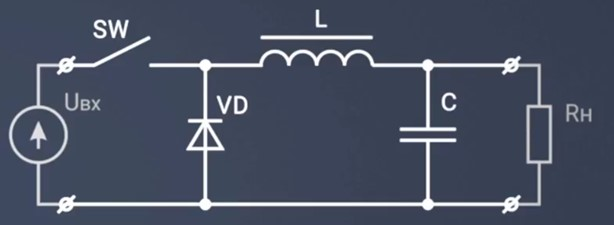</p>

<p align="center" >Понижающий преобразователь </p> 

В схеме присутствуют первичный источник напряжения $U_{вх}$, ключ $SW$, дроссель $L$, диод $VD$, выходной конденсатор $C$ и эквивалентное сопротивление нагрузки $R_{н}$. Схема работает в режиме непрерывного тока - ток дросселя не должен обращаться в 0. Ввиду инерционных свойств катушки ток в ней линейно нарастает при замкнутом ключе и линейно спадает при разомкнутом. Емкость выходного конденсатора будем считать достаточно большой, для поддержания в установившимся режиме неизменного $U_{вых}$. Для упрощения модели будем считать диод идеальным - падение на диоде равно 0.

<p align="center" > 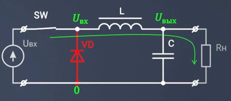</p>

<p align="center" >Понижающий преобразователь - I такт</p> 

Ключ замкнут. Диод $VD$ оказывается в закрытом состоянии, потому что на его катоде потенциал входа, а на аноде потенциал земли. Ток протекает по контуру: источник $U_{вх}$ - замкнутый ключ $SW$ - дроссель $L$ - конденсатор $С$ - нагрузка $R_{н}$. 

<p align="center" > 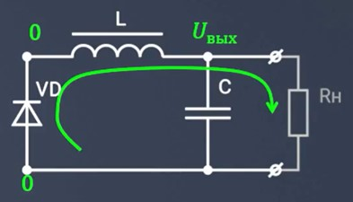</p>

<p align="center" >Понижающий преобразователь - II такт</p> 

Ключ разомкнут. Источник $U_{вх}$ отключен, энегрия от него не поступает, но катушка индуктивности накопила в себе энергию и будет поддерживать ток в контуре: катушка $L$ - конденсатор $С$ - нагрузка $R_{н}$ - диод $VD$. Поскольку к диоду не прикладывается обратное напряжение он открыт и по нему ток течет.


#### Повышающий преобразователь

<p align="center" > 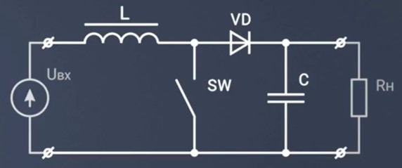</p>

<p align="center" >Повышающий преобразователь </p>

Элементы используются те же, но порядок подключения изменился. Работает схема следующим образом.

<p align="center" > 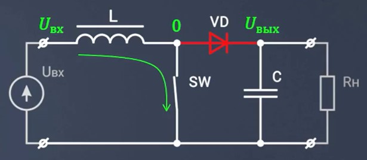</p>

<p align="center" >Повышающий преобразователь - I такт </p>

Ключ замкнут. Катушка индуктивности оказывается подключеннй к источник $U_{вх}$. Остальная схема от источника отключена, так как диод закрыт. Ток первичного источника протекает через катушку индуктивности, благодаря чему в ней запасается энергия. 

<p align="center" > 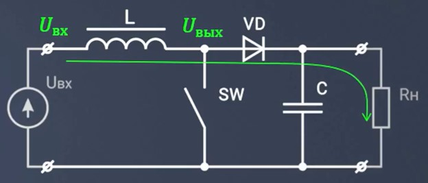</p>

<p align="center" >Повышающий преобразователь - II такт</p>

Ключ разомкнут. Ток протекает по контуру: источник $U_{вх}$ - катушка индуктивности $L$ - диод $VD$ - конденсатор $C$ - нагрузка $R_{н}$. Катушка начинает работать как еще один источник ЭДС, напряжение которого склыдвается с напряжением источника $U_{вх}$, что позволяет сформировать повышенное напряжение на выходе.


#### Инвертирующий преобразователь

<p align="center" > </p>

<p align="center" >Инвертирующий преобразователь </p>

Изображенная схема формирует отрицательное выходное напряжение из положительного входного.

<p align="center" > 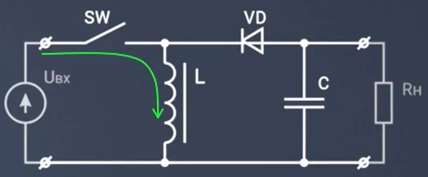</p>

<p align="center" >Инвертирующий преобразователь - I такт</p>

Ключ замкнут. Первичный источник питания подключен к дросселю. Дроссель начинает запасать энергию, ток в нем линейно нарастает, обратим внимание, что диод закрыт.

<p align="center" > 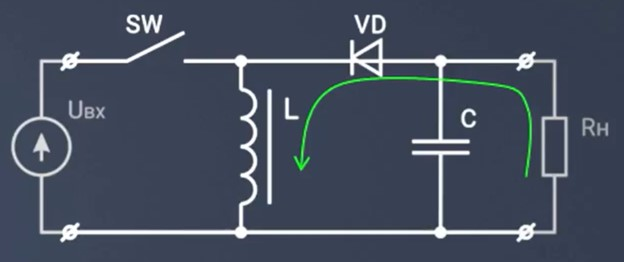</p>

<p align="center" >Инвертирующий преобразователь - II такт</p>

Ключ разомкнут. Дроссель будет пытаться поддержать ток, протекавший через него до этого, используя запасенную ранее энергию. Это приведет к протеканию тока по контуру: нагрузка $R_{н}$ - диод $VD$ - дроссель $L$. Ток через нагрузку в данном случае течет в другую сторону по сравнению с предыдущими схемами, в следствие этого напряжение на нагрузке сформируется отрицательное.


## Пример расчёта

В рамках данной курсовой работы вам предстоит произвести расчеты для схемы на основе импульного преобразователя напряжения для формирования необходимого уровня напряжения для питания схемы. В качестве примера рассмотрим понижающий DC-DC преобразователь серии LM2575. [Cпецификация LM2575](https://static.chipdip.ru/lib/927/DOC012927213.pdf)

Компонент представлен в версиях с фиксированным выходным напряжением (3,3 В, 5 В, 12 В, 15 В) и с регулируемым. Последние могут формировать уровень напряжения в диапазоне от 1,23 В до 37 В (57 В для HV-версии). Разберем расчет LM2575(HV)-ADJ c регулируемым выходом, Uвых которого зависит от коэффициента обратной связи.

Для начала необходимо определиться, в каком именно корпусе будет импульсник (в спецификации предлагается 5 вариантов). Остановим выбор на компоненте в корпусе TO-220.

<p align="center" > 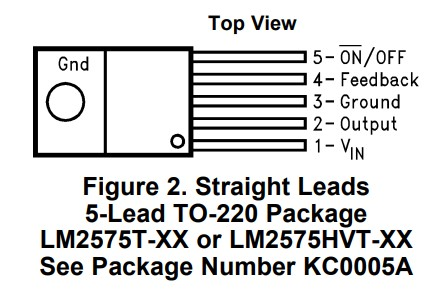</p>

<p align="center" >Рисунок 1 – LM2575 в корпусе TO-220 </p> 

Для лучшего понимания работы преобразователя изучим его структурную схему.

<p align="center" > 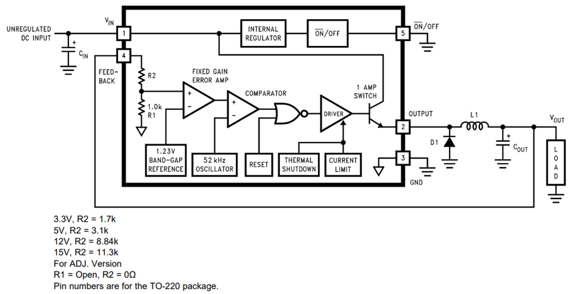</p>

<p align="center" >Рисунок 2 - Структурная схема </p> 

Кажется, что-то подобное мы уже рассматривали. Как и в схеме понижающего преобразователя здесь установлены диод $D_1$, дроссель $L_1$, выходной конденсатор $C_{out}$, нагрузка $LOAD$. Однако эта схема более усовершенствованная - здесь присутсвует обратная связь `FEEDBACK`. 
Значение напряжения, которое подается на $R_{н}$, направляется на вход компаратора через резистивный делитель (делитель может находиться внутри микросхемы - в таком случае уровень выходного напряжения фиксирован 'fixed output', - или же располагаться вне корпуса - инженер сам подбирает номиналы $R_{1}, \  R_{2}$ для формирования нужного уровня $U_{out}$ 'adjustable output'). Происходит сравнение с опорным напряжением. В результате биполярный `NPN транзистор`, использующийся в качестве ключа $SW$, будет переключаться таким образом, чтобы уровень $U_{out}$ был стабильным вне зависимости от колебаний напряжения на входе. В упрощенном виде схема имеет следующий вид (ШИМ - [широтно-импульсная модуляция](https://ru.wikipedia.org/wiki/Широтно-импульсная_модуляция#Причины_применения_ШИМ)):

<p align="center" > 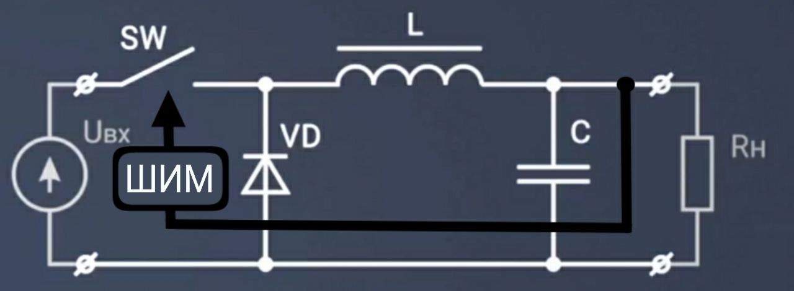</p>

<p align="center" >Рисунок 3 – Упрощенная схема импульсного преобразователя </p> 


Пусть для примера $U_{in}\ = 26 \ В,\  U_{out}\ = 7 \ В,\  R_{н}\ = 10 \ Ом,\  f \= 52 \ кГц $

Для формирования необходимого уровня напряжения на выходе, необходимо правильно подобрать компоненты обвязки, которые обеспечат необходимый коэффициент обратной связи. Обратимся к разделу спецификации `TEST CIRCUIT AND LAYOUT GUIDELINES`

<p align="center" > 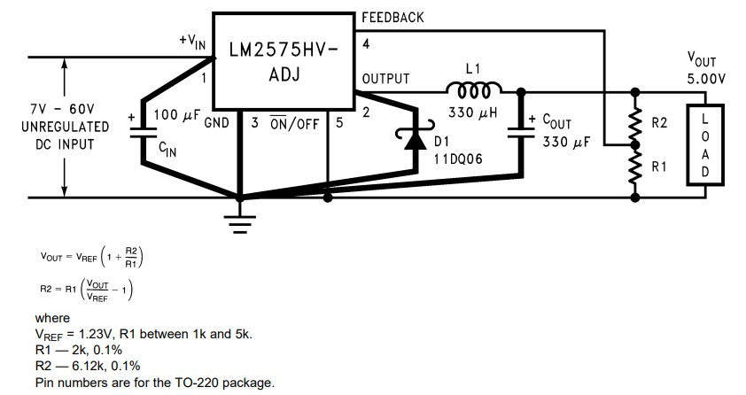</p>

<p align="center" >Рисунок 4 – Подключение преобразователя с регулируемым выходом </p> 

#### Резисторы  $R_1,\ R_2$

В спецификации приведено отношение номиналов резисторов обратной связи и выходного напряжения

```math
U_{out}= U_{ref} \cdot (1 + \frac{R_2}{R_1})
```
$R_{1}\$ нужно выбрать из диапазона (1 - 5) кОм, возьмем, допустим, $2,4 \ кОм$. $U_{ref}\$ для данного компонента составляет 1,23 В. Учитывая выходное напряжение проебразователя, вычисляем по формуле значение $R_{2}\$.

```math
R_{2}= R_{1} \cdot (\frac{U_{out}}{U_{ref}} - 1)
```

```math
R_{2}= 2,4 \cdot 10^3 \cdot (\frac{7}{1,23} - 1) ≈ 11,2\ кОм
```
Используя номинальный [ряд E24](./../appendix_D/README.md), $R_{2}\ = 12\ кОм$.

#### Катушка индуктивности L

Используя формулу из спецификации, рассчитаем константу индуктивности
```math
V \cdot T (В \cdot мксек) = (U_{in} - U_{out}) \cdot \frac{U_{out}}{U_{in}} \cdot \frac{1000}{f (кГц)}
```
```math
V \cdot T = (26 - 7) \cdot \frac{7}{26} \cdot \frac{1000}{52} ≈ 98 \ (В \cdot мксек)
```
$R_{н}\ = 10 \ Ом$. По закону Ома выходной ток $I_{out}$ (или $I_{н}$) равен

```math
I_{out}= \frac{U_{R_{н}}}{R_{н}} = \frac {7}{10} = 0,7 \ А
```
Данное значение является максимальный током нагрузки.
По схеме из спецификации (по оси X - максимальный ток нагрузки, Y - константа индуктивности) на Рисунке 5 определим необходимый регион индуктивности и воспользуемся данными на Рисунке 6 для определения номинала катушки.

<p align="center" > 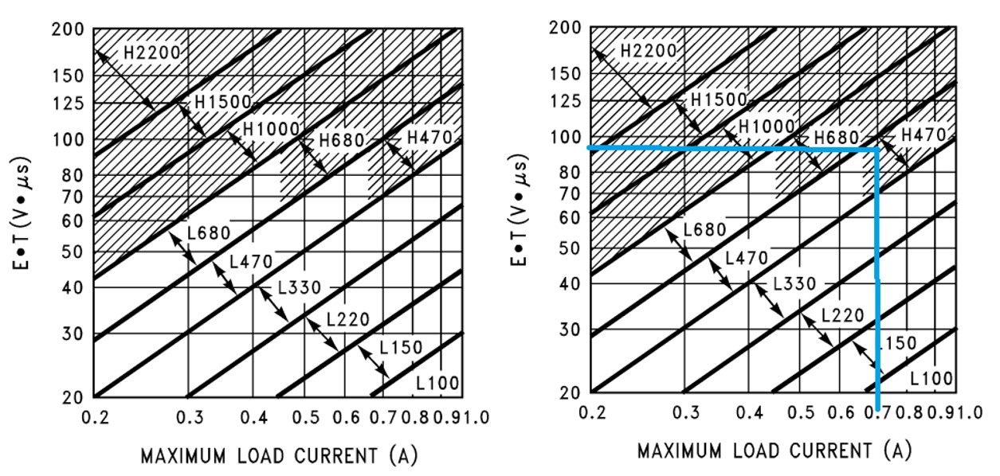</p>

<p align="center" >Рисунок 5 – Выбор области для катушки индуктивности </p> 

<p align="center" > 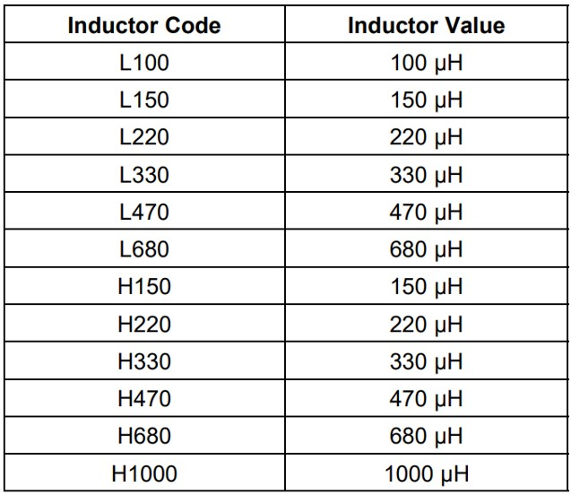</p>

<p align="center" >Рисунок 6 – Выбор номинала катушки индуктивности </p> 

Получаем $L = 470 \ мкГн$.

#### Диод Шоттки VD

Значение тока через диод должно быть хотя бы в 1,2 раза больше значения $I_{н}$ а максимальное обратное напряжение диода должно быть минимум в 1,25 раз больше входного напряжения. Тогда
```math
I_{f} > 1,2 \cdot 0,7 = 0,84 \ А
```
```math
V_{DC} > 1,25 \cdot 26 = 32,5 \ В
```
Воспользуемся подсказкой из даташита, учитывая полученные значения.
<p align="center" > 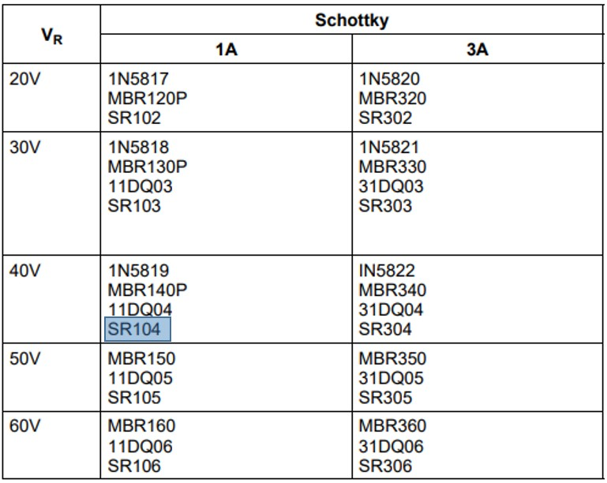</p>

<p align="center" >Рисунок 7 – Выбор диода Шоттки </p> 

Остановим выбор на SR104.

#### Конденсатор $С_{in}\$

По спецификации рекомендуется установить обычный или танталовый конденсатор емкостью $100 \ мкФ$. $С_{in}\$ располагается максимально близко к микросхеме, чтобы минимизировать появление помех на входе преобразователя.

#### Конденсатор $С_{out}$

Значение выходного конденсатора вместе с катушкой индуктивности определяет доминирующую пару полюсов контура переключающего регулятора. Для стабильной работы конденсатор должен удовлетворять следующему требованию

```math
С_{out} > 7,785 \cdot  \frac{U_{in_{max}}}{U_{out}\cdot L(мкГн)}
```

```math
С_{out} > 7,785 \cdot  \frac{26}{7\cdot 470} = 61 \ мкФ
```

По этой формуле можно получить значение номинала $С_{out}\$ в диапазоне (10 - 2000) мкФ. Но не спешите подбирать ближайший по номинальному ряду значение конденсатора. В спецификации указан следующий нюанс: во избежание неприемлимых пульсаций на выходе рекомендуется брать $С_{out}$ номиналом не менее 220 мкФ. Итог: будем использовать в схеме танталовый конденсатор $С_{out}\ = 220 \ мкФ$.

#### Схема подключения LM2575

Номиналы компонентов обвязки получились следующие:

$R_{1}\ = 2,4\ кОм$

$R_{2}\ = 12\ кОм$

$L\ = 470\ мкГн$

$VD\  -\  SR104$

$С_{in}\ = 100 \ мкФ$

$С_{out}\ = 220 \ мкФ$

Изобразим подключенную схему согласно спецификации (Рисунок 4) в `САПР Altium Designer`:

<p align="center" > 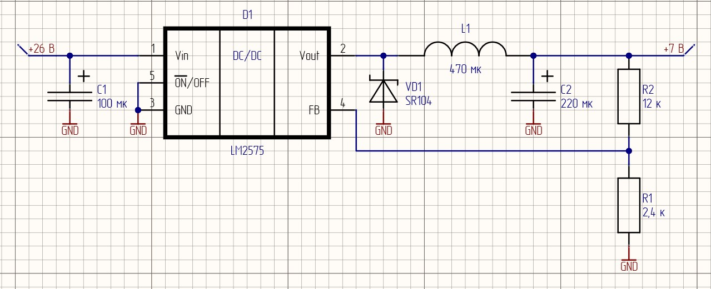</p>

<p align="center" >Рисунок 8 – LM2575 с компонентами обвязки </p> 

Нумерация резисторов произведена как в даташите во избежание путаницы (не отвечает требованиям ГОСТ).

## Практическая часть

> ПРИМЕЧАНИЕ: запрещается использование стабилизаторов компании Analog Devices и Texas Instruments

### Задание 1. Расчитать импульсный преобразователь напряжения с регулируемым выходом

#### 1.1 Выбор преобразователя

Выбрать импульсный преобразователь напряжения с регулируемым выходным напряжением, удовлетворяющий параметрам, приведённым в таблице 2.1.

Таблица 2.1 – Параметры для подбора импульсного преобразователя

|   №   | $U_{in\ min}\ ,\ В$|  $U_{in\ max}\ ,\ В$  | $U_{out\ nom}\ ,\ В$   | $I_{out}\ ,\ мА$  |
|-------|---------------|---------------|-----------|-----------|
|   1   |   6           |   8           |3\.5       |170        |
|   2   |   5\.5        |   8           |3\.5       |180        |
|   3   |   7           |   8           |3\.5       |250        |
|   4   |   6\.5        |   8           |3\.5       |310        |
|   5   |   8           |   9          |5          |300        |
|   6   |   7\.5        |   10           |5          |280        |
|   7   |   9           |   12          |5          |250        |
|   8   |   8\.5        |   14          |6          |230        |
|   9   |   10           |   15          |6          |270        |
|   10  |   9\.5        |   14          |6          |330        |
|   11  |   11          |   14          |6          |220        |
|   12  |   10\.5       |   14          |6          |230        |
|   13  |   11          |   14          |7          |275        |
|   14  |   10          |   12          |7          |230        |
|   15  |   11\.5       |   15          |7          |310        |
|   16  |   12          |   16          |7          |380        |
|   17  |   12\.5       |   16          |6          |280        |
|   18  |   13          |   16          |6          |270        |
|   19  |   13\.5       |   18          |7          |280        |
|   20  |   14          |   18          |6          |290        |
|   21  |   14\.5       |   19          |9          |190        |
|   22  |   15          |   18          |7          |280        |
|   23  |   15\.5       |   19          |8          |315        |
|   24  |   16          |   19          |8          |250        |
|   25  |   16\.5       |   18          |9         |250        |
|   26  |   17          |   19          |12         |200        |
|   27  |   17\.5       |   20          |11         |210        |
|   28  |   18          |   21          |11         |210        |
|   29  |   18\.5       |   21          |12         |220        |
|   30  |   19          |   21          |13         |350        |

> П р и м е ч а н и е  
$№$ – номер индивидуального варианта  
$U_{in\ min}$ – минимальное входное напряжение схемы формирования питания  
$U_{in\ max}$ – максимальное входное напряжение схемы формирования питания  
$U_{out\ nom}$ – номинальное выходное напряжение схемы формирования питания  
$R_{нагр}$ – сопротивление нагрузки  

#### 1.2 Расчёт параметров пассивных компонентов
Рассчитать схему для преобразователя в соответствии со спецификацией на выбранный компонент. Расчёт схемы включает в себя расчёт номиналов резисторов, конденсаторов и прочих пассивных компонентов (если они требуются в схеме) в соответствии со спецификацией на выбранный компонент. После вычисления точных значений номиналов подобрать ближайшие из [ряда E24](./../appendix_D/README.md) (при дальнейших расчётах использовать номиналы именно этого ряда).  Рассчитать абсолютное и относительное отклонение $U_{out}$ от $U_{out\ nom}$ в результате применения компонентов из ряда E24.
> В случае, если в спецификации приведена схема и расчёты не требуются, указать в данном пункте отчёта «Схема и соответствующие номиналы пассивных компонентов приведены в спецификации».

#### 1.3 Расчёт тока потребления на фиксированную нагрузку
Независимо от выбранного преобразователя и его нагрузочной способности предлагается выполнить расчёт и сделать вывод о том, будет ли выбранный преобразователь корректно работать в соответствии с указанными в спецификации условиями (иными словами, сможет ли обеспечить преобразователь необходимый ток $I_{нагр}$ в нагрузку по заданному уровню напряжения). Для примера предлагается рассмотреть $R_{нагр}= 10\ Ом$.

Сделать вывод о том, выдержит ли преобразователь нагрузку, эквивалентную Rнагр = 10 Ом.
> Если $I_{нагр}$ < $I_{max\ dc-dc}$ то  преобразователь выдержит данную нагрузку. Значение $I_{max\ dc-dc}$ приведено в спецификации.

#### 1.4 Разработка схемы электрической принципиальной
Зарисовать схему электрическую принципиальную с учётом номиналов, выбранных на этапе 1.2, а также с учётом требований перечня ГОСТов, приведённого в приложении А. При выполнении схемы рекомендуется воспользоваться САПР Altium Designer, а также соответствующей учебной библиотекой.
> Библиотека включает в себя УГО необходимых пассивных компонентов. УГО преобразователя необходимо разработать самостоятельно по примерам, которые также приведены в библиотеке.

### Задание 2. Расчитать импульсный преобразователь напряжения с фиксированным выходом

#### 2.1 Выбор преобразователя

Выбрать импульсный  преобразователь напряжения с фиксированным выходным напряжением, удовлетворяющий параметрам, приведёнными в табл. 2.2.

Таблица 2.2 – Параметры для подбора импульсного  преобразователя
|  $№$ |   $U_{in\ min}\ ,\ В$ |   $U_{in\ max}\ ,\ В$  |   $U_{out\ nom}\ ,\ В$    |   $R_{нагр}\ ,\ Ом$ |
|-------|---------------|---------------|--------------|--------------|
|   1   |   14\.5       |   16          |   5          |    10        |
|   2   |   15          |   18          |   3\.3       |    15        |
|   3   |   15\.5       |   17          |   5          |    11        |
|   4   |   8\.5        |   12          |   3\.3       |    9         |
|   5   |   9           |   12          |   5          |    9         |
|   6   |   9\.5        |   14          |   3\.3       |    8         |
|   7   |   10          |   13          |   5          |    19        |
|   8   |   10\.5       |   13          |   3\.3       |    14        |
|   9   |   11          |   16          |   5          |    14        |
|   10  |   11\.5       |   14          |   3\.3       |    15        |
|   11  |   12          |   15          |   5          |    11        |
|   12  |   12\.5       |   16          |   3\.3       |    9         |
|   13  |   13          |   17          |   5          |    8         |
|   14  |   13          |   15          |   5          |    11        |
|   15  |   13\.5       |   17          |   3\.3       |    15        |
|   16  |   14          |   17          |   5          |    11        |
|   17  |   14\.5       |   17          |   3\.3       |    9         |
|   18  |   15          |   17          |   5          |    15        |
|   19  |   15\.5       |   19          |   3\.3       |    21        |
|   20  |   16          |   19          |   5          |    11        |
|   21  |   16\.5       |   19          |   3\.3       |    14        |
|   22  |   17          |   19          |   5          |    9         |
|   23  |   17\.5       |   19          |   3\.3       |    13        |
|   24  |   18          |   19          |   5          |    8         |
|   25  |   18\.5       |   20          |   3\.3       |    14        |
|   26  |   19          |   20          |   5          |    17        |
|   27  |   12\.5       |   19          |   3\.3       |    11        |
|   28  |   13          |   18          |   5          |    6         |
|   29  |   13\.5       |   17          |   3\.3       |    12        |
|   30  |   14          |   17          |   5          |    11        |

> П р и м е ч а н и е  
$№$ – номер индивидуального варианта  
$U_{in\ min}$ – минимальное входное напряжение схемы формирования питания  
$U_{in\ max}$ – максимальное входное напряжение схемы формирования питания  
$U_{out\ nom}$ – номинальное выходное напряжение схемы формирования питания  
$R_{нагр}\ ,\ Ом$ – выходной ток схемы формирования питания

#### 2.2 Расчёт параметров пассивных компонентов

Рассчитать схему для преобразователя в соответствии со спецификацией на выбранный компонент. Расчёт схемы включает в себя расчёт номиналов резисторов, конденсаторов и прочих пассивных компонентов (если они требуются в схеме) в соответствии со спецификацией на выбранный компонент. После вычисления точных значений номиналов подобрать ближайшие из [ряда E24](./../appendix_D/README.md) (при дальнейших расчётах использовать номиналы именно этого ряда).  Рассчитать абсолютное и относительное отклонение $U_{out}$ от $U_{out\ nom}$ в результате применения компонентов из ряда E24.
> В случае, если в спецификации приведена схема и расчёты не требуются, указать в данном пункте отчёта «Схема и соответствующие номиналы пассивных компонентов приведены в спецификации».

Сделать вывод о том, выдержит ли преобразователь нагрузку, эквивалентную Rнагр = 10 Ом.
> Если $I_{нагр}$ < $I_{max\ dc-dc}$ то преобразователь выдержит данную нагрузку. Значение $I_{max\ dc-dc}$ приведено в спецификации.

#### 2.3 Разработка схемы электрической принципиальной

Зарисовать схему электрическую принципиальную с учётом номиналов, выбранных на этапе 1.2, а также с учётом требований перечня ГОСТов, приведённого в приложении А. При выполнении схемы рекомендуется воспользоваться САПР Altium Designer, а также соответствующей учебной библиотекой.
> Библиотека включает в себя УГО необходимых пассивных компонентов. УГО преобразователя необходимо разработать самостоятельно по примерам, которые также приведены в библиотеке.

