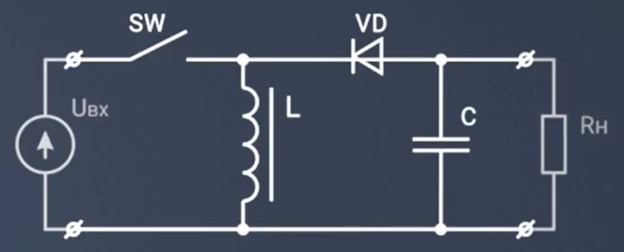

# Часть 2. Расчёт импульсного преобразователя напряжения

## Теоретическая часть

Расчеты КПД линейных стабилизаторов показывают, что при преобразовании высокого входного напряжения в низкое выходное приходится сталкиваться с серьезными проблемами тепловыделения. Кроме того, возникают ситуации, когда необходимо организовать питание с напряжением питания выше, чем может обеспечить источник питания. В таких случаях на помощь приходят схемы на основе импульсных преобразователей напряжения.

Импульсные преобразователи без гальванической развязки подразделяются на понижающие, повышающие и инвертирующие преобразователи.

### Приницп работы


#### Понижающий преобразователь

<p align="center" > </p>

<p align="center" >Понижающий преобразователь </p> 

В схеме присутствуют первичный источник напряжения $U_{вх}$, ключ $SW$, дроссель $L$, диод $VD$, выходной конденсатор $C$ и эквивалентное сопротивление нагрузки $R_{н}$. Схема работает в режиме непрерывного тока - ток дросселя не должен обращаться в 0. Ввиду инерционных свойств катушки ток в ней линейно нарастает при замкнутом ключе и линейно спадает при разомкнутом. Емкость выходного конденсатора будем считать достаточно большой, для поддержания в установившимся режиме неизменного $U_{вых}$. Для упрощения модели будем считать диод идеальным - падение на диоде равно 0.

<p align="center" > </p>

<p align="center" >Понижающий преобразователь - I такт</p> 

Ключ замкнут. Диод $VD$ оказывается в закрытом состоянии, потому что на его катоде потенциал входа, а на аноде потенциал земли. Ток протекает по контуру: источник $U_{вх}$ - замкнутый ключ $SW$ - дроссель $L$ - конденсатор $С$ - нагрузка $R_{н}$. 

<p align="center" > </p>

<p align="center" >Понижающий преобразователь - II такт</p> 

Ключ разомкнут. Источник $U_{вх}$ отключен, энегрия от него не поступает, но катушка индуктивности накопила в себе энергию и будет поддерживать ток в контуре: катушка $L$ - конденсатор $С$ - нагрузка $R_{н}$ - диод $VD$. Поскольку к диоду не прикладывается обратное напряжение он открыт и по нему ток течет.


#### Повышающий преобразователь

<p align="center" > </p>

<p align="center" >Повышающий преобразователь </p>

Элементы используются те же, но порядок подключения изменился. Работает схема следующим образом.

<p align="center" > </p>

<p align="center" >Повышающий преобразователь - I такт </p>

Ключ замкнут. Катушка индуктивности оказывается подключеннй к источник $U_{вх}$. Остальная схема от источника отключена, так как диод закрыт. Ток первичного источника протекает через катушку индуктивности, благодаря чему в ней запасается энергия. 

<p align="center" > </p>

<p align="center" >Повышающий преобразователь - II такт</p>

Ключ разомкнут. Ток протекает по контуру: источник $U_{вх}$ - катушка индуктивности $L$ - диод $VD$ - конденсатор $C$ - нагрузка $R_{н}$. Катушка начинает работать как еще один источник ЭДС, напряжение которого склыдвается с напряжением источника $U_{вх}$, что позволяет сформировать повышенное напряжение на выходе.


#### Инвертирующий преобразователь

<p align="center" > </p>

<p align="center" >Инвертирующий преобразователь </p>

Изображенная схема формирует отрицательное выходное напряжение из положительного входного.

<p align="center" > </p>

<p align="center" >Инвертирующий преобразователь - I такт</p>

Ключ замкнут. Первичный источник питания подключен к дросселю. Дроссель начинает запасать энергию, ток в нем линейно нарастает, обратим внимание, что диод закрыт.

<p align="center" > </p>

<p align="center" >Инвертирующий преобразователь - II такт</p>

Ключ разомкнут. Дроссель будет пытаться поддержать ток, протекавший через него до этого, используя запасенную ранее энергию. Это приведет к протеканию тока по контуру: нагрузка $R_{н}$ - диод $VD$ - дроссель $L$. Ток через нагрузку в данном случае течет в другую сторону по сравнению с предыдущими схемами, в следствие этого напряжение на нагрузке сформируется отрицательное.


## Практическая часть

### Пример

В рамках данной курсовой работы вам предстоит произвести расчеты для схемы на основе импульного преобразователя напряжения для формирования необходимого уровня напряжения для питания схемы. В качестве примера рассмотрим понижающий DC-DC преобразователь серии LM2575. [Cпецификация LM2575](https://static.chipdip.ru/lib/927/DOC012927213.pdf)

Компонент представлен в версиях с фиксированным выходным напряжением (3,3 В, 5 В, 12 В, 15 В) и с регулируемым. Последние могут формировать уровень напряжения в диапазоне от 1,23 В до 37 В (57 В для HV-версии). Разберем расчет LM2575(HV)-ADJ c регулируемым выходом, Uвых которого зависит от коэффициента обратной связи.

Для начала необходимо определиться, в каком именно корпусе будет импульсник (в спецификации предлагается 5 вариантов). Остановим выбор на компоненте в корпусе TO-220.

<p align="center" > </p>

<p align="center" >Рисунок 1 – LM2575 в корпусе TO-220 </p> 

Для лучшего понимания работы стабилизатора изучим его структурную схему.

<p align="center" > </p>

<p align="center" >Рисунок 2 - Структурная схема </p> 

Кажется, что-то подобное мы уже рассматривали. Как и в схеме понижающего преобразователя здесь установлены диод $D_1$, дроссель $L_1$, выходной конденсатор $C_{out}$, нагрузка $LOAD$. Однако эта схема более усовершенствованная - здесь присутсвует обратная связь `FEEDBACK`. 
Значение напряжения, которое подается на $R_{н}$, направляется на вход компаратора через резистивный делитель (делитель может находиться внутри микросхемы - в таком случае уровень выходного напряжения фиксирован 'fixed output', - или же располагаться вне корпуса - инженер сам подбирает номиналы $R_{1}, \  R_{2}$ для формирования нужного уровня $U_{out}$ 'adjustable output'). Происходит сравнение с опорным напряжением. В результате биполярный `NPN транзистор`, использующийся в качестве ключа $SW$, будет переключаться таким образом, чтобы уровень $U_{out}$ был стабильным вне зависимости от колебаний напряжения на входе. В упрощенном виде схема имеет следующий вид (ШИМ - [широтно-импульсная модуляция](https://ru.wikipedia.org/wiki/Широтно-импульсная_модуляция#Причины_применения_ШИМ)):

<p align="center" > </p>

<p align="center" >Рисунок 3 – Упрощенная схема импульсного стабилизатора </p> 


Пусть для примера $U_{in}\ = 26 \ В,\  U_{out}\ = 7 \ В,\  R_{н}\ = 10 \ Ом,\  f \= 52 \ кГц $

Для формирования необходимого уровня напряжения на выходе, необходимо правильно подобрать компоненты обвязки, которые обеспечат необходимый коэффициент обратной связи. Обратимся к разделу спецификации `TEST CIRCUIT AND LAYOUT GUIDELINES`

<p align="center" > </p>

<p align="center" >Рисунок 4 – Подключение преобразователя с регулируемым выходом </p> 

#### Резисторы R_1, R_2

В спецификации приведено отношение номиналов резисторов обратной связи и выходного напряжения

```math
U_{out}= U_{ref} \cdot (1 + \frac{R_2}{R_1})
```
$R_{1}\$ нужно выбрать из диапазона (1 - 5) кОм, возьмем, допустим, $2,4 \ кОм$. $U_{ref}\$ для данного компонента составляет 1,23 В. Учитывая выходное напряжение проебразователя, вычисляем по формуле значение $R_{2}\$.

```math
R_{2}= R_{1} \cdot (\frac{U_{out}}{U_{ref}} - 1)
```

```math
R_{2}= 2,4 \cdot 10^3 \cdot (\frac{7}{1,23} - 1) ≈ 11,2\ кОм
```
Используя `номинальный ряд E24`, $R_{2}\ = 12\ кОм$.

#### Катушка индуктивности L

Используя формулу из спецификации, рассчитаем константу индуктивности
```math
V \cdot T (В \cdot мксек) = (U_{in} - U_{out}) \cdot \frac{U_{out}}{U_{in}} \cdot \frac{1000}{f (кГц)}
```
```math
V \cdot T = (26 - 7) \cdot \frac{7}{26} \cdot \frac{1000}{52} ≈ 98 \ (В \cdot мксек)
```
$R_{н}\ = 10 \ Ом$. По закону Ома выходной ток $I_{out}$ (или $I_{н}$) равен

```math
I_{out}= \frac{U_{R_{н}}}{R_{н}} = \frac {7}{10} = 0,7 \ А
```
Данное значение является максимальный током нагрузки.
По схеме из спецификации (по оси X - максимальный ток нагрузки, Y - константа индуктивности) на Рисунке 5 определим необходимый регион индуктивности и воспользуемся данными на Рисунке 6 для определения номинала катушки.

<p align="center" > </p>

<p align="center" >Рисунок 5 – Выбор области для катушки индуктивности </p> 

<p align="center" > </p>

<p align="center" >Рисунок 6 – Выбор номинала катушки индуктивности </p> 

Получаем $L = 470 \ мкГн$.

#### Диод Шоттки VD

Значение тока через диод должно быть хотя бы в 1,2 раза больше значения $I_{н}$ а максимальное обратное напряжение диода должно быть минимум в 1,25 раз больше входного напряжения. Тогда
```math
I_{f} > 1,2 \cdot 0,7 = 0,84 \ А
```
```math
V_{DC} > 1,25 \cdot 26 = 32,5 \ В
```
Воспользуемся подсказкой из даташита, учитывая полученные значения.
<p align="center" > </p>

<p align="center" >Рисунок 7 – Выбор диода Шоттки </p> 

Остановим выбор на SR104.

#### Конденсатор C_in

По спецификации рекомендуется установить обычный или танталовый конденсатор емкостью $100 \ мкФ$. $С_{in}\$ располагается максимально близко к микросхеме, чтобы минимизировать появление помех на входе преобразователя.

#### Конденсатор С_out

Значение выходного конденсатора вместе с катушкой индуктивности определяет доминирующую пару полюсов контура переключающего регулятора. Для стабильной работы конденсатор должен удовлетворять следующему требованию

```math
С_{out} > 7,785 \cdot  \frac{U_{in_{max}}}{U_{out}\cdot L(мкГн)}
```

```math
С_{out} > 7,785 \cdot  \frac{26}{7\cdot 470} = 61 \ мкФ
```

По этой формуле можно получить значение номинала $С_{out}\$ в диапазоне (10 - 2000) мкФ. Но не спешите подбирать ближайший по номинальному ряду значение конденсатора. В спецификации указан следующий нюанс: во избежание неприемлимых пульсаций на выходе рекомендуется брать $С_{out}$ номиналом не менее 220 мкФ. Итог: будем использовать в схеме танталовый конденсатор $С_{out}\ = 220 \ мкФ$.

#### Схема подключения LM2575

Номиналы компонентов обвязки получились следующие:

$R_{1}\ = 2,4\ кОм$

$R_{2}\ = 12\ кОм$

$L\ = 470\ мкГн$

$VD\  -\  SR104$

$С_{in}\ = 100 \ мкФ$

$С_{out}\ = 220 \ мкФ$

Изобразим подключенную схему согласно спецификации (Рисунок 4) в `САПР Altium Designer`:

<p align="center" > </p>

<p align="center" >Рисунок 8 – LM2575 с компонентами обвязки </p> 

Нумерация резисторов произведена как в даташите во избежание путаницы.

### Задание

Задание 1. Расчитать импульсный стабилизатор с регулируемым выходом
1.1 Выбрать импульсный стабилизатор напряжения с регулируемым выходным напряжением, удовлетворяющий параметрам, приведённым в таблице 2.1.

Таблица 2.1 – Параметры для подбора импульсного стабилизатора

|   №ИВ |   UВХ_MIN, В  |   UВХ_MAX, В  | UВЫХ, В   | IВЫХ, мА  |
|   1   |   5           |   6           |3\.5       |160        |
|   2   |   5\.5        |   7           |3\.5       |200        |
|   3   |   6           |   7           |3\.5       |300        |
|   4   |   6\.5        |   8           |3\.5       |300        |
|   5   |   7           |   10          |4          |350        |
|   6   |   7\.5        |   9           |4          |300        |
|   7   |   8           |   11          |4          |230        |
|   8   |   8\.5        |   13          |5          |200        |
|   9   |   9           |   14          |5          |300        |
|   10  |   9\.5        |   12          |5          |300        |
|   11  |   10          |   11          |5          |200        |
|   12  |   10\.5       |   11          |5          |220        |
|   13  |   11          |   13          |6          |300        |
|   14  |   10          |   11          |5          |220        |
|   15  |   11\.5       |   12          |6          |300        |
|   16  |   12          |   15          |6          |400        |
|   17  |   12\.5       |   15          |6          |300        |
|   18  |   13          |   15          |7          |250        |
|   19  |   13\.5       |   14          |7          |300        |
|   20  |   14          |   16          |7          |300        |
|   21  |   14\.5       |   17          |8          |170        |
|   22  |   15          |   18          |8          |300        |
|   23  |   15\.5       |   17          |9          |300        |
|   24  |   16          |   18          |9          |270        |
|   25  |   16\.5       |   17          |10         |300        |
|   26  |   17          |   18          |11         |180        |
|   27  |   17\.5       |   19          |12         |200        |
|   28  |   18          |   20          |12         |230        |
|   29  |   18\.5       |   20          |13         |250        |
|   30  |   19          |   20          |11         |400        |

П р и м е ч а н и е №ИВ – номер индивидуального варианта Uвх_min – входное минимальное напряжение Uвх_max – входное максимальное напряжение Uвых – номинальное выходное напряжение Iвых – выходной ток 1.2 Рассчитать схему для стабилизатора в соответствии со спецификацией на выбранный компонент. Расчёт схемы включает в себя расчёт номиналов резисторов, конденсаторов и прочих пассивных компонентов, если они требуются в схеме. После вычисления точных значений номиналов подобрать ближайшие из ряда E24. 1.3 Зарисовать итоговую схему с учётом номиналов, выбранных на этапе 1.2.
1.4 Рассчитать ток Iнагр, который будет выдан стабилизатором в нагрузку при Rнагр = 10 Ом. 1.5 Сделать вывод о том, выдержит ли стабилизатор нагрузку, эквивалентную Rнагр = 10 Ом (если Iнагр < Iмах_стаб то стабилизатор выдержит данную нагрузку). Значение Iмах_стаб приведено в спецификации. Задание 2. Импульсный стабилизатор с фиксированным выходом 2.1 Выбрать импульсный стабилизатор напряжения с фиксированным выходным напряжением, удовлетворяющий параметрам, приведёнными в табл. 2.2. Таблица 2.2 – Параметры для подбора импульсного стабилизатора №ИВ Uвх_min, В Uвх_max, В Uвых, В Rнагр, Ом 1 14.5 18 5 8 2 15 17 3.3 15 3 15.5 16 5 10 4 8.5 11 3.3 6 5 9 11 5 8 6 9.5 13 3.3 7 7 10 14 5 20 8 10.5 12 3.3 13 9 11 12 5 15 10 11.5 13 3.3 14 11 12 13 5 10 12 12.5 14 3.3 8 13 13 15 5 9 14 13 14 5 10 15 13.5 15 3.3 16 16 14 15 5 12 17 14.5 16 3.3 8 18 15 16 5 16 19 15.5 17 3.3 22 20 16 18 5 12 21 16.5 17 3.3 11 22 17 18 5 8 23 17.5 20 3.3 11 24 18 20 5 9 25 18.5 20 3.3 13 26 19 22 5 18 27 12.5 20 3.3 9 28 13 20 5 5 29 13.5 18 3.3 12 30 14 18 5 10 П р и м е ч а н и е №ИВ – номер индивидуального варианта Uвх_min – входное минимальное напряжение Uвх_max – входное максимальное напряжение Uвых – номинальное выходное напряжение Iвых – выходной ток 2.2 Рассчитать схему для стабилизатора в соответствии со спецификацией на выбранный компонент. Расчёт схемы включает в себя расчёт номиналов резисторов, конденсаторов и прочих пассивных компонентов, если они требуются в схеме (подобрать ближайшие значения из стандартного ряда E24). В случае, если в спецификации приведена схема и расчёты не требуются, указать в данном пункте «Схема приведена в спецификации». 2.3 Зарисовать итоговую схему. 2.4 Сделать вывод о том, выдержит ли стабилизатор нагрузку, эквивалентную Rнагр = 10 Ом (если Iнагр < Iмах_стаб то стабилизатор выдержит данную нагрузку). Значение Iмах_стаб приведено в спецификации. Требования к отчёту  отчёт должен быть выполнен в электронном виде;  отчёт должен содержать фрагменты фильтров с сайтов дистрибьютеров;  отчёт должен содержать фрагменты схем из спецификации;  отчёт должен содержать фрагменты таблицы из спецификации;  отчёт должен содержать фрагменты формул из спецификации;  рисунки в отчёте должны быть названы и пронумерованы;  в случае, если схемы нарисованы от руки, к отчёту следует приложить фотографию схемы, если оформлены в Altium Designer – приложить скрин. Загрузка отчёта Отчёт по части 2 выполняется в том же документе, что и часть 1 – является его продолжением, после чего должен быть прикреплён в системе ОРИОКС в разделе «Домашние задания»: Дисциплина – Электротехника Контрольное мероприятие – КР. Часть 2 Название задания – «Расчёт импульсных стабилизаторов напряжения» Тип работы – Домашняя работа Вариант – (указать номер варианта из таблицы) Описание – (указать через запятую названия выбранных стабилизаторов)
|   №ИВ |   Uвх_min, В  |   Uвх_max, В  |   Uвых, В    |    Rнагр, Ом |
|   1   |   14\.5       |   18          |   5          |    8         |
|   2   |   15          |17             |   3\.3       |    15        |
|   3   |   15\.5       |   16          |   5          |    10        |
|   4   |   8\.5        |   11          |   3\.3       |    6         |
|   5   |   9           |   11          |   5          |    8         |
|   6   |   9\.5        |   13          |   3\.3       |    7         |
|   7   |   10          |   14          |   5          |    20        |
|   8   |   10\.5       |   12          |   3\.3       |    13        |
|   9   |   11          |   12          |   5          |    15        |
|   10  |   11\.5       |   13          |   3\.3       |    14        |
|   11  |   12          |   13          |   5          |    10        |
|   12  |   12\.5       |   14          |   3\.3       |    8         |
|   13  |   13          |   15          |   5          |    9         |
|   14  |   13          |   14          |   5          |    10        |
|   15  |   13\.5       |   15          |   3\.3       |    16        |
|   16  |   14          |   15          |   5          |    12        |
|   17  |   14\.5       |   16          |   3\.3       |    8         |
|   18  |   15          |   16          |   5          |    16        |
|   19  |   15\.5       |   17          |   3\.3       |    22        |
|   20  |   16          |   18          |   5          |    12        |
|   21  |   16\.5       |   17          |   3\.3       |    11        |
|   22  |   17          |   18          |   5          |    8         |
|   23  |   17\.5       |   20          |   3\.3       |    11        |
|   24  |   18          |   20          |   5          |    9         |
|   25  |   18\.5       |   20          |   3\.3       |    13        |
|   26  |   19          |   22          |   5          |    18        |
|   27  |   12\.5       |   20          |   3\.3       |    9         |
|   28  |   13          |   20          |   5          |    5         |
|   29  |   13\.5       |   18          |   3\.3       |    12        |
|   30  |   14          |   18          |   5          |    10        |