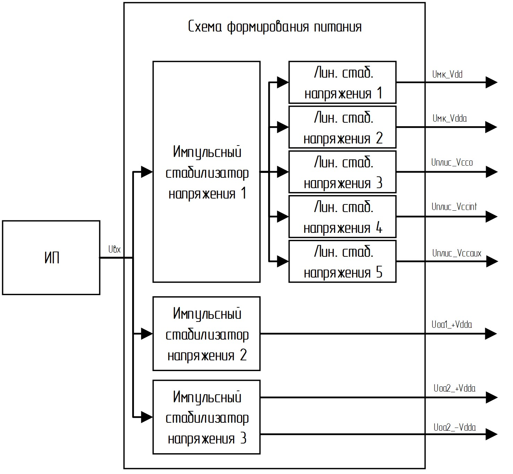

# Часть 3. Схема формирования питания

## Задание 

Разработать схему формирования питания как составную часть устройства Х (структурная схема представлена на рис.3.1) с заданными характеристиками.

Схема должна обеспечивать необходимые уровни напряжения для перечисленных ниже узлов схемы.

Описание структурных блоков устройства Х в части питания, для которого в данной части курсовой работы необходимо разработать схему формирования питания:

1. Микроконтроллер (далее МК)  
    1.1.	VD (питание цифровой части МК, обычно в спецификации называется VDD)  
    1.2. VA (питание аналоговой части МК, обычно в спецификации называется VDDA)  
2. Программируемая логическая интегральная схема (далее ПЛИС)  
    2.1. VCCINT (напряжение питания ядра)  
    2.2. VCCO (напряжение питания блоков ввода-вывода)  
    2.3. V CCAUX (вспомогательное напряжение питания)  
3.	Операционный усилитель (Operational Amplifier, OA) с однополярным питанием («Single-supply», далее ОУ-1)  
    +V (положительное питание ОУ)  
4.	Операционный усилитель (Operational Amplifier, OA)  с двухполярным питанием («Dual-supply», далее ОУ-2)  
    4.1. +V (положительное питание ОУ)  
    4.2. -V (отрицательное питание ОУ)  

 

Рисунок 3.1 – Структурная схема устройства X

## Методические указания по выполнению

При разработке схемы формирования питания стоит учитывать не только уровень напряжения (таблица 3.1), но и потребляемый ток в конкретной цепи питания (таблица 3.2).

Входное напряжение Uвх в соответствии с вариантами значительно завышено, относительно уровня напряжений питания целевых потребителей схемы - МК и ПЛИС.

Использование линейного стабилизатора в качестве входного каскада в данной ситуации не целесообразно, так как линейный стабилизатор обладает довольно низким КПД (около 50%) и «излишки» входного напряжения будет рассеивать в виде тепла. Использование линейного стабилизатора в данной ситуации приведёт к нагреву устройства и к нецелесообразному расходу энергии источника питания. Исходя из чего предлагается с помощью импульсного стабилизатора напряжения сначала понизить уровень входного напряжения до определённого уровня, после чего стабилизировать его с помощью линейного стабилизатора.

Уровень напряжения питания ОУ В РАМКАХ ДАННОГО ЗАДАНИЯ предлагается формировать с помощью импульсных стабилизаторов, без применения линейных.

Примерная схема формирования питания приведена на рисунке 2.

 

Рисунок 3.2 – Предлагаемая стрнуктурная схема формирования питания

## Требования к содержанию отчёта

1.	Фрагменты из таблиц с вариантом задания  
2.	Оценка уровня выходного напряжения импульсного стабилизатора 1  
3.	Выбор линейных стабилизаторов (все подпункты требуется выполнить для каждого стабилизатора)  
3.1.	Вводные данные для выбора стабилизатора (Uвх, Uвых, Iвых)  
3.2.	Обоснование выбора данного стабилизатора (полное номенклатурное название выбранного стабилизатора, описание параметров (Uвх, Uвых, Iвых_max, корпуса) и вывод о том, что такой стабилизатор подходит)  
3.3.	Расчёт мощности, выдаваемой в нагрузку Pнагр  
3.4.	Расчёт рассеивающей на стабилизаторе мощности Pрасс  
3.5.	Расчёт суммарной мощности, потребляемой стабилизатором и нагрузкой (Pнагр + Pрасс)  
4.	Оценка выходного тока импульсного стабилизатора 1  
5.	Выбор импульсного стабилизатора 1  
5.1.	Вводные данные для выбора стабилизатора (Uвх, Uвых, Iвых)  
5.2.	Обоснование выбора данного стабилизатора (полное номенклатурное название выбранного стабилизатора, описание параметров (Uвх, Uвых, Iвых_max, корпуса) и вывод о том, что такой стабилизатор подходит)  
6.	Выбор импульсных стабилизаторов 2 и 3  
6.1.	Вводные данные для выбора стабилизатора (Uвх, Uвых, Iвых)  
6.2.	Обоснование выбора данного стабилизатора (полное номенклатурное название выбранного стабилизатора, описание параметров (Uвх, Uвых, Iвых_max, корпуса) и вывод о том, что такой стабилизатор подходит)
7.  Итоговая структурная схема (по аналогии с рисунком 3.2) с указанием формируемых уровней напряжений и токов в каждой ветви (для формирования структурной схемы предлагается воспользоваться online-ресуром drawio.com)
8.	Итоговая схема электрическая принципиальная для формирования питания с учётом выбранных компонентов (образец оформления на Рис.3.3). К схеме необходимо приложить комментарии с расчётами пассивных компонентов. Для расчёта использовать [ряд E96](https://github.com/e-Pascal/Electrical-engineering/tree/main/Coursework/appendix_D) 
9.	Оценка выходного тока ИП (источника питания) для вашего устройства (потреблением пассивных компонентов пренебречь)  
 
 
 

Рисунок 3.3 – Пример оформления схемы электрической принципиальной

## Вопросы и ответы

1.	Как я могу оценить уровень выходного напряжения на импульсном стабилизаторе 1?
> Для ответа на этот вопрос необходимо понять, какие уровни напряжений требуется сформировать для МК и ПЛИС. Например, по какому-то из вариантов требуется сформировать 1.8 В, 2.5 В, 3.3 В, 1 В, 5 В. Выбираем максимальное и прибавляем от 1 В до 2 В. От 1 В до 2 В это напряжения падения на линейном стабилизаторе (величина падения напряжения зависит, в частности, от стабилизаторов, которые захотите использовать в дальнейшем). Соответственно на выходе импульсного стабилизатора 1 необходимо сформировать напряжение приблизительно 5 В + 2 В = 7 В.

2.	Могу ли я использовать стабилизаторы с фиксированным выходом?
> Да.

3.	Нужно ли дополнительно стабилизировать напряжения после импульсных стабилизаторов 2 и 3?
> Нет, в данном задании этого не требуется. Но в реальных схемах стоит учесть, что уровень импульсных помех питающего напряжения может повлиять на обрабатываемые сигналы. При желании добавить линейный стабилизатор можно. 

4.	Можно ли не делать два отдельных стабилизатора, если некоторые из уровней напряжения совпадают?
> В данном случае делать 2 стабилизатора в большинстве случаев действительно не целесообразно. Но нужно учесть ток потребления от всех микросхем, подключаемых к этой цепи питания.

5.	Как определить суммарную мощность?
>Pнагр = Pнагр1+Pнагр2+Pнагр3… - сумма всех мощностей  
Pнагр1 = UI  
Например по варианту Uмк_Vdd = 4 В и Iмк_Vdd = 20 мА.  
Отсюда Pмк_Vdd = Uмк_Vdd * Iмк_Vdd = 80 мВт.  
Находим мощности потребления для все остальных цепей и складываем их

6.	Нужно ли прилагать скрины с Mouser.com или других дистрибьютеров?
> Нет.

7.	Можно ли использовать стабилизаторы одной серии (одна спецификация)?
> Да.

8.	Как оценить выходной ток импульсного стабилизатора?
> Для этого нужно оценить мощность потребителей после импульсного стабилизатора. В нашем случае это линейные стабилизаторы. В пункте 3.5 для каждого стабилизатора нужно рассчитать суммарную мощность потребления каждым стабилизатором. Просуммировав мощности всех линейных стабилизаторов, можно оценить Pимп_вых – требуемую выходную мощность импульсного стабилизатора 1. Учитывая выходное напряжение импульсного стабилизатора, определённого в пункте 1 можно вычислить выходной ток по формуле I = P/U

9.	Как оценить выходной ток ИП?
> Исходя из схемы, приведённой на Рис.1 потребителями относительно источника питания являются импульсные стабилизаторы. Соответственно необходимо уточнить мощности потребления каждым импульсным стабилизатором и просуммировать их. Так как КПД импульсного стабилизатора 90-98 %, можно пренебречь потерями на самих стабилизаторах. В спецификации на каждый стабилизатор указывается потребление самого стабилизатора. Но в рамках данного задания эту информацию мы использовать не будем и будем считать что потери на стабилизаторе пренебрежимо малы. Остаётся просуммировать мощности потребления каждого импульсного стабилизатора, а с учётом пренебрежения потерями на данных стабилизаторах, мощность потребления равна мощности, выдаваемой в нагрузку. Например, ток потребления ОУ-1 составляет 30 мА, напряжение питания 5 В. P = IU=5*0,03=0,15 Вт. Аналогичным образом необходимо найти мощности потребления для всех остальных импульсных стабилизаторов. Просуммировать их. Исходя из Uвх по варианту рассчитать выходной ток I=P/Uвх.

10.	Как сформировать отрицательное напряжение для ОУ-2?
> Так как с источника питания не приходит отрицательное напряжение, необходимо получить внутри схемы формирования питания. Для формирования питающих напряжений для ОУ-2 можно использовать специальные импульсные стабилизаторы, которые умеют формировать из положительного напряжения на входе симметричные уровни противоположной полярности на выходе. Например, из входных +30 В такой стабилизатор может сформировать +12 В и -12 В.
Есть ещё один вариант формирования отрицательного напряжения. В данном способе требуется 2 стабилизатора. С помощью первого формируете положительное входное напряжение, а на втором, используя сформированное напряжение инвертируете его. Такие схемы подключения стабилизаторов называют инвертирующими. Некоторые современные стабилизаторы можно подключать разным способом и получать повышенное напряжение, пониженное, инвертированное, симметричные и т.д.

11.	А что будет если я нарисую выводы у микросхем не только слева и справа, но и сверху и снизу, а резистор пружинкой, конденсатор лодочкой, катушку индуктивности спиралькой и буду проводить цепи в схеме не под углом 90 градусов?
> Ваша огромная схема будет отправлена на доработку.

12.	Нужно ли огибать цепи дугой на схеме, если они не пересекаются?
> Нет, не нужно. В месте пересечения цепей на схеме ставится точка, в противном случае точка не ставится.

## Варианты индивидуальных параметров схемы

Таблица 3.1 – Уровни напряжений для схемы формирования питания

|   №   | $U_{вх}\ ,\ В$ |  $U_{мк_\ Vdd}\ ,\ В$ | $U_{мк_\ Vdda}\ ,\ В$ | $U_{плис_\ Vcco}\ ,\ В$  | $U_{плис_\ Vccint}\ ,\ В$  | $U_{плис_\ Vccaux}\ ,\ В$  |$+U_{оу1_\ Vdda}\ ,\ В$  | $+U_{оу2_\ Vdda}\ ,\ В$ | $-U_{оу2_\ Vdda}\ ,\ В$  |
|-------|----|------|-------|-------|--------|------|-------|-------|---|
|1		| 30 |	3,3	|	3,3	|	2,5	|	1	 |1,25	|13		| 13	|-13|
|2		| 35 |	2,5	|	2,5	|	5	|	0,8	 |1,6	|18		| 14	|-14|
|3		| 40 |	1,8	|	1,8	|	2,5	|	1,25 |1,5	|13		| 18	|-18|
|4		| 20 |	2,5	|	2,5	|	5	|	1,5	 |2		|13		| 12	|-12|
|5		| 30 |	3	|	5	|	2,5	|	1,25 |1,3	|15		| 11	|-11|
|6		| 30 |	2,5	|	2,5	|	3,3	|	1,5	 |1,6	|11		| 15	|-15|
|7		| 25 |	3,3	|	3,3	|	2,5	|	1,25 |1,8	|11		| 14	|-14|
|8		| 30 |	3	|	3	|	2,5	|	1	 |1,8	|12		| 15	|-15|
|9		| 35 |	3	|	5	|	3	|	0,8	 |1,25	|16		| 16	|-16|
|10		| 25 |	3,3	|	3,3	|	5	|	1	 |1,6	|11		| 18	|-18|
|11		| 36 |	5	|	4	|	2,5	|	1,25 |1,5	|18		| 15	|-15|
|12		| 24 |	2,5	|	2,5	|	3	|	1	 |1,8	|14		| 14	|-14|
|13		| 26 |	5	|	5	|	2,5	|	0,8	 |1,25	|20		| 16	|-16|
|14		| 26 |	3	|	4	|	5	|	1	 |1,6	|17		| 15	|-15|
|15		| 23 |	3,3	|	3,3	|	3,3	|	1,25 |1,5	|17		| 16	|-16|
|16		| 34 |	5	|	5	|	5	|	1,25 |1,8	|14		| 15	|-15|
|17		| 26 |	3,3	|	3,3	|	3,3	|	1	 |1,5	|11		| 14	|-14|
|18		| 26 |	2,5	|	2,5	|	3	|	0,8	 |1,8	|15		| 15	|-15|
|19		| 28 |	5	|	5	|	3,3	|	1	 |1,25	|12		| 16	|-16|
|20		| 38 |	3,3	|	3,3	|	2,5	|	1,25 |1,8	|12		| 15	|-15|
|21		| 36 |	5	|	4	|	5	|	1,25 |1,6	|11		| 15	|-15|
|22		| 34 |	2,5	|	2,5	|	2,5	|	1	 |1,25	|15		| 14	|-14|
|23		| 26 |	3,3	|	3,3	|	2,5	|	1,5	 |2		|18		| 14	|-14|
|24		| 38 |	5	|	4	|	3,3	|	1	 |1,3	|20		| 12	|-12|
|25		| 22 |	2,5	|	2,5	|	5	|	0,8	 |1,6	|14		| 16	|-16|
|26		| 26 |	3,3	|	4	|	2,5	|	1	 |1,25	|14		| 12	|-12|
|27		| 28 |	5	|	2,5	|	3,3	|	1	 |1,8	|13		| 12	|-12|
|28		| 36 |	2,5	|	2,5	|	3,3	|	0,8	 |1,6	|14		| 18	|-18|
|29		| 32 |	3,3	|	4	|	5	|	1	 |1,25	|14		| 16	|-16|
|30		| 40 |	5	|	2,5	|	3,3	|	1,25 |1,8	|14		| 15	|-15|  

Таблица 3.2 – Токи потребления для схемы формирования питания
|   №   |  $I_{мк_\ Vdd}\ ,\ mA$ | $I_{мк_\ Vdda}\ ,\ mA$ | $I_{плис_\ Vcco}\ ,\ mA$  | $I_{плис_\ Vccint}\ ,\ mA$  | $I_{плис_\ Vccaux}\ ,\ mA$  |$+I_{оу1_\ Vdda}\ ,\ mA$  | $+I_{оу2_\ Vdda}\ ,\ mA$|  $-I_{оу2_\ Vdda}\ ,\ mA$  |
|---|-------|---|-------|-------|-------|-------|-------|-----|
|1	|100	|50	|	300	|	80	|	100	|	20	|	20	|	20|
|2	|110	|40	|	100	|	50	|	110	|	30	|	15	|	15|
|3	|120	|30	|	200	|	80	|	130	|	40	|	20	|	20|
|4	|130	|40	|	250	|	50	|	80	|	20	|	30	|	30|
|5	|140	|50	|	350	|	70	|	110	|	15	|	20	|	20|
|6	|150	|30	|	400	|	80	|	120	|	20	|	20	|	20|
|7	|140	|25	|	200	|	50	|	100	|	30	|	15	|	15|
|8	|150	|30	|	150	|	50	|	100	|	20	|	20	|	20|
|9	|160	|50	|	300	|	70	|	100	|	10	|	30	|	30|
|10	|170	|60	|	150	|	50	|	110	|	15	|	20	|	20|
|11	|180	|40	|	150	|	50	|	130	|	20	|	10	|	10|
|12	|190	|50	|	200	|	50	|	80	|	30	|	15	|	15|
|13	|200	|60	|	150	|	70	|	110	|	20	|	5	|	5 |
|14	|210	|70	|	250	|	50	|	120	|	25	|	15	|	15|
|15	|200	|50	|	100	|	50	|	100	|	30	|	30	|	30|
|16	|190	|60	|	250	|	70	|	100	|	15	|	15	|	15|
|17	|160	|30	|	300	|	80	|	110	|	10	|	10	|	10|
|18	|140	|50	|	250	|	60	|	130	|	15	|	15	|	15|
|19	|130	|50	|	100	|	80	|	80	|	5	|	10	|	10|
|20	|100	|60	|	150	|	70	|	110	|	15	|	15	|	15|
|21	|90		|70	|	250	|	80	|	120	|	20	|	5	|	5 |
|22	|120	|50	|	250	|	60	|	100	|	20	|	15	|	15|
|23	|130	|60	|	200	|	70	|	110	|	15	|	20	|	20|
|24	|90		|40	|	300	|	80	|	130	|	20	|	30	|	30|
|25	|80		|50	|	250	|	80	|	80	|	25	|	20	|	20|
|26	|70		|40	|	200	|	60	|	110	|	20	|	25	|	25|
|27	|80		|60	|	150	|	80	|	120	|	15	|	10	|	10|
|28	|90		|30	|	200	|	60	|	100	|	20	|	15	|	15|
|29	|110	|50	|	150	|	70	|	100	|	25	|	5	|	5 |
|30	|100	|40	|	100	|	80	|	100	|	15	|	15	|	15|
