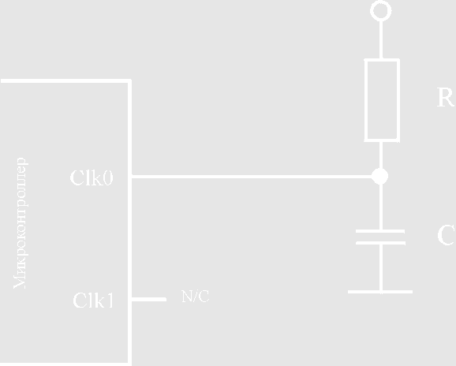
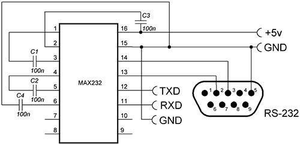

# Часть 4. Схема формирования питания для МК, ПЛИС и ОУ

## Содержание

1. [Введение](#введение)
2. [Теоретическая база](#теоретическая-база)
   - [Особенности питания микроконтроллеров](#особенности-питания-микроконтроллеров)
   - [Особенности питания ПЛИС](#особенности-питания-плис)
   - [Особенности питания операционных усилителей](#особенности-питания-операционных-усилителей)
   - [Согласование различных уровней напряжений](#согласование-различных-уровней-напряжений)
3. [Практические примеры](#практические-примеры)
   - [Схема питания для STM32 и Artix-7](#схема-питания-для-stm32-и-artix-7)
   - [Схема питания для ОУ LM358](#схема-питания-для-оу-lm358)
4. [Выбор компонентов и расчёты](#выбор-компонентов-и-расчёты)
5. [Инженеру на заметку](#инженеру-на-заметку)
6. [Заключение](#заключение)

---

## Введение

В четвёртой части курсовой работы рассматривается разработка схемы питания на основе вторичных источников питания (ВИП) для микроконтроллера (МК), программируемой логической интегральной схемы (ПЛИС) и операционного усилителя (ОУ). Особое внимание в данной части уделено выбору стабилизаторов, расчётам их параметров и особенностям фильтрации.

---

## Теоретическая база

### Питание микроконтроллеров

Питание МК — это важнейший аспект проектирования схем, от которого зависит стабильность работы как самого устройства, так и всей системы. Современные микроконтроллеры требуют формирования разного уровня напряжений для питания ядра, периферийных модулей и аналоговых цепей.

---

#### Особенности 

Система питания МК как правило включает в себя следующие выводы:
- VDD: внешнее питание для части блока ввода-вывода, внутреннего регулятора и аналоговых систем, таких как сброс, управление питанием и внутреннее тактирование;
- VDDA: внешнее аналоговое питание для АЦП, ЦАП, операционных усилителей, компараторов и источника опорного напряжения. Питание VDDA независимо от VDD;
- VREF: используется для установки точного уровня опорного напряжения. 
- VBAT: питает часы реального времени RTC, внешний генератор 32 кГц и регистры восстановления, когда отсутствует основное питание.

 

Рисунок 3.1 – ...

Рассмотрим пример МК от разных производителей, такие как STM32, ESP32 или PIC, которые имеют следующие особенности:

- **Ядро процессора**:
  Работает на низком напряжении ($V_\\text{CORE}$) от $1,1 \\ \\text{В}$ до $1,8 \\ \\text{В}$, что снижает энергопотребление и увеличивает производительность.
  
- **Периферийные интерфейсы**:
  GPIO, UART, SPI и другие интерфейсы питаются от напряжения ($V_\\text{IO}$), обычно $3,3 \\ \\text{В}$ или $5 \\ \\text{В}$.

- **Аналоговые модули**:
  АЦП и ЦАП требуют стабильного опорного напряжения ($V_\\text{REF}$), чтобы обеспечить точные измерения.

- **Резервный домен**:
  RTC и энергонезависимая память питаются от ($V_\\text{BAT}$), часто это $1,8 \\ \\text{В}$ или литиевая батарея на $3,0 \\ \\text{В}$.

---

#### Практические примеры

##### STM32H7
- $V_\\text{CORE} = 1,2 \\ \\text{В}$, $I_\\text{CORE} = 0,5 \\ \\text{А}$.
- $V_\\text{IO} = 3,3 \\ \\text{В}$, $I_\\text{IO} = 0,3 \\ \\text{А}$.
- $V_\\text{REF} = 3,3 \\ \\text{В}$ для аналоговых модулей.

##### ESP32
- Основное питание: $3,3 \\ \\text{В}$, ток до $0,5 \\ \\text{А}$.
- Уровни интерфейсов согласуются через преобразователи напряжений для периферии на $5.0 \\ \\text{В}$.

##### PIC18F45K22
- Одинаковый уровень напряжения питания $5,0 \\ \\text{В}$ для ядра и периферии.
- Минимальное потребление $20 \\ \\text{мА}$ в режиме сна.

---

#### Пример выбора микросхем ВИП и расчёты

##### Исходные данные:
- $V_\\text{CORE} = 1,2 \\ \\text{В}, I_\\text{CORE} = 0,5 \\ \\text{А}$.
- $V_\\text{IO} = 3,3 \\ \\text{В}, I_\\text{IO} = 0,3 \\ \\text{А}$.
- $V_\\text{IN} = 5,0 \\ \\text{В}$.

---

##### Выбор микросхем

###### Для $V_\\text{CORE}$:
- Импульсный стабилизатор **Texas Instruments TPS62097**:
  - Выходное напряжение: $1,2 \\ \\text{В}$.
  - Максимальный выходной ток: $1,0 \\ \\text{А}$.
  - КПД: $\\approx 90\\%$ при указанных параметрах.

###### Для $V_\\text{IO}$:
- Линейный стабилизатор **Analog Devices LT1963**:
  - Выходное напряжение: $3,3 \\ \\text{В}$.
  - Низкий уровень шумов: $<40 \\ \\mu\\text{В}$.

---

##### Расчёты

###### Для $V_\\text{CORE}$ с импульсным стабилизатором:
1. Выходная мощность:
   $$P_\\text{OUT} = V_\\text{OUT} \\cdot I_\\text{OUT} = 1,2 \\cdot 0,5 = 0,6 \\ \\text{Вт}.$$
2. Входная мощность:
   $$P_\\text{IN} = \\frac{P_\\text{OUT}}{\\eta} = \\frac{0,6}{0,9} = 0,667 \\ \\text{Вт}.$$
3. Входной ток:
   $$I_\\text{IN} = \\frac{P_\\text{IN}}{V_\\text{IN}} = \\frac{0.667}{5,0} = 0.133 \\ \\text{А}.$$

###### Для $V_\\text{IO}$ с линейным стабилизатором:
1. Тепловыделение:
   $$P_\\text{DISS} = (V_\\text{IN} - V_\\text{OUT}) \\cdot I_\\text{OUT} = (5,0 - 3,3) \\cdot 0,3 = 0,51 \\ \\text{Вт}.$$
2. Выходная мощность:
   $$P_\\text{OUT} = V_\\text{OUT} \\cdot I_\\text{OUT} = 3,3 \\cdot 0,3 = 0,99 \\ \\text{Вт}.$$

---

##### Итоговые параметры системы
- Общая входная мощность:
  $$P_\\text{IN (общ)} = P_\\text{IN (CORE)} + P_\\text{DISS (IO)} + P_\\text{OUT (IO)} = 0,667 + 0,51 + 0,99 = 2.167 \\ \\text{Вт}.$$

---

### Питание ПЛИС

Программируемые логические интегральные схемы (ПЛИС) обладают высокой производительностью и требуют сложной системы питания. Основные особенности включают множество уровней напряжений, высокое энергопотребление, а также строгие требования к фильтрации помех. 

ПЛИС, как правило, имеют довольно сложные требования к питанию, включая несколько линий питания (часто при разных напряжениях), жесткие допуски напряжения, последовательность включения питания и плавный запуск. 

Требования к системе питания ПЛИС: 
1. Ограничить параметры переходного процесса при включении питания.
2. Максимально снизить уровень высокочастотного шума, неизбежного в цифровых высокоскоростных схемах. Для этого необходимы:
    - раздельные шины питания для различных основных потребителей тока;
    - установка достаточного количества фильтрующих конденсаторов.

Если эти требования не выполняются, то работа может быть ненадежной или ПЛИС может быть повреждена.

Структурная схема системы питания ПЛИС состоит из первичного источника питания, формирующего входное напряжение (Vin) для стабилизатора напряжения, схемы, устанавливающей последовательность подачи различных напряжений и по необходимости схемы слежения за уровнями напряжений (супервизор). Одним из ключевых компонентов системы питания является цепочка фильтрующих конденсаторов вокруг ПЛИС. Они позволяют распределить рабочий ток между потребителями, используя низкоимпедансные пути прохождения тока, тем самым снижая уровень высокочастотного шума. 

Все ПЛИС нуждаются в источнике напряжения питания ядра, но большинство сложных ПЛИС испытывают потребность и в отдельном источнике напряжения питания для блоков ввода-вывода, источнике опорных напряжений, источнике напряжения для дополнительных функций. Зачастую, для корректного формирования последовательсти подачи питания на ПЛИС используют супервизоры питания(не обязательный атрибут, но значительно повышающий качество формирования уровней). В некоторых ПЛИС важна последовательность подачи питания, для чего можно использовать супервизоры или включать стабилизаторы напряжения с задержкой(задержку подачи логического уровня можно формировать обычным RC фильтром). 
  

 

Рисунок 3.1 – ...

Для питания разных функциональных блоков ПЛИС используются различные уровни напряжения. Для обеспечения одного уровня напряжения необходим один вторичный источник питания. 

Рассмотрим более подробно основные типы напряжения питания, необходимые для ПЛИС:
- VCCINT. Внешнее напряжение питания ядра. Является основным питающим напряжением ПЛИС и, как правило, обеспечивает большую часть мощности, затрачиваемой в ПЛИС. Основное напряжение источника зависит от семейства ПЛИС. Напряжение питания ядра может использоваться и для питания конфигурационного перепрограммируемого постоянного запоминающего устройства. Для современных ПЛИС это напряжение обычно находится в диапазоне от 0,9 В до 1,2 В с допуском 5%.
- VCCO. Напряжение питания блоков ввода-вывода. Уровни напряжения определяются внешними цифровыми схемами и, поскольку многие современные ПЛИС имеют несколько портов ввода-вывода, каждый из них может питаться от своего источника для обеспечения интерфейса с различными типами цифровой логики. 
- VCCAUX. Вспомогательное напряжение питания, необходимое для различных вспомогательных функций ПЛИС, например для устройства управления тактовой частотой или интерфейсом JTAG. Вспомогательные устройства более чувствительны к шуму, нежели другие, и поэтому VCCAUX имеет более высокие требования по развязке для минимизации наведенного шума. В случае если источник питания ядра напряжением VCCO обладает низким шумом, от него можно запитать блоки вспомогательных функций
 

 

Рисунок 4. – ...

---

#### 1. Особенности питания ПЛИС

Современные ПЛИС, такие как **Xilinx Artix-7** или **Intel Cyclone V**, требуют раздельного питания для различных блоков. Основные уровни питания данной микросхемы включают:

1. **Питание ядра ($V_\\text{CORE}$)**:
   - Обеспечивает работу основной логики ядра.
   - Типичное напряжение: $0,9 \\, \\text{В} - 1,2 \\, \\text{В}$.
   - Ток потребления может достигать нескольких ампер в зависимости от активности логики.

2. **Питание интерфейсов ($V_\\text{IO}$)**:
   - Для работы GPIO и интерфейсов ввода-вывода (I²C, SPI, UART).
   - Обычно $3,3 \\, \\text{В}$ или $2,5 \\, \\text{В}$, чтобы соответствовать внешним устройствам.

3. **Питание вспомогательных блоков ($V_\\text{AUX}$)**:
   - Используется для тактовых генераторов, конфигурационной памяти и дополнительных модулей.
   - Типичное напряжение: $1,8 \\, \\text{В}$.

4. **Опорное напряжение ($V_\\text{REF}$)**:
   - Для работы аналоговых блоков и прецизионных схем.
   - Требует минимального уровня шумов, типичное значение — $1,25 \\, \\text{В} - 2,5 \\, \\text{В}$.

---

#### 2. Практические примеры

##### Пример 1: Xilinx Artix-7
Для ПЛИС **Artix-7** используются следующие уровни напряжений:
1. $V_\\text{CORE} = 1,0 \\, \\text{В}$, потребляемый ток $2 \\, \\text{А}$ при высокой загрузке логики.
2. $V_\\text{IO} = 3,3 \\, \\text{В}$, потребляемый ток $0,5 \\, \\text{А}$.
3. $V_\\text{AUX} = 1,8 \\, \\text{В}$, потребляемый ток $0,1 \\, \\text{А}$.

##### Пример 2: Intel Cyclone V
1. $V_\\text{CORE} = 1.1 \\, \\text{В}$, ток $1.8 \\, \\text{А}$.
2. $V_\\text{IO} = 2.5 \\, \\text{В}$, ток $0.3 \\, \\text{А}$.
3. $V_\\text{REF} = 1.25 \\, \\text{В}$ для опорных сигналов АЦП и ЦАП.

---

#### 3. Пример выбора микросхем ВИП и расчёты

##### Исходные данные:
Для ПЛИС Artix-7:
- $V_\\text{CORE} = 1,0 \\, \\text{В}, I_\\text{CORE} = 2,0 \\, \\text{А}$.
- $V_\\text{IO} = 3,3 \\, \\text{В}, I_\\text{IO} = 0,5 \\, \\text{А}$.
- $V_\\text{AUX} = 1,8 \\, \\text{В}, I_\\text{AUX} = 0,1 \\, \\text{А}$.

##### Выбор микросхем:
1. **Для $V_\\text{CORE}$:**
   - Импульсный стабилизатор **Texas Instruments LM21215A**:
     - Выходное напряжение: $1,0 \\, \\text{В}$.
     - Максимальный ток: $15 \\, \\text{А}$.
     - КПД: $92\\%$ при нагрузке $2,0 \\, \\text{А}$.

2. **Для $V_\\text{IO}$:**
   - Линейный стабилизатор **Analog Devices LT1963**:
     - Выходное напряжение: $3,3 \\, \\text{В}$.
     - Максимальный ток: $1,5 \\, \\text{А}$.
     - Низкий уровень шумов.

3. **Для $V_\\text{AUX}$:**
   - Импульсный стабилизатор **Texas Instruments TPS62933**:
     - Выходное напряжение: $1,8 \\, \\text{В}$.
     - Максимальный ток: $3,0 \\, \\text{А}$.
     - КПД: $94\\%$.

##### Расчёты:
1. **Для $V_\\text{CORE}$:**
   - Выходная мощность:
     $$P_\\text{OUT} = V_\\text{OUT} \\cdot I_\\text{OUT} = 1,0 \\cdot 2,0 = 2,0 \\, \\text{Вт}.$$
   - Входная мощность:
     $$P_\\text{IN} = \\frac{P_\\text{OUT}}{\\eta} = \\frac{2,0}{0,92} \\approx 2,17 \\, \\text{Вт}.$$

2. **Для $V_\\text{IO}$:**
   - Тепловыделение:
     $$P_\\text{DISS} = (V_\\text{IN} - V_\\text{OUT}) \\cdot I_\\text{OUT} = (5,0 - 3,3) \\cdot 0,5 = 0,85 \\, \\text{Вт}.$$

---

### Особенности питания операционных усилителей

Операционные усилители (ОУ) являются важной частью многих аналоговых и смешанных схем. Правильная организация питания этих компонентов влияет на их стабильность, точность и уровень шумов. В отличие от цифровых устройств, ОУ чувствительны к колебаниям напряжения питания, что делает критически важным выбор стабилизаторов и фильтров.

---

#### Питание ОУ: основные аспекты

Большинство операционных усилителей требуют двухполярного питания, то есть наличие положительного ($V_+$) и отрицательного ($V_-$) напряжений относительно общего провода ($GND$). Это позволяет корректно обрабатывать как положительные, так и отрицательные входные сигналы, что необходимо для многих схем обработки сигналов. Типичные уровни питания для аналоговых ОУ составляют:
- $V_+ = +15 \\, \\text{В}$, $V_- = -15 \\, \\text{В}$ — для прецизионных аналоговых схем.
- $V_+ = +5 \\, \\text{В}$, $V_- = -5 \\, \\text{В}$ — для низковольтных приложений.

Например, ОУ, такие как **LM358**, могут работать в однополярных схемах ($V_+ = 5 \\, \\text{В}, V_- = 0 \\, \\text{В}$), но это ограничивает диапазон обрабатываемых сигналов.

---

#### Влияние питания на параметры ОУ

Параметры операционных усилителей зависят от стабильности и уровня напряжений питания. Например:
- **Напряжение смещения** ($V_\\text{offset}$): нестабильное питание может привести к дрейфу смещения, что особенно критично для схем измерений.
- **Уровень шумов** ($V_\\text{noise}$): высокочастотные помехи в линии питания усиливаются схемой, ухудшая сигнал.
- **Полоса пропускания** ($BW$): недостаточное питание может ограничить верхнюю границу частотного диапазона.

Для минимизации влияния питания на работу ОУ применяются фильтрующие элементы, такие как LC-фильтры и байпасные конденсаторы.

---

#### Практический пример: питание LM358

Операционный усилитель **LM358** часто используется в низковольтных и экономичных схемах. Его питание может быть организовано как двухполярным ($\\pm 15 \\, \\text{В}$), так и однополярным ($0 - 5 \\, \\text{В}$).

1. **Двухполярное питание**:
   - Стабилизаторы: используют линейные стабилизаторы **LM7815** ($+15 \\, \\text{В}$) и **LM7915** ($-15 \\, \\text{В}$).
   - Фильтрация: конденсаторы $0,1 \\, \\mu\\text{Ф}$ размещаются на входе и выходе стабилизаторов для подавления высокочастотных помех.

2. **Однополярное питание**:
   - Источник: линейный стабилизатор **LM7805** для $+5 \\, \\text{В}$.
   - Ограничения: максимальный выходной сигнал ограничен диапазоном $0 - 5 \\, \\text{В}$.

---

#### Согласование питания ОУ с другими компонентами

В многокомпонентных схемах операционные усилители часто взаимодействуют с МК или ПЛИС. При этом важно обеспечить изоляцию питания аналоговых и цифровых компонентов. Например:
- Для питания ОУ может использоваться отдельный стабилизатор с низким уровнем шумов, такой как **Analog Devices LT3042**.
- Аналоговые цепи требуют выделенной земли, которая соединяется с цифровой землёй в одной точке (рядом со стабилизатором).

---

#### Итоги по питанию

1. **Обеспечьте стабильность напряжений**:
   - Используйте качественные стабилизаторы, подходящие для нагрузки (линейные для минимальных шумов, импульсные для высоких токов).
   - Проверяйте стабильность напряжений для всех уровней питания.

2. **Разделяйте аналоговые и цифровые цепи**:
   - Используйте изолированные источники питания для чувствительных компонентов, таких как ОУ или аналоговые модули.
   - Соединяйте земли аналоговых и цифровых цепей в одной точке (через "мостик").

3. **Планируйте многоуровневое питание**:
   - Для МК: обеспечьте отдельное питание для ядра, периферии и аналоговых модулей.
   - Для ПЛИС: организуйте питание для ядра, интерфейсов, вспомогательных блоков и опорного напряжения.
   - Для ОУ: при необходимости используйте двухполярное питание.

4. **Уделите внимание фильтрации помех**:
   - Размещайте байпасные конденсаторы ($0,1 \\, \\mu\\text{Ф}$) максимально близко к выводам питания каждого компонента.
   - Используйте дополнительные ёмкости ($10 \\, \\mu\\text{Ф}$) для снижения низкочастотных шумов.

5. **Продумайте топологию печатной платы**:
   - Делайте линии питания короткими и широкими, особенно для цепей с высокими токами (например, ядро ПЛИС).
   - Уменьшайте индуктивность и сопротивление дорожек.

6. **Обеспечьте защиту цепей питания**:
   - Устанавливайте диоды Шоттки для защиты от обратного тока.
   - Используйте TVS-диоды для предотвращения повреждений при всплесках напряжения.

7. **Учитывайте взаимодействие компонентов**:
   - Питание МК, ПЛИС и ОУ должно быть согласовано по уровням напряжений.
   - Если возможны помехи, устанавливайте фильтры между источниками питания и потребителями.

---

## ПИТАНИЕ
### Микроконтроллер (МК)

### Питание ПЛИС

Программируемые логические интегральные схемы находят все большее применение в разнообразных областях и решают различные задачи — от простой логики до цифровой обработки сигналов, и поэтому, для их питания требуются различные уровни мощности. Мощность, необходимая для питания ПЛИС, определяется следующими факторами: тип ПЛИС, ее рабочая частота, температура окружающей среды, число задействованных линий ввода-вывода и, конечно, процент используемых ресурсов ПЛИС. 

## Тактирование
Система тактирования является основным функциональным блоком, синхронизирующим все процессы и определяющим скорость их выполнения.

### Микроконтроллер

Микроконтроллер
Существует 4 способа задания тактовой частоты микроконтроллера:
•	использовать внутренний генератор;
•	использовать внешний кварц;
•	использовать внешний генератор;
•	использовать RC-цепочку.
Тактирование от внутреннего генератора

При этом способе нам не нужно подключать какие либо внешние детали. Тактирование осуществляется от RC-генератора, который находится внутри МК. Этот способ не подойдет, если нужны точные интервалы времени, т. к.  задающая частота RC-генератора плавает в зависимости от температуры.

Тактирование от внешнего кварцевого резонатора
Для того чтобы подключить осциллятор нужно знать расположение выводов МК и их название. Схема подключения приведена в спецификации к данному МК. Два основных недостатка этого способа синхронизации – необходимость подключения дополнительных внешних конденсаторов (рекомендуемые номиналы которых можно найти в спецификации к МК) и хрупкость кристаллов кварца. Оба этих недостатка могут быть устранены, если использовать керамический резонатор. Керамические резонаторы существенно более стойки к ударной нагрузке, и многие из них имеют встроенные конденсаторы, вследствие чего количество требуемых внешних компонентов уменьшается с трех до одного.
Тактирование от внешнего генератора
При помощи внешнего тактового генератора можно задать любую частоту синхронизации. Высокая стабильность создаваемой частоты (временная и температурная). Однако внешний кварцевый генератор занимает большой объём. Также иногда требуется отдельная линия питания.
Тактирование с использованием RC-цепочки
В этом случае необходимая частота тактовых импульсов задается путем соответствующего выбора постоянной времени RC-цепи. Это самый дешевый способ задания частоты, но наименее точный. Если кварц обеспечивает поддержание частоты с точностью в тысячные доли процента, керамический резонатор – в десятые доли процента, то RC-цепь дает точность порядка десятков процентов. Точность задания тактовой частоты можно повысить, используя переменные резистор или конденсатор. Однако при этом сложность и цена генератора увеличатся.
   

 

Рисунок 3.1 – ...

 

Рисунок 4 – ...

 

Рисунок 4 – ...

### ПЛИС
В качестве генератора стабильной частоты используются внешние кварцевые или микромеханические генераторы. В некоторых случаях внешний генератор может быть подключен не напрямую к ПЛИС, а через буферные схемы для минимизации искажений сигнала и увеличения надежности. 
 

 

Рисунок 4 – ...

 
## ИНТЕРФЕЙСЫ
Интерфейс – совокупность механических, электрических и программных средств, с помощью которых компоненты системы объединяются для решения задачи обмена информации.

Каждый вывод может использоваться в режиме:
•	Input floating – вход без подтягивающего резистора, брошенный в воздухе вход.
•	Input pull-up – вход с подтягивающим резистором, подключенным к питанию.
•	Input pull-down - вход с подтягивающим резистором, подключенным к общему проводу (земле).
•	Analog – аналоговый вход ( вход АЦП, компараторов и т.п.).
•	Output open-drain – выход с открытым стоком. Функционально аналогичен выходу с открытым коллектором. При низком логическом уровне замыкает вывод на землю, при высоком – бросает в воздухе.
•	Output push-pull – обычный активный выход. При низком логическом уровне напряжение на выводе равно 0, при высоком – напряжение близко к напряжению питания.

### Интерфейсы программирования и отладки

Для того чтобы МК или ПЛИС могли решать задачи и выполнять определенные функции, файл прошивки нужно записать в память микроконтроллераили ПЛИС или, проще говоря, прошить.
Для прошивки применяется устройство, называемое программатор. В зависимости от типа программатора в большинстве случаев вход подключается к COM или USB порту, а выход к определенным выводам микросхемы МК или ПЛИС.

#### Популярные интерфесы отладки и программирования

1. JTAG (Joint Test Action Group)
JTAG — это стандартный интерфейс для тестирования и программирования цифровых устройств. Он изначально был разработан для тестирования соединений на печатных платах, но широко используется и для программирования микроконтроллеров и ПЛИС, а также для отладки.
Использует несколько линий 
TCK (TCLK) (test clock)- тестовая синхронизация
TDI (test data in) - входные тестовые данные 
TDO (test data out) - выходные тестовые данные 
TMS (test mode select) - выбор тестового режима
TRST (test reset) - сброс JTAG в начальное состояние  (используется не всегда)
 

 

Рисунок 4 – ...

2. SWD (Serial Wire Debug)
SWD — это интерфейс для отладки, разработанный как часть архитектуры ARM. Он представляет собой сокращенную версию JTAG и предназначен для упрощения отладочных интерфейсов с меньшим количеством линий связи.
 SWD использует всего две линии — SWDIO (данные) и SWCLK (тактовый сигнал), что делает его более компактным по сравнению с JTAG.
 

 

Рисунок 4 – ...

3. SWIM (Single Wire Interface Module)
SWIM — это интерфейс для программирования и отладки, разработанный компанией STMicroelectronics для своих 8-битных микроконтроллеров STM8. Он использует только одну линию для передачи данных, что упрощает его интеграцию в схемы. Предоставляет доступ к памяти и регистраторам микроконтроллера.
 
 
 

Рисунок 4 – ...

### Интерфейсы передачи/обмена пользовательскими данными

#### UART 
UART (Universal Asynchronous Receiver-Transmitter) — это последовательный интерфейс, который используется для асинхронной передачи данных между устройствами. Это один из самых простых и популярных интерфейсов для передачи данных между устройствами.
 Обычно требует двух линий — TX (Transmitter / передача данных) и RX ( Receiver / прием данных), а также иногда линии для контроля потока, такие как CTS и RTS. В отличие от JTAG и SWD, UART не требует отдельного тактового сигнала, так как данные передаются в асинхронном режиме. Используется также для загрузки прошивок в микроконтроллеры (bootloader), простой отладки и мониторинга данных через последовательный интерфейс.
Для связи двух устройств понадобятся два провода, причем соединять их следует крест-накрест RX первого в TX второго и наоборот (куда один передает, там другой принимает). Связь в UART может быть симплексной (данные передаются только в одном направлении), полудуплексной (каждая сторона  передает данные, но не одновременно) или полнодуплексной (одновременная передача и прием данных).
 
 
 

Рисунок 4 – ...

С помощью UART также можно можно связать микроконтроллер и компьютер, но есть одна проблема: у UART интерфейса логические уровни 0 и +5 вольт, а в компьютере логические уровни в интерфейсе RS-232 могут быть от -25 до -3 вольт и от +3 до +25 вольт. Для этого применяют специальный преобразователь уровней на микросхеме MAX232:
 
 
 

Рисунок 4 – ...

Все сигналы UART передаются специально выбранными уровнями, обеспечивающими высокую помехоустойчивость связи. Отметим, что данные передаются в инверсном коде (логической единице соответствует низкий уровень, логическому нулю — высокий уровень. 

 

Рисунок 4 – ...

#### SPI
SPI (Serial Peripheral Interface) - последовательный периферийный интерфейс, предназначен для организации обмена данными между двумя устройствами. С его помощью может осуществляться обмен данными между микроконтроллером или ПЛИС и различными устройствами, такими, как АЦП, FLASH-ПЗУ и др. Кроме того, через интерфейс SPI может осуществляться программирование.
  

 

Рисунок 4 – ...

 

Рисунок 4 – ...

CPOL — исходный уровень сигнала синхронизации (если CPOL=0, то линия синхронизации до начала цикла передачи и после его окончания имеет низкий уровень (т.е. первый фронт нарастающий, а последний — падающий), иначе, если CPOL=1, — высокий (т.е. первый фронт падающий, а последний — нарастающий));
CPHA — фаза синхронизации; от этого параметра зависит, в какой последовательности выполняется установка и выборка данных (если CPHA=0, то по переднему фронту в цикле синхронизации будет выполняться выборка данных, а затем, по заднему фронту, — установка данных; если же CPHA=1, то установка данных будет выполняться по переднему фронту в цикле синхронизации, а выборка — по заднему). Информация по режимам SPI обобщена в таблице.
 
 
 

Рисунок 4 – ...

#### I2C
I2C (Inter-Integrated Circuit) - последовательный асимметричный интерфейс между интегральными схемами внутри электронных приборов.В положительную сторону отличается от UART более высокой скоростью стабильной передачи данных и более стабильной передачей данных на высокой скорости. Кроме того, благодаря своей архитектуре, позволяет подключать к одной шине, состоящей из двух проводов SDA (данные) и SCL (тактовые импульсы), до 128 устройств одновременно, не используя дополнительного оборудования, если не считать двух подтягивающих резисторов.
 
 
 

Рисунок 4 – ...

Устройство, подключенное к шине, должно быть либо ведущим, либо подчиненным. Ведущее устройство инициирует передачу данных путем передачи адреса подчиненного устройства и типа передачи: чтение или запись. Если к шине подключено несколько ведущих устройств и некоторая их часть одновременно инициировала передачу, применяется механизм арбитража, который учитывает приоритет этих устройств.

 

Рисунок 4 – ...

 

Рисунок 4 – ...

 

Рисунок 4 – ...

 

Рисунок 4 – ...

    
Ведущее устройство сигнализирует о начале транзакции генерацией на шине условия START (S). Затем, передается пакет адреса с адресом подчиненного устройства (ADDRESS) и указание желаемого направления передачи данных, т.е. чтение или запись (R/W). По завершении передачи всех пакетов данных (DATA), ведущее устройство генерирует на шине условие STOP (P) и транзакция завершается. После приема каждого байта получатель данных генерирует бит подтверждения (A или ACK) или неподтверждения (/A или NACK).
…………………………………………………………………………………………………………...

#### CAN

CAN (Control Area Network) — последовательная магистраль, обеспечивающая увязку в сеть "интеллектуальных" устройств ввода/вывода, датчиков и исполнительных устройств некоторого механизма или даже предприятия. Характеризуется протоколом, обеспечивающим возможность нахождения на магистрали нескольких ведущих устройств, обеспечивающим передачу данных в реальном масштабе времени и коррекцию ошибок, высокой помехоустойчивостью.
Рассматриваемый нами узел сети CAN состоит из микроконтроллера, CAN контроллера и приемопередатчика. Некоторые микроконтроллеры имеют встроенный контроллер CAN, такой как STM32 или PIC18F, в то время как другим требуется внешний контроллер CAN, такой как MCP2515. приемопередатчик подключается к витой паре, на концах которой размещены согласующие резисторы с сопротивлением 120 Ом.
Для формирования логической единицы в витой паре, или свободной шине, на оба провода подается напряжение, равное половине разности напряжения между 0 или Vcc. Логическому нулю соответствует подача на провода линии дифференциального напряжения

 

Рисунок 4 – ...

 

Рисунок 4 – ...

Пакет сообщения CAN
Формат сообщения CAN показан на рисунке
 
 
 

Рисунок 4 – ...

Идентификатор сообщения используется для идентификации данных, отправленных в этом пакете. Каждое отправленное сообщение принимается всеми узлами сети и в данном случае идентификатор позволяет понять конкретному устройству, необходимо ли обрабатывать данное сообщение. Максимальная длина сообщения 8 байт. 
Арбитраж на шине CAN: первым по шине CAN всегда передается сообщение с наименьшим идентификатором.

### Служебные выводы

#### Режимы загрузки

Микроконтроллер может начать свою работу в одном из трех различных режимов загрузки. Эти режимы выбираются с помощью выводов BOOT0 и BOOT1. От выбранного режима загрузки зависит, какую область карты памяти микроконтроллер будет считать началом памяти. МК может исполнять код программы из Flash памяти, внутреннего статического ОЗУ или системной памяти.
Для работы в обычном режиме вывод BOOT0 необходимо соединить с GND. Если же планируется использование других режимов, необходимо предусмотреть джамперы для задания различных состояний на выводах управления загрузкой.
BOOT1	BOOT0	Режим запуска программы
0	0	Внутренняя FLASH
1	0	
0	1	Системная память
1	1	Внутреннее ОЗУ

 

 

Рисунок 4 – ...

Управляющие сигналы для выбора режима загрузки

ПЛИС также имеет специальные выводы, которые задают режим загрузки. В зависимости от состояния этих выводов выбирается нужный режим конфигурации. Рассмотрим, как это происходит на примере Xilinx и Intel (Altera) ПЛИС.
Для Xilinx FPGA
1.	Многорежимный переключатель M[2:0]:
Эти три пина определяют режим загрузки FPGA Xilinx:
Типичная настройка этих пинов:
•	M[2:0] = 001: Master SPI (конфигурация из внешней SPI FLASH).
•	M[2:0] = 101: Slave SPI (приём данных по SPI).
•	M[2:0] = 110: JTAG (конфигурация через JTAG).
Для Intel (Altera) FPGA
MSEL (Configuration Mode Select):
Пины MSEL[3:0] на микросхеме Intel FPGA задают режим загрузки:
•	Активный последовательный (Active serial (AS)).
•	Активный параллельный (Active parallel (AP)).
•	Пассивный последовательный (Passive serial (PS)).
•	Быстрый пассивный параллельный (Fast passive parallel (FPP)).
•	JTAG.

#### Сброс

Начальный сброс требуется любому МК. Организуется он через выводы NRST (активный НИЗКИЙ уровень) или RST (активный ВЫСОКИЙ уровень). В большинстве широкораспространённых моделей используется NRST. Схема подключения данного вывода приведена в спецификации к МК. Ниже показан одна из возможных схем сброса.

 

Рисунок 4 – ...

После того как схема включена, изначально конденсатор C12 разряжен и напряжение на RST почти равно нулю и в результате микроконтроллер не запускается. Получается, что после запуска схемы происходит постоянный сброс. С течением времени происходит заряд конденсатора через резистор, после того как он зарежется на выводе RST появится логическая единица, МК запустится. Кнопка же разряжает конденсатор и происходит перезапуск микроконтроллера.
 Задержку перед стартом МК можно посчитать по формуле как T=R*C при данных значения получается приблизительно одна секунда. Для чего эта задержка? Для того чтобы МК не запускался перед тем как все устройства на плате не запитаются и  не перейдут в установившийся режим работы.
GPIO (General Purpose Input/Output).
General Purpose Input/Output — интерфейс, который содержит Входы и Выходы общего назначения, к которым можно подключать разнообразные исполнительные устройства, датчики, дисплеи, контроллеры, разные модули и разную периферию.
GPIO называют «порт общего назначения», поскольку каждый его разряд может быть свободно настроен для работы по приему как входных, так и для формирования выходных цифровых сигналов.
Регистр портов (PDR). Устанавливает направление для каждого внешнего вывода GPIO - либо на ввод, либо на вывод, либо на ввод/вывод (рис. 1).
Регистр входных данных порта (PIDR). Показывает состояние входных контактов.
Регистр выходных данных порта (PODR). Чтобы выводить данные через выходные выводы, программно записываются выходные значения в этот регистр.

 

Рисунок 4 – ...

### Подключение периферии через GPIO

Светодиод

 

Рисунок 4 – ...

Как видно из рисунка, в правильном подключении светодиода присутствует гасящий резистор, который ограничивает ток через сам светодиод и используемый им выход порта, соответствующий GPIO4.
При прямом подключении без резистора, на светодиод поступит напряжение +3.3В, что есть больше нормы для светодиодов (2-3В). Прямое напряжение такой величины станет причиной резкого возрастания тока в цепи. Такая ситуация может повлечь за собой выгорание светодиода и выхода из строя как отдельного буфера GPIO, так и микропроцессора в целом.

#### Кнопка

Основные варианты подключения кнопки:
1. Нормально разомкнутая (НО) кнопка
 Кнопка размыкает цепь в неактивном состоянии и замыкает при нажатии.
•	Схема подключения:
o	Один контакт кнопки подключается к источнику питания.
o	Второй контакт подключается к нагрузке, которая, в свою очередь, соединена с другим полюсом источника питания.
2. Нормально замкнутая (НЗ) кнопка
В неактивном состоянии кнопка замыкает цепь, а при нажатии размыкает её.
•	Применение: Обычно используется для остановки оборудования, активации аварийных сигналов, защитных систем.
•	Схема подключения:
o	Один контакт подключается к источнику питания.
o	Второй контакт к нагрузке, которая замыкает цепь до нажатия кнопки.

#### Движковый переключатель
Имеет два состояния, одно из которых замыкает одну цепь, а другое – размыкает. Применяется для переключения между двумя устройствами или режимами работы.
•  Схема подключения:

 

Рисунок 4 – ...

