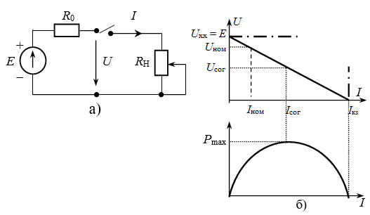

# Лабораторная работа №1. Элементы электрических цепей

## Цель работы

Исследование активного и пассивного двухполюсника и их эквивалентные преобразования. Изучение режимов работы источника напряжения. Изучение RLC - элементов в электрических цепях при воздействии источников постоянного тока.

## Необходимое ПО

Multisim NI

## Порядок выполнения лабораторной работы

Перед началом выполнения лабораторной работы каждому студенту необходимо `ВНИМАТЕЛЬНО` изучить информацию, приведённую в разделе [теория](#Теория), после чего приступить к разделу [Задания](#Задания). В лабораторной работе предусмотрены индивидуальные варианты схем, а также их параметры. Для получения номера варианта необходимо обратиться к преподавателю.

После выполнения моделирования и выполнения расчётов, необходимо предоставить отчёт о выполнении лабораторной работы преподавателю, а также ответить на дополнительные вопросы. Отчёт должен быть выполнен в тетради и содержать следующие пункты:

1.	Цель работы
2.	Схему и её параметры из индивидуального задания
3.	Эквивалентные схемы, графики, расчёты, таблицы
4.	Вывод

## Теория
### Источники электрической энергии в электрических цепях

Элементы электрических цепей в отчете необходимо изображать в соответствии `ГОСТ 2.750-68` и `ГОСТ 2.751-73` (рис. 1), а в программном приложении Multisim эти элементы изображены с использованием стандарта `ISO` (рис. 2).


*Рисунок 1. Условные графические обозначения в соответствии с ГОСТ2.750 – 68, ГОСТ 2.751 – 73*


*Рисунок 2. Условные графические обозначения по ISO (Multisim)*

### Активные и пассивные двухполюсники

`Двухполюсник` – это часть электрической цепи, имеющий два свободных вывода. С помощью этих выводов один двухполюсник может быть соединен с любым другим двухполюсником.

`Активный` двухполюсник содержит источники энергии, резисторы, индуктивности и конденсаторы, а `пассивный` – только резисторы, индуктивности и конденсаторы.

### Теорема Тевенина - Гельмгольца

Теорема `Тевенина - Гельмгольца` об эквивалентном источнике напряжения.  Активный двухполюсник (сложную электрическую схему) можно заменить эквивалентным источником напряжения и последовательно включенным сопротивлением.  Напряжение холостого хода равно ЭДС на этих выводах, а внутреннее сопротивление равно эквивалентному сопротивлению двухполюсника. 

### Теорема Нортона

Теорема `Нортона` об эквивалентном источнике тока. Активный двухполюсник можно заменить эквивалентным источником тока с параллельно включенным сопротивлением. Источник тока равен току короткого замыкания на этих выводах, а внутреннее сопротивление равно эквивалентному сопротивлению двухполюсника относительно этих выводов.

### Эквивалентные преобразования источников

Если известна ЭДС и внутреннее сопротивление реального источника напряжения, тогда его можно заменить реальным источником тока, который равен: 

$$J=\frac{E}{r_0}$$

Внутреннее сопротивление сохраняет свое значение и включают его параллельно источнику тока. Реальный источник тока с параллельно включенным сопротивлением также можно заменить источником напряжения с последовательно включенным таким же сопротивлением. При этом ЭДС источника напряжения равна:

$$E=J*r_0$$

#### Примечание

Идеальный источник напряжения, имеющий внутреннее сопротивление равное нулю, нельзя преобразовать в идеальный источник тока, внутреннее сопротивление которого равно бесконечности.  

Идеальный источник тока также нельзя преобразовать в идеальный источник напряжения.

### Режимы работы источников в цепях постоянного тока

Электрическая схема для исследования источника тока, изображенная на рисунке 3, состоит из реального источника напряжения и резистора с сопротивлением $R_н$. Величину электрического тока можно регулировать от нуля в режиме холостого хода, когда ключ разомкнут, до тока короткого замыкания (ключ замкнут, а ползун резистора находится в крайнем верхнем положении).

Реальный источник напряжения имеет ЭДС и внутреннее сопротивление $R_0$.



*Рисунок 3. Схема для исследования реального источника (a) и графики (б) вольт-амперная характеристика и зависимость мощности от тока*

График напряжения идеального источника напряжения в режиме холостого хода является прямой горизонтальной линией, а график идеального источника тока в данном режиме равен току короткого замыкания и направлен вертикально.

Характерные точки работы реального источника:

* режим холостого хода:         $U_{xx}=E, I=0$;	
* номинальный режим: 		    $U_{ном}=(0,8–0,9)*E$; 
* согласованный режим: 		    $U_{сог}=\frac{E}{2}, I_{сог}=\frac{I_{кз}}{2}, P_{max}, \eta=50%$;
* режим короткого замыкания:	$U=0, I{кз}=\frac{E}{R_0}$.

Линейное уравнение вольт – амперной характеристики (ВАХ):

$$E=U+I*R_0$$

Условие номинального режима работы источника напряжения – это когда коэффициент полезного действия источника `(КПД)` находится в пределах 80 – 90%.  КПД источника напряжения определяют как отношение мощности, переданной потребителю, к мощности, вырабатываемой источником:

```math
\eta=\frac{P_{потр}}{P_{ист}}*100\%=\frac{U*I}{E*I}*100\%
```

$P_{потр}=U*I$ - мощность, отдаваемая источником потребителю; 
$P_{ист}=E*I$ - мощность, вырабатываемая источником.

Основной признак наличия согласованного режима в электрической цепи заключается в том, что источник отдает потребителю максимальную мощность, а в это время сопротивление нагрузки равно внутреннему сопротивлению источника $R_{нагр}=R_0$.

Мощность, отдаваемая источником потребителю при согласованном режиме, определяется по формуле:

```math
$$P=U*I=E*I-I^2*R_0$$
```

Взяв производную и приравняв к нулю, можно получить экстремальное значение, при котором возникает максимальная мощность согласованного режима:

```math
\frac{dP}{dI}=E-2*I*R_0=0
```

Электрический ток согласованного режима равен:

```math
I_{сог}=\frac{E}{2*r_0}=\frac{I_{кз}}{2}
```

Максимальная мощность при согласованном режиме рассчитывается по формуле:

```math
P_{max}=\frac{E^2}{2*R_0}-\frac{E^2*R_0}{4*R^2_0}=\frac{E^2}{4*R_0}
```

У идеального источника напряжения внутреннее сопротивление $R_0$ равно нулю, а график ВАХ становится горизонтальной линией. Идеальный источник тока равен току короткого замыкания $J=I_{кз}$, а график ВАХ становится вертикальной линией, исходящей из точки короткого замыкания.

## Задания

### 1. Исследование электрической схемы активного двухполюсника

1.  Собрать электрическую схему активного двухполюсника на рабочем поле `Multisim`. Вариант схемы приведен на рисунке 4, а параметры схемы – в `таблице 1`;
2.  Измерить напряжение холостого хода $U_{хх}$ на выходе активного двухполюсника. Рассчитать мощность холостого хода $P_{хх}$. Результат зафиксировать в таблице в рабочей тетради, форма приведена в [шаблоне](./templates/template_1.docx);
3.  Измерить ток короткого замыкания $I_{кз}$ и напряжение $U_{кз}$ (замкнуть выход активного двухполюсника проводником). Рассчитать мощность короткого замыкания $P_{кз}$. Результат зафиксировать в таблице в рабочей тетради, форма приведена в [шаблоне](./templates/template_1.docx);
4.  Рассчитать внутреннее сопротивление активного двухполюсника по формуле $R_0=\frac{U{xx}}{I_{кз}}$. Результат зафиксировать в таблице в рабочей тетради, форма приведена в [шаблоне](./templates/template_1.docx);
5.  Подключить резистор $R$ (по варианту из `таблицы 1`) к выходу активного двухполюсника и измерить ток и напряжение на нём. Результат зафиксировать в таблице в рабочей тетради, форма приведена в [шаблоне](./templates/template_1.docx);
6.  Активный двухполюсник заменить эквивалентной ЭДС, с последовательно включенным эквивалентным сопротивлением (`теорема Тевенина – Гельмгольца`), а затем последовательно подключить сопротивление R и измерить ток и напряжение на нем. Результат зафиксировать в таблице в рабочей тетради, форма приведена в [шаблоне](./templates/template_1.docx);
7.  Активный двухполюсник заменить эквивалентным источником тока с параллельно включенным эквивалентным сопротивлением (`теорема Нортона`), а затем подключить сопротивление $R$ и измерить ток и напряжение на нём. Результат зафиксировать в таблице в рабочей тетради, форма приведена в [шаблоне](./templates/template_1.docx);


### Исследование режимов работы активного двухполюсника

1.  К выходу активного двухполюсника из задания 1 подключить резистор $R$, равный по номиналу внутреннему сопротивлению $R_0$. Измерить ток ($I_{сог}$) и напряжение ($U_{сог}$) согласованного режима на резисторе $R$. Рассчитать мощность согласованного режима $P_{сог}$. Собрать электрические схемы. Результат зафиксировать в таблице в рабочей тетради, форма приведена в [шаблоне](./templates/template_1.docx);
2.  Получить дополнительные значения токов равные $I_1=0.5*I_{сог}$ и $I_2=1.5*I_{сог}$, изменяя сопротивление нагрузки $R_н$. Рассчитать мощность $P_1$ и $P_2$. Собрать электрические схемы. Результат зафиксировать в таблице в рабочей тетради, форма приведена в [шаблоне](./templates/template_1.docx);
3.  Подобрать показание вольтметра равным $U_{ном}=0,9*U_{хх}$, изменяя сопротивление нагрузки $R_н$. Результат зафиксировать в таблице в рабочей тетради, форма приведена в [шаблоне](./templates/template_1.docx);
4.  Заполнить таблицу;
5.  Построить графики друг под другом:
    * вольт-амперной характеристики (ВАХ);
    * зависимости мощности $P$ от тока $I$;
    * зависимости мощности $P$ от нагрузочного резистора. 

### Исследование поведения резистора, конденсатора и катушки индуктивности в цепи постоянного тока

1.  Собрать электрическую схему, приведенную на рисунке 5 ($E=12 В; R=20 Ом; L=10 мГн; C=10 мкФ$) на рабочем поле Multisim, а также перерисовать схему в тетрадь;
2.  Измерить токи ($I_R, I_C, I_L$) и напряжения ($U_R, U_C, U_L$). Результат зафиксировать в таблице в рабочей тетради, форма приведена в [шаблоне](./templates/template_1.docx);

*Таблица 1. Параметры схемы*

|     №     Вар    |     Вариант     схемы    |     $E_1$,     В |     $E_2$,     В |     $E_3$,      В |     $J_5$,        A |     $R_1$,     Ом |     $R_2$,     Ом |     $R_3$,     Ом |     $R_4$,     Ом |     $R$,     Ом  |
|------------------|--------------------------|------------------|------------------|-------------------|---------------------|-------------------|-------------------|-------------------|-------------------|------------------|
|     1            |     1                    |     10           |     20           |     10            |     1               |     10            |     10            |     10            |     5             |     10           |
|     2            |     2                    |     15           |     30           |     15            |     2               |     10            |     10            |     10            |     8             |     20           |
|     3            |     3                    |     20           |     20           |     10            |     0,5             |     20            |     20            |     10            |     5             |     20           |
|     4            |     4                    |     10           |     20           |     20            |     2               |     12            |     24            |     6             |     6             |     12           |
|     5            |     1                    |     20           |     30           |     20            |     2,5             |     20            |     20            |     20            |     10            |     10           |
|     6            |     2                    |     20           |     40           |     20            |     4               |     20            |     20            |     12            |     12            |     12           |
|     7            |     3                    |     10           |     30           |     10            |     1               |     10            |     10            |     10            |     2             |     10           |
|     8            |     4                    |     10           |     20           |     10            |     0,5             |     20            |     20            |     5             |     10            |     20           |
|     9            |     1                    |     20           |     20           |     15            |     2               |     10            |     5             |     10            |     5             |     10           |
|     10           |     2                    |     20           |     10           |     20            |     1               |     10            |     10            |     10            |     8             |     15           |
|     11           |     3                    |     20           |     10           |     20            |     1               |     10            |     10            |     10            |     10            |     15           |
|     12           |     4                    |     30           |     15           |     30            |     2               |     10            |     10            |     10            |     5             |     20           |
|     13           |     1                    |     30           |     30           |     20            |     1               |     20            |     20            |     10            |     5             |     20           |
|     14           |     2                    |     20           |     10           |     10            |     2               |     12            |     24            |     6             |     6             |     12           |
|     15           |     3                    |     30           |     20           |     30            |     2,6             |     20            |     20            |     20            |     10            |     10           |
|     16           |     4                    |     40           |     20           |     40            |     4               |     20            |     20            |     10            |     10            |     10           |
|     17           |     1                    |     30           |     10           |     30            |     1               |     10            |     10            |     10            |     2             |     10           |
|     18           |     2                    |     20           |     10           |     20            |     0,5             |     20            |     20            |     5             |     10            |     20           |
|     19           |     3                    |     30           |     15           |     30            |     2               |     10            |     10            |     10            |     5             |     20           |
|     20           |     4                    |     30           |     30           |     20            |     1               |     20            |     20            |     10            |     5             |     20           |
|     21           |     1                    |     10           |     20           |     20            |     2               |     12            |     24            |     6             |     6             |     12           |
|     22           |     2                    |     20           |     10           |     20            |     1               |     10            |     10            |     10            |     8             |     15           |
|     23           |     3                    |     20           |     10           |     20            |     0,5             |     20            |     20            |     5             |     10            |     20           |
|     24           |     4                    |     30           |     30           |     20            |     1               |     20            |     20            |     10            |     5             |     20           |
|     25           |     1                    |     15           |     15           |     15            |     2,5             |     15            |     20            |     40            |     5             |     15           |
|     26           |     2                    |     25           |     15           |     30            |     1               |     20            |     30            |     20            |     10            |     15           |
|     27           |     3                    |     35           |     20           |     40            |     1               |     25            |     15            |     30            |     10            |     20           |
|     28           |     4                    |     40           |     25           |     25            |     1,5             |     30            |     25            |     15            |     5             |     20           |
|     29           |     1                    |     15           |     25           |     15            |     0,5             |     25            |     20            |     20            |     10            |     10           |
|     30           |     2                    |     20           |     15           |     25            |     2               |     15            |     25            |     10            |     5             |     10           |


*Рисунок 4. Варианты схем*


*Рисунок 5. Схема с RLC-элементами в цепи постоянного тока*
