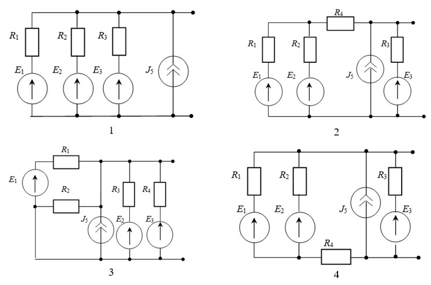
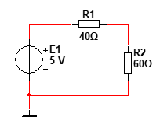

# Лабораторная работа №1. Элементы электрических цепей
[#Цель работы](#цель-работы)\
[#Необходимое ПО](#необходимое-по)\
[#Порядок выполнения и защиты лабораторной работы](#порядок-выполнения-и-защиты-лабораторной-работы)\
[#Теоретическая часть](#теоретическая-часть)\
[#Практическая часть](#практическая-часть)\
[#Ключевые слова](#ключевые-слова)\
[#Пример решения типовых задач для допуска](#пример-решения-типовых-задач-для-допуска)

## Цель работы
Исследование активного и пассивного двухполюсника и их эквивалентные преобразования. Изучение режимов работы источника напряжения. Изучение RLC - элементов в электрических цепях при воздействии источников постоянного тока.

## Необходимое ПО
Для моделирования схем необходимо воспользоваться средой для моделирования электрических схем 
**[MultiSim NI](https://onedrive.live.com/?authkey=%21AM%2DwBKXV%2D0kQXlE&id=A4E122951888DC80%2125389&cid=A4E122951888DC80)**.  
  
Перед выполнением лабораторной работы рекомендуется ознакомиться с [кратким руководством по использованию Multisim 14.1](./../../Articles/Article_2/README.md).

## Порядок выполнения и защиты лабораторной работы

### Выполнение

Перед началом выполнения лабораторной работы каждому студенту необходимо `ВНИМАТЕЛЬНО` изучить информацию, приведённую в [теоретическом разделе](#теоретическая-часть), после чего приступить к разделу [практической части](#практическая-часть). В лабораторной работе предусмотрены индивидуальные варианты схем, а также их параметры. Для получения номера варианта необходимо обратиться к преподавателю (при определении варианта не стоит руководствоваться номером ПК или номером в электронном журнале).
Выполнение лабораторной работы в MultiSim NI сопровождается оформлением отчёта в тетради в соответствии со следующим планом:  
- [x] **Цель работы**
- [x] **Заготовка [таблицы 1](./doc/template_lab1.docx)**
- [x] **Задание №1**
- [x] 1.1 Схема и её параметры из индивидуального задания
- [x] 1.2 Результаты измерений $U_{хх}$ и $I_{хх}$, расчёт $P_{хх}$, заполнение таблицы 1
- [x] 1.3 Результаты измерений $U_{кз}$ и $I_{кз}$, расчёт $P_{кз}$, заполнение таблицы 1
- [x] 1.4 Расчёт внутреннего сопротивления $R_0$
- [x] 1.5 Результаты измерений $U$ и $I$, расчёт $P$
- [x] 1.6 Результаты измерений $U$ и $I$, расчёт $P$, схема эквивалентной модели
- [x] 1.7 Результаты измерений $U$ и $I$, расчёт $P$, схема эквивалентной модели
- [x] **Задание №2**
- [x] 2.1 Значение $R_н$, результаты измерений $U_{сог}$ и $I_{сог}$, расчёт $P_{сог}$, значение  заполнение таблицы 1
- [x] 2.2 Расчёт $I_1$ и $I_2$, соответствующие значение $R_н$, результаты измерений $U_1$ и $U_2$, расчёт $P_1$ и $P_2$, заполнение таблицы 1
- [x] 2.3 Расчёт $U_{ном}$, значение $R_н$, результаты измерения $I_{ном}$, расчёт $P_{ном}$, заполнение таблицы 1
- [x] 2.4 Построение графиков
- [x] **Задания №3**
- [x] 3.1 Схема из индивидуального задания и её параметры
- [x] 3.2 Результаты измерений $U_R$, $U_C$, $U_L$, $I_R$, $I_C$, $I_L$
- [x] **Вывод**

### Защита
В процессе защиты лабораторной работы студенту необходимо ответить на вопросы преподавателя, направленные на проверку и улучшение качества освоения полученных знаний, умений и опыта деятельноcти по следующим разделам:
1. [БДЗ-1](./../../Bdz/bdz_1/README.md)
2. [Решение типовых задач](#пример-решения-типовых-задач-для-допуска) 
3. [Теоретический материал лабораторной работы](#теоретическая-часть) 
4. Теоретический материал лекций
5. Выполнение практической части лабораторной работы (по отчёту)
6. Владение инструментами среды моделирования (Multisim)

## Теоретическая часть
### Источники электрической энергии в электрических цепях

Элементы электрических цепей изображаются в соответствии `ГОСТ 2.721-74` (рис. 1), а общепринятые изображения идеального источника тока и идеального источника ЭДС согласно (рис. 2).

<p align="center" > </p>

<p align="center" >Рисунок 1 – Условные графические обозначения в соответствии с ГОСТ2.721–74</p>  

<p align="center" > </p>

<p align="center" >Рисунок 2 – Условные графические обозначения общепринятые</p>  


### Активные и пассивные двухполюсники

`Двухполюсник` – это часть электрической цепи, имеющий два свободных вывода. С помощью этих выводов один двухполюсник может быть соединен с любым другим двухполюсником.

`Активный` двухполюсник содержит источники энергии, резисторы, индуктивности и конденсаторы, а `пассивный` – только резисторы, индуктивности и конденсаторы.

### Теорема Тевенина - Гельмгольца

Теорема `Тевенина - Гельмгольца` об эквивалентном источнике напряжения.  Активный двухполюсник (сложную электрическую схему) можно заменить эквивалентным источником напряжения и последовательно включенным сопротивлением.  Напряжение холостого хода равно ЭДС на этих выводах, а внутреннее сопротивление равно эквивалентному сопротивлению двухполюсника. 

### Теорема Нортона

Теорема `Нортона` об эквивалентном источнике тока. Активный двухполюсник можно заменить эквивалентным источником тока с параллельно включенным сопротивлением. Источник тока равен току короткого замыкания на этих выводах, а внутреннее сопротивление равно эквивалентному сопротивлению двухполюсника относительно этих выводов.

### Эквивалентные преобразования источников

Если известна ЭДС и внутреннее сопротивление реального источника напряжения, тогда его можно заменить реальным источником тока, который равен: 
```math
J=\frac{E}{r_0}
```
Внутреннее сопротивление сохраняет свое значение и включают его параллельно источнику тока. Реальный источник тока с параллельно включенным сопротивлением также можно заменить источником напряжения с последовательно включенным таким же сопротивлением. При этом ЭДС источника напряжения равна:
```math
E=J \cdot r_0
```
#### Примечание

Идеальный источник напряжения, имеющий внутреннее сопротивление равное нулю, нельзя преобразовать в идеальный источник тока, внутреннее сопротивление которого равно бесконечности.  

Идеальный источник тока также нельзя преобразовать в идеальный источник напряжения.

### Режимы работы источников в цепях постоянного тока

Электрическая схема для исследования источника тока, изображенная на рисунке 3, состоит из реального источника напряжения и резистора с сопротивлением $R_н$. Величину электрического тока можно регулировать от нуля в режиме холостого хода, когда ключ разомкнут, до тока короткого замыкания (ключ замкнут, а ползун резистора находится в крайнем верхнем положении).

Реальный источник напряжения имеет ЭДС и внутреннее сопротивление $R_0$.

<p align="center" > </p>

<p align="center" >Рисунок 3 – Схема для исследования реального источника (a) и графики (б) вольт-амперная характеристика и зависимость мощности от тока</p>  

График напряжения идеального источника напряжения в режиме холостого хода является прямой горизонтальной линией, а график идеального источника тока в данном режиме равен току короткого замыкания и направлен вертикально.

Характерные точки работы реального источника:

* режим холостого хода:
```math
U_{xx}=E, I=0
```
* номинальный режим:
```math
U_{ном}=(0,8–0,9) \cdot E
```
* согласованный режим: 
```math
U_{сог}=\frac{E}{2}, I_{сог}=\frac{I_{кз}}{2}, P_{max}, \eta=50%
```
* режим короткого замыкания:
```math
U=0, I_{кз}=\frac{E}{R_0}
```
Линейное уравнение вольт – амперной характеристики (ВАХ):
```math
E=U+I \cdot R_0
```
Условие номинального режима работы источника напряжения – это когда коэффициент полезного действия источника `(КПД)` находится в пределах 80 – 90%.  КПД источника напряжения определяют как отношение мощности, переданной потребителю, к мощности, вырабатываемой источником:

```math
\eta=\frac{P_{потр}}{P_{ист}} \cdot 100\%=\frac{U \cdot I}{E \cdot I} \cdot 100\%
```

$P_{потр}=U \cdot I$ - мощность, отдаваемая источником потребителю

$P_{ист}=E \cdot I$ - мощность, вырабатываемая источником

Основной признак наличия согласованного режима в электрической цепи заключается в том, что источник отдает потребителю максимальную мощность, а в это время сопротивление нагрузки равно внутреннему сопротивлению источника $R_{нагр}=R_0$.

Мощность, отдаваемая источником потребителю при согласованном режиме, определяется по формуле:

```math
P=U \cdot I=E \cdot I-I^2 \cdot R_0
```

Взяв производную и приравняв к нулю, можно получить экстремальное значение, при котором возникает максимальная мощность согласованного режима:

```math
\frac{dP}{dI}=E-2 \cdot I \cdot R_0=0
```

Электрический ток согласованного режима равен:

```math
I_{сог}=\frac{E}{2 \cdot r_0}=\frac{I_{кз}}{2}
```

Максимальная мощность при согласованном режиме рассчитывается по формуле:

```math
P_{max}=\frac{E^2}{2 \cdot R_0}-\frac{E^2 \cdot R_0}{4 \cdot R^2_0}=\frac{E^2}{4 \cdot R_0}
```

У идеального источника напряжения внутреннее сопротивление $R_0$ равно нулю, а график ВАХ становится горизонтальной линией. Идеальный источник тока равен току короткого замыкания $J=I_{кз}$, а график ВАХ становится вертикальной линией, исходящей из точки короткого замыкания.

## Практическая часть

### 0. Подготовка таблицы
Для занесения результатов в процессе выполнения лабораторной работы необходимо подготовить в рабочей тетради [таблицу 1](./doc/template_lab1.docx). 

*Таблица 1 - Шаблон таблицы для оформления отчёта*


### 1. Исследование электрической схемы активного двухполюсника

1.1.  Собрать электрическую схему активного двухполюсника на рабочем поле `Multisim`. Вариант схемы приведен на рисунке 4, а параметры схемы – в `таблице 2`;

1.2.  Измерить напряжение холостого хода ($U_{хх}$) и ток ($I_{хх}$) на выходе активного двухполюсника. Рассчитать мощность холостого хода ($P_{хх}$). Результаты занести в таблицу 1;

1.3.  Измерить ток короткого замыкания ($I_{кз}$) и напряжение ($U_{кз}$) (замкнуть выход активного двухполюсника проводником). Рассчитать мощность короткого замыкания ($P_{кз}$). Результаты занести в таблицу 1;

1.4.  Рассчитать внутреннее сопротивление активного двухполюсника по формуле. Результаты занести в таблицу 1;
```math
R_0=\frac{U_{xx}}{I_{кз}}
```

1.5.  Подключить резистор $R$ (по варианту из `таблицы 2`) к выходу активного двухполюсника и измерить ток ($I$) и напряжение ($U$) на нём.  Рассчитать мощность ($P$). Результаты занести в таблицу 1;

1.6.  Активный двухполюсник заменить эквивалентной ЭДС, с последовательно включенным эквивалентным сопротивлением (`теорема Тевенина – Гельмгольца`), а затем последовательно подключить сопротивление $R$ (по варианту из `таблицы 2`) и измерить ток ($I$) и напряжение ($U$) на нём. Схему зарисовать в тетради.  Рассчитать мощность ($P$). Результаты занести в таблицу 1;

1.7.  Активный двухполюсник заменить эквивалентным источником тока с параллельно включенным эквивалентным сопротивлением (`теорема Нортона`), а затем подключить сопротивление $R$ (по варианту из `таблицы 2`) и измерить ток ($I$) и напряжение ($U$) на нём.  Рассчитать мощность ($P$). Результаты занести в таблицу 1;


### 2. Исследование режимов работы активного двухполюсника

2.1.  К выходу активного двухполюсника из задания 1.1 подключить резистор "нагрузки" $R_н$, равный по номиналу внутреннему сопротивлению ($R_0$). Измерить ток ($I_{сог}$) и напряжение ($U_{сог}$) в согласованном режиме на резисторе $R_н$. Рассчитать мощность согласованного режима $P_{сог}$. Результаты занести в таблицу 1;

2.2.  Вычислить дополнительные (вспомогательные точки для построения ВАХ) значения токов $I_1$ и $I_2$. Изменяя сопротивление нагрузки ($R_н$) добиться значений вычисленных токов через R. Измерить вспомогательные значения напряжения $U_1$ и $U_2$. Рассчитать мощность $P_1$ и $P_2$. Результаты занести в таблицу 1;
```math
   I_1=0,5 \cdot I_{сог}
```
```math
   I_2=1,5 \cdot I_{сог}
```
2.3.  Подобрать показание вольтметра равным $U_{ном}=0,9 \cdot U_{хх}$, изменяя сопротивление нагрузки $R_н$. Результаты занести в таблицу 1;

2.4.  Используя результаты таблицы 1, построить в тетради графики (графики зависимостей от тока рекомендуется расположить друг под другом):
- ВАХ активного двухполюсника с указанием точек, характерных изученным режимам работы (1.2, 1.3, 2.1, 2.3);
- зависимости мощности ($P$) от тока ($I$) активного двухполюсника (1.2, 1.3, 2.1-2.3);
- зависимости мощности ($P$) от нагрузочного резистора $R_н$ (1.2, 1.3, 2.1-2.3).
> при построении зависимости мощности от тока и нагрузочного сопротивления необходимо учитывать, что в режиме холостого хода значение $R_н\rightarrow\infty$, а в режиме короткого замыкания $R_н=0$.

### 3. Исследование влияния пассивных компонентов на ток и напряжение в последовательной RLC цепи на постоянном токе (при воздействии источника постоянного тока/ЭДС)

3.1.  Зарисовать в тетради и собрать в среде моделирования электрическую схему, приведенную на рисунке 5.  
Параметры схемы:  
$E=E_1$ (значение $E_1$ приведено в таблице 2)  
$R=R_1$ (значение $R_1$ приведено в таблице 2)  
$L=$ 10 мГн  
$C=$ 10 мкФ

3.2.  Измерить токи ($I_R, I_C, I_L$) и напряжения ($U_R, U_C, U_L$). Результаты занести в таблицу 1;

### Индивидуальные варианты
*Таблица 2. Параметры схемы*

|     №     Вар    |     Вариант     схемы    |     $E_1$,     В |     $E_2$,     В |     $E_3$,      В |     $J_5$,        A |     $R_1$,     Ом |     $R_2$,     Ом |     $R_3$,     Ом |     $R_4$,     Ом |     $R$,     Ом  |
|------------------|--------------------------|------------------|------------------|-------------------|---------------------|-------------------|-------------------|-------------------|-------------------|------------------|
|     1            |     1                    |     10           |     20           |     10            |     1               |     10            |     10            |     10            |     5             |     10           |
|     2            |     2                    |     15           |     30           |     15            |     2               |     10            |     10            |     10            |     8             |     20           |
|     3            |     3                    |     20           |     20           |     10            |     0,5             |     20            |     20            |     10            |     5             |     20           |
|     4            |     4                    |     10           |     20           |     20            |     2               |     12            |     24            |     6             |     6             |     12           |
|     5            |     1                    |     20           |     30           |     20            |     2,5             |     20            |     20            |     20            |     10            |     10           |
|     6            |     2                    |     20           |     40           |     20            |     4               |     20            |     20            |     12            |     12            |     12           |
|     7            |     3                    |     10           |     30           |     10            |     1               |     10            |     10            |     10            |     2             |     10           |
|     8            |     4                    |     10           |     20           |     10            |     0,5             |     20            |     20            |     5             |     10            |     20           |
|     9            |     1                    |     20           |     20           |     15            |     2               |     10            |     5             |     10            |     5             |     10           |
|     10           |     2                    |     20           |     10           |     20            |     1               |     10            |     10            |     10            |     8             |     15           |
|     11           |     3                    |     20           |     10           |     20            |     1               |     10            |     10            |     10            |     10            |     15           |
|     12           |     4                    |     30           |     15           |     30            |     2               |     10            |     10            |     10            |     5             |     20           |
|     13           |     1                    |     30           |     30           |     20            |     1               |     20            |     20            |     10            |     5             |     20           |
|     14           |     2                    |     20           |     10           |     10            |     2               |     12            |     24            |     6             |     6             |     12           |
|     15           |     3                    |     30           |     20           |     30            |     2,6             |     20            |     20            |     20            |     10            |     10           |
|     16           |     4                    |     40           |     20           |     40            |     4               |     20            |     20            |     10            |     10            |     10           |
|     17           |     1                    |     30           |     10           |     30            |     1               |     10            |     10            |     10            |     2             |     10           |
|     18           |     2                    |     20           |     10           |     20            |     0,5             |     20            |     20            |     5             |     10            |     20           |
|     19           |     3                    |     30           |     15           |     30            |     2               |     10            |     10            |     10            |     5             |     20           |
|     20           |     4                    |     30           |     30           |     20            |     1               |     20            |     20            |     10            |     5             |     20           |
|     21           |     1                    |     10           |     20           |     20            |     2               |     12            |     24            |     6             |     6             |     12           |
|     22           |     2                    |     20           |     10           |     20            |     1               |     10            |     10            |     10            |     8             |     15           |
|     23           |     3                    |     20           |     10           |     20            |     0,5             |     20            |     20            |     5             |     10            |     20           |
|     24           |     4                    |     30           |     30           |     20            |     1               |     20            |     20            |     10            |     5             |     20           |
|     25           |     1                    |     15           |     15           |     15            |     2,5             |     15            |     20            |     40            |     5             |     15           |
|     26           |     2                    |     25           |     15           |     30            |     1               |     20            |     30            |     20            |     10            |     15           |
|     27           |     3                    |     35           |     20           |     40            |     1               |     25            |     15            |     30            |     10            |     20           |
|     28           |     4                    |     40           |     25           |     25            |     1,5             |     30            |     25            |     15            |     5             |     20           |
|     29           |     1                    |     15           |     25           |     15            |     0,5             |     25            |     20            |     20            |     10            |     10           |
|     30           |     2                    |     20           |     15           |     25            |     2               |     15            |     25            |     10            |     5             |     10           |

<p align="center" > </p>

<p align="center" >Рисунок 4 – Схемы, соответствующие индивидуальным вариантам</p>  

<p align="center" > </p>

<p align="center" >Рисунок 5 – Схема с пассивными элементами (R,L,C) в цепи постоянного тока</p>  

## Ключевые слова

1.   Идеальный источник
2.   Реальный источник
3.   Двухполюсник
4.   Активный двухполюсник
5.   Пассивный двухполюсник
6.   Вольт-амперная характеристика (ВАХ)
7.   Теорема Тевенина-Гельмгольца
8.   Теорема Нортона
9.   Эквивалентное преобразование источников
10.   Режим холостого хода
11.   Номинальный режим
12.   Согласованный режим
13.   Режим короткого замыкания
14.   Конденсатор в цепи постоянного тока
15.   Катушка индуктивности в цепи постоянного тока

## Пример решения типовых задач для допуска

### Задача
1.1 Рассчитать значения токов $I_1$ и $I_2$, протекающих через резисторы $R_1$ и $R_2$ соответственно.\
1.2 Рассчитать значения напряжений $U_1$ и $U_2$ на резисторах $R_1$ и $R_2$ соответственно.

<p align="center" > </p>

#### Решение

1.1 Резисторы $R_1$ и $R_2$ подключены к источнику ЭДС последовательно, поэтому через данные резисторы будет протекать одинаковый ток, определяемый с помощью закона Ома:

```math
 I_1=I_2=I=\frac{E}{(R_1+R_2)}=\frac{5\;В}{(40\;Ом + 60\;Ом)} = 0,05\;А = 50\;мА (1.1)
```
1.2 Для расчёта значений напряжений $U_1$ и $U_2$ необходимо рассчитать ток, используя выражение из пункта 1.1, после чего выполнить расчёт напряжений на $R_1$ и $R_2$:
 ```math
 U_1=I \cdot R_1=0,05\;А \cdot 40 Ом=2\;В
```
```math
 U_2=I \cdot R_2=0,05\;А \cdot 60 Ом=3\;В
```
