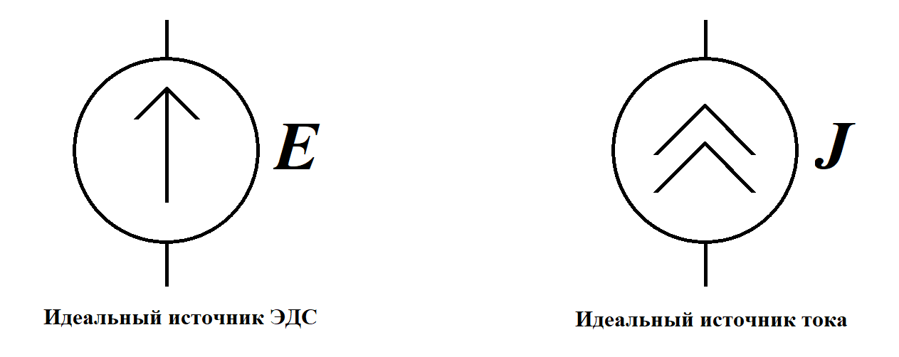

# Лабораторная работа №1. Элементы электрических цепей

## Цель работы

исследование активного и пассивного двухполюсника и их эквивалентные преобразования. Изучение режимов работы источника напряжения. Изучение RLC - элементов в электрических цепях при воздействии источников постоянного тока.

## Необходимое ПО

Multisim NI

## Порядок выполнения лабораторной работы

Перед началом выполнения лабораторной работы каждому студенту необходимо `ВНИМАТЕЛЬНО` изучить информацию, приведённую в разделе [теория](#Теория), после чего приступить к разделу [Задания](#Задания). В лабораторной работе предусмотрены индивидуальные варианты схем, а также их параметры. Для получения номера варианта необходимо обратиться к преподавателю.

После выполнения моделирования и выполнения расчётов, необходимо предоставить отчёт о выполнении лабораторной работы преподавателю, а также ответить на дополнительные вопросы. Отчёт должен быть выполнен в тетради и содержать следующие пункты:

1.	Цель работы;
2.	Схему и её параметры из индивидуального задания;
3.	Эквивалентные схемы, графики, расчёты, таблицы;
4.	Вывод.

## Теория
### Источники электрической энергии в электрических цепях

Элементы электрических цепей в отчете необходимо изображать в соответствии `ГОСТ 2.750-68` и `ГОСТ 2.751-73` (рис. 1), а в программном приложении Multisim эти элементы изображены с использованием стандарта `ISO` (рис. 2).


*Рисунок 1. Условные графические обозначения в соответствии с ГОСТ2.750 – 68, ГОСТ 2.751 – 73*



*Рисунок 2. Условные графические обозначения по ISO (Multisim)*

### Активные и пассивные двухполюсники

`Двухполюсник` – это часть электрической цепи, имеющий два свободных вывода. С помощью этих выводов один двухполюсник может быть соединен с любым другим двухполюсником.

`Активный` двухполюсник содержит источники энергии, резисторы, индуктивности и конденсаторы, а `пассивный` – только резисторы, индуктивности и конденсаторы.

### Теорема Тевенина - Гельмгольца

Теорема `Тевенина - Гельмгольца` об эквивалентном источнике напряжения.  Активный двухполюсник (сложную электрическую схему) можно заменить эквивалентным источником напряжения и последовательно включенным сопротивлением.  Напряжение холостого хода равно ЭДС на этих выводах, а внутреннее сопротивление равно эквивалентному сопротивлению двухполюсника. 

### Теорема Нортона

Теорема `Нортона` об эквивалентном источнике тока. Активный двухполюсник можно заменить эквивалентным источником тока с параллельно включенным сопротивлением. Источник тока равен току короткого замыкания на этих выводах, а внутреннее сопротивление равно эквивалентному сопротивлению двухполюсника относительно этих выводов.

### Эквивалентные преобразования источников

Если известна ЭДС и внутреннее сопротивление реального источника напряжения, тогда его можно заменить реальным источником тока, который равен: 

$$J=\frac{E}{r_0}$$

Внутреннее сопротивление сохраняет свое значение и включают его параллельно источнику тока. Реальный источник тока с параллельно включенным сопротивлением также можно заменить источником напряжения с последовательно включенным таким же сопротивлением. При этом ЭДС источника напряжения равна:

$$E=J*r_0$$

#### Примечание

Идеальный источник напряжения, имеющий внутреннее сопротивление равное нулю, нельзя преобразовать в идеальный источник тока, внутреннее сопротивление которого равно бесконечности.  

Идеальный источник тока также нельзя преобразовать в идеальный источник напряжения.

### Режимы работы источников в цепях постоянного тока

Электрическая схема для исследования источника тока, изображенная на рисунке 3, состоит из реального источника напряжения и резистора с сопротивлением $R_н$. Величину электрического тока можно регулировать от нуля в режиме холостого хода, когда ключ разомкнут, до тока короткого замыкания (ключ замкнут, а ползун резистора находится в крайнем верхнем положении).

Реальный источник напряжения имеет ЭДС и внутреннее сопротивление $R_0$.


*Рисунок 3. Схема для исследования реального источника (a) и графики (б) вольт-амперная характеристика и зависимость мощности от тока*

График напряжения идеального источника напряжения в режиме холостого хода является прямой горизонтальной линией, а график идеального источника тока в данном режиме равен току короткого замыкания и направлен вертикально.

Характерные точки работы реального источника:

* режим холостого хода:         $U_{xx}=E, I=0$;	
* номинальный режим: 		    $U_{ном}=(0,8–0,9)*E$; 
* согласованный режим: 		    $U_{сог}=\frac{E}{2}, I_{сог}=\frac{I_{кз}}{2}, P_{max}, \eta=50%$;
* режим короткого замыкания:	$U=0, I{кз}=\frac{E}{R_0}$.

Линейное уравнение вольт – амперной характеристики (ВАХ):

$$E=U+I*R_0$$

Условие номинального режима работы источника напряжения – это когда коэффициент полезного действия источника `(КПД)` находится в пределах 80 – 90%.  КПД источника напряжения определяют как отношение мощности, переданной потребителю, к мощности, вырабатываемой источником:

```math
\eta=\frac{P_{потр}}{P_{ист}}*100\%=\frac{U*I}{E*I}*100\%
```

* $P_{потр}=U*I$ - мощность, отдаваемая источником потребителю; 
* $P_{ист}=E*I$ - мощность, вырабатываемая источником.

Основной признак наличия согласованного режима в электрической цепи заключается в том, что источник отдает потребителю максимальную мощность, а в это время сопротивление нагрузки равно внутреннему сопротивлению источника $R_{нагр}=R_0$.

Мощность, отдаваемая источником потребителю при согласованном режиме, определяется по формуле:

```math
$$P=U*I=E*I-I^2*R_0$$
```

Взяв производную и приравняв к нулю, можно получить экстремальное значение, при котором возникает максимальная мощность согласованного режима:

```math
\frac{dP}{dI}=E-2*I*R_0=0
```

Электрический ток согласованного режима равен:

```math
I_{сог}=\frac{E}{2*r_0}=\frac{I_{кз}}{2}
```

Максимальная мощность при согласованном режиме рассчитывается по формуле:

```math
P_{max}=\frac{E^2}{2*R_0}-\frac{E^2*R_0}{4*R^2_0}=\frac{E^2}/{4*R_0}
```math

У идеального источника напряжения внутреннее сопротивление $R_0$ равно нулю, а график ВАХ становится горизонтальной линией. Идеальный источник тока равен току короткого замыкания $J=I_{кз}$, а график ВАХ становится вертикальной линией, исходящей из точки короткого замыкания.

## Задания

### Исследование электрической схемы активного двухполюсника

### Исследование режимов работы активного двухполюсника

### Исследование поведения резистора, конденсатора и катушки индуктивности в цепи постоянного тока