# Лабораторная работа №2
[#Цель работы](#цель-работы)  
[#Необходимое ПО](#необходимое-по)  
[#Порядок выполнения и защиты лабораторной работы](#порядок-выполнения-и-защиты-лабораторной-работы)  
[#Теоретическая часть](#теоретическая-часть)  
[#Практическая часть](#практическая-часть)  
[#Ключевые слова](#ключевые-слова)  

## Цель работы

Изучение RLC - элементов в электрических цепях переменного тока. Изучение режимов работы источника питания, осциллографа, функционального генератора, амперметра, вольтметра, ваттметра, плоттера Боде.

## Необходимое ПО
Для моделирования схем необходимо воспользоваться средой для моделирования электрических схем 
**[MultiSim NI](https://onedrive.live.com/?authkey=%21AM%2DwBKXV%2D0kQXlE&id=A4E122951888DC80%2125389&cid=A4E122951888DC80)**.  
  
Перед выполнением лабораторной работы рекомендуется ознакомиться с [кратким руководством по использованию Multisim 14.1](./../../Articles/Article_2/README.md).

## Порядок выполнения и защиты лабораторной работы

### Выполнение

Перед началом выполнения лабораторной работы каждому студенту необходимо `ВНИМАТЕЛЬНО` изучить информацию, приведённую в [теоретическом разделе](#теоретическая-часть), после чего приступить к разделу [практической части](#практическая-часть). В лабораторной работе предусмотрены индивидуальные варианты схем, а также их параметры. Для получения номера варианта необходимо обратиться к преподавателю (при определении варианта не стоит руководствоваться номером ПК или номером в электронном журнале).
Выполнение лабораторной работы в MultiSim NI сопровождается оформлением отчёта в тетради в соответствии со следующим планом:  
- [x] **Цель работы**
- [x] **Задание №1**
- [x] 1.1 Зафиксировать в тетради параметры для схемы ФНЧ из индивидуального задания и выполнить расчёт ёмкости $C_1$
- [x] 1.2 Зарисовать в тетради схему ФНЧ
- [x] 1.3 Зарисовать в тетради ЛАЧХ и ЛФЧХ для ФНЧ
- [x] 1.4 Построить модель схемы ФНЧ в MultiSim (в отчёте зарисовать схему ФНЧ и подключение плоттера Боде к схеме)
- [x] 1.5 Зафиксировать в тетради частоту, соответствующую уровню -3 дБ на ЛАЧХ, отображаемой плоттером Боде
- [x] **Задание №1**
- [x] 2.1 Зафиксировать в тетради параметры для схемы ФВЧ из индивидуального задания и выполнить расчёт ёмкости $C_2$
- [x] 2.2 Зарисовать в тетради схему ФВЧ
- [x] 2.3 Зарисовать в тетради ЛАЧХ и ЛФЧХ для ФВЧ
- [x] 2.4 Построить модель схемы ФВЧ в MultiSim  (в отчёте зарисовать схему ФВЧ и подключение плоттера Боде к схеме)
- [x] 2.5 Зафиксировать в тетради частоту, соответствующую уровню -3 дБ на ЛАЧХ, отображаемой плоттером Боде
- [x] **Вывод**

### Защита
В процессе защиты лабораторной работы студенту необходимо ответить на вопросы преподавателя, направленные на проверку и улучшение качества освоения полученных знаний, умений и опыта деятельноcти по следующим разделам:

1. [Теоретический материал лабораторной работы](#теоретическая-часть) 
2. Теоретический материал лекций
3. Выполнение практической части лабораторной работы (по отчёту)
6. Владение инструментами среды моделирования (Multisim)

## Теоретическая часть

### R, L, C в цепях синусоидального тока 

#### Мгновенное значение гармонического тока и напряжени

Периодический переменный ток, изменяющийся по синусоидальному закону со сдвигом фазы или без сдвига (рис. 1), – называется гармоническим током.

<p align="center" > 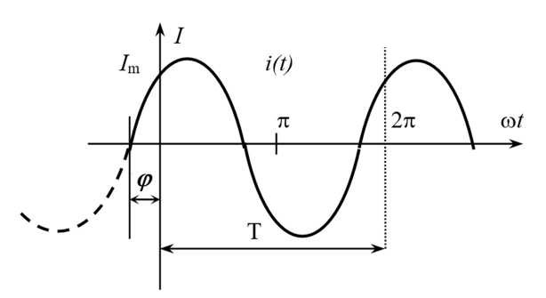</p>

<p align="center" >Рисунок 1 – График синусоидального тока</p> 

Мгновенные значения гармонического тока и напряжения имеют следующий вид:

```math
i(t)=I_m  sin(\omega  t+\phi)=I_m  cos(\omega t+\phi+90\degree)
```

```math
u(t)=U_m sin(\omega t+\phi)=U_m cos(\omega t+\phi+90\degree)
```

*   $i$ - мгновенное значение тока, А;
*   $I_m$ - амплитуда электрического тока, А;
*   $U_m$ - амплитуда напряжения, В;
*   $\omega$ - угловая частота, $с^{-1}, \left ( \omega=2 \pi f  \right )$;
*   $f$ - частота, Гц;
*   $\phi$ - сдвиг фазы в момент времени $t=0$, рад.

#### Активное сопротивление

`Активным` или `ваттным` сопротивлением называется всякое сопротивление, поглощающее электрическую энергию или вернее превращающее ее в другой вид энергии, например в тепловую, световую или химическую.

#### Реактивное сопротивление

`Реактивное сопротивление` – электрическое сопротивление переменному току, обусловленное передачей энергии магнитным полем в индуктивностях или электрическим полем в конденсаторах. 

Элементы, обладающие реактивным сопротивлением, называют реактивными. 

#### Реактивное сопротивление конденсатора

`Реактивное сопротивление конденсатора` — это сопротивление конденсатора, вызванное изменением тока или напряжения из-за его ёмкости.

Реактивное сопротивление конденсатора рассчитывается по следующей формуле:

```math
X_c=-\frac{1}{\omega C}=-\frac{1}{2 \pi f C}
```

*   $X_c$ - реактивное сопротивление конденсатора в Омах;
*   $f$ - частота в Герцах;
*   $C$ - ёмкость в Фарадах;
*   $\omega$- угловая частота в $с^{-1}$.

Исходя из приведённой выше формулы видно, что при повышении частоты переменного тока реактивное сопротивление конденсатора уменьшается.

При этом не стоит забывать про то, что реальный конденсатор обладает не только реактивным, но и активным сопротивлением, вследствие чего образуются токи утечки.

#### Реактивное сопротивление катушки индуктивности

`Реактивное сопротивление катушки индуктивности` — это сопротивление катушки, вызванное изменением тока или напряжения из-за её индуктивности. 

Реактивное сопротивление катушки индуктивности рассчитывается по следующей формуле:

```math
X_L=\omega L=2 \pi f L
```

*   $X_L$ - реактивное сопротивление катушки индуктивности в Омах;
*   $f$ - частота в Герцах;
*   $L$ – индуктивность в Генри;
*   $\omega$- угловая частота в $с^{-1}$.

Исходя из приведённой выше формулы видно, что при повышении частоты переменного тока реактивное сопротивление катушки индуктивности увеличивается. 

При этом не стоит забывать, что реальная катушка индуктивности обладает не только реактивным, но и активным сопротивлением, что обусловленным сопротивлением материала из которого она изготовлена.

#### Треугольник сопротивлений 

`Импеданс` – комплексное, полное сопротивление переменному току электрической цепи с активным и реактивным сопротивлением. Рассмотрим цепь, активное сопротивление элементов которой $r$, индуктивность $L$ и емкость $С$. 

<p align="center" > 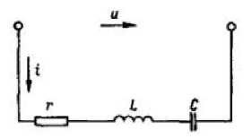</p>

<p align="center" >Рисунок 2 – Цепь переменного тока с резистором, катушкой индуктивности и конденсатором</p> 

Полное сопротивление (импеданс) такой цепи:

```math
z = \sqrt{r^2+(x_L-x_C)^2}=\sqrt{r^2+x^2}
```

Графически это выражение можно изобразить в виде, так называемого, треугольника сопротивлений. 

<p align="center" > 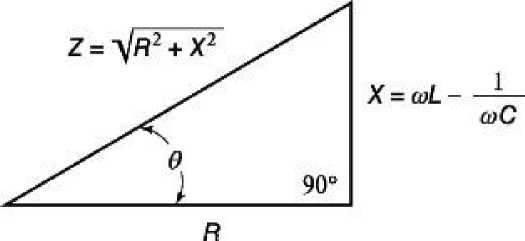</p>

<p align="center" >Рисунок 3 – Треугольник сопротивлений</p>  

Гипотенуза треугольника сопротивлений изображает полное сопротивление цепи (импеданс), а катеты — активное и реактивное сопротивления.

<p align="center" > 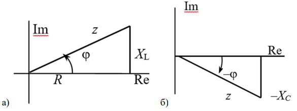</p>

<p align="center" >Рисунок 4 – Треугольники сопротивлений</p> 
<p align="center" >a)активно - индуктивная нагрузка, б) активно - емкостная нагрузка</p> 

#### Резистор про ток и напряжение 

Электрический ток, проходящий через резистор, совпадает по фазе с напряжением.

<p align="center" > 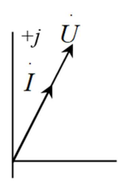</p>

<p align="center" >Рисунок 5 – Вектор тока, проходящего через резистор, совпадающий по направлению с вектором напряжения</p> 

Соотношения между напряжением и током на резисторе имеют вид:

```math
u_R=R i\rightarrow R \dot{I}
```

#### Конденсатор про ток и напряжение

Электрический ток в конденсаторе представляет собой часть или совокупность процессов его заряда и разряда накопления и отдачи энергии электрическим полем между его обкладками.

В цепи переменного тока конденсатор будет заряжаться до определённого максимального значения, пока ток не сменит направление на противоположное. Следовательно, в моменты амплитудного значения напряжения на конденсаторе, ток в нём будет равен нулю. Таким образом, напряжение на конденсаторе и ток всегда будут иметь расхождение во времени в четверть периода. 

В результате ток в цепи будет ограничен падением напряжения на конденсаторе, что создаёт реактивное сопротивление переменному току, обратно-пропорциональное скорости изменения тока (частоте) и ёмкости конденсатора.

Если приложить к конденсатору напряжение $U$, мгновенно начнётся ток от максимального значения, далее уменьшаясь до нуля. В это время напряжение на его выводах будет расти от нуля до максимума. Следовательно, напряжение на обкладках конденсатора по фазе отстаёт от тока на угол $90\degree$. Такой сдвиг фаз называют отрицательным. На рисунке 6 изображен вектор напряжения, отстающий от вектора тока на $90\degree$.

<p align="center" > 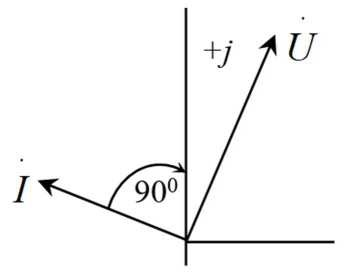</p>

<p align="center" >Рисунок 6 – Отставание вектора напряжения от вектора тока на 90°</p> 

Соотношения между напряжением и током на конденсаторе имеют вид:

```math
i_c=\frac{dQ}{dt}=C \frac{du}{dt}
```

```math
u_c=\frac{1}{C}\int {i_c dt}
```

#### Катушка индуктивности про ток и напряжение 

При протекании переменного тока $I$ в катушке, магнитное поле создаёт в её витках ЭДС, которая препятствует изменению тока. При увеличении тока ЭДС отрицательна и препятствует нарастанию тока, при уменьшении - положительна и препятствует его убыванию, оказывая таким образом сопротивление изменению тока на протяжении всего периода. 

В результате созданного противодействия, на выводах катушки индуктивности в противофазе формируется напряжение $U$, подавляющее ЭДС, равное ей по амплитуде и противоположное по знаку.

При прохождении тока через нуль, амплитуда ЭДС достигает максимального значения, что образует расхождение во времени тока и напряжения в $\frac{1}{4}$ периода. 

Если приложить к выводам катушки индуктивности напряжение $U$, ток не может начаться мгновенно по причине противодействия ЭДС, равного $-U$, поэтому ток в индуктивности всегда будет отставать от напряжения на угол $90\degree$. Сдвиг при отстающем токе называют положительным. На рисунке 7 изображен вектор напряжения, опережающий вектор тока на $90\degree$.

<p align="center" > 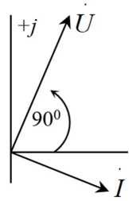</p>

<p align="center" >Рисунок 7 – Опережение вектора напряжения относительно вектора тока на 90°</p> 

Соотношения между напряжением и током на катушке индуктивности имеют вид:

```math
u_L=-\varepsilon =L \frac{di}{dt}
```

```math
i_L=\frac{1}{L} \int{u_L dt}
```

### Фильтры на основе R и C 

#### Основные понятия 

`Коэффициентом передачи (преобразования)` называют функцию, которая определяется как отношение выходного сигнала к входному сигналу. 

В частности, если величины входного и выходного сигналов однородны, тогда коэффициент передачи называют коэффициентом усиления. Так, например, коэффициентом усиления по напряжению $K_U$ называют физическую величину, равную отношению амплитуды переменной компоненты выходного напряжения $U_{вых}$ к амплитуде входного напряжения $U_{вх}$:

```math
K_U=\frac{U_{вых}}{U_{вх}},
```

где $U_{вых}$ – напряжение на выходе цепи, $U_{вх}$ – напряжение на входе цепи. 

<p align="center" > 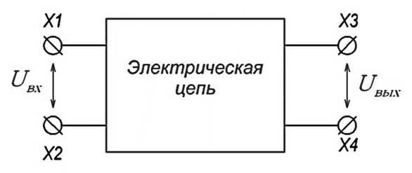</p>

<p align="center" >Рисунок 8 – Упрощенная схема электрической цепи</p> 

В выражении для коэффициента усиления можно использовать не только амплитуды, но и действующие значения напряжения. 

Если коэффициент передачи больше единицы, то электрическая цепь усиливает входной сигнал, если же меньше единицы, то ослабляет. 

Коэффициент усиления выражают как в относительных единицах так и в децибелах. В таком случае выражения для определения коэффициента усиления выглядят следующим образом. 

Коэффициент усиления по напряжению: 

```math
K_U=20 lg(\frac{U_{вых}}{U_{вх}})
```

Коэффициенты усиления по току:

```math
K_I=20 lg(\frac{I_{вых}}{I_{вх}})
```

Коэффициенты усиления по мощности:

```math
K_P=10 lg(\frac{P_{вых}}{P_{вх}})
```

Если в усилителе коэффициент передачи больше единицы для безразмерного коэффициента или больше нуля для коэффициента, представленного в децибелах, то коэффициент называют коэффициентом усиления, иначе коэффициентом ослабления. 

`Амплитудно-частотная характеристика` (АЧХ) цепи показывает зависимость уровня сигнала на выходе устройства от линейного изменения частоты передаваемого сигнала при постоянной амплитуде синусоидального сигнала на входе этого устройства (рис.9 и рис.10 сверху).

`Логарифмическая амплитудно-частотная характеристика` (ЛАЧХ) цепи показывает зависимость уровня сигнала на выходе устройства от изменения частоты передаваемого сигнала в логарифмическом масштабе при постоянной амплитуде синусоидального сигнала на входе этого устройства (рис.10 снизу). В западной литературе используется название диаграмма Бо́де или график Боде, по имени инженера Хенрика Боде. 

`Фазо-частотная характеристика` (ФЧХ) – это зависимость сдвига по фазе между синусоидальными сигналами на входе и выходе устройства от линейного изменения частоты сигнала на входе этого устройства. 

`Логарифмическая фазо-частотная характеристика` (ЛФЧХ) – это зависимость сдвига по фазе между синусоидальными сигналами на входе и выходе устройства от изменения частоты сигнала в логарифмическом масштабе на входе этого устройства (рис. 9).

`Полоса пропускания` – это диапазон частот, в пределах которого АЧХ цепи или устройства достаточно равномерна, чтобы обеспечить передачу сигнала без существенного искажения его формы (рис.9). Определяется по уровню -3 дБ от максимального значения АЧХ. 

`Неравномерность АЧХ в полосе пропускания` - размер флуктуации АЧХ от пика до пика в полосе пропускания. 

`Крутизна частотной характеристики фильтра` – скорость спада АЧХ в полосе подавления (дБ/октаву или дБ/декаду) (рис.9). 

<p align="center" > 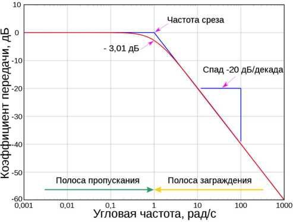</p>

<p align="center" >Рисунок 9 – Логарифмическая амплитудно-частотная характеристика</p> 

<p align="center" > 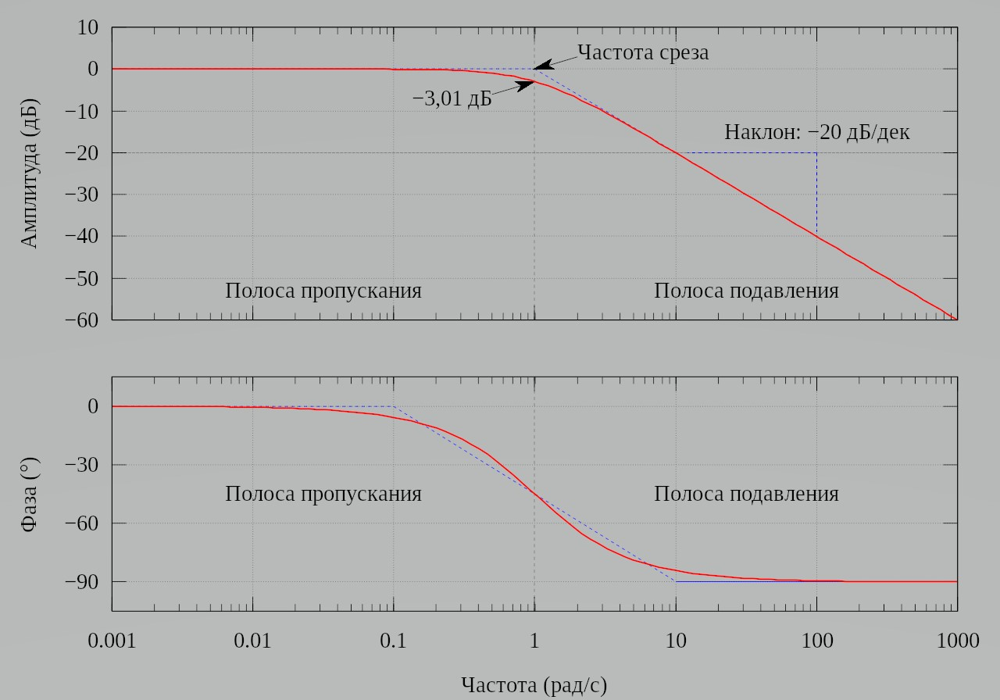</p>

<p align="center" >Рисунок 10 – Пример ЛАЧХ (сверху) и ЛФЧХ (снизу) для ФНЧ 1-го порядка</p> 

**Примечание по ЛАЧХ**

>  По оси **абсцисс** на **ЛАЧХ** отображается частота в логарифмическом масштабе:
> *   декада (дек): 1 декада равна изменению частоты в 10 раз;  
> *   октава (окт): 1 октава равна изменению частоты в 2 раза.
>   
>  По оси **ординат** на **ЛАЧХ** отображается амплитуда выходного сигнала в децибелах (десятая часть бела) это отношение мощностей (20 децибел равно изменению мощности в 10 раз)

**Примечание по ЛФЧХ**

>  По оси **абсцисс** на **ЛФЧХ** откладывается частота в логарифмическом масштабе (в декадах или октавах);  
>  По оси **ординат** на **ЛФЧХ** откладывается выходная фаза в угловых градусах или радианах.

Частота среза фильтра $f_{ср}$ – частота, на которой сигнал ослабляется на -3 дБ по 
логарифмической шкале. По линейной шкале для напряжения $K_U$ и тока $K_I$ уровень -3 дБ 
составляет $\frac{1}{\sqrt{2}} (0.707)$, а для мощности $K_P$ составляет $\frac{1}{2} (0.5)$.


`Порядок фильтра` – параметр, характеризующий крутизну среза. Фильтр первого порядка имеет крутизну среза 6 дБ/октаву (20 дБ на декаду), второго порядка - 12 дБ/октаву (40 дБ на декаду), третьего – 18 дБ/октаву (60 дБ на декаду) и т.д. (рис.11)

<p align="center" > 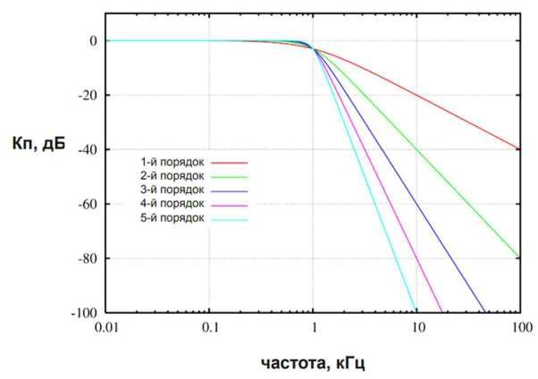</p>

<p align="center" >Рисунок 11 – Зависимость крутизны среза от порядка фильтра</p> 

Задача фильтрации сводится к созданию фильтра с заданными АЧХ и ФЧХ, а точнее с заданными характеристиками, основными из которых являются:

*   полоса пропускания; 
*   неравномерность АЧХ в полосе пропускания;
*   крутизна среза; 
*   отставание по фазе. 

#### Четыре фильтра 
`Фильтр нижних частот (ФНЧ, LPF, Low Pass Filter)` – фильтр, который пропускает низкочастотные сигналы и ослабляет высокочастотные.

<p align="center" > 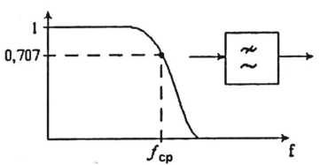</p>

<p align="center" >Рисунок 12 – АЧХ ФНЧ</p> 

`Фильтр верхних частот (ФВЧ, HPF, High Pass Filter)` – фильтр, который пропускает высокочастотные сигналы и ослабляет низкочастотные. 

<p align="center" > 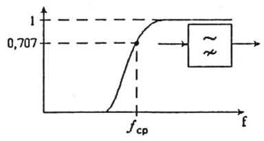</p>

<p align="center" >Рисунок 13 – АЧХ ФВЧ</p> 

`Полосовой фильтр (ПФ, полосно-пропускающий, BPF, Band Pass Filter)` – фильтр, который пропускает сигналы в некоторой полосе частот и подавляет сигналы на низких и на высоких частотах.

<p align="center" > 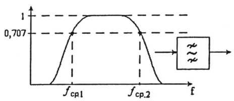</p>

<p align="center" >Рисунок 14 – АЧХ ПФ</p> 

`Режекторный фильтр (РФ, полосно-заграждающий, BSF, Band Stop Filter)` – фильтр, который ослабляет сигналы в некоторой полосе частот и пропускает сигналы на низких и высоких частотах. 

<p align="center" > 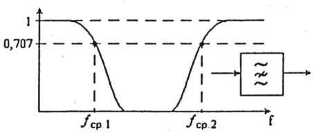</p>

<p align="center" >Рисунок 15 – АЧХ ПФ</p> 

#### От делителя напряжения к фильтрам на R и C 

Принцип работы простейших фильтров подобен принципу работы делителя напряжения. С помощью делителя напряжения можно можем понизить входное напряжения до необходимого нам уровня.

<p align="center" > 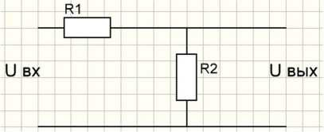</p>

<p align="center" >Рисунок 16 – Делитель напряжения</p> 

```math
U_{вых}=U{вх} \frac{R_2}{R_1+R_2}
```

```math
U_{вых}=U{вх} K_U
```

```math
K_U=\frac{R_2}{R_1+R_2}
```

```math
R_{общ}=R_1+R_2
```

```math
R_2=R_{общ} \frac{U_{вых}}{U{вх}}=R_{общ} K_U
```

<p align="center" > 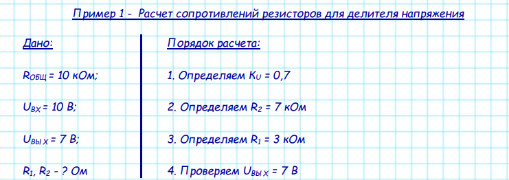</p>

<p align="center" >Рисунок 17 – Расчет сопротивлений резисторов для делителя напряжения</p> 

Расчёт фильтров выполняется по аналогии с расчётом делителя напряжения. 

Так как сопротивление нагрузки, подключаемой к выходу делителя, влияет на выходное напряжение, то должно выполняться условие $R_2 << R_н$ . Это правило также справедливо и при расчетах фильтров.

#### Г-образный RC -фильтр

Чтобы из делителя напряжения на двух резисторах получить фильтр, можно заменить один из резисторов конденсатором. Частота среза такого фильтра вычисляется по формуле:

```math
f_{ср}=\frac{1}{2 \pi R C}
```

При замене сопротивления $R_1$ (Рис. 16) на конденсатор можно получим фильтр верхних частот (Рис.18 а), в основе которого лежит дифференцирующая $RC$ цепь. А при замене конденсатором сопротивления $R_2$ (Рис.16) – фильтр нижних частот (Рис.18 б), в основе которого лежит интегрирующая $RC$ цепь. 

Коэффициент передачи для ФНЧ и ФВЧ на базе RC вычисляется по формулам:

```math
K_{UФНЧ}=\frac{X_C}{\sqrt{R^2+X^2_C}}
```

```math
K_{UФВЧ}=\frac{R}{\sqrt{R^2+X^2_C}}
```

Для ФНЧ и ФВЧ на частоте среза $K_{UФНЧ} = K_{UФВЧ} = 0.707$ так как на данной частоте $R = XC$. Учитывая вышесказанное, на каждом из компонентов $R$ и $С$ рассеиваемая мощность будет распределяться равномерно. Следовательно на частоте среза происходит ослабление мощности сигнала в 2 раза $K_{PФНЧ} = K_{PФВЧ} = 0.5$.

<p align="center" > 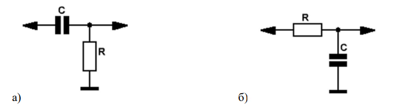</p>

<p align="center" >Рисунок 18 – RC-фильтры</p> 
<p align="center" >а)ФВЧ, б)ФНЧ</p> 
<p align="center" > 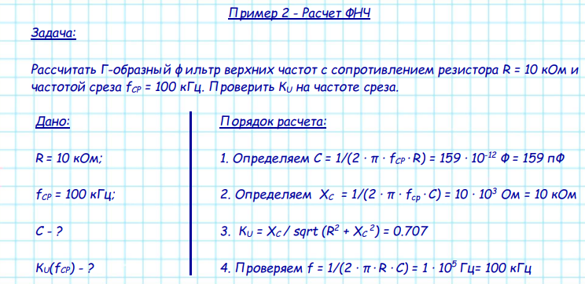</p>

<p align="center" >Рисунок 19 – Расчет ФНЧ</p> 

<p align="center" > 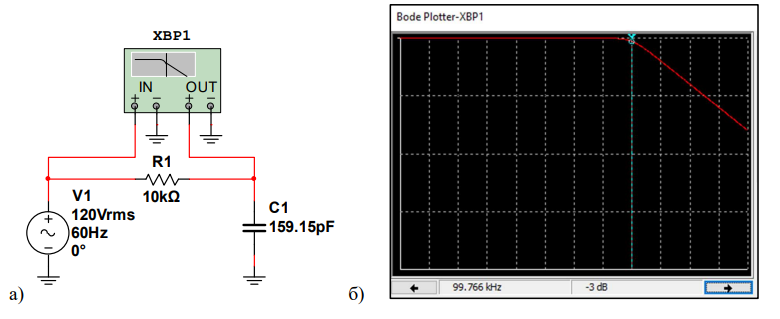</p>

<p align="center" >Рисунок 20 – Моделирование в среде MultiSim</p>
<p align="center" >а)схема ФНЧ, б)ЛАЧХ построенного ФНЧ</p> 

#### Нагрузка 

Как можно заметить, на рисунке 20 отсутствует нагрузка. Но на практике к выходу фильтра подключается нагрузка, как это показано на рис. 21. На схеме нагрузка является отдельным компонентом, но в реальной цепи она может представлять что-то гораздо более сложное, например, аналого-цифровой преобразователь, усилитель или входной каскад осциллографа, который используется для измерения амплитудно-частотной характеристики фильтра. Введение нагрузки в схему при моделировании позволяет получить более точную модель и избежать неприятных последствий при использовании разработанного фильтра на практике. Кроме того, при построении фильтра необходимо отталкиваться от параметров устройства, к которому он будет подключаться. На практике пользуются простым правилом: сопротивление фильтра должно быть в 10-100 раз меньше чем сопротивление нагрузки.

<p align="center" > 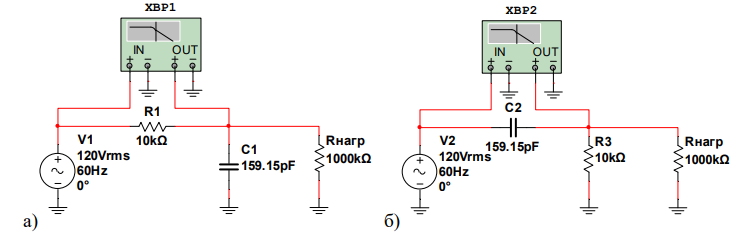</p>

<p align="center" >Рисунок 21 – Подключение нагрузки к фильтрам в среде MultiSim а. ФНЧ, б. ФВЧ</p> 

Г-образные фильтры на базе RC являются фильтрами 1-го порядка, вследствие чего имеют существенный недостаток в виде пологой крутизны спада АЧХ. 

Существуют также Т-образные и П-образные RC фильтры (2-го порядка) для увеличения крутизны спада АЧХ. 

### Построение АЧХ и ФЧХ в Multisim 

Для построенного в Multisim фильтра можно выполнить анализ амплитудно-частотных и фазо-частотных характеристик с помощью инструмента Плоттер Боде (Bode plotter). Пример исследуемого фильтра представлен на рисунке 22. Для формирования синусоидального сигнала потребуется компонент AC POWER (Sources->POWER SOURCES->AC POWER). Частоту и амплитуду сигнала можно выставить любую, на анализ цепи с помощью плоттера Боде это не влияет. Сопротивление нагрузки Rload необходимо выставить приблизительно в 100 раз больше, чем сопротивление фильтра.

<p align="center" > 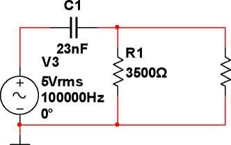</p>

<p align="center" >Рисунок 22 – Пример исследуемого фильтра</p> 

#### Плоттер Боде 

Плоттер Боде предназначен для анализа амплитудно-частотных и фазо-частотных характеристик и представления их в линейном или логарифмическом масштабе. Наиболее полезен данный инструмент для анализа схем фильтров. Выбрать данный инструмент можно как показано на рисунке 23 или из панели инструментов, располагающегося в правой части рабочего пространства. 

<p align="center" > 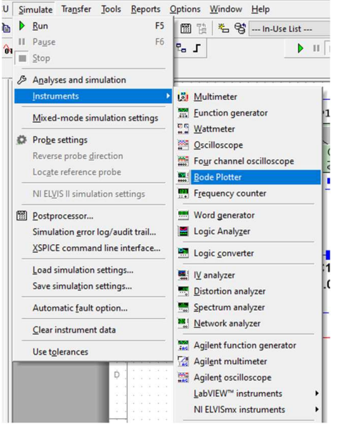</p>

<p align="center" >Рисунок 23 – Расположение плоттера Боде в меню</p> 

Плоттер Боде имеет четыре вывода: два вывода IN и два вывода OUT. Подключение прибора к исследуемой схеме осуществляется при помощи выводов отмеченных значком «+» (вывод IN «+» подключается к входу схемы, вывод OUT «+» – к выходу), выводы «–» подключаются к общей шине. На рисунке 24 представлен пример подключения плоттера Боде к схеме ФВЧ 1-го порядка, рассчитанного в примере выше

<p align="center" > 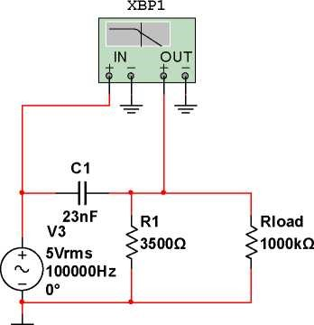</p>

<p align="center" >Рисунок 24 – Схема подключения плоттера Боде к фильтру</p> 

Рассмотрим более подробно лицевую панель прибора, представленную на рисунке 25.

<p align="center" > 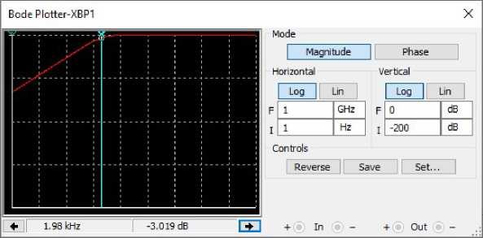</p>

<p align="center" >Рисунок 25 – Лицевая панель плоттера Боде</p> 

В ее левой части расположен графический дисплей, который предназначен для графического отображения формы сигнала. Так же прибор оснащен курсором для проведения измерений в любой точке графика, курсор при необходимости можно перемещать при помощи левой кнопки мыши. Управлять положением курсора можно так же и при помощи стрелок перемещения вертикального курсора, которые расположены в нижней левой части лицевой панели плоттера Боде под графическим дисплеем. Между стрелками находятся два информационных поля, в которых отображаются значения частоты и фазы (или коэффициента передачи), полученные на пересечении вертикального курсора и графика.

В правой части находится панель управления, предназначенная для настройки параметров плоттера Боде. Рассмотрим данную панель более подробно. В верхней части панели находится поле «Режим», в котором размещено две кнопки: «Амплитуда» и «Фаза». При нажатой кнопке «Амплитуда» прибор работает в режиме анализа амплитудно-частотных характеристик. При нажатой кнопке «Фаза» – в режиме анализа фазо-частотных характеристик. В полях «По горизонтали» и «По вертикали» можно задать параметры горизонтальной и вертикальной осей координат при логарифмической или линейной шкале. Логарифмическая шкала используется в том случае, если сравниваемые значения имеют большой разброс, как например, в случае анализа амплитудно-частотой характеристики. Переключение шкалы производится при помощи кнопок «Log» (логарифмическая) и «Лин» (линейная). Масштаб горизонтальной (ось Х) и вертикальной (ось Y) осей определяется начальным («I» - initial) и конечным («F» - final) значениями.

На экране графического дисплея плоттера Боде `по оси Х всегда отображается частота`.

При измерении коэффициента передачи `ось Y отображает отношение выходного напряжения схемы к его входному напряжению`. Для логарифмической шкалы единицы – децибелы. В том случае если измеряется фаза, вертикальная ось всегда показывает угол фазы в градусах.

При анализе `амплитудно-частотной характеристик`и диапазон значений по вертикальной оси может быть задан в линейном масштабе от 0 до 10е+09, в логарифмическом масштабе – от –200 dB до 200 dB.

При анализе `фазо-частотной характеристики` диапазон значений по вертикальной оси может быть задан от –720 градусов до +720 градусов. 

#### Осциллограф 

`Осциллограф` – это прибор, предназначенный для исследования амплитудных и временнЫх параметров электрического сигнала, подаваемого на его вход, и наглядно отображаемого на экране. 

#### Функциональный генератор 

`Функциональный генератор` – устройство, позволяющее генерировать сигнал определённой формы ( прямоугольной, треугольной и синусоидальной), имеющий заданные характеристики. 

#### Мультиметр 

`Мультиметр` — электроизмерительный прибор, объединяющий в себе несколько функций. В минимальной конфигурации включает функции вольтметра, амперметра и омметра.

## Практическая часть
### Задание №1. Построение ФНЧ 1-го порядка  
1.1  Вычислить значение ёмкости $C_1$ для ФНЧ в соответствии с параметрами, представленными в таблице 1  
1.2  Зарисовать схему ФНЧ с указанием позиционных обозначений и номиналов  
1.3  Зарисовать ЛАЧХ и ЛФЧХ для ФНЧ с указанием частоты среза и уровня ослабления -3 дБ  
1.4  Построить модель схемы ФНЧ в среде MultiSim  
1.5  С помощью плоттера Боде убедиться, что $f_{ср}$ соответствует табличному значению  
### Задание №2 Построение ФВЧ 1-го порядка  
2.1  Вычислить значение ёмкости $C_2$ для ФВЧ в соответствии с параметрами, представленными в таблице 1  
2.2  Зарисовать схему ФВЧ с указанием позиционных обозначений и номиналов  
2.3  Зарисовать ЛАЧХ и ЛФЧХ для ФВЧ с указанием частоты среза и уровня ослабления -3 дБ  
2.4  Построить модель схемы ФВЧ в среде MultiSim  
2.5  С помощью плоттера Боде убедиться, что $f_{ср}$ соответствует табличному значению  

### Индивидуальные варианты

*Таблица 1. Параметры схемы*

|                |     ФНЧ           |                |     ФВЧ      |                |
|----------------|-------------------|----------------|--------------|----------------|
|     Вариант    |     R             |     $f_{cp}$   |     R        |     $f_{cp}$   |
|     1          |     2 кОм         |     50 кГц     |     3 кОм    |     20 МГц     |
|     2          |     5 кОм         |     3 МГц      |     6 кОм    |     5 МГц      |
|     3          |     1 кОм         |     750 кГц    |     6 кОм    |     75 кГц     |
|     4          |     4 кОм         |     100 кГц    |     2 кОм    |     9 МГц      |
|     5          |     2 кОм         |     15 МГц     |     5 кОм    |     80 кГц     |
|     6          |     2 кОм         |     500 кГц    |     1 кОм    |     200 кГц    |
|     7          |     5 кОм         |     3 МГц      |     6 кОм    |     500 кГц    |
|     8          |     6 кОм         |     300 кГц    |     2 кОм    |     450 кГц    |
|     9          |     1 кОм         |     400 кГц    |     8 кОм    |     25 МГц     |
|     10         |     2 кОм         |     30 кГц     |     3 кОм    |     600 кГц    |
|     11         |     6 кОм         |     110 кГц    |     6 кОм    |     30 МГц     |
|     12         |     8 кОм         |     2 кГц      |     7 кОм    |     800 кГц    |
|     13         |     3 кОм         |     150 кГц    |     1 кОм    |     50 кГц     |
|     14         |     5 кОм         |     600 кГц    |     5 кОм    |     30 кГц     |
|     15         |     2 кОм         |     100 кГц    |     6 кОм    |     300 кГц    |
|     16         |     1 кОм         |     5 МГц      |     2 кОм    |     8 МГц      |
|     17         |     6 кОм         |     180 кГц    |     4 кОм    |     75 кГц     |
|     18         |     4 кОм         |     170 кГц    |     9 кОм    |     60 кГц     |
|     19         |     8 кОм         |     2 МГц      |     3 кОм    |     30 МГц     |
|     20         |     3 кОм         |     60 кГц     |     9 кОм    |     15 МГц     |
|     21         |     5 кОм         |     400 кГц    |     6 кОм    |     45 кГц     |
|     22         |     3 кОм         |     450 кГц    |     2 кОм    |     20 МГц     |
|     23         |     6 кОм         |     500 кГц    |     1 кОм    |     55 кГц     |
|     24         |     2 кОм         |     650 кГц    |     5 кОм    |     60 кГц     |
|     25         |     3 кОм         |     330 кГц    |     8 кОм    |     30 кГц     |
|     26         |     5 кОм         |     20 кГц     |     4 кОм    |     20 МГц     |
|     27         |     1 кОм         |     100 кГц    |     9 кОм    |     250 кГц    |
|     28         |     2 кОм         |     300 кГц    |     2 кОм    |     3 МГц      |
|     29         |     5 кОм         |     400 кГц    |     5 кОм    |     95 кГц     |
|     30         |     3 кОм         |     10 кГц     |     7 кОм    |     30 МГц     |

## Ключевые слова
1.	Мгновенные значения гармонического тока и напряжения
2.	Активное сопротивление
3.	Реактивное сопротивление
4.	Реактивное сопротивление конденсатора
5.	Реактивное сопротивление катушки индуктивности
6.	Импеданс
7.	Треугольник сопротивлений
8.	Соотношения между напряжением и током на резисторе
9.	Направление векторов тока и напряжения у резистора на комплексной плоскости
10.	Соотношения между напряжением и током на конденсаторе
11.	Направление векторов тока и напряжения у конденсатора на комплексной плоскости
12.	Соотношения между напряжением и током на индуктивности
13.	Направление векторов тока и напряжения у индуктивности на комплексной плоскости
14.	Коэффициентом передачи по току в относительных единицах и в децибелах
15.	Коэффициентом передачи по напряжению в относительных единицах и в децибелах
16.	Коэффициентом передачи по мощности в относительных единицах и в децибелах
19.	Амплитудно-частотная характеристика
20.	Фазо-частотная характеристика
21.	Логарифмическая амплитудно-частотная характеристика
20.	Логарифмическая фазо-частотная характеристика
22.	Частота среза фильтра fср
23.	Частота среза фильтра RC фильтра
24.	Частота среза фильтра LC фильтра
25.	Полоса пропускания
26.	Неравномерность АЧХ в полосе пропускания
27.	Крутизна частотной характеристики
28.	Порядок фильтра
29.	ФНЧ
30.	ФВЧ
31.	ПФ
32.	РФ
33.	Г-образный фильтр
34.	Т-образный фильтр
35.	П-образный фильтр
36.	Плоттер Боде
37.	Функциональный генератор
40.	Осциллограф
41.	Мультиметр
