# Лабораторная работа № 2

**Исследование RLC-элементов и частотных характеристик RC-фильтров**

> **Порядок работы:** дома подготовьте конспект → на занятии предъявите его преподавателю → после проверки выполните задания в Multisim и запишите результаты в черновик → дома оформите отчёт → принесите отчёт на следующее лабораторное занятие.

## Содержание

- [Цель работы](#цель-работы)
- [Необходимое ПО](#необходимое-по)
- [Этап 1. Подготовка дома](#этап-1-подготовка-дома)
- [Теоретическая часть](#теоретическая-часть)
- [Этап 2. Выполнение на занятии](#этап-2-выполнение-на-занятии)
- [Практическая часть](#практическая-часть)
- [Индивидуальные варианты](#индивидуальные-варианты)
- [Этап 3. Оформление отчёта дома](#этап-3-оформление-отчёта-дома)
- [Этап 4. Сдача и защита отчёта](#этап-4-сдача-и-защита-отчёта)
- [Вопросы для самопроверки](#вопросы-для-самопроверки)

## Цель работы

Изучить свойства резистора, катушки индуктивности и конденсатора в цепях синусоидального тока. Освоить расчёт RC-фильтров нижних и верхних частот первого порядка, исследовать их амплитудно-частотные и фазо-частотные характеристики в NI Multisim с помощью плоттера Боде.

## Необходимое ПО

Для моделирования электрических схем используется **NI Multisim**.

Перед занятием ознакомьтесь с [кратким руководством по использованию Multisim 14.1](./../../Articles/Article_2/README.md).

## Этап 1. Подготовка дома

До лабораторного занятия изучите [теоретическую часть](#теоретическая-часть), ознакомьтесь с практическими заданиями и подготовьте **конспект в тетради**.

### Что должно быть в конспекте

В начале укажите **номер и название лабораторной работы**, затем запишите **цель работы** и **краткий конспект теории** по следующему плану.

| Раздел конспекта | Что необходимо записать или зарисовать |
| --- | --- |
| Гармонические ток и напряжение | Формулы мгновенных значений; определения амплитуды, частоты, угловой частоты и начальной фазы; связь между частотой и угловой частотой. |
| Элементы R, L и C | Активное и реактивное сопротивления; формулы сопротивлений катушки и конденсатора, их зависимость от частоты; соотношения между током и напряжением; взаимное положение векторов тока и напряжения для каждого элемента. |
| Полное сопротивление | Понятие импеданса и треугольник сопротивлений последовательной RLC-цепи. |
| Частотные характеристики | Коэффициенты передачи по напряжению, току и мощности, их выражение в децибелах; определения АЧХ, ФЧХ, ЛАЧХ и ЛФЧХ; подписи и единицы измерения осей. |
| Электрические фильтры | Назначение ФНЧ, ФВЧ, полосового и режекторного фильтров; понятия частоты среза, полосы пропускания и порядка фильтра. |
| RC-фильтры первого порядка | Схемы ФНЧ и ФВЧ с обозначением входа и выхода; формулы частоты среза и расчёта ёмкости; качественные эскизы ЛАЧХ и ЛФЧХ обоих фильтров с отметкой частоты среза. |
| Измерительные приборы | Назначение плоттера Боде, осциллографа, функционального генератора и мультиметра; схема подключения входных и выходных выводов плоттера Боде. |

Формулы сопровождайте расшифровкой обозначений и единицами измерения. На схемах и графиках подписывайте элементы, оси и характерные точки. Излагайте материал кратко, своими словами: переписывать методичку целиком не требуется.

**Конспект готовится до занятия.** Расчёты по индивидуальному варианту и результаты моделирования будут получены при выполнении практической части и включены в отчёт.

### Что принести на занятие

- Тетрадь с названием работы, целью и готовым конспектом.
- Черновик для расчётов, схем, графиков и результатов измерений.

В начале занятия преподаватель проверяет конспект. **К выполнению заданий в Multisim приступайте после проверки конспекта преподавателем.**

## Теоретическая часть

Этот раздел изучается дома и служит основой для конспекта. При выполнении работы его можно использовать как справочный материал.

### R, L, C в цепях синусоидального тока

#### Мгновенные значения гармонического тока и напряжения

Периодический переменный ток, изменяющийся по синусоидальному закону со сдвигом фазы или без сдвига (рис. 1), – называется гармоническим током.

<p align="center" > 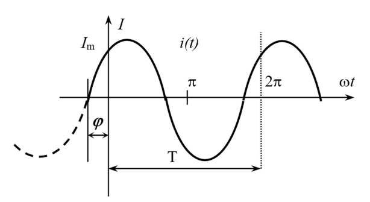</p>

<p align="center" >Рисунок 1 – График синусоидального тока</p>

Мгновенные значения гармонического тока и напряжения имеют следующий вид:

```math
i(t)=I_m\sin(\omega t+\varphi_i)
```

```math
u(t)=U_m\sin(\omega t+\varphi_u)
```

*   $i(t)$ — мгновенное значение тока, А;
*   $u(t)$ — мгновенное значение напряжения, В;
*   $I_m$ - амплитуда электрического тока, А;
*   $U_m$ - амплитуда напряжения, В;
*   $\omega$ - угловая частота, $с^{-1}, \left ( \omega=2 \pi f  \right )$;
*   $f$ - частота, Гц;
*   $\varphi_i$, $\varphi_u$ — начальные фазы тока и напряжения, рад; их разность определяет сдвиг фаз между напряжением и током.

#### Активное сопротивление

**Активным** или **ваттным** сопротивлением называется всякое сопротивление, поглощающее электрическую энергию или вернее превращающее ее в другой вид энергии, например в тепловую, световую или химическую.

#### Реактивное сопротивление

**Реактивное сопротивление** – электрическое сопротивление переменному току, обусловленное передачей энергии магнитным полем в индуктивностях или электрическим полем в конденсаторах.

Элементы, обладающие реактивным сопротивлением, называют реактивными.

#### Реактивное сопротивление конденсатора

**Реактивное сопротивление конденсатора** — это сопротивление конденсатора, вызванное изменением тока или напряжения из-за его ёмкости.

Реактивное сопротивление конденсатора рассчитывается по следующей формуле:

```math
X_C=\frac{1}{\omega C}=\frac{1}{2\pi f C}
```

*   $X_C$ — модуль ёмкостного реактивного сопротивления, Ом; импеданс идеального конденсатора $Z_C=-jX_C$;
*   $f$ - частота в Герцах;
*   $C$ - ёмкость в Фарадах;
*   $\omega$- угловая частота в $с^{-1}$.

Исходя из приведённой выше формулы видно, что при повышении частоты переменного тока реактивное сопротивление конденсатора уменьшается.

В реальном конденсаторе имеются потери энергии и ток утечки через диэлектрик; идеальная ёмкость этих эффектов не учитывает.

#### Реактивное сопротивление катушки индуктивности

**Реактивное сопротивление катушки индуктивности** — это сопротивление катушки, вызванное изменением тока или напряжения из-за её индуктивности.

Реактивное сопротивление катушки индуктивности рассчитывается по следующей формуле:

```math
X_L=\omega L=2 \pi f L
```

*   $X_L$ - реактивное сопротивление катушки индуктивности в Омах;
*   $f$ - частота в Герцах;
*   $L$ – индуктивность в Генри;
*   $\omega$- угловая частота в $с^{-1}$.

Исходя из приведённой выше формулы видно, что при повышении частоты переменного тока реактивное сопротивление катушки индуктивности увеличивается.

При этом не стоит забывать, что реальная катушка индуктивности обладает не только реактивным, но и активным сопротивлением, что обусловлено, в частности, сопротивлением провода обмотки.

#### Треугольник сопротивлений

**Импеданс** – комплексное, полное сопротивление переменному току электрической цепи с активным и реактивным сопротивлением. Рассмотрим цепь, активное сопротивление элементов которой $r$, индуктивность $L$ и емкость $С$.

<p align="center" > 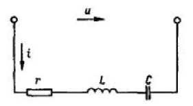</p>

<p align="center" >Рисунок 2 – Цепь переменного тока с резистором, катушкой индуктивности и конденсатором</p>

Импеданс такой последовательной цепи $Z=r+j(X_L-X_C)$, где $j$ — мнимая единица. Его модуль:

```math
|Z|=\sqrt{r^2+(X_L-X_C)^2}
```

Графически это выражение можно изобразить в виде, так называемого, треугольника сопротивлений.

<p align="center" > 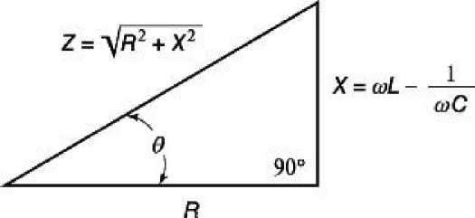</p>

<p align="center" >Рисунок 3 – Треугольник сопротивлений</p>

Гипотенуза треугольника сопротивлений изображает модуль полного сопротивления цепи, а катеты — активное и реактивное сопротивления.

<p align="center" > 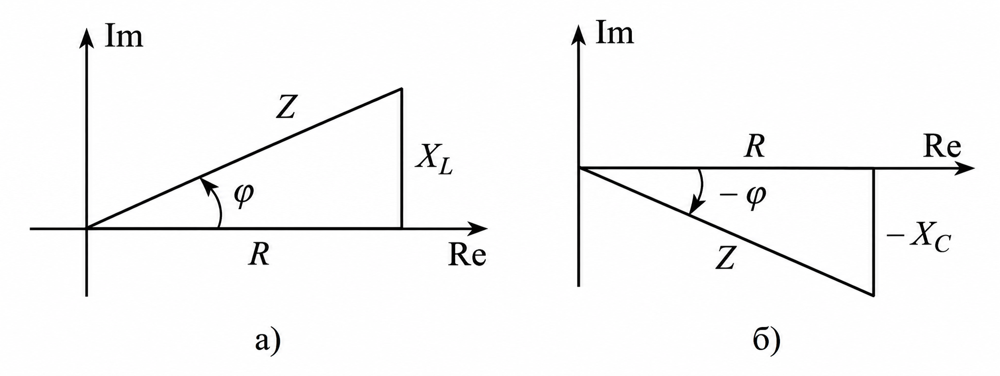</p>

<p align="center" >Рисунок 4 – Треугольники сопротивлений</p>
<p align="center" >a)активно - индуктивная нагрузка, б) активно - емкостная нагрузка</p>

#### Ток и напряжение на резисторе

Электрический ток, проходящий через резистор, совпадает по фазе с напряжением.

<p align="center" > 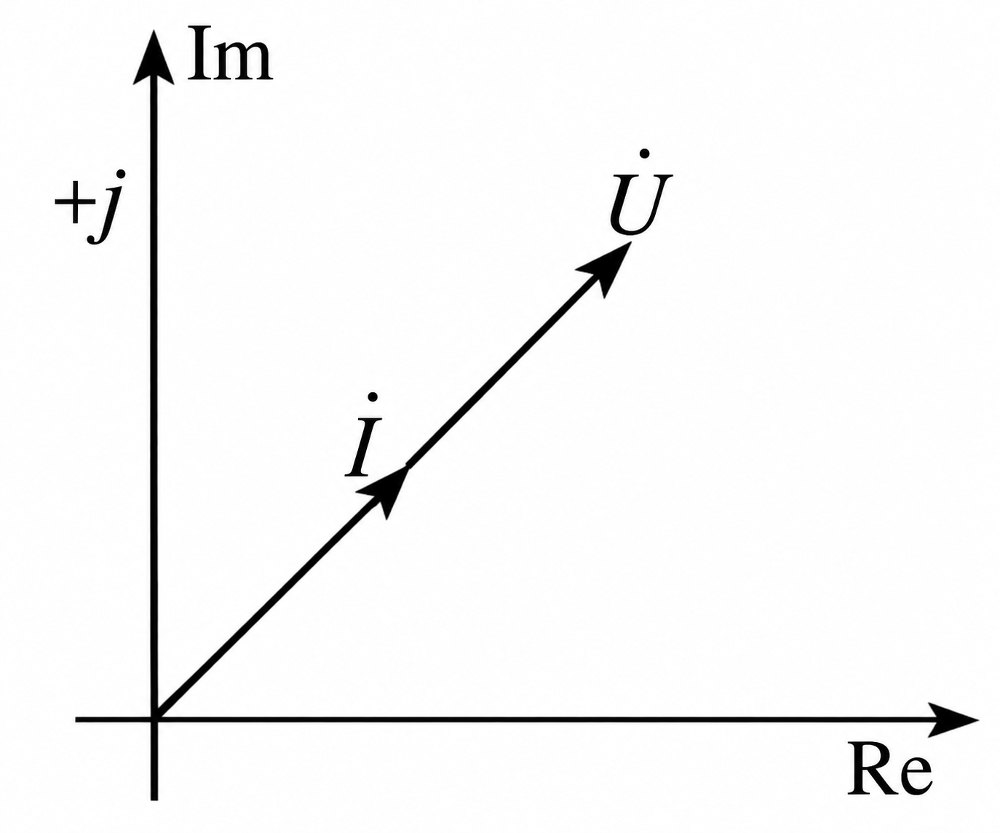</p>

<p align="center" >Рисунок 5 – Вектор тока, проходящего через резистор, совпадающий по направлению с вектором напряжения</p>

Соотношения между напряжением и током на резисторе имеют вид:

```math
u_R(t)=R i_R(t),\qquad \dot{U}_R=R\dot{I}_R
```

#### Ток и напряжение на конденсаторе

Ток идеального конденсатора связан со скоростью изменения напряжения на его обкладках. Конденсатор накапливает энергию электрического поля и возвращает её в цепь.

При синусоидальном воздействии ток опережает напряжение на $90^\circ$, то есть на четверть периода. В моменты максимума и минимума напряжения ток равен нулю. На рисунке 6 вектор напряжения отстаёт от вектора тока на $90^\circ$.

<p align="center" > 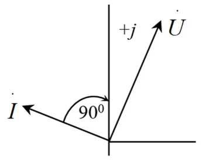</p>

<p align="center" >Рисунок 6 – Отставание вектора напряжения от вектора тока на 90°</p>

Соотношения между напряжением и током на конденсаторе имеют вид:

```math
i_c=\frac{dQ}{dt}=C \frac{du}{dt}
```

```math
u_C(t)=u_C(t_0)+\frac{1}{C}\int_{t_0}^{t}i_C(\tau)\,d\tau
```

#### Ток и напряжение на катушке индуктивности

При изменении тока в катушке возникает ЭДС самоиндукции, препятствующая этому изменению. Идеальная катушка накапливает энергию магнитного поля и возвращает её в цепь.

При синусоидальном воздействии напряжение на идеальной катушке опережает ток на $90^\circ$, то есть на четверть периода. На рисунке 7 показано соответствующее положение векторов.

<p align="center" > 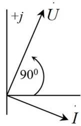</p>

<p align="center" >Рисунок 7 – Опережение вектора напряжения относительно вектора тока на 90°</p>

Соотношения между напряжением и током на катушке индуктивности имеют вид:

```math
u_L=-\varepsilon =L \frac{di}{dt}
```

```math
i_L(t)=i_L(t_0)+\frac{1}{L}\int_{t_0}^{t}u_L(\tau)\,d\tau
```

### Фильтры на основе R и C

#### Основные понятия

**Коэффициентом передачи (преобразования)** называют функцию, которая определяется как отношение выходного сигнала к входному сигналу.

В частности, если величины входного и выходного сигналов однородны, тогда коэффициент передачи называют коэффициентом усиления. Так, например, коэффициентом усиления по напряжению $K_U$ называют физическую величину, равную отношению амплитуды переменной компоненты выходного напряжения $U_{вых}$ к амплитуде входного напряжения $U_{вх}$:

```math
K_U=\frac{U_{вых}}{U_{вх}},
```

где $U_{вых}$ – напряжение на выходе цепи, $U_{вх}$ – напряжение на входе цепи.

<p align="center" > 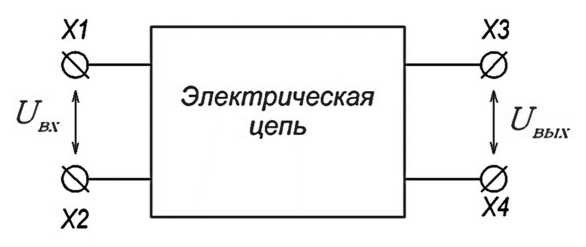</p>

<p align="center" >Рисунок 8 – Упрощенная схема электрической цепи</p>

В выражении для коэффициента усиления можно использовать не только амплитуды, но и действующие значения напряжения.

Если коэффициент передачи больше единицы, то электрическая цепь усиливает входной сигнал, если же меньше единицы, то ослабляет.

Коэффициент усиления выражают как в относительных единицах так и в децибелах. В таком случае выражения для определения коэффициента усиления выглядят следующим образом.

Коэффициент усиления по напряжению:

```math
K_{U,дБ}=20\lg(\frac{U_{вых}}{U_{вх}})
```

Коэффициенты усиления по току:

```math
K_{I,дБ}=20\lg(\frac{I_{вых}}{I_{вх}})
```

Коэффициенты усиления по мощности:

```math
K_{P,дБ}=10\lg(\frac{P_{вых}}{P_{вх}})
```

Если в усилителе коэффициент передачи больше единицы для безразмерного коэффициента или больше нуля для коэффициента, представленного в децибелах, то коэффициент называют коэффициентом усиления, иначе коэффициентом ослабления.

**Амплитудно-частотная характеристика** (АЧХ) цепи показывает зависимость уровня сигнала на выходе устройства от частоты передаваемого сигнала при постоянной амплитуде синусоидального сигнала на входе этого устройства (рис. 9).

**Логарифмическая амплитудно-частотная характеристика** (ЛАЧХ) цепи показывает зависимость уровня сигнала на выходе устройства от частоты, отложенной в логарифмическом масштабе при постоянной амплитуде синусоидального сигнала на входе этого устройства (рис. 10 сверху). В западной литературе используется название диаграмма Бо́де или график Боде, по имени инженера Хенрика Боде.

**Фазо-частотная характеристика** (ФЧХ) – это зависимость сдвига по фазе между синусоидальными сигналами на входе и выходе устройства от частоты сигнала на входе этого устройства.

**Логарифмическая фазо-частотная характеристика** (ЛФЧХ) – это зависимость сдвига по фазе между синусоидальными сигналами на входе и выходе устройства от изменения частоты сигнала в логарифмическом масштабе на входе этого устройства (рис. 9).

**Полоса пропускания** – это диапазон частот, в пределах которого АЧХ цепи или устройства достаточно равномерна, чтобы обеспечить передачу сигнала без существенного искажения его формы (рис.9). Определяется по уровню -3 дБ от максимального значения АЧХ.

**Неравномерность АЧХ в полосе пропускания** - размер флуктуации АЧХ от пика до пика в полосе пропускания.

**Крутизна частотной характеристики фильтра** – скорость спада АЧХ в полосе подавления (дБ/октаву или дБ/декаду) (рис.9).

<p align="center" > 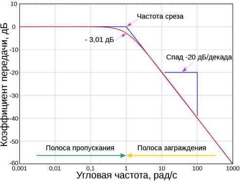</p>

<p align="center" >Рисунок 9 – Логарифмическая амплитудно-частотная характеристика</p>

<p align="center" > 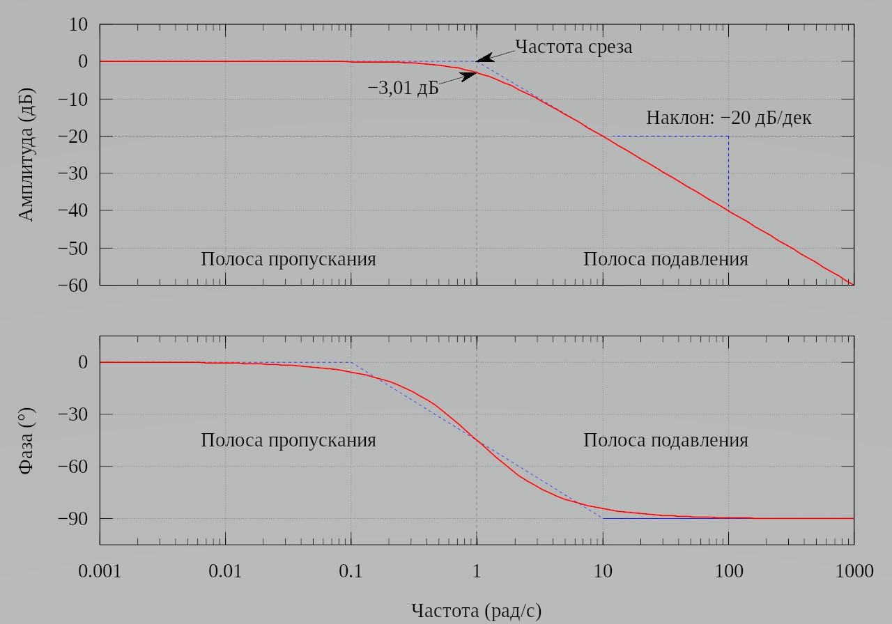</p>

<p align="center" >Рисунок 10 – Пример ЛАЧХ (сверху) и ЛФЧХ (снизу) для ФНЧ 1-го порядка</p>

**Примечание по ЛАЧХ**

>  По оси **абсцисс** на **ЛАЧХ** отображается частота в логарифмическом масштабе:
> *   декада (дек): 1 декада равна изменению частоты в 10 раз;
> *   октава (окт): 1 октава равна изменению частоты в 2 раза.
>
> По оси **ординат** на **ЛАЧХ** отображается коэффициент передачи по напряжению в децибелах: $20\lg(U_{вых}/U_{вх})$. Увеличение отношения напряжений в 10 раз соответствует 20 дБ; увеличение отношения мощностей в 10 раз соответствует 10 дБ.

**Примечание по ЛФЧХ**

>  По оси **абсцисс** на **ЛФЧХ** откладывается частота в логарифмическом масштабе (в декадах или октавах);
>  По оси **ординат** на **ЛФЧХ** откладывается выходная фаза в угловых градусах или радианах.

Частота среза фильтра $f_{ср}$ – частота, на которой сигнал ослабляется на -3 дБ по
логарифмической шкале. По линейной шкале для напряжения $K_U$ и тока $K_I$ уровень -3 дБ
составляет $\frac{1}{\sqrt{2}} (0.707)$, а для мощности $K_P$ составляет $\frac{1}{2} (0.5)$.


**Порядок фильтра** – параметр, характеризующий крутизну среза. Фильтр первого порядка имеет крутизну среза 6 дБ/октаву (20 дБ на декаду), второго порядка - 12 дБ/октаву (40 дБ на декаду), третьего – 18 дБ/октаву (60 дБ на декаду) и т.д. (рис.11)

<p align="center" > 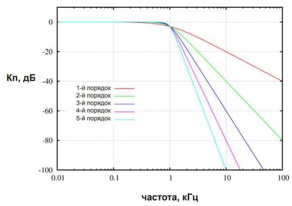</p>

<p align="center" >Рисунок 11 – Зависимость крутизны среза от порядка фильтра</p>

Задача фильтрации сводится к созданию фильтра с заданными АЧХ и ФЧХ, а точнее с заданными характеристиками, основными из которых являются:

*   полоса пропускания;
*   неравномерность АЧХ в полосе пропускания;
*   крутизна среза;
*   отставание по фазе.

#### Четыре фильтра
**Фильтр нижних частот (ФНЧ, LPF, Low Pass Filter)** – фильтр, который пропускает низкочастотные сигналы и ослабляет высокочастотные.

<p align="center" > 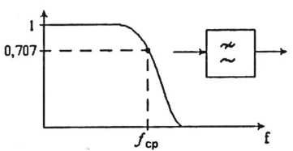</p>

<p align="center" >Рисунок 12 – АЧХ ФНЧ</p>

**Фильтр верхних частот (ФВЧ, HPF, High Pass Filter)** – фильтр, который пропускает высокочастотные сигналы и ослабляет низкочастотные.

<p align="center" > 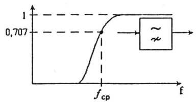</p>

<p align="center" >Рисунок 13 – АЧХ ФВЧ</p>

**Полосовой фильтр (ПФ, полосно-пропускающий, BPF, Band Pass Filter)** – фильтр, который пропускает сигналы в некоторой полосе частот и подавляет сигналы на низких и на высоких частотах.

<p align="center" > 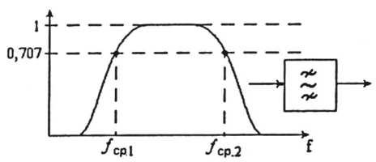</p>

<p align="center" >Рисунок 14 – АЧХ ПФ</p>

**Режекторный фильтр (РФ, полосно-заграждающий, BSF, Band Stop Filter)** – фильтр, который ослабляет сигналы в некоторой полосе частот и пропускает сигналы на низких и высоких частотах.

<p align="center" > 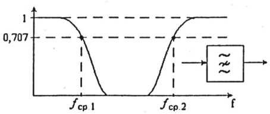</p>

<p align="center" >Рисунок 15 – АЧХ режекторного фильтра</p>

#### От делителя напряжения к фильтрам на R и C

Принцип работы простейших фильтров подобен принципу работы делителя напряжения. С помощью делителя напряжения можно понизить входное напряжение до необходимого нам уровня.

<p align="center" > 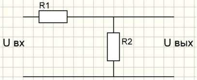</p>

<p align="center" >Рисунок 16 – Делитель напряжения</p>

```math
U_{вых}=U_{вх} \frac{R_2}{R_1+R_2}
```

```math
U_{вых}=U_{вх} K_U
```

```math
K_U=\frac{R_2}{R_1+R_2}
```

```math
R_{общ}=R_1+R_2
```

```math
R_2=R_{общ} \frac{U_{вых}}{U_{вх}}=R_{общ} K_U
```

<p align="center" > 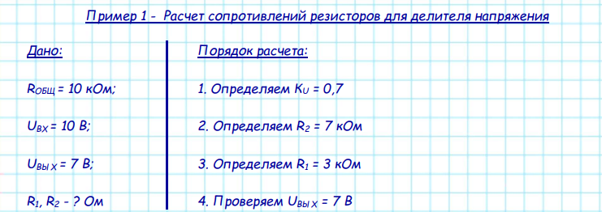</p>

<p align="center" >Рисунок 17 – Расчет сопротивлений резисторов для делителя напряжения</p>

Расчёт фильтров выполняется по аналогии с расчётом делителя напряжения.

Так как сопротивление нагрузки, подключаемой к выходу делителя, влияет на выходное напряжение, то должно выполняться условие $R_2 << R_н$ . Это правило также справедливо и при расчетах фильтров.

#### Г-образный RC -фильтр

Чтобы из делителя напряжения на двух резисторах получить фильтр, можно заменить один из резисторов конденсатором. Частота среза такого фильтра вычисляется по формуле:

```math
f_{ср}=\frac{1}{2 \pi R C}
```

При замене сопротивления $R_1$ (Рис. 16) на конденсатор можно получить фильтр верхних частот (Рис.18 а), в основе которого лежит дифференцирующая $RC$ цепь. А при замене конденсатором сопротивления $R_2$ (Рис.16) – фильтр нижних частот (Рис.18 б), в основе которого лежит интегрирующая $RC$ цепь.

Коэффициент передачи для ФНЧ и ФВЧ на базе RC вычисляется по формулам:

```math
K_{UФНЧ}=\frac{X_C}{\sqrt{R^2+X^2_C}}
```

```math
K_{UФВЧ}=\frac{R}{\sqrt{R^2+X^2_C}}
```

Для ненагруженных RC-фильтров на частоте среза $R=X_C$, а коэффициент передачи по напряжению равен $1/\sqrt{2}\approx0{,}707$, что соответствует приблизительно −3 дБ. Фазовый сдвиг выходного напряжения относительно входного составляет −45° для ФНЧ и +45° для ФВЧ. Идеальный конденсатор не рассеивает активную мощность; равенство $R=X_C$ не означает равного распределения рассеиваемой мощности между резистором и конденсатором.

Для качественного построения характеристик можно использовать выражения, где $f_{ср}=1/(2\pi RC)$:

```math
K_{U,ФНЧ}=\frac{1}{\sqrt{1+(f/f_{ср})^2}},\qquad
\varphi_{ФНЧ}=-\arctan(f/f_{ср})
```

```math
K_{U,ФВЧ}=\frac{f/f_{ср}}{\sqrt{1+(f/f_{ср})^2}},\qquad
\varphi_{ФВЧ}=90^\circ-\arctan(f/f_{ср})
```

В последней формуле значение арктангенса выражается в градусах. Фаза ФНЧ изменяется от 0° к −90°, а фаза ФВЧ — от +90° к 0° при увеличении частоты.

<p align="center" > 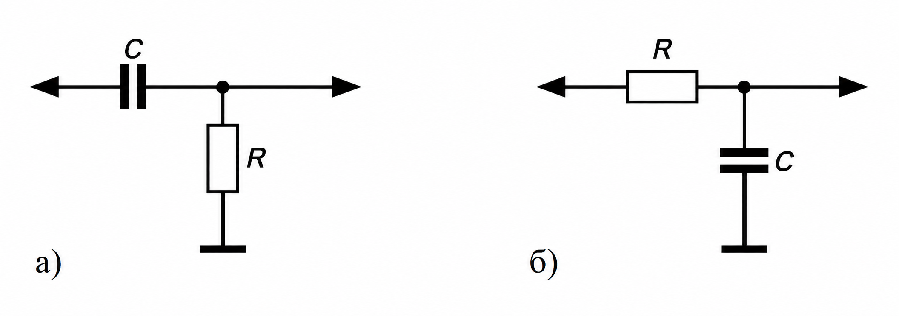</p>

<p align="center" >Рисунок 18 – RC-фильтры</p>
<p align="center" >а)ФВЧ, б)ФНЧ</p>
<p align="center" > 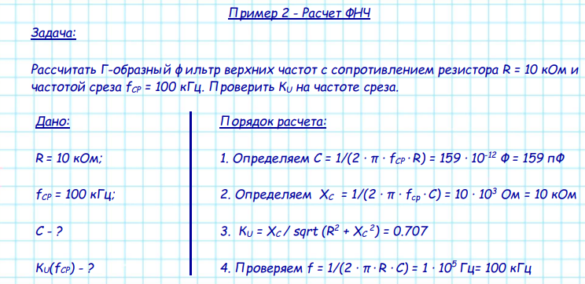</p>

<p align="center" >Рисунок 19 – Расчет ФНЧ</p>

<p align="center" > 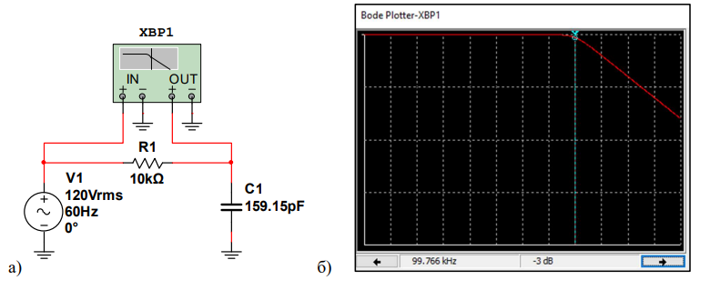</p>

<p align="center" >Рисунок 20 – Моделирование в среде Multisim</p>
<p align="center" >а)схема ФНЧ, б)ЛАЧХ построенного ФНЧ</p>

#### Нагрузка

Как можно заметить, на рисунке 20 отсутствует нагрузка. Но на практике к выходу фильтра подключается нагрузка, как это показано на рис. 21. На схеме нагрузка является отдельным компонентом, но в реальной цепи она может представлять что-то гораздо более сложное, например, аналого-цифровой преобразователь, усилитель или входной каскад осциллографа, который используется для измерения амплитудно-частотной характеристики фильтра. Введение нагрузки в схему при моделировании позволяет получить более точную модель и избежать неприятных последствий при использовании разработанного фильтра на практике. Кроме того, при построении фильтра необходимо отталкиваться от параметров устройства, к которому он будет подключаться. На практике пользуются простым правилом: сопротивление фильтра должно быть в 10-100 раз меньше чем сопротивление нагрузки.

<p align="center" > 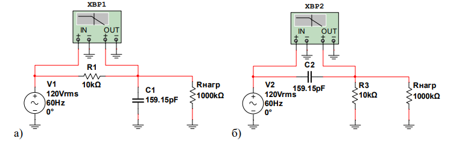</p>

<p align="center" >Рисунок 21 – Подключение нагрузки к фильтрам в среде Multisim а. ФНЧ, б. ФВЧ</p>

Г-образные фильтры на базе RC являются фильтрами 1-го порядка, вследствие чего имеют существенный недостаток в виде пологой крутизны спада АЧХ.

Для увеличения крутизны спада АЧХ применяют фильтры более высокого порядка. Порядок определяется передаточной функцией; одна лишь Т-образная или П-образная форма схемы не определяет его.

### Построение АЧХ и ФЧХ в Multisim

Для построенного в Multisim фильтра можно выполнить анализ амплитудно-частотных и фазо-частотных характеристик с помощью инструмента Плоттер Боде (Bode plotter). Пример исследуемого фильтра представлен на рисунке 22. Для формирования синусоидального сигнала потребуется компонент AC POWER (Sources->POWER SOURCES->AC POWER). Частоту и амплитуду сигнала можно выставить любую, на анализ цепи с помощью плоттера Боде это не влияет. Сопротивление нагрузки Rload необходимо выставить приблизительно в 100 раз больше, чем сопротивление фильтра.

<p align="center" > 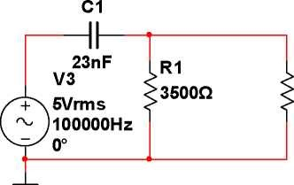</p>

<p align="center" >Рисунок 22 – Пример исследуемого фильтра</p>

#### Плоттер Боде

Плоттер Боде предназначен для анализа амплитудно-частотных и фазо-частотных характеристик и представления их в линейном или логарифмическом масштабе. Наиболее полезен данный инструмент для анализа схем фильтров. Выбрать данный инструмент можно как показано на рисунке 23 или из панели инструментов, располагающегося в правой части рабочего пространства.

<p align="center" > 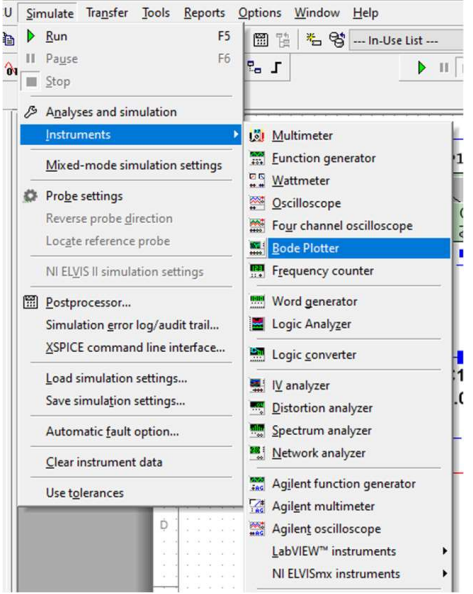</p>

<p align="center" >Рисунок 23 – Расположение плоттера Боде в меню</p>

Плоттер Боде имеет четыре вывода: два вывода IN и два вывода OUT. Подключение прибора к исследуемой схеме осуществляется при помощи выводов отмеченных значком «+» (вывод IN «+» подключается к входу схемы, вывод OUT «+» – к выходу), выводы «–» подключаются к общей шине. На рисунке 24 представлен пример подключения плоттера Боде к схеме ФВЧ 1-го порядка, рассчитанного в примере выше

<p align="center" > 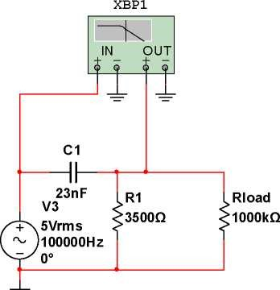</p>

<p align="center" >Рисунок 24 – Схема подключения плоттера Боде к фильтру</p>

Рассмотрим более подробно лицевую панель прибора, представленную на рисунке 25.

<p align="center" > 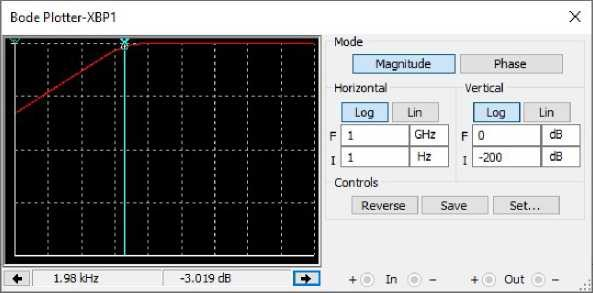</p>

<p align="center" >Рисунок 25 – Лицевая панель плоттера Боде</p>

В ее левой части расположен графический дисплей, который предназначен для графического отображения формы сигнала. Так же прибор оснащен курсором для проведения измерений в любой точке графика, курсор при необходимости можно перемещать при помощи левой кнопки мыши. Управлять положением курсора можно так же и при помощи стрелок перемещения вертикального курсора, которые расположены в нижней левой части лицевой панели плоттера Боде под графическим дисплеем. Между стрелками находятся два информационных поля, в которых отображаются значения частоты и фазы (или коэффициента передачи), полученные на пересечении вертикального курсора и графика.

В правой части находится панель управления, предназначенная для настройки параметров плоттера Боде. Рассмотрим данную панель более подробно. В верхней части панели находится поле «Режим», в котором размещено две кнопки: «Амплитуда» и «Фаза». При нажатой кнопке «Амплитуда» прибор работает в режиме анализа амплитудно-частотных характеристик. При нажатой кнопке «Фаза» – в режиме анализа фазо-частотных характеристик. В полях «По горизонтали» и «По вертикали» можно задать параметры горизонтальной и вертикальной осей координат при логарифмической или линейной шкале. Логарифмическая шкала используется в том случае, если сравниваемые значения имеют большой разброс, как например, в случае анализа амплитудно-частотой характеристики. Переключение шкалы производится при помощи кнопок «Log» (логарифмическая) и «Лин» (линейная). Масштаб горизонтальной (ось Х) и вертикальной (ось Y) осей определяется начальным («I» - initial) и конечным («F» - final) значениями.

На экране графического дисплея плоттера Боде **по оси Х всегда отображается частота**.

При измерении коэффициента передачи **ось Y отображает отношение выходного напряжения схемы к его входному напряжению**. Для логарифмической шкалы единицы – децибелы. В том случае если измеряется фаза, вертикальная ось всегда показывает угол фазы в градусах.

При анализе **амплитудно-частотной характеристики** диапазон значений по вертикальной оси может быть задан в линейном масштабе от 0 до 10е+09, в логарифмическом масштабе – от –200 dB до 200 dB.

При анализе **фазо-частотной характеристики** диапазон значений по вертикальной оси может быть задан от –720 градусов до +720 градусов.

#### Осциллограф

**Осциллограф** – это прибор, предназначенный для исследования амплитудных и временных параметров электрического сигнала, подаваемого на его вход, и наглядно отображаемого на экране.

#### Функциональный генератор

**Функциональный генератор** – устройство, позволяющее генерировать сигнал определённой формы ( прямоугольной, треугольной и синусоидальной), имеющий заданные характеристики.

#### Мультиметр

**Мультиметр** — электроизмерительный прибор, объединяющий в себе несколько функций. В минимальной конфигурации включает функции вольтметра, амперметра и омметра.

## Этап 2. Выполнение на занятии

1. Предъявите преподавателю домашний конспект. После его проверки приступайте к практической части.
2. Уточните у преподавателя номер индивидуального варианта. **Номер варианта не определяется номером компьютера или номером в журнале.**
3. Выполните задания № 1 и № 2 в NI Multisim.
4. По ходу работы записывайте в **черновик** исходные данные, расчёты, номиналы элементов, настройки измерений и полученные результаты. Зарисуйте схемы и характеристики, необходимые для отчёта.
5. Сохраните модели и, при необходимости, снимки схем и графиков, чтобы использовать их при домашнем оформлении отчёта.

На занятии выполняются моделирование и измерения. Окончательный отчёт оформляется дома по данным, полученным на занятии.

## Практическая часть

### Задание № 1. Исследование ФНЧ первого порядка

1. Запишите в черновик сопротивление $R$ и заданную частоту среза $f_{ср}$ из таблицы 1 для своего варианта.
2. Рассчитайте ёмкость $C_1$:

   $$C_1=\frac{1}{2\pi R f_{ср}}.$$

   Подставляйте сопротивление в омах, частоту в герцах; результат получится в фарадах. Запишите расчёт и единицы измерения.
3. Зарисуйте схему ФНЧ с позиционными обозначениями и номиналами элементов. Выходное напряжение снимается с конденсатора.
4. Сделайте предварительные эскизы ЛАЧХ и ЛФЧХ. Отметьте частоту среза, уровень −3 дБ на ЛАЧХ и фазовый сдвиг −45° на ЛФЧХ.
5. Соберите модель в Multisim и подключите плоттер Боде согласно теоретическому разделу. Зафиксируйте схему подключения прибора.
6. Получите ЛАЧХ и ЛФЧХ. Выберите диапазон частот, позволяющий увидеть поведение фильтра ниже и выше частоты среза. Запишите границы диапазона, подпишите оси и единицы измерения.
7. Курсором плоттера Боде определите частоту среза по уровню −3 дБ относительно коэффициента передачи в полосе пропускания. Запишите измеренную частоту и сравните её с заданной.

### Задание № 2. Исследование ФВЧ первого порядка

1. Запишите в черновик сопротивление $R$ и заданную частоту среза $f_{ср}$ из таблицы 1 для своего варианта.
2. Рассчитайте ёмкость $C_2$:

   $$C_2=\frac{1}{2\pi R f_{ср}}.$$

3. Зарисуйте схему ФВЧ с позиционными обозначениями и номиналами элементов. Выходное напряжение снимается с резистора.
4. Сделайте предварительные эскизы ЛАЧХ и ЛФЧХ. Отметьте частоту среза, уровень −3 дБ на ЛАЧХ и фазовый сдвиг +45° на ЛФЧХ.
5. Соберите модель в Multisim, подключите плоттер Боде и зафиксируйте схему подключения.
6. Получите ЛАЧХ и ЛФЧХ. Запишите границы диапазона частот, подпишите оси и единицы измерения.
7. Определите частоту среза тем же способом, что и для ФНЧ. Запишите результат и сравните его с заданным значением.

> Формула расчёта ёмкости относится к идеальному ненагруженному RC-фильтру. Если в модели подключена нагрузка, обязательно запишите её сопротивление: нагрузка может изменить коэффициент передачи и частоту среза. При почти единичном коэффициенте передачи в полосе пропускания частота среза приблизительно соответствует абсолютному уровню −3 дБ.

### Таблица для записи результатов

Перенесите таблицу в черновик и заполните её по ходу выполнения работы. При наличии нагрузки укажите её сопротивление отдельно.

| Фильтр | R | Заданная частота среза | Рассчитанная ёмкость | Частота среза по Multisim |
| --- | --- | --- | --- | --- |
| ФНЧ | | | | |
| ФВЧ | | | | |

Для каждого числового результата указывайте единицу измерения.

### Индивидуальные варианты

*Таблица 1. Параметры схемы*

| Вариант | R (ФНЧ) | Частота среза (ФНЧ) | R (ФВЧ) | Частота среза (ФВЧ) |
| --- | --- | --- | --- | --- |
|     1          |     2 кОм         |     50 кГц     |     3 кОм    |     20 МГц     |
|     2          |     5 кОм         |     3 МГц      |     6 кОм    |     5 МГц      |
|     3          |     1 кОм         |     750 кГц    |     6 кОм    |     75 кГц     |
|     4          |     4 кОм         |     100 кГц    |     2 кОм    |     9 МГц      |
|     5          |     2 кОм         |     15 МГц     |     5 кОм    |     80 кГц     |
|     6          |     2 кОм         |     500 кГц    |     1 кОм    |     200 кГц    |
|     7          |     5 кОм         |     3 МГц      |     6 кОм    |     500 кГц    |
|     8          |     6 кОм         |     300 кГц    |     2 кОм    |     450 кГц    |
|     9          |     1 кОм         |     400 кГц    |     8 кОм    |     25 МГц     |
|     10         |     2 кОм         |     30 кГц     |     3 кОм    |     600 кГц    |
|     11         |     6 кОм         |     110 кГц    |     6 кОм    |     30 МГц     |
|     12         |     8 кОм         |     2 кГц      |     7 кОм    |     800 кГц    |
|     13         |     3 кОм         |     150 кГц    |     1 кОм    |     50 кГц     |
|     14         |     5 кОм         |     600 кГц    |     5 кОм    |     30 кГц     |
|     15         |     2 кОм         |     100 кГц    |     6 кОм    |     300 кГц    |
|     16         |     1 кОм         |     5 МГц      |     2 кОм    |     8 МГц      |
|     17         |     6 кОм         |     180 кГц    |     4 кОм    |     75 кГц     |
|     18         |     4 кОм         |     170 кГц    |     9 кОм    |     60 кГц     |
|     19         |     8 кОм         |     2 МГц      |     3 кОм    |     30 МГц     |
|     20         |     3 кОм         |     60 кГц     |     9 кОм    |     15 МГц     |
|     21         |     5 кОм         |     400 кГц    |     6 кОм    |     45 кГц     |
|     22         |     3 кОм         |     450 кГц    |     2 кОм    |     20 МГц     |
|     23         |     6 кОм         |     500 кГц    |     1 кОм    |     55 кГц     |
|     24         |     2 кОм         |     650 кГц    |     5 кОм    |     60 кГц     |
|     25         |     3 кОм         |     330 кГц    |     8 кОм    |     30 кГц     |
|     26         |     5 кОм         |     20 кГц     |     4 кОм    |     20 МГц     |
|     27         |     1 кОм         |     100 кГц    |     9 кОм    |     250 кГц    |
|     28         |     2 кОм         |     300 кГц    |     2 кОм    |     3 МГц      |
|     29         |     5 кОм         |     400 кГц    |     5 кОм    |     95 кГц     |
|     30         |     3 кОм         |     10 кГц     |     7 кОм    |     30 МГц     |

## Этап 3. Оформление отчёта дома

После занятия оформите **отчёт в тетради** по результатам своей работы. Используйте записи из черновика и сохранённые материалы моделирования.

### Содержание отчёта

1. **Номер и название лабораторной работы.**
2. **Цель работы.**
3. **Номер индивидуального варианта и исходные данные.**
4. **Задание № 1 — ФНЧ:** расчёт ёмкости с подстановкой чисел и единицами измерения; схема с номиналами и подключением плоттера Боде; полученные ЛАЧХ и ЛФЧХ; измеренная частота среза и её сравнение с заданной.
5. **Задание № 2 — ФВЧ:** расчёт ёмкости, схема, характеристики и результаты измерения в том же составе.
6. **Сводная таблица результатов** для обоих фильтров.
7. **Вывод:** какие частоты пропускает и ослабляет каждый фильтр; согласуются ли полученные характеристики и частоты среза с расчётом; чем могут объясняться обнаруженные расхождения.

Схемы должны содержать позиционные обозначения и номиналы элементов. На графиках укажите названия осей, единицы измерения, частоту среза и соответствующие уровни. Отчёт должен отражать фактически полученные результаты, в том числе расхождения с расчётом.

**Домашний конспект и отчёт выполняют разные задачи:** конспект подтверждает подготовку к занятию, а отчёт содержит расчёты, результаты моделирования и выводы. Повторно переписывать весь конспект в отчёт не требуется.

## Этап 4. Сдача и защита отчёта

**Готовый отчёт принесите на следующее лабораторное занятие.**

При защите необходимо объяснить выполненные расчёты, принцип работы исследованных фильтров, способ подключения и настройки плоттера Боде, а также полученные результаты. Преподаватель может задавать вопросы по теории этой работы, связанному с ней лекционному материалу и выполнению заданий в Multisim.

## Вопросы для самопроверки

1. Что характеризуют амплитуда, частота и начальная фаза гармонического сигнала?
2. Как связаны частота и угловая частота?
3. Как изменяются сопротивления конденсатора и катушки при увеличении частоты?
4. Как соотносятся фазы тока и напряжения на идеальных R-, L- и C-элементах?
5. Чем импеданс отличается от его модуля? Что показывает треугольник сопротивлений?
6. Как вычисляется коэффициент передачи по напряжению в относительных единицах и децибелах?
7. Что откладывается по осям АЧХ, ЛАЧХ, ФЧХ и ЛФЧХ?
8. Что называют частотой среза? Какому отношению напряжений соответствует уровень около −3 дБ?
9. Чем различаются ФНЧ, ФВЧ, полосовой и режекторный фильтры?
10. Как построить простейшие RC-фильтры нижних и верхних частот? С какого элемента снимается выходное напряжение?
11. Как рассчитать ёмкость по заданным сопротивлению и частоте среза?
12. Как изменяются ЛАЧХ и ЛФЧХ исследуемых фильтров при увеличении частоты?
13. Как влияет нагрузка на работу фильтра?
14. Как подключить плоттер Боде и определить частоту среза?
15. Почему частота среза, полученная при моделировании, может отличаться от заданной?
