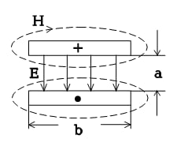
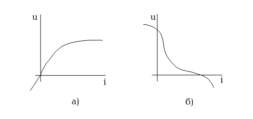

# Тема №1. Основные понятия электротехники
`Электротехника` - обширная область практического применения электромагнитных явлений, происходящих в электротехническом устройстве.


`Электротехническое устройство` - система заряженных тел и проводников с током.  
Для практического применения электромагнитных явлений в электротехническом устройстве необходимо по крайней мере установить связь между переменными системы (потенциалами, зарядами, токами, магнитными потоками) и параметром системы.  


Переменные системы делятся на две категории: известные, независимые (сигналы) и определяемые, зависимые (реакция).  
Обозначив сигналы вектором  $\overline a$; реакцию вектором $\overline b$; параметры системы вектором $\overline c$ можно сформулировать две основные задачи электротехники:  
 1. `Анализ`: Дано $\overline a$ и $\overline c$; определить $\overline b$; т.е. при заданной системе $\overline c$ и возмущениях $\overline a$ в результате анализа получается реакция системы $\overline b$
 2. `Синтез`: Дано $\overline a$ и $\overline b$; определить $\overline c$; т.е. требуется определить такую систему $\overline c$, чтобы при заданных возмущениях $\overline a$ обеспечивала требующую реакцию $\overline b$


Для решения задач электротехники (как и задач во многих других областях знаний) исходя из физических процессов в системе переходят к модельному представлению системы, т.е. к такому упрощению системы, которое с одной стороны сохраняла бы все существенные ее свойства, с другой поддавалась бы решению доступными математическими средствами.  


Венцом моделирования является составление математической модели.  
Наиболее полным описанием электротехнических процессов являются уравнения Максвелла, известные из курса физики:  
```math
1.rot \overline H= \overline \delta + \frac{\partial \overline D}{\partial t}
```

 ```math
2.rot \overline E= - \frac{\partial \overline B}{\partial t}
```  
 ```math
3.div \overline B= 0
```
```math
4.div \overline D= \overline \rho
```
и уравнения Умова-Пойнтинга
```math
5.\overline\Pi= \overline E \times \overline H .
```
Первое уравнение утверждает тот факт, что вектор тока ($\overline \delta$), равно как и ток, вызванный изменением электрического смещения ($\frac{\partial \overline D}{\partial t}$), вызывает появление магнитного поля.

Второе уравнение показывает связь между изменением вектора магнитной индукции ($\frac{\partial \overline B}{\partial t}$) и напряженностью электрического поля.

Третье уравнение утверждает, что линии магнитного поля замкнуты, т.е. не существует магнитных зарядов.

Четвертое уравнение вводит понятие электрического заряда, на котором начинаются и заканчиваются линии электрического смещения. Среда, в которой взаимодействуют переменные задается коэффициентами в соотношениях $\overline D=\overline\varepsilon\overline E$; $\overline B=\overline\mu \overline H$; $\overline \delta=\overline \gamma\overline E$.

Пятое уравнение указывает, что энергия локализуется в электрических и магнитных полях.

Если не считаться с квантовыми, статистическими процессами микромира приведенная система уравнений достаточно полно описывает все электромагнитные взаимодействия в электротехнических устройствах и в этом смысле является полной математической моделью любой системы.

Непосредственно для практического расчета целого ряда электротехнических расчетов уравнения Максвелла использовать затруднительно по двум обстоятельствам:

1. Сложность математического аппарата векторного анализа.
2. Громоздкость исходных данных, т.к. требуется задание параметров в виде векторных полей.
   
В очень многих задачах требуется знание только интегральных понятий:

Ток: 
```math
i=\int_S \overline \delta {d} \overline s=\oint \overline H{d}\overline l
```
ЭДС: 
```math
e=\oint_l\left(\overline E_{СТОР} + \overline E_{ИНД} \right){d}\overline l
```
Напряжение:  
```math
u=\int_A^B \overline E{d}\overline l
```

Эти обстоятельства возникают когда:
1. Пути тока достаточно малого сечения и ток можно считать равномерно распределенными по сечению.
2. Электрические свойства проводников и диэлектриков существенно различны (Ом и МОм).
3. В источниках и приемниках нас интересуют только интегральные эффекты.
Устройство отвечающее этим требованиям называется электрической цепью.
Следует еще остановиться на понятии мощности.
```math
P=\int_S \overline \Pi{d}\overline s
```
 
где S - сечение, где взаимодействуют электрическое и магнитное поля.
<p align="center" > </p>
<p align="center" >Рисунок 1 - 1</p>

В случае двух проводников с током I, шириной b, расположенных на расстоянии а, при разности потенциалов U получим:
 $U=\alpha E$; $\oint_l \overline H{d}\overline l= I\implies H_i2b=I$	 .
 
Значит напряженность магнитного поля от двух токов:
 ```math
H=\frac{I}{2b}2=\frac{I}{b}.
```

Вектор Пойнтинга $\overline \Pi=\overline H\times\overline E=\frac{IU}{ab}$ .

Мощность $\Pi S=IU$  (вектора Е и Н перпендикулярны).
Получаем математическое тождество, благодаря которому мощность можно рассчитывать в виде произведения тока и напряжения.
```math
p=ui
``` 

`Электрическая цепь` - это система заряженных тел и проводников с током, которая с достаточной для практических целей точностью может быть описана интегральными понятиями. u, i, e, p, w.

Приведенные интегральные понятия при математическом описании системы выступают как переменные.

Часть переменных может быть независимой (заданной), называемой сигналами, а другая часть - зависимые переменные (реакция системы).

Сама система включает элементы системы, задаваемые их параметрами и характер взаимодействия (соединения) этих элементов. Физически каждый элемент может:

1. Генерировать электрическую энергию, точнее преобразовывать какой-либо вид энергии в электрическую и привносить ее в систему.
2. Рассеивать энергию т.е. необратимо превращать электрическую энергию в какой-либо другой вид энергии.
3. Накапливать и возвращать энергию электрического поля.
4. Накапливать и возвращать энергию магнитного поля.

Очевидно, простейшим элементом электрической цепи может быть `двухполюсник`, т.е. часть цепи, рассмотренная относительно двух зажимов. В качестве переменных здесь принимается ток $i(t)$   и напряжение $u(t)$ . Связь между переменными - математическая модель $i=f(u)$  или $u=f(i)$ .
Это означает, что двухполюсник может быть задан вольт-амперной характеристикой, которая может проходить или не проходить через начало координат. В первом случае это пассивный двухполюсник (рис. 1-2,а), во втором - активный (рис. 1-2,б).

<p align="center" > </p>
<p align="center" >Рисунок 1 - 2</p>

`Активный двухполюсник` обязательно обладает свойством генерировать электрическую энергию.

`Пассивный двухполюсник`, если и содержит источники, то они так соединены и имеют такие параметры, что это не проявляется на внешних зажимах. В эксперименте легко различить активный и пассивный двухполюсники. В первом случае вольтметр включенный: на зажимы такого отдельно взятого двухполюсника покажет напряжение  $u\neq 0$ (при $i=0$), а амперметр $i\neq 0$  (при $u= 0\$). В случае пассивного двухполюсника $u=0$  (при $i=0$) и $i=0$  (при $u=0$).
Двухполюсные элементы могут быть линейными и не линейными. Элемент линейный, если его вольт-амперная характеристика выражается прямой линией.

Сейчас и в дальнейшем, пока не будут сделаны оговорки, будем рассматривать `линейные элементы`. Из них состоят `линейные электрические цепи`.

Существенное упрощение математических моделей получается если различные свойства элементов можно разделить в пространстве, т.е. пользоваться элементами с `сосредоточенными параметрами`. Если это невозможно, приходиться иметь дело с цепями с распределенными параметрами.

Параметры, характеризующие свойство элементов, могут зависеть или не зависеть от времени.

Из всего многообразия возможных моделей элементов пока выберем линейные элементы с сосредоточенными параметрами. Параметры пассивных элементов будем считать не зависящими от времени, параметры активных элементов (сигналы) в общем случае будем считать функциями времени.

`Резюме`: Электрическая цепь - такое модельное представление электрического устройства, которое использует в качестве переменных интегральные понятия о токе, напряжении, электродвижущей силе, мощности, энергии (i, u, e, p, w). Математическая модель, т.е. связь между переменными определяется на основе представления системы в виде отдельных элементов, обладающих теми или иными свойствами. Теория электрических цепей - существенная часть электротехники - решает две основные задачи: анализ и синтез.

## Контрольные вопросы к теме
1. 	Какова область интересов дисциплины «Электротехника»?
2. 	Сформулируйте две основные задачи теории цепей.
3. 	Объясните качественно уравнения Максвелла.
4. 	В чем физический смысл уравнения Умова-Пойнтинга?
5. 	В чем качественная разница выражения мощности в уравнениях $\overline \Pi=\overline H\times\overline E$  и $p=ui$ ?
6. 	Каково качественное соотношение между электрическим устройством и электрической цепью?
7. 	Каково принципиальное отличие активного и пассивного двухполюсников?
8. 	Что такое линейный двухполюсник?
