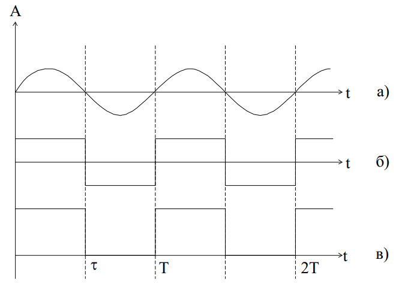
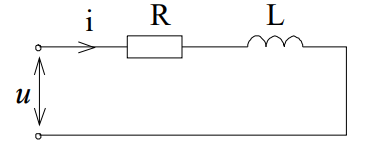
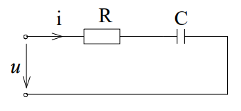
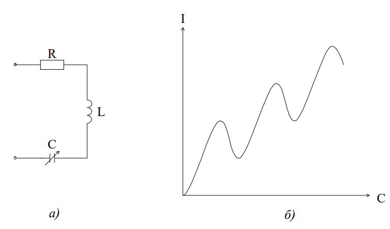
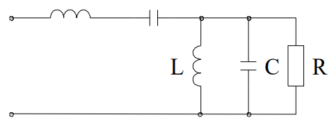
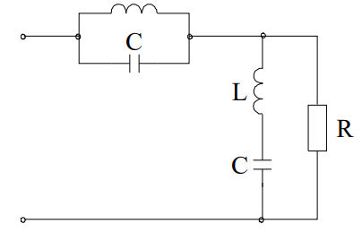

# Тема №10. Особенности измерений при несинусоидальных сигналах


Разные системы приборов переменного тока регистрируют разные величины, но шкала их отградуирована так, что при синусоидальном воздействии они показывают эффективное значение измеряемой величины.
Приборы электродинамической, электромагнитной и тепловой систем отградуированы в действующих значениях. Приборы магнитоэлектрической системы реагируют только на постоянную составляющую.
Магнитоэлектрические приборы с детекторным преобразователем реагируют на средние по модулю значения, а отградуированы на эффективные значения при синусоидальном возмущении.
Электронные амплитудные приборы регистрируют максимальные значения, а отградуированы также на эффективные значения для синусоидального возмущения.
Рассмотрим конкретные примеры.
Пусть имеем различные формы напряжений при одинаковом эффективном значении, равном 10 В.

синусоидальная (рис. 7-8,а);

прямоугольная (рис. 7-8,б);

серия импульсов при $\frac{τ}{T}=0,5$ (рис. 7-8,в).

<p align="center" > </p>
<p align="center" >Рис. 7-8</p>

Поскольку эффективные значения всех напряжений одинаковы, то приборы электродинамической, электромагнитной и тепловой систем покажут 10 В.
Амплитудные значения:

синусоидальная 14, 1 В;

прямоугольная 10 В;

серия импульсов $X=10*\sqrt{2}=14,1В$

Амплитудные приборы, отградуированные на эффективное значение, показывают:
синусоидальная 10 В;

прямоугольная $10/\sqrt{2}=7,1 В$;

серия импульсов 14,1/1,41=10 В.

Детекторные приборы реагируют на средние по модулю значения, но цена деления шкалы увеличена в 1,11:
синусоидальная 10 В;

прямоугольная 10*1,1=11,1 В;

серия импульсов 14,1/21,11=7,8 В.

Магнитоэлектрические приборы:

синусоидальная 0;

прямоугольная 0;

серия импульсов 14,1/2=7,05 В.

## §4. Расчет линейных цепей при несинусоидальных токах, напряжениях и ЭДС

Расчет цепей содержит следующие этапы:
1. Разложение заданных ЭДС или токов источников на гармонические составляющие.
2. Расчет токов и напряжений для каждой составляющей отдельно (на основе принципа наложения).
3. Квадратичное суммирование решений для каждой составляющей.

Обычно ряды Фурье сходятся довольно быстро и в зависимости от требуемой точности решения задачи с учетом характера цепи ограничиваются определенным количеством членов разложения. таким образом, расчет сводится к решению стольких однотипных задач, сколькими гармониками ограничиваются. При этом учитывается, что для различных частот сопротивления элементов схемы неодинаковы.

Сопротивление катушки индуктивности для постоянной составляющей $X_{L0}=0$;

сопротивление для k-й гармоники в к раз больше, чем для основной:

```math
X_{LK}=kωL=kX_{L1}.
```

Конденсатор не пропускает постоянную составляющую ($X_{C0}=∞$); для k-й гармоники сопротивления емкости в к раз меньше, чем для основной:

```math
X_{CK}=\frac{1}{kωC}=\frac{1}{k}X_{C1}
```

Активное сопротивление также зависит от частоты, возрастая с ее увеличением из-за поверхностного эффекта. Однако для цепей, рассматриваемых в электротехнике, зависимость обычно не учитывают, считая 

```math
R_K=const
```

Вследствие зависимости реактивных сопротивлений от частоты токи и падения напряжений в цепях, содержащих емкости, имеют больший коэффициент гармоник, чем ЭДС генератора. Иными словами, отклонение от синусоиды в емкостных цепях усиливается.
В индуктивных цепях происходит обратное явление, т.е. индуктивность подавляет проявление высших гармоник.
Рассмотрим несколько примеров.
Пример 1. В цепи с последовательно соединенными R и L подведено несинусоидальное напряжение]

```math
u = U_0+U_{m1}sinωt+U_{m3}sin(3ωt+ψ_3),
```

найдем мгновенное и действующее значения тока для схемы (рис.7-9.)

<p align="center" > </p>
<p align="center" >Рис. 7-9</p>

Постоянная составляющая тока

```math
I_0=\frac{U_0}{R}
```

Для первой гармоники:

```math
i_1=\frac{U_{m1}}{Z_1}sin(ωt-φ_1) \ ток
```

```math
Z_1=\sqrt{R^2+(ωL)^2} = \sqrt{R^2+X^2_{L1}} \ модуль \ сопротивления 
```

```math
φ_1=arctg\frac{ωL}{R}=arccos\frac{R}{Z_1} \ фаза
```

Действующее значение тока

```math
I_1=\frac{U_{m1}}{\sqrt{2}Z_1}
```

Для третьей гармоники:

```math
i_3=\frac{U_{m3}}{Z_3}sin(ωt+ψ_3-φ_3) \ ток
```

```math
Z_3=\sqrt{R^2+(3ωL)^2} = \sqrt{R^2+X^2_{L3}} \ модуль \ сопротивления 
```

```math
φ_3=arctg\frac{3ωL}{R} \ фаза
```

Действующее значение тока

```math
I_3=\frac{U_{m3}}{Z_3\sqrt{2}}
```

Мгновенное значение общего тока

```math
i(t) = I_0 + \sqrt{2}I_1sin(ωt-φ_1)+\sqrt{2}I_3sin(ωt+ψ_3-φ_3)
```

Действующее значение общего тока

```math
I = \sqrt{I^2_0+I^2_1+I^2_3}
```

Поскольку $Z_1$ < $Z_3$ , относительное влияние третьей гармоники в кривой тока меньше, чем в кривой напряжения.

Пример 2. Пусть то же напряжение действует в последовательной RC-цепи (рис. 7-10).

<p align="center" > </p>
<p align="center" >Рис. 7-10</p>

Постоянная составляющая

```math
I_0 = 0
```

Для первой гармоники:

```math
i_1=\frac{U_{m1}}{Z_1}sin(ωt+φ_1) \ ток
```

```math
Z_1=\sqrt{R^2+(\frac{1}{ωC})^2} = \sqrt{R^2+X^2_{C1}} \ модуль \ сопротивления 
```

```math
φ_1=arctg\frac{1}{ωRC} \ фаза
```

Действующее значение тока

```math
I_1=\frac{U_{m1}}{Z_1\sqrt{2}}
```

Для третьей гармоники:

```math
i_3=\frac{U_{m3}}{Z_3}sin(ωt+ψ_3+φ_3) \ ток
```

```math
Z_3=\sqrt{R^2+(\frac{1}{3ωC})^2} = \sqrt{R^2+X^2_{C3}} \ модуль \ сопротивления 
```

```math
φ_3=arctg\frac{1}{3ωCR} \ фаза
```

Действующее значение

```math
I_3=\frac{U_{m3}}{\sqrt{2}Z_3}
```

ток в цепи

```math
i(t) = \sqrt{2}I_1sin(ωt+φ_1) + \sqrt{2}I_3sin(3ωt+ψ_3+φ_3)
```

Действующее значение тока

```math
I = \sqrt{I^2_1+I^2_2}
```

так как $Z_3$ < $Z_1$ , третья гармоника в кривой тока выражена сильнее, чем в кривой напряжения.

## § 5. Активная мощность при периодических несинусоидальных токах и напряжениях

Общее правило определения активной мощности P:

```math
P=\frac{1}{T}\int^T_0uidt=\frac{1}{T}\int^T_0(u_0+u_1+u_2+...)(i_0+i_1+i_2+...)dt
```

После перемножения под интегралом получаем сумму произведений двух видов:

```math
u_k i_k \ и \ u_g i_s
```

Интеграл от слагаемых первого вида:

```math
P=\frac{1}{T}\int^T_0u_ki_kdt=P_K=U_KI_Kcosφ_K
```

Интегралы от слагаемых второго вида обращаются в ноль, так как они представляют собой интегралы от синусоидальных функций за целое число периодов.

```math
P=\frac{1}{T}\int^T_0uidt=\sum^∞_{K=0}P_K=U_0I_0+U_1I_1cosφ_1+U_2I_2cosφ_2+...
```

Активная мощность при периодических несинусоидальных токах и напряжениях равна сумме активных мощностей постоянной и всех гармонических составляющих тока и напряжения.
Понятие коэффициента мощности при несинусоидальных токах и напряжения не совпадает с понятием cosφ:

```math
cosα=\frac{P}{UI}=\frac{\sum^∞_0P_K}{\sqrt{\sum^∞_0U^2_K}\sqrt{\sum^∞_0I^2_K}}
```

Появление высших гармоник в цепях, содержащих реактивные сопротивления, приводит к снижению коэффициента мощности, a=1  только при чисто резистивной цепи.

α - угол сдвига фаз между эквивалентными синусоидами тока и напряжения, действующие значения которых такие же как у несинусоидальных.

## § 6. Резонанс в цепи при несинусоидальных токах и напряжениях

При несинусоидальных токах и напряжениях явления резонанса значительно усложняются, так как резонанс возникает для каждой гармоники отдельно.

<p align="center" > </p>
<p align="center" >Рис. 7-11</p>

В цепи RLC (рис. 7-11,а), например, несинусоидальное напряжение вызовет ток k-й гармоники

```math
I_K = \frac{U_K}{\sqrt{R^2+(kωL-\frac{1}{kωC}})^2}
```

Характер кривой $I(C)$ показан на рис. 7-11,б, причем $C_1$ < $C_2$ < $C_3$ , так как $C_K$ = $\frac{1}{k^2ω^2C}$

Аналогичные явления можно наблюдать и при параллельном соединении элементов.
Явлениями резонанса пользуются для создания фильтров, т.е. схем для выделения требуемых частот и подавления нежелательных частот.
Рассмотрим несколько конкретных схем.


1.  LC участок схемы рис 7-12, настроенный в резонанс на k-ю гармонику, будет оказывать сопротивления для всех гармоник, кроме k-й, и следовательно, в токе нагрузки определяющая роль принадлежит току этой гармоники.

<p align="center" > </p>
<p align="center" >Рис. 7-12</p>

2.  Если эту схему дополнить LC-цепочкой параллельно нагрузке, то она, составляя малое сопротивление для всех гармоник, кроме k-й, не пропустит в нагрузку гармоники, кроме k-й. Практически такая схема пропускает полосу частот и поэтому называется полосовым фильтром
(рис. 7-13).

<p align="center" > </p>
<p align="center" >Рис. 7-13</p>

Для уменьшения k-й гармоники в нагрузке резонансные фильтры включаются по схеме рис. 7-14.

<p align="center" > </p>
<p align="center" >Рис. 7-14</p>

Конечно, эффект действия фильтра зависит от согласования с нагрузкой.


## Контрольные вопросы к теме
1.  Каков порядок расчета линейных цепей при несинусоидальных токах и напряжения?
2.  Как представить несинусоидальный периодический сигнал в виде суммы гармонических составляющих?
3.  Каков физический смысл нулевого члена ряда Фурье?
4.  Как рассчитать действующее значение несинусоидального периодического сигнала?
5.  Какими коэффициентами характеризуются несинусоидальные сигналы?
6.  Как рассчитать сопротивление цепи для постоянной составляющей? Для первой гармоники? Для n-ой гармоники?
7.  Каковы особенности измерений при несинусоидальных сигналах приборами различных систем?
8.  Какое значение несинусоидального напряжения покажет авометр магнитоэлектрической системы в режиме постоянного напряжения, переменного напряжения?
