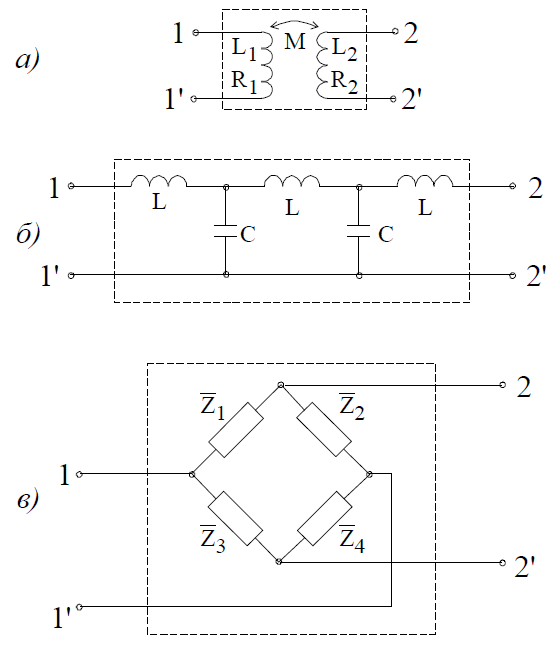
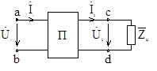

# Лекция №11. Общие свойства четырехполюсников
Электротехническое устройство, служащее для передачи энергии (сигналов) и имеющие по два входных и выходных зажима, называется `четырехполюсником`.  
Если внутри четырехполюсника нет источников энергии или они взаимно компенсируют друг друга, то такой четырехполюсник называют `пассивным` (рис. 8-1: а - идеальный трансформатор; б - частотный фильтр; в - мостовая схема).

<p align="center" > </p>
<p align="center" >Рисунок 8 - 1</p> 

Рассмотрим свойства четырехполюсников в установившемся режиме при периодических синусоидальных токах и напряжениях. Это позволит в дальнейшем применить полученные результаты для анализа цепей при других формах сигналов.  

Для анализа свойств четырехполюсника установим зависимость между входным напряжением $\dot{U}_1$ и токами

$\dot{I}_1$ и входными
$\dot{U}_2$ и
$\dot{I}_2$ (рис. 8-2, где П - пассивная схема).

 
<p align="center" > </p>
<p align="center" >Рисунок 8 - 2</p>

При выборе направлений напряжений и токов, указанных на рисунке, энергия передается от входа (клемма a-b) к сопротивлению нагрузки $Z_H$
  (клеммы c-d).  
Составим уравнение цепи методом контурных токов. В первый контур включим входные зажимы, во второй контур включим сопротивление нагрузки $\overline{Z}_H$.

```math
\overline{Z}_H \dot{I}_1 + \overline{Z}_{12} \dot{I}_2 + \overline{Z}_{13} \dot{I}_3 + ... + \overline{Z}_{1n} \dot{I}_n = \dot{U}_1
```
```math
\overline{Z}_{21} \dot{I}_1 + \overline{Z}_{22} \dot{I}_2 + \overline{Z}_{23} \dot{I}_3 + ... + \overline{Z}_{2n} \dot{I}_n = 0
```
```math
\overline{Z}_{n1} \dot{I}_1 + \overline{Z}_{n2} \dot{I}_2 + \overline{Z}_{n3} \dot{I}_3 + ... + \overline{Z}_{nn} \dot{I}_n = 0.  
```


Обозначим  $\overline{Z}_2{}_2$ = $\overline{Z'}_1{}_2$ + $\overline{Z}_H$,
где  $\overline{Z}_2{}_2$ - часть сопротивления второго контура, входящая в состав четырехполюсника.  
Учитывая, что $\dot{I}_2$ $\overline{Z}_H$ = $\dot{U}_2$:  
```math
\overline{Z}_{11} \dot{I}_1 + \overline{Z}_{12} \dot{I}_2 + ... + \overline{Z}_{1n} \dot{I}_n = \dot{U}_1
```
```math
\overline{Z}_{21} \dot{I}_1 + \overline{Z}_{22} \dot{I}_2 + ... + \overline{Z}_{2n} \dot{I}_n = - \dot{U}_2
```
```math
\overline{Z}_{n1} \dot{I}_1 + \overline{Z}_{n2} \dot{I}_2 + ... + \overline{Z}_{nn} \dot{I}_n = 0.
```

Все остальные уравнения содержат в правой части нули, что соответствует пассивному четырехполюснику.  
Решение системы уравнений:  
```math
\dot{I}_1 = \frac{\Delta_{11}}{\Delta} \dot{U}_1 - \frac{\Delta_{21}}{\Delta} \dot{U}_2;
``` 
```math
\dot{I}_2 = \frac{\Delta_{12}}{\Delta} \dot{U}_1 - \frac{\Delta_{22}}{\Delta} \dot{U}_2;
```  
Отношения  $\frac{\Delta_{11}}{\Delta}$,  $\frac{\Delta_{12}}{\Delta}$ имеют размерность проводимости.  
Обозначим  
```math
\frac{\Delta_{11}}{\Delta} = \overline{Y}_{11}; \frac{\Delta_{12}}{\Delta} = \overline{Y}_{21}; -\frac{\Delta_{22}}{\Delta} = \overline{Y}_{22}; -\frac{\Delta_{21}}{\Delta} = \overline{Y}_{12}.
```  
тогда уравнения четырехполюсника принимают вид:  
```math
\dot{I}_1 = \overline{Y}_{11} \dot{U}_1 + \overline{Y}_{12} \dot{U}_2;
```
```math
\dot{I}_2 = \overline{Y}_{21} \dot{U}_1 + \overline{Y}_{22} \dot{U}_2.
```    
 
В матричной форме:  
```math
\begin{bmatrix}
\overline{Y}_{11} & \overline{Y}_{12}\\
\overline{Y}_{21} & \overline{Y}_{22}
\end{bmatrix}.
\begin{bmatrix}
\dot{U}_1\\
\dot{U}_2
\end{bmatrix} =
\begin{bmatrix}
\dot{I}_1\\
\dot{I}_2
\end{bmatrix},
``` 
или  
 $\mathbf{\overline{Y} \dot{U} = \dot{I}}$.  
Для линейных уравнений, соответствующих линейным цепям $\Delta_{12} = \Delta_{21}$
 , поэтому  $Y_{12} = - Y_{21}$.  
Указанные коэффициенты называются Y-параметрами, а матрица Y-матрицей четырехполюсника. Как видно из записи уравнений четырехполюсников в Y-параметрах с учетом уравнения  $Y_{12} = - Y_{21}$
, пассивный четырехполюсник характеризуется тремя независимыми параметрами. Физический смысл Y-параметров можно определить по режимам короткого замыкания на выходе $(U_2 = 0)$
  и на входе $(U_1 = 0)$.
```math
Y_{11} = (\frac{\dot{I}_1}{\dot{U}_1})_{\dot{U}_2 = 0} - \text{входная проводимость при коротком замыкании на выходе}.  
```  
```math
Y_{12} = (\frac{I_1}{U_2})_{\dot{U}_1 = 0} - \text{передаточная (взаимная) проводимость при коротком замыкании на входе}.  
```  
```math
Y_{21} = (\frac{I_2}{U_1})_{\dot{U}_2 = 0} - \text{передаточная проводимость при коротком замыкании на выходе}.
```  
```math
Y_{22} = (\frac{I_2}{U_2})_{U_1 = 0} - \text{выходная проводимость при коротком замыкании на входе}.
```  
Решим систему уравнений относительно напряжений:  
 ```math
\mathbf{\dot{U} = \overline{Y}^{-1} \dot{I} = \overline{Z} \dot{I}},
```
где

```math
\mathbf{\overline{Z}} =
\begin{bmatrix}
\overline{Z}_{11} & \overline{Z}_{12}\\
\overline{Z}_{21} & \overline{Z}_{22}
\end{bmatrix}=  
\frac{1}{\overline{Y}_{11} \overline{Y}_{22} - \overline{Y}_{12} \overline{Y}_{21}}
\begin{bmatrix}
\overline{Y}_{22} & -\overline{Y}_{12}\\
-\overline{Y}_{21} & \overline{Y}_{11}
\end{bmatrix}
```

Или в развернутом виде  
```math
\mathbf{\dot{U}_1 = \overline{Z}_{11} \dot{I}_1 + \overline{Z}_{12} \dot{I}_2}
\mathbf{\dot{U}_2 = \overline{Z}_{21} \dot{I}_1 + \overline{Z}_{22} \dot{I}_2}
```

 
Два из четырех параметров связаны между собой:  
```math
\mathbf{\overline{Z}_{12} = -\overline{Z}_{21}}
```

Физический смысл Z-параметров четырехполюсника можно определить по режимам холостого хода на выходе ($\dot{I}_2 = 0$) и на входе ($\dot{I}_1 = 0$).
```math
\overline{Z}_{11} = (\frac{E_1}{I_1})_{\dot{I}_2 = 0} - \text{входное сопротивление в режиме холостого хода на выходе}.
```
```math
\overline{Z}_{12} = (\frac{E_1}{I_2})_{\dot{I}_1 = 0} - \text{передаточное (взаимное) сопротивление в режиме холостого хода на входе}.
```
 ```math
\overline{Z}_{21} = (\frac{E_2}{I_1})_{\dot{I}_2 = 0} - \text{передаточное сопротивление в режиме холостого хода на выходе}.
```
```math
\overline{Z}_{22} = (\frac{E_2}{I_2})_{\dot{I}_1 = 0} - \text{выходное сопротивление зажимов 22’ в режиме холостого хода на входе}.
``` 
Во многих практических случаях удобно когда система уравнений решена относительно выходных напряжений и тока:  
```math
\dot{U}_1 = A \dot{U}_2 + B \dot{I}_2
```
```math  
\dot{I}_1 = C \dot{U}_2 + D \dot{I}_2
``` 
 

 
Параметры A, B, C, D в общем случае комплексные. Их можно выразить, например, через Z-параметры.  
Решая второе уравнение Z-параметров относительно тока $\dot{I}_2$, получим:  
```math
\dot{I}_1 = \frac{1}{\overline{Z}_{21}} \dot{U}_2 - \frac{\overline{Z}_{22}}{\overline{Z}_{21}} \dot{I}_2;
```  

Сопоставив со вторым уравнением в A-параметрах, получаем:  
```math
C = \frac{1}{\overline{Z}_{21}}; D = \frac{\overline{Z}_{22}}{\overline{Z}_{21}}
```
  
 Подставим $\dot{I}_1$ в первое уравнение в Z-параметрах:  
 ```math
\dot{U}_1 = \overline{Z}_{11} \dot{I}_1 + \overline{Z}_{12} \dot{I}_2 = \frac{\overline{Z}_{11}}{\overline{Z}_{21}}\dot{U}_2 - \frac{\overline{Z}_{11} \overline{Z}_{22} - \overline{Z}_{21} \overline{Z}_{12}}{\overline{Z}_{21}} \dot{I}_2
```  

Таким образом  
```math
A = \frac{\overline{Z}_{11}}{\overline{Z}_{21}}; B = \frac{\overline{Z}_{21} \overline{Z}_{12} - \overline{Z}_{11} \overline{Z}_{22}}{\overline{Z}_{21}}
```

Нетрудно убедиться, что AD-BC=1.  
Физический смысл А-параметров:  
```math
A = (\frac{U_1}{U_2})_{I_2 = 0} - \text{передаточное отношение напряжений в режиме холостого хода на выходе}.
```
```math
B = (\frac{U_1}{I_2})_{\dot{U}_2 = 0} - \text{передаточное сопротивление при коротком замыкании на выходе}.
```
```math
C = (\frac{I_1}{U_2})_{\dot{I}_2 = 0} - \text{передаточная проводимость в режиме холостого хода на выходе}.
```
```math
D = (\frac{I_1}{I_2})_{\dot{U}_2 = 0} - \text{передаточное отношение токов при коротком замыкании на выходе}.
```
При обратном питании с учетом изменения знаков токов получим:  
```math
\begin{cases}
\dot{U}_2 = D \dot{U}_1 + B \dot{I}_1\\
\dot{I}_2 = C \dot{U}_1 + A \dot{I}_1
\end{cases}
```
При этом сохраняется соотношение
AD-BC=1  
Для формирования уравнений при смешанном соединении четырехполюсников применяются еще два уравнения в H-параметрах и G-параметрах:  
```math
\begin{cases}
\dot{U}_1 = H_{11} \dot{I}_1 +  H_{12} \dot{U}_2\\
\dot{I}_2 =  H_{21} \dot{I}_1 +  H_{22} \dot{U}_2
\end{cases}
```  
```math
  H_{12} = H_{21}
```
```math
\begin{cases}
\dot{I}_1 = G_{11} \dot{U}_1 +  G_{12} \dot{I}_2\\
\dot{U}_2 =  G_{21} \dot{U}_1 +  G_{22} \dot{I}_2
\end{cases}
``` 
```math
  G_{12} = G_{21}
```

 
 
 
Физический смысл предлагаем установить читателю.
