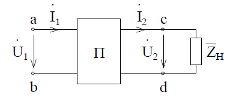

# Лекция №11. Общие свойства четырехполюсников
§ 1. Уравнения четырехполюсников  
Электротехническое устройство, служащее для передачи энергии (сигналов) и имеющие по два входных и выходных зажима, называется `четырехполюсником`.  
Если внутри четырехполюсника нет источников энергии или они взаимно компенсируют друг друга, то такой четырехполюсник называют `пассивным` (рис. 8-1: а - идеальный трансформатор; б - частотный фильтр; в - мостовая схема).

 

Рисунок 8 - 1
 
Рассмотрим свойства четырехполюсников в установившемся режиме при периодических синусоидальных токах и напряжениях. Это позволит в дальнейшем применить полученные результаты для анализа цепей при других формах сигналов.
Для анализа свойств четырехполюсника установим зависимость между входным напряжением   и токами   и входными   и   (рис. 8-2, где П - пассивная схема).
 

 

Рисунок 8 - 2

При выборе направлений напряжений и токов, указанных на рисунке, энергия передается от входа (клемма a-b) к сопротивлению нагрузки   (клеммы c-d).
Составим уравнение цепи методом контурных токов. В первый контур включим входные зажимы, во второй контур включим сопротивление нагрузки  .
 
 

 .
Обозначим  ,
где   - часть сопротивления второго контура, входящая в состав четырехполюсника.
Учитывая, что  :
 
 

 .
Все остальные уравнения содержат в правой части нули, что соответствует пассивному четырехполюснику.
Решение системы уравнений:
 ;
 .
Отношения  ,   имеют размерность проводимости.
Обозначим
 ;  ;  ;  ,
тогда уравнения четырехполюсника принимают вид:
 ;
 .
В матричной форме:
 ,
или
 .
Для линейных уравнений, соответствующих линейным цепям  , поэтому  .
Указанные коэффициенты называются Y-параметрами, а матрица Y-матрицей четырехполюсника. Как видно из записи уравнений четырехполюсников в Y-параметрах с учетом уравнения  , пассивный четырехполюсник характеризуется тремя независимыми параметрами. Физический смысл Y-параметров можно определить по режимам короткого замыкания на выходе   и на входе  .
  - входная проводимость при коротком замыкании на выходе.
  - передаточная (взаимная) проводимость при коротком замыкании на входе.
  - передаточная проводимость при коротком замыкании на выходе.
  - выходная проводимость при коротком замыкании на входе.
Решим систему уравнений относительно напряжений:
 ,
где
 
Или в развернутом виде
 
 
Два из четырех параметров связаны между собой:
 
Физический смысл Z-параметров четырехполюсника можно определить по режимам холостого хода на выходе ( ) и на входе ( ).
  - входное сопротивление в режиме холостого хода на выходе.
  - передаточное (взаимное) сопротивление в режиме холостого хода на входе.
  - передаточное сопротивление в режиме холостого хода на выходе.
  - выходное сопротивление зажимов 22’ в режиме холостого хода на входе.
Во многих практических случаях удобно когда система уравнений решена относительно выходных напряжений и тока:
 
 
Параметры A, B, C, D в общем случае комплексные. Их можно выразить, например, через Z-параметры.
Решая второе уравнение Z-параметров относительно тока  , получим:
 
Сопоставив со вторым уравнением в A-параметрах, получаем:
 ;  
Подставим   в первое уравнение в Z-параметрах:
 
Таким образом
 ;  
Нетрудно убедиться, что AD-BC=1.
Физический смысл А-параметров:
  - передаточное отношение напряжений в режиме холостого хода на выходе.
  - передаточное сопротивление при коротком замыкании на выходе.
  - передаточная проводимость в режиме холостого хода на выходе.
  - передаточное отношение токов при коротком замыкании на выходе.
При обратном питании с учетом изменения знаков токов получим:
 
При этом сохраняется соотношение
AD-BC=1
Для формирования уравнений при смешанном соединении четырехполюсников применяются еще два уравнения в H-параметрах и G-параметрах:
 
 
 
 
Физический смысл предлагаем установить читателю.
