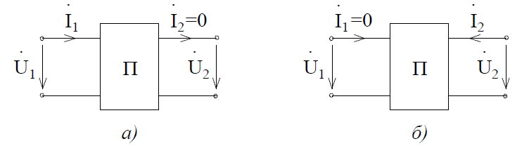
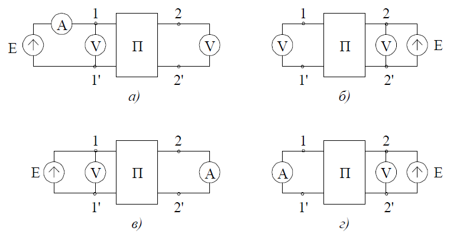

# Тема №12. Эквивалентные схемы четырехполюсника  
Поскольку любая система уравнений, описывающая пассивный четырехполюсник, имеет три независимых параметра, то всякий четырехполюсник можно свести к любой из трех эквивалентных схем: Т-образной (рис. 8-3,а); П-образной (рис. 8-3,б); Х-образной (рис. 8-3,в), содержащих также три параметра: $\overline{Z}_1 ; \overline{Z}_2 ; \overline{Z}_3$.

<p align="center" > </p>
<p align="center" >Рис. 8-3</p> 

Заметим, что переход от П-образной схемы к Т-образной осуществляется как переход от треугольника к звезде. Например:

```math
\overline{Z}^T_1 = \frac{\overline{Z}^n_1 \overline{Z}^n_3}{\overline{Z}^n_1 + \overline{Z}^n_2 + \overline{Z}^n_3}
```
Выразим элементы эквивалентных схем через параметры четырехполюсника. Например, для Т-образной схемы непосредственно из уравнений Кирхгофа следует
```math
\dot{U}_1 = \dot{I}_1 \overline{Z}_1 + (\dot{I}_1 - \dot{I}_2) \overline{Z}_3
```
```math
\dot{U}_2 = -\dot{I}_2 \overline{Z}_2 + (\dot{I}_1 - \dot{I}_2) \overline{Z}_3,
```
где
```math
\dot{I}_1 - \dot{I}_2 = \dot{I}_3
```
или
```math
\dot{U}_1 = (\overline{Z}_1 + \overline{Z}_3)\dot{I}_1 - \overline{Z}_3\dot{I}_2
```
```math
\dot{U}_2 = \overline{Z}_3\dot{I}_1 - (\overline{Z}_2 + \overline{Z}_3)\dot{I}_2
```
Сравнивая полученные уравнения в Z-параметрах для Т-образной эквивалентной схемы, получим
```math
\overline{Z}_{11} = \overline{Z}_1 + \overline{Z}_3; \overline{Z}_{12} = \overline{Z}_3 = - \overline{Z}_{21}; \overline{Z}_{22} = -(\overline{Z}_2 + \overline{Z}_3)
```
Используя уравнения связи между А-параметрами и Z-параметрами четырехполюсника, выразим А-параметры эквивалентной Т-образной схемы:
```math
A = \frac{\overline{Z}_{11}}{\overline{Z}_{21}}; B = -\frac{\overline{Z}_{11}\overline{Z}_{22}-\overline{Z}_{12}(-\overline{Z}_{21})}{\overline{Z}_{21}}; C = \frac{1}{\overline{Z}_{21}}; D = -\frac{\overline{Z}_{22}}{\overline{Z}_{21}}
```
Откуда
```math
A = \frac{\overline{Z}_1+\overline{Z}_3}{\overline{Z}_3} = 1 + \frac{\overline{Z}_1}{\overline{Z}_3}; B = \frac{\overline{Z}_1\overline{Z}_2 +\overline{Z}_2\overline{Z}_3 + \overline{Z}_3\overline{Z}_1}{\overline{Z}_3};
C = \frac{1}{\overline{Z}_3}; D = \frac{\overline{Z}_2+\overline{Z}_3}{\overline{Z}_3}
```
При решении обратной задачи, т.е. по заданным А-параметрам определить сопротивления Т-образной схемы, воспользуемся следующими формулами:
```math
\overline{Z}_3 = \frac{1}{C}; \overline{Z}_1 = \frac{A-1}{C}; \overline{Z}_2 = \frac{D-1}{C}
```
Для П-образной схемы справедливы соотношения:
```math
\overline{Z}_3 = B; \overline{Z}_1 = \frac{B}{D-1}; \overline{Z}_2 = \frac{B}{A-1}; A = 1 + \frac{\overline{Z}_3}{\overline{Z}_2}; B = \overline{Z}_3; C = \frac{\overline{Z}_1+\overline{Z}_2+\overline{Z}_3}{\overline{Z}_1\overline{Z}_2}; D = 1 + \frac{\overline{Z}_3}{\overline{Z}_1}
```

## Экспериментальное определение параметров четырехполюсника
Поскольку все параметры четырехполюсника связаны между собой, то достаточно для каждого четырехполюсника найти одну из систем параметров. Существует два способа определения параметров: расчетный, использующий схему электрической цепи и экспериментальный, рассматривающий четырехполюсник как «черный ящик» с четырьмя выводами. В первом случае не существует принципиальных различий между анализом свойств четырехполюсника на постоянном и переменном токе. Однако при экспериментальном определении параметров такие различия отмечаются.
Поскольку в каждой системе параметров только три независимых параметра, необходимо составить три уравнения для их вычисления. С этой целью используют эксперименты в режимах холостого хода (ХХ) и короткого замыкания (КЗ).
В режиме холостого хода (рис. 8-4,а) на выходе

<p align="center" > </p>
<p align="center" >Рис. 8-4</p>

ток равен нулю $\dot{I}_2{}_X{}_X = 0$.  
При обратном питании в режиме холостого хода на входе четырехполюсника $\dot{I}_1{}_X{}_X = 0$.
При коротком замыкании на выходе или входе соответственно напряжения равны нулю $\dot{U}_2{}_К{}_З = 0$ ;  $\dot{U}_1{}_К{}_З = 0$  (рис. 8-5, а - режим короткого замыкания на входе, б - то же на выходе).

<p align="center" > </p>
<p align="center" >Рис. 8-5</p>

Указанные опыты представляют частные случаи состояния четырехполюсника, которые не нарушают справедливости уравнений четырехполюсника. Этот факт позволяет достаточно просто определить параметры четырехполюсника.
Запишем уравнения в А-параметрах:
```math
\dot{U}_1 = A\dot{U}_2 + B\dot{I}_2
```
```math
\dot{I}_1 = C\dot{U}_2 + D\dot{I}_2
```
В режиме короткого замыкания на выходе четырехполюсника напряжения $U_2 = 0$ , тогда
```math
U_1 = BI_2; 
```
```math
I_1 = DI_2.
```
Откуда
```math
B = \frac{\dot{U}_1}{I_{2КЗ}}, D = \frac{\dot{I}_{1КЗ}}{I_{2КЗ}}
```
В режиме холостого хода на выходе четырехполюсника ток $\dot{I}_2 = 0$, тогда уравнения принимают вид:
```math
\dot{U}_1 = A\dot{U}_2,
```
```math
\dot{I}_1 = C\dot{U}_2,
```
откуда
```math
A = \frac{\dot{U}_1}{\dot{U}_{2XX}}; C = \frac{\dot{I}_{1XX}}{\dot{U}_{2XX}}
```
Любой из А-параметров четырехполюсника можно вычислить по трем другим из соотношения AD - BC = I .
Аналогично, проводя три эксперимента в режимах холостого хода и короткого замыкания можно определить параметры Z, Y или Н. При этом необходимо помнить, что для линейных цепей $\dot{U}_1$ - в режиме холостого хода и $\dot{I}_2$ - в режиме короткого замыкания выбираются произвольными по величине, которая определяется мощностью рассеяния элементов. Однако, чтобы не допустить повреждений элементов и не нарушить линейный режим, в режиме холостого хода $\dot{U}_1$ выбирают таким, чтобы ${U}_2{}_X{}_X = {U}_2{}_N$ , т.е. номинальному напряжению; в режиме короткого замыкания $\dot{U}_1{}_К{}_З$  выбирают таким, чтобы ${U}_I{}_К{}_З = {I}_2{}_N$ , т.е. номинальному току. Под номинальными значениями тока или напряжения понимают такие величины, на которые рассчитано устройство, представленное в виде четырехполюсника. Например, для трансформатора  - это напряжение сети, в которую он включается, и номинальный ток нагрузки.
Пример:
Определить Z-параметры четырехполюсника, представленного на
рис. 8-6. в режимах холостого хода на выходе (а) и входе (б)

<p align="center" > </p>
<p align="center" >Рис. 8-6</p

Запишем систему уравнений
```math
\begin{rcases*}
\dot{U}_1 = \overline{Z}_{11}\dot{I}_1 + \overline{Z}_{12}\dot{I}_2 \\
\dot{U}_2 = \overline{Z}_{21}\dot{I}_1 + \overline{Z}_{22}\dot{I}_2
\end{rcases*} 
```
Учитывая, что  $\dot{I}_2{}_X{}_X = 0$, имеем
```math
\overline{Z}_{11} = \frac{\dot{U}_1}{I_{1XX}}; \overline{Z}_{21} = \frac{U_{2XX}}{I_{1XX}}
```
Вычислим ток  $\dot{I}_1$, предполагая, что на входе схем действует напряжение $\dot{U}_1$:
```math
\dot{I}_1 = \frac{\dot{U}_1}{R_1 + \frac{-j\frac{1}{\omega C}(R_2 + j\omega L)}{R_2 + j\omega L-j\frac{1}{\omega C}}},
```
откуда
```math
\overline{Z}_{11} = R_1 + \frac{-j\frac{1}{\omega C}(R_2 + j\omega L)}{R_2 + j\omega L-j\frac{1}{\omega C}}
```
$\overline{Z}_{21}$ определяем из выражения для $U_2$, считая что на входе протекает ток $\dot{I}_1$  
```math
\dot{U}_2 = I_1 \frac{-j\frac{1}{\omega C}(R_2 + j\omega L)}{R_2 + j\omega L-j\frac{1}{\omega C}} \cdot \frac{R_2}{(R_2+j\omega L)} = \frac{-j\frac{R_2}{\omega C}\dot{I}_1}{R_2 + j(\omega L - \frac{1}{\omega C})},
```
откуда
```math
\overline{Z}_{21} = -\overline{Z}_{12} = -\frac{\frac{jR_2}{\omega C}}{R_2 + j(\omega L - \frac{1}{\omega C})}.
```
Для нахождения $\overline{Z}_2{}_2$ проведем расчет в режиме холостого хода на входе (рис. 8-6,б) и из второго уравнения имеем, полагая $\dot{I}_1{}_X{}_X = 0$:
```math
\overline{Z}_{22} = \frac{\dot{U}_2}{\dot{I}_{2XX}}
```
Если к выходу четырехполюсника приложено напряжение $\dot{U}_2$, ток определяется выражением
```math
\dot{I}_2 = \frac{\dot{U}_2}{\frac{R_2(j\omega L - j\frac{1}{\omega C})}{R_2 + j(\omega L - \frac{1}{\omega C})}},
```
откуда
```math
\overline{Z}_{22} = \frac{jR_2(\omega L - \frac{1}{\omega C})}{R_2 + j(\omega L - \frac{1}{\omega C})}.
```
Таким образом, принимая во внимание $\overline{Z}_2{}_1 = -\overline{Z}_1{}_2$, определили все Z-параметры четырехполюсника.
Для экспериментального определения параметров четырехполюсника используются: амперметр, вольтметр, омметр, ваттметр или фазометр.
Рассмотрим сначала определение параметров четырехполюсника в режиме холостого хода на выходе и входе представлена на рис. 8-7,а,б.

<p align="center" > </p>
<p align="center" >Рис. 8-7</p

При проведении экспериментов на постоянном токе достаточно измерить напряжение и ток.
В случае синусоидального возмущающего воздействия (на переменном токе), используя амперметр и вольтметр, можно найти только действующие значения. Для установления разности фаз между различными комплексами применяют фазометр или ваттметр.
Фазометры имеют общую точку между входом и выходом. Поэтому при их присоединении к четырехполюснику надо соблюдать правила регулярности (см. ниже).
Включить фазометр между входом и выходом, не нарушая структуры четырехполюсника, не всегда возможно. Поэтому, при экспериментальном определении параметров, исходной информацией являются входные сопротивления четырехполюсника, измеренные при холостом ходе и коротком замыкании на входе и выходе:
```math
\overline{Z}_{1X} = \frac{\dot{U}_{1X}}{\dot{I}_{1X}}; \overline{Z}_{1X} = \overline{Z}_{1X} e^{j\varphi_{1X}}; \varphi_{1X} = \arccos{\frac{P_{1X}}{U_{1X}I_{1X}}};
```
```math
\overline{Z}_{1K} = \frac{\dot{U}_{1K}}{\dot{I}_{1K}}; \overline{Z}_{1K} = \overline{Z}_{1K} e^{j\varphi_{K}}; \varphi_{1K} = \arccos{\frac{P_{1K}}{U_{1K}I_{1K}}};
```
```math
\overline{Z}_{2X} = \frac{\dot{U}_{2X}}{\dot{I}_{2X}}; \overline{Z}_{2X} = \overline{Z}_{2X} e^{j\varphi_{2X}}; \varphi_{2X} = \arccos{\frac{P_{2X}}{U_{2X}I_{2X}}};
```
```math
\overline{Z}_{2K} = \frac{\dot{U}_{2K}}{\dot{I}_{2K}}; \overline{Z}_{2K} = \overline{Z}_{2K} e^{j\varphi_{2K}}; \varphi_{2K} = \arccos{\frac{P_{2K}}{U_{2K}I_{2K}}};
```
Знаки фаз устанавливают по схеме или из результатов измерений. Запишем систему уравнений в А-параметрах:
```math
\begin{rcases*}
\dot{U}_1 = A\dot{U}_2 + B I_2 \\
\dot{I}_1 = C\dot{U}_2 + D\dot{I}_2
\end{rcases*} 
```
Из указанной системы найдем выражения для входного и выходного сопротивления в режимах холостого хода и короткого \c This замыкания через А-параметры
```math
\overline{Z}_{1XX} = \frac{A}{C}; \overline{Z}_{2XX} = \frac{D}{C}
```
```math
\overline{Z}_{1КЗ} = \frac{B}{D}; \overline{Z}_{2КЗ} = \frac{B}{A}.
```
Или
```math
\frac{\overline{Z}_{1XX}}{\overline{Z}_{2XX}} = \frac{\overline{Z}_{1КЗ}}{\overline{Z}_{2КЗ}}
```
Для определения параметра А запишем тождество
```math
\frac{\overline{Z}_{1X}}{\overline{Z}_{2X} - \overline{Z}_{2K}} = \frac{A}{C(\frac{D}{C} - \frac{B}{A})} = \frac{A^2 C}{C(AD-BC)} = A^2
```
откуда
```math
A = \sqrt{\frac{\overline{Z}_{1X}}{\overline{Z}_{2X} - \overline{Z}_{2K}}}
```
После соответствующих математических преобразований получаем
```math
B = A\overline{Z}_{2K}; D = C\overline{Z}_{2K}; C = \frac{A}{\overline{Z}_{1X}}
```
Аналогичным образом, используя амперметр, вольтметр и ваттметр, можно определить другие параметры четырехполюсника. Если, например, известны показания приборов:
```math
\begin{equation}
\begin{split}
& U_{1X} = 100 В, P_{1K} = 0,5 кВт \\
& I_{1X} = 20 А, U_{2K} = 56,6 В, \\
& P_{1X} = 2 кВт, I_{2K} = 8 А, \\
& U_{1K} = 70,7 В, \varphi_{1K}>0, \varphi_{2K}<0, \\
& I_{1K} = 10 А, P_{2K} = 320 кВт,
\end{split} 
\end{equation} 
```
то можно определить
```math
\begin{equation}
\begin{split}
& \overline{Z}_{1X} = \frac{U_{1X}}{I_{1X}} = 5 Ом; \cos{\varphi_{1X}} = \frac{2000}{100 \cdot 20} = 1; \varphi_{1X} = 0; \overline{Z}_{1X} = 50e^{jo}; \
& \overline{Z}_{1K} = \frac{U_{1K}}{I_{1K}} = \frac{70,7}{10} = 7,07 Ом;  \cos{\varphi_{1K}} = \frac{P_{1K}}{U_{1K} \cdot I_{1K}} = \frac{500}{707} = 0,707; \
& \varphi_{1K} = \frac{\pi}{4}; \overline{Z}_{1K} = 5 \sqrt{2} e^{j\frac{\pi}{4}} Ом; \
& \overline{Z}_{2K} = \frac{U_{2K}}{I_{2K}} = \frac{56,6}{8} = 7,07 Ом; \cos{\varphi_{2K}} = \frac{320}{56,6 \cdot 8} = 0,707; \
& \varphi_{2K} = -\frac{\pi}{4}; \overline{Z}_{2K} = 5 \sqrt{2} e^{-j\frac{\pi}{4}} Ом; \
& \frac{\overline{Z}_{1X}}{\overline{Z}_{2X}} = \frac{\overline{Z}_{1K}}{\overline{Z}_{2K}}; \overline{Z}_{2X} = \frac{\overline{Z}_{1X} \cdot \overline{Z}_{2X}}{\overline{Z}_{1K}};
\end{split} 
\end{equation}
```
```math
\overline{Z}_{2X} = \frac{5 \cdot 5 \sqrt{2} e^{-j\frac{\pi}{4}}}{5 \sqrt{2} e^{-j\frac{\pi}{4}}} = 5 e^{-j\frac{\pi}{2}}
```
откуда
```math
\begin{equation}
\begin{split}
& A = \sqrt{\frac{\overline{Z}_{1X}}{\overline{Z}_{2X} - \overline{Z}_{2K}}} = \sqrt{\frac{5}{-j5-5\sqrt{2}e^{-j\frac{\pi}{4}}}} = \sqrt{\frac{1}{-j-1+j}} = j \
& B = (5 -5j)j = (5+5j) Ом; C = \frac{A}{\overline{Z}_{1X}} = \frac{j}{5} = 0,2j Ом^{-1}; \
& D = C\overline{Z}_{2X} = 0,2j(-5j) = 1.
\end{split} 
\end{equation}
```
Вспомнив, что для Т-образной эквивалентной схемы:
```math
\overline{Z}_1 = \frac{A-1}{C}; \overline{Z}_2 = \frac{D-1}{C}; \overline{Z}_3 = \frac{1}{C}
```
получим:
```math
\overline{Z}_3 = -5j; \overline{Z}_1 = 5+5j; \overline{Z}_2 = 0
```
Такой четырехполюсник изображен на рис. 8-8.

<p align="center" > </p>
<p align="center" >Рис. 8-8</p
