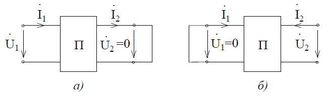

# Лекция №12. Эквивалентные схемы четырехполюсника  
Поскольку любая система уравнений, описывающая пассивный четырехполюсник, имеет три независимых параметра, то всякий четырехполюсник можно свести к любой из трех эквивалентных схем: Т-образной (рис. 8-3,а); П-образной (рис. 8-3,б); Х-образной (рис. 8-3,в), содержащих также три параметра: $\overline{Z}_1 ; \overline{Z}_2 ; \overline{Z}_3$.

<p align="center" > </p>
<p align="center" >Рис. 8-3</p> 

Заметим, что переход от П-образной схемы к Т-образной осуществляется как переход от треугольника к звезде. Например:

```math
\overline{Z}^T_1 = \frac{\overline{Z}^n_1 \overline{Z}^n_3}{\overline{Z}^n_1 + \overline{Z}^n_2 + \overline{Z}^n_3}
```
Выразим элементы эквивалентных схем через параметры четырехполюсника. Например, для Т-образной схемы непосредственно из уравнений Кирхгофа следует
```math
\dot{U}_1 = \dot{I}_1 \overline{Z}_1 + (\dot{I}_1 - \dot{I}_2) \overline{Z}_3
```
```math
\dot{U}_2 = -\dot{I}_2 \overline{Z}_2 + (\dot{I}_1 - \dot{I}_2) \overline{Z}_3,
```
где
```math
\dot{I}_1 - \dot{I}_2 = \dot{I}_3
```
или
```math
\dot{U}_1 = (\overline{Z}_1 + \overline{Z}_3)\dot{I}_1 - \overline{Z}_3\dot{I}_2
```
```math
\dot{U}_2 = \overline{Z}_3\dot{I}_1 - (\overline{Z}_2 + \overline{Z}_3)\dot{I}_2
```
Сравнивая полученные уравнения в Z-параметрах для Т-образной эквивалентной схемы, получим
```math
\overline{Z}_{11} = \overline{Z}_1 + \overline{Z}_3; \overline{Z}_{12} = \overline{Z}_3 = - \overline{Z}_{21}; \overline{Z}_{22} = -(\overline{Z}_2 + \overline{Z}_3)
```
Используя уравнения связи между А-параметрами и Z-параметрами четырехполюсника, выразим А-параметры эквивалентной Т-образной схемы:
```math
A = \frac{\overline{Z}_{11}}{\overline{Z}_{21}}; B = -\frac{\overline{Z}_{11}\overline{Z}_{22}-\overline{Z}_{12}(-\overline{Z}_{21})}{\overline{Z}_{21}}; C = \frac{1}{\overline{Z}_{21}}; D = -\frac{\overline{Z}_{22}}{\overline{Z}_{21}}
```
Откуда
```math
A = \frac{\overline{Z}_1+\overline{Z}_3}{\overline{Z}_3} = 1 + \frac{\overline{Z}_1}{\overline{Z}_3}; B = \frac{\overline{Z}_1\overline{Z}_2 +\overline{Z}_2\overline{Z}_3 + \overline{Z}_3\overline{Z}_1}{\overline{Z}_3};
C = \frac{1}{\overline{Z}_3}; D = \frac{\overline{Z}_2+\overline{Z}_3}{\overline{Z}_3}
```
При решении обратной задачи, т.е. по заданным А-параметрам определить сопротивления Т-образной схемы, воспользуемся следующими формулами:
```math
\overline{Z}_3 = \frac{1}{C}; \overline{Z}_1 = \frac{A-1}{C}; \overline{Z}_2 = \frac{D-1}{C}
```
Для П-образной схемы справедливы соотношения:
```math
\overline{Z}_3 = B; \overline{Z}_1 = \frac{B}{D-1}; \overline{Z}_2 = \frac{B}{A-1}; A = 1 + \frac{\overline{Z}_3}{\overline{Z}_2}; B = \overline{Z}_3; C = \frac{\overline{Z}_1+\overline{Z}_2+\overline{Z}_3}{\overline{Z}_1\overline{Z}_2}; D = 1 + \frac{\overline{Z}_3}{\overline{Z}_1}
```

## Экспериментальное определение параметров четырехполюсника
Поскольку все параметры четырехполюсника связаны между собой, то достаточно для каждого четырехполюсника найти одну из систем параметров. Существует два способа определения параметров: расчетный, использующий схему электрической цепи и экспериментальный, рассматривающий четырехполюсник как «черный ящик» с четырьмя выводами. В первом случае не существует принципиальных различий между анализом свойств четырехполюсника на постоянном и переменном токе. Однако при экспериментальном определении параметров такие различия отмечаются.
Поскольку в каждой системе параметров только три независимых параметра, необходимо составить три уравнения для их вычисления. С этой целью используют эксперименты в режимах холостого хода (ХХ) и короткого замыкания (КЗ).
В режиме холостого хода (рис. 8-4,а) на выходе

<p align="center" > </p>
<p align="center" >Рис. 8-4</p>

ток равен нулю $\dot{I}_2{}_X{}_X = 0$.  
При обратном питании в режиме холостого хода на входе четырехполюсника $\dot{I}_1{}_X{}_X = 0$.
При коротком замыкании на выходе или входе соответственно напряжения равны нулю $\dot{U}_2{}_К{}_З = 0$ ;  $\dot{U}_1{}_К{}_З = 0$  (рис. 8-5, а - режим короткого замыкания на входе, б - то же на выходе).

<p align="center" > </p>
<p align="center" >Рис. 8-5</p>

Указанные опыты представляют частные случаи состояния четырехполюсника, которые не нарушают справедливости уравнений четырехполюсника. Этот факт позволяет достаточно просто определить параметры четырехполюсника.
Запишем уравнения в А-параметрах:
```math
\dot{U}_1 = A\dot{U}_2 + B\dot{I}_2
```
```math
\dot{I}_1 = C\dot{U}_2 + D\dot{I}_2
```
В режиме короткого замыкания на выходе четырехполюсника напряжения $U_2 = 0$ , тогда
```math
U_1 = BI_2; 
```
```math
I_1 = DI_2.
```
Откуда
```math
B = \frac{\dot{U}_1}{I_{2КЗ}}, D = \frac{\dot{I}_{1КЗ}}{I_{2КЗ}}
```
В режиме холостого хода на выходе четырехполюсника ток $\dot{I}_2 = 0$, тогда уравнения принимают вид:
```math
\dot{U}_1 = A\dot{U}_2,
```
```math
\dot{I}_1 = C\dot{U}_2,
```
откуда
```math
A = \frac{\dot{U}_1}{\dot{U}_{2XX}}; C = \frac{\dot{I}_{1XX}}{\dot{U}_{2XX}}
```
Любой из А-параметров четырехполюсника можно вычислить по трем другим из соотношения AD - BC = I .
Аналогично, проводя три эксперимента в режимах холостого хода и короткого замыкания можно определить параметры Z, Y или Н. При этом необходимо помнить, что для линейных цепей $\dot{U}_1$ - в режиме холостого хода и $\dot{I}_2$ - в режиме короткого замыкания выбираются произвольными по величине, которая определяется мощностью рассеяния элементов. Однако, чтобы не допустить повреждений элементов и не нарушить линейный режим, в режиме холостого хода $\dot{U}_1$ выбирают таким, чтобы ${U}_2{}_X{}_X = {U}_2{}_N$ , т.е. номинальному напряжению; в режиме короткого замыкания $\dot{U}_1{}_К{}_З$  выбирают таким, чтобы ${U}_I{}_К{}_З = {I}_2{}_N$ , т.е. номинальному току. Под номинальными значениями тока или напряжения понимают такие величины, на которые рассчитано устройство, представленное в виде четырехполюсника. Например, для трансформатора  - это напряжение сети, в которую он включается, и номинальный ток нагрузки.
Пример:
Определить Z-параметры четырехполюсника, представленного на
рис. 8-6. в режимах холостого хода на выходе (а) и входе (б)

<p align="center" > </p>
<p align="center" >Рис. 8-6</p
