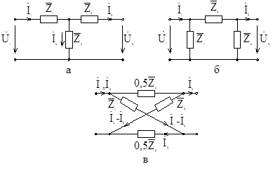

# Лекция №12. Эквивалентные схемы четырехполюсника  
Поскольку любая система уравнений, описывающая пассивный четырехполюсник, имеет три независимых параметра, то всякий четырехполюсник можно свести к любой из трех эквивалентных схем: Т-образной (рис. 8-3,а); П-образной (рис. 8-3,б); Х-образной (рис. 8-3,в), содержащих также три параметра: $\overline{Z}_1 ; \overline{Z}_2 ; \overline{Z}_3$ .

 

Рис. 8-3
 
