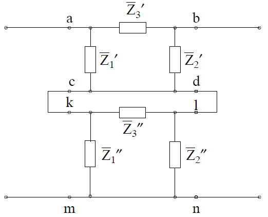
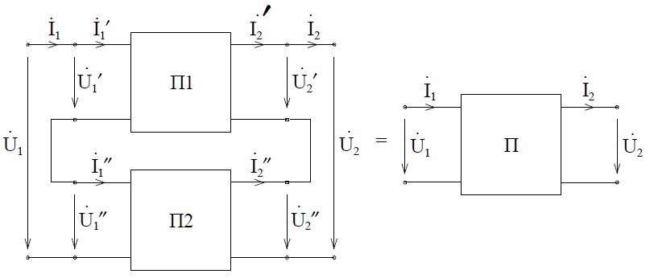

# Лекция №13. Соединения четырехполюсников
Теория четырехполюсников позволяет представить сложную схему в виде комбинаций четырехполюсников и анализировать свойства общей схемы на основе свойств составляющих четырехполюсников.
При соединении четырехполюсников в общую схему иногда нарушаются индивидуальные свойства (регулярность) составляющих четырехполюсника, например на рис. 8-9 сопротивление $\overline{Z}^{``}_3$ четырехполюсника закорачивается при соединении в общую схему, что приводит к изменению его свойств.

<p align="center" > </p>
<p align="center" >Рис. 8-9</p> 

Рассмотрим свойства схем при различных способах соединения четырехполюсников. Задача нахождения четырехполюсника, эквивалентного сложному четырехполюснику, сводится к определению параметров этого эквивалентного четырехполюсника по заданным параметрам соединенных четырехполюсников. Способы соединения четырехполюсников рассмотрим на примерах объединения двух четырехполюсников в один:

1. 	Последовательное соединение двух четырехполюсников (рис. 8-10)

<p align="center" > </p>
<p align="center" >Рис. 8-10</p> 

При таком соединении должны выполняться следующие соотношения (уравнения связи):
```math
\begin{rcases*}
\dot{U}_1 = \dot{U}^`_1 + \dot{U}^{``}_1\\
\dot{U}_2 = \dot{U}^`_2 + \dot{U}^{``}_2
\end{rcases*};
\begin{rcases*}
\dot{I}_1 = \dot{I}^`_1 + \dot{I}^{``}_1\\
\dot{I}_2 = \dot{I}^`_2 + \dot{I}^{``}_2
\end{rcases*}
```
Используем запись уравнений четырехполюсника в Z-параметрах:
для четырехполюсника П1
```math
\begin{equation}
\begin{split}
& \dot{U}^`_1 = \dot{I}^`_1 \overline{Z}^`_{11} + \dot{I}^`_2 \overline{Z}^`_{12} \\
& \dot{U}^`_2 = \dot{I}^`_1 \overline{Z}^`_{21} + \dot{I}^`_2 \overline{Z}^`_{22}
\end{split} 
\end{equation}
```
для четырехполюсника П2
```math
\begin{equation}
\begin{split}
& \dot{U}^{``}_1 = \dot{I}^`_1 \overline{Z}^{``}_{11} + \dot{I}^`_2 \overline{Z}^{``}_{12} \\
& \dot{U}^{``}_2 = \dot{I}^`_1 \overline{Z}^{``}_{21} + \dot{I}^`_2 \overline{Z}^{``}_{22}
\end{split} 
\end{equation}
```
Исключим внутренние переменные $\dot{U}^{\prime}_1;  \dot{U}^{\prime}_2; \dot{U}^{\prime \prime}_1; \dot{U}^{\prime \prime}_2$ в соответствии с уравнениями связи:
```math
\begin{equation}
\begin{split}
& \dot{U}_1 = \dot{I}_1(\overline{Z}^{`}_{11} + \overline{Z}^{``}_{11}) + \dot{I}_2(\overline{Z}^{`}_{12} + \overline{Z}^{``}_{12}) \\
& \dot{U}_1 = \dot{I}_1(\overline{Z}^{`}_{21} + \overline{Z}^{``}_{21}) + \dot{I}_2(\overline{Z}^{`}_{22} + \overline{Z}^{``}_{22})
\end{split} 
\end{equation}
```
Откуда параметры общего четырехполюсника выразятся через параметры составляющих четырехполюсников:
```math
\overline{Z}_{11} = \overline{Z}^{`}_{11} + \overline{Z}^{``}_{11}; \overline{Z}_{12} = \overline{Z}^{`}_{12} + \overline{Z}^{``}_{12}; \overline{Z}_{21} = \overline{Z}^{`}_{21} + \overline{Z}^{``}_{21}; \overline{Z}_{22} = \overline{Z}^{`}_{22} + \overline{Z}^{``}_{22}
```
В матричной форме
```math
\begin{bmatrix}
\dot{U}_1 \\
\dot{U}_2
\end{bmatrix} =
\begin{bmatrix}
\dot{U}^`_1 \\
\dot{U}^`_2
\end{bmatrix} +
\begin{bmatrix}
\dot{U}^{``}_1 \\
\dot{U}^{``}_2
\end{bmatrix} =
\begin{bmatrix}
\overline{Z}^{`}_{11} & \overline{Z}^{`}_{12} \\
\overline{Z}^{`}_{21} & \overline{Z}^{`}_{22}
\end{bmatrix}
\begin{bmatrix}
\dot{I}^`_1 \\
\dot{I}^`_2
\end{bmatrix} +
\begin{bmatrix}
\overline{Z}^{``}_{11} & \overline{Z}^{``}_{12} \\
\overline{Z}^{``}_{21} & \overline{Z}^{``}_{22}
\end{bmatrix}
\begin{bmatrix}
\dot{I}^{``}_1 \\
\dot{I}^{``}_2
\end{bmatrix} =
\begin{bmatrix}
\overline{Z}^{`}_{11} + \overline{Z}^{``}_{11} & \overline{Z}^{`}_{12} + \overline{Z}^{``}_{12} \\
\overline{Z}^{`}_{21} + \overline{Z}^{``}_{21} & \overline{Z}^{`}_{22} + \overline{Z}^{``}_{22}
\end{bmatrix}
\begin{bmatrix}
\dot{I}_1 \\
\dot{I}_2
\end{bmatrix}
```
Или
```math
\dot{U} =
\begin{bmatrix}
\overline{Z}^{`} + \overline{Z}^{``}
\end{bmatrix} \dot{I}
```
Итак, при последовательном соединении двух четырехполюсников матрица Z-параметров эквивалентного четырехполюсника равна сумме матриц Z-параметров отдельных четырехполюсников.
2. 	Параллельное соединение четырехполюсников (рис. 8-11)

<p align="center" > </p>
<p align="center" >Рис. 8-11</p> 

