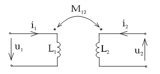

# Лекция №2. Элементы электрических цепей
Для моделирования электрических цепей плодотворными оказалось применение идеальных элементов, обладающих только одним из четырех перечисленных выше свойств. При этом реальные элементы получаются как соединение идеальных элементов с различными свойствами.

## А. Двухполюсные элементы
1. `Идеальный источник ЭДС`
   Схемное изображение и вольт-амперная характеристика приведены на рис. 2-1.
   
<p align="center" > </p>
<p align="center" >Рисунок 2 - 1 а)</p>

<p align="center" > </p>
<p align="center" >Рисунок 2 - 1 б)</p>

Его единственное свойство - генерировать электрическую энергию так, что напряжение на его зажимах не зависит от протекающего через него тока. По смыслу идеализации $R_{BH}=0$. Стрелка в круге показывает направление внутренних сил, т.е. направлена в сторону точки с большим потенциалом. Напряжение с точки зрения потребителя отмечается стрелкой от точки большего потенциала к меньшему: $U= E$.

В схемах часто вместо идеального источника ЭДС просто рисуют стрелку u, как показано на рис. 2-2.

<p align="center" > </p>
<p align="center" >Рисунок 2 - 2 </p>

Если ток через источник протекает согласно с направлением внутренних сил, то $\rho=ui<0$ .

Отрицательная мощность значит то, что источник отдает энергию в остальную часть цепи. Если направление тока таково, что $\rho=ui>0$  , то источник потребляет энергию (например аккумулятор в режиме заряда).
Коротко говоря, свойства идеального источника ЭДС:

Напряжение: $U = E$ - задано,

Ток: $I$ - любой,

Сопротивление: $R_{BH}=0$

2. `Идеальный источник тока`
Изображение на схеме и вольт-амперная характеристика представлены на рис. 2-3.

<p align="center" > </p>
<p align="center" >Рисунок 2 - 3 </p>

Его свойства можно определить:
Напряжение: u - любое,
Ток: $i=J$ - задан.
Сопротивление: $R_{BH}=\infty$ 

Приближенно источник тока можно себе представить как реальный источник с большим напряжением и большим внутренним сопротивлением, подключенный к потребителю с малым сопротивлением.

Так же, как и в случае источника ЭДС, если $\rho=ui<0$ источник отдает энергию; $\rho=ui>0$ источник потребляет энергию.

Подчеркнем еще раз, что параметры идеальных источников в общем случае могут быть функциями времени: $e(t)$; $J(t)$.

Для уяснения возможности потребления энергии источниками полезно рассмотреть две задачи (рис. 2-4, а и б). (Напряжения и токи на схемах постоянны).

<p align="center" > </p>
<p align="center" >Рисунок 2 - 4 а) </p>

<p align="center" > </p>
<p align="center" >Рисунок 2 - 4 б) </p>

Очевидно при таком соединении один из источников генерирует энергию, а другой потребляет. Обозначив направления токов и напряжений в схемах, становится ясно, что для схемы рис. а) в источнике ЭДС $\rho=ui>0$ - потребитель, а в источнике тока $\rho=ui<0$.

В схеме рис. б) - наоборот.

2. `Резистор`(рис. 2-5) элемент, обладающий только свойством рассеивать (потреблять) электрическую энергию.

<p align="center" > </p>
<p align="center" >Рисунок 2 - 5  </p>

Соотношение между током и напряжением определяется законом Ома $u=Ri$, $i=uG$ (математическая модель R).
Направление тока и напряжения всегда совпадают, поэтому мощность всегда положительна (энергия потребляется).

```math
\rho=ui=i^2R=\frac{u^2}{R}=u^2G>0
```

Параметр $R$ - сопротивление [Ом]. Величина обратная $R$ -$G=\frac{1}{R} -проводимость.

Следует иметь ввиду, что таким же прямоугольником часто изображают любой двухполюсник.

4. `Катушка индуктивности` (рис. 2-6) элемент, обладающий только свойством накапливать (и отдавать) энергию магнитного поля.

<p align="center" > </p>
<p align="center" >Рисунок 2 - 6  </p>

Соотношение между током и напряжением на элементе, известное из курса физики:

```math
u_L=L\frac{di}{dt}; i=\frac{1}{L}\int udt=\frac{1}{L}\int^t_0udt+i_L(0).
```

Т.е. напряжение на зажимах элемента возникает только тогда, когда есть изменение тока. Если изменения тока нет (ток постоянный), то напряжение $U_0=0$   (закоротка), а элемент накопил энергию $W=\frac{Li^2}{dt}$. В любой момент времени при $i=0$ запасенная энергия $W=\frac {Li^2}{2}>0$.
Если напряжение и ток совпадают по направлению $\rho=ui>0$,то энергия запасается. В те промежутки времени, когда $\rho=ui<0$ энергия возвращается в цепь.
$L$ - параметр элемента, измеряемый в генри [Гн]. Следует обратить внимание, что элемент инерционен относительно тока, т.е. внезапное, скачкообразное изменение тока через индуктивность невозможно.

```math
i_L(-t_1)=i_L(+t_1)
```

5. `Конденсатором` называют емкостный элемент, который обладает свойством только запасать энергию электрического поля (рис. 2-7)

<p align="center" > </p>
<p align="center" >Рисунок 2 - 7  </p>

Математическая модель:

```math
i_l=C\frac{du_c}{dt}; u_c=\frac{1}{C}\int i_Cdt=\frac{1}{C}\int^t_0i_Cdt+u_c(0)
```
Ток через конденсатор протекает в связи с изменением напряжения на его зажимах. Если изменений напряжения нет: tТок через конденсатор протекает в связи с изменением напряжения на его зажимах. Если изменений напряжения нет: $u=Cons0$, то $i=0$ (разрыв цепи), а элемент накопил энергию $W_E=\frac{Cu^2}{2}$.При изменяющемся напряжении запас энергии $W=\frac{Cu^2}{2}$, а мощность $\rho=\frac{dW}{dt}=uC\frac{du}{dt}=ui$ положительна в те промежутки времени, когда ток и напряжение совпадают по направлению. В это время энергия в конденсаторе накапливается. С - параметр, измеряемый в фарадах [Ф].
На обкладках конденсатора невозможны скачки напряжения, как невозможны в природе внезапные изменения запасной энергии:

```math
u_C=(-t_1)=u_c(+t_1)
```
Некоторые авторы, чтобы подчеркнуть идеальность катушки индуктивности и емкостного накопителя употребляют жаргонные термины по наименованию параметра элемента: индуктивность ($L$) и емкость ($С$), хотя это, строго говоря, неправильно , но допустимо.
Упоминавшиеся ситуации разрыва цепи и закоротку тоже целесообразно определить как элемент цепи.

`Закоротка`: ток любой: напряжение $u=0$ .

`Разрыв`: напряжение любое; ток $i=0$ .

В некоторых случаях в радиоэлектронике применяют элементы, реальных аналогов не имеющих. Их получают как математические абстракции.
Все перечисленные выше элементы - двухполюсники.


## Б. Четырехполюсные элементы
Если напряжения (токи) между двумя узлами зависят не только от тока (напряжения) между этими узлами, а определяются токами и напряжениями на других участках цепи, то математическое описание таких случаев требует введения четырехполюсных элементов.

`1. Взаимная индуктивность`

Четырехполюсным элементом , имеющим реальный прототип является взаимная индуктивность (рис.2-10).

<p align="center" > </p>
<p align="center" >Рисунок 2 - 10 </p>

Реально это две катушки индуктивности $L_1$  и $L_2$  , имеющие полностью или частично общий магнитный поток. Из физики известно, что напряжение на катушке определяется изменением магнитного потока. Следовательно при наличии общего магнитного потока напряжение на каждой индуктивности определится как сумма двух слагаемых:

```math
u_1=L_1\frac{di_1}{dt} \pm M_{12}\frac{di_2}{dt}
```

```math
u_2=L_2\frac{di_2}{dt} \pm M_{21}\frac{di_1}{dt}
```

Одно из них напряжение самоиндукции, а другое напряжение взаимоиндукции.

```math
M_{12}=K\sqrt{L_1L_2} =M_{21} [Гн]
```

$0 < K < 1$- безразмерный коэффициент, показывающий какая часть магнитного потока, является общей.
Знак “+” в уравнении ставится, если при выбранных направлениях тока магнитные потоки складываются. Для того, чтобы на схеме обозначить это обстоятельство на катушках $L_1$  и $L_2$  отмечаются начала обмоток. При этом, если токи в обеих катушках одинаково направлены относительно начал обмоток, то магнитные потоки складываются.

При К=1 (совершенный трансформатор).

```math
u_1=L_1\frac{di_1}{dt} \pm \sqrt{l_1L_2}\frac{di_2}{dt}=\sqrt{L_1}\left(\sqrt{L_1}\frac{di_1}{dt} + \sqrt{L_2}\frac{di_2}{dt}\right)
```

```math
u_2=\pm\sqrt{L_1L_2}\frac{di_1}{dt} + L_2\frac{di_2}{dt}=\sqrt{L_2}\left(\sqrt{L_1}\frac{di_1}{dt} +\sqrt{L_2}\frac{di_2}{dt}\right)
```

Отношение:

