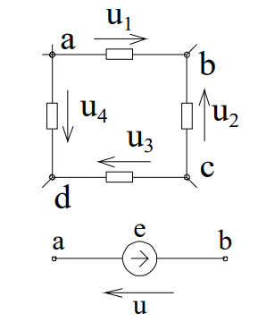
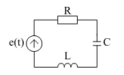
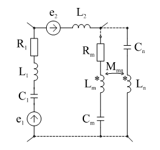

# Тема №3. Закон Ома и правила Кирхгофа

`Закон Ома` устанавливает соотношение между током , протекающим через какой-либо двухполюсник и напряжением на его зажимах. Для идеальных пассивных элементов мы их уже записывали:

```math
u=Ri ;
```


```math
u_L=L\frac{di}{dt};
```

```math
u_C=C\frac{du}{dt};
```

Эти компонентные уравнения являются основанием для выражения соответствующих соотношений в сколь угодно сложных цепях.

`I правило Кирхгофа`

Как следствие непрерывности тока, правило устанавливает, что суммарный ток , втекающий в какой-либо замкнутый объем равен суммарному вытекающему из этого объема тока. В теории цепей под замкнутым объемом понимается узел или отсечение. Чаще всего $I$ правило Кирхгофа формулируют для любого узла: 

```math
\sum_K i_K=0
```

<p align="center" > </p>
<p align="center" >Рисунок 2 - 23 </p>

Для узла, изображенного на рис. 2-23 узловое уравнение запишется:

```math
i_1+J_2+i_3+-i_4-J_5=0.
```

Иногда уравнение записывают, выделяя отдельно источники тока:

```math
i_1+i_3-i_4=J_5-J_2
```

т.е.

```math
\sum_K i_K=\sum_K J_K
```

Важно только соблюдать правило знаков: все истинные направления входящих токов считаются положительными, а выходящие - отрицательными. Можно считать и наоборот. Поскольку часто искомыми являются не только величины, но и направления токов, то последние до получения результатов анализа неизвестны. Практически, как это будет показано ниже, уравнения составляются относительно условных положительных направлений, которые принимаются произвольно, но одинаково во всех уравнениях. Если в результате анализа получатся отрицательные значения токов, то истинное значение будет обратным.

Решим задачу характерную для параллельного соединения резисторов (рис. 2-24) по $I$ правилу Кирхгофа.

<p align="center" > </p>
<p align="center" >Рисунок 2 - 24 </p>

```math
\frac{u}{R_Э}=i=\sum^n_1 i_K=\sum^n_1 i_K=\sum^n_1 \frac{u_K}{R_K}=u\sum^n_1 \frac{1}{R_K};
```

Значит $n$ параллельно соединенных резисторов, с точки зрения остальной цепи, можно заменить одним $R_Э$ в соответствии с соотношением.

```math
G_Э=\sum^n_1 G_K
```

или

```math
\frac{1}{R_Э}=\sum^n_1 \frac{1}{R_K}
```

Для двух резисторов часто применяется это соотношение в виде:

```math
R_Э=\frac{R_1R-2}{R_1+R_2}
```

Если параллельно соединены конденсаторы, то

```math
i_ВХ=\sum^n_1 i=\sum^n_1 C_K\frac{du_K}{dt}= \left\{\sum C_K\right\} \frac{du}{dt};
```

```math
C_Э=\sum^n_1 C_K
```

т.е.

```math
i_{ВХ}=\sum i= \sum \frac{1}{L_K} \int u_Kdt= \sum \frac{1}{L_K} \left\{ \int u_Kdt\right\}
```

получим:

```math
\frac {1}{L_Э}= \sum^n_1 \frac{1}{L_K}
```

`II правило Кирхгофа`

Напомним, что напряжение на двухполюсных элементах это разность потенциалов на его зажимах:

```math
R=(\varphi- \varphi \div )
```

<p align="center" > </p>
<p align="center" >Рисунок 2 - 25 </p>

Нетрудно убедиться, что для рис. 2-25

```math
\sum u_K=\varphi_a-\varphi_b+\varphi_b-\varphi_c ...-\varphi_a= 0
```

т.е. сумма напряжений на двухполюсниках любого замкнутого контура равна нулю. Конечно это будет справедливо, если соблюдать правила знаков:

```math
u_1=u_{ab}=\varphi_a-\varphi_b
```

```math
u_2=u_{cb}=-u{bc}
```

и т.д.

Если какие-либо из двухполюсников представляют из себя источники ЭДС, то с учетом взаимного направления $e$ и u можно записать контурное уравнение:

```math
\sum_K u_K= \sum_K e_K
```

В левой части ставятся напряжения со знаком плюс, совпадающие с направлением обхода контура, в правой - ЭДС, совпадающие с тем же направлением обхода. Для представления уравнений $II$ правилоа Кирхгофа относительно тех же переменных (токов) используются приведенные выше компонентные уравнения.

## Пример

Пусть имеем систему, состоявшую из последовательно соединенных резистора, конденсатора и катушки. На этот двухполюсник воздействует ЭДС   (рис. 2-26).

<p align="center" > </p>
<p align="center" >Рисунок 2 - 26 </p>

Контурное уравнение запишется:

```math
R_i+\frac{1}{C} \int idt+ L\frac{di}{dt}= e(t)
```

Поскольку через все элементы протекает один и тот же ток, то с некоторой условностью можно записать:$Zi=e$, где оператор 

```math
Z=R+\frac{1}{C} \int (\bullet)dt+ L\frac{d (\bullet)}{dt}
```

имеет смысл сопротивления и характеризует среду, где действует возмущение $e(t)$. В этом смысле оператор $Z$ выражает собственное свойство системы.

Применяя II правило Кирхгофа, легко получить выражения для эквивалентной замены последовательно соединенных резисторов, катушек индуктивностей и емкостей:

```math
R_Э= \sum_K R_K
```

```math
L_Э= \sum_K L_K
```

```math
\frac {1}{C_Э}= \sum_K \frac {1}{C_K}
```

Для фрагмента некоторой цепи, изображенной на рис. 2-27, контурное уравнение можно записать, суммировав напряжение на группах однотипных элементов:

<p align="center" > </p>
<p align="center" >Рисунок 2 - 27 </p>

```math
\sum e_m= \sum_m i_mR_m+\sum_m \frac{1}{C_m} \int^t_0 i_mdt +\sum_m u_{cm}(0)+\sum_m L\frac{di_m}{dt}+\sum_{m,n} M_{mn}\frac{di_n}{dt}
```

Суммы, конечно, везде алгебраические с учетом знаков выбранных (условных) положительных направлений токов по отношению к произвольному направлению обхода контура.

## Геометрия электрической цепи
Определим ветвь, как совокупность элементов, по которым протекает один и тот же ток (последовательно соединенных). Тогда  с точки зрения геометрии электрическая цепь представляет собой совокупность ветвей и узлов. Узлом назовем точку, где сходятся три и более ветвей. Иногда вводится понятие - простой узел: точка соединения двух ветвей. Математический аппарат, описывающий структуры, состоящие из ветвей и узлов излагается в теории графов.

## Основные термины теории графов:

`Граф схемы` - совокупность узлов и ветвей.

`Узел-точка`, где сходятся три и более ветвей. Путь-совокупность ветвей, проходя по которой, любая ветвь не проходится многократно. Ветви пути, перечисленные в заданном порядке определяют направление пути.

`Контур` - замкнутый путь, начинающийся и заканчивающийся в одном и том же узле. Перечисление ветвей задает направление обхода контура. Поскольку токи проходят только по замкнутым путям в графах, отображающих электрические цепи, ветви не входящие в замкнутые контуры не учитываются.

`Сечение` - совокупность ветвей, удаление которых из графа приводит к образованию двух несвязных графов.

### Контрольные вопросы к теме
1. Что такое идеальный элемент электрической цепи?
2. Перечислите идеальные двухполюсные элементы. Назовите их свойства и запишите математические модели.
3. Перечислите известные Вам четырехполюсные идеальные элементы. Запишите их математические модели.
4. Выразите условия эквивалентной замены реального источника тока на источник напряжения.
5. Приведите примеры выражения свойств реальных элементов электротехнического устройства сочетанием идеальных элементов.
6. Сформулируйте основные правила и законы теории электрических цепей: закон Ома и правила Кирхгофа.
7. Покажите условия эквивалентной замены однородных идеальных элементов при последовательном и параллельном соединениях.
8. Можно ли соединять идеальные источники последовательно? Параллельно?
9. Каков порядок записи уравнений для мгновенных значений токов и напряжений по первому правилу Кирхгофа? Как выделить из них систему независимых уравнений?
10. Каков порядок записи уравнений для мгновенных значений токов и напряжений по второму правилу Кирхгофа? Как выделить систему независимых уравнений?
