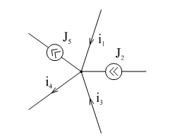
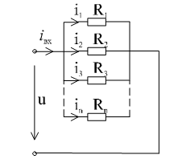

# Лекция №3. Законы Ома и Кирхгофа

`Закон Ома` устанавливает соотношение между током , протекающим через какой-либо двухполюсник и напряжением на его зажимах. Для идеальных пассивных элементов мы их уже записывали:

```math
u=Ri ;
```


```math
u_L=L\frac{di}{dt};
```

```math
u_C=C\frac{du}{dt};
```

Эти компонентные уравнения являются основанием для выражения соответствующих соотношений в сколь угодно сложных цепях.

`I Закон Кирхгофа`

Как следствие непрерывности тока, закон устанавливает, что суммарный ток , втекающий в какой-либо замкнутый объем равен суммарному вытекающему из этого объема тока. В теории цепей под замкнутым объемом понимается узел или отсечение. Чаще всего $I$ закон Кирхгофа формулируют для любого узла: 

```math
\sum_K i_K=0
```

<p align="center" > </p>
<p align="center" >Рисунок 2 - 23 </p>

Для узла, изображенного на рис. 2-23 узловое уравнение запишется:

```math
i_1+J_2+i_3+-i_4-J_5=0.
```

Иногда уравнение записывают, выделяя отдельно источники тока:

```math
i_1+i_3-i_4=J_5-J_2
```

т.е.

```math
\sum_K i_K=\sum_K J_K
```

Важно только соблюдать правило знаков: все истинные направления входящих токов считаются положительными, а выходящие - отрицательными. Можно считать и наоборот. Поскольку часто искомыми являются не только величины, но и направления токов, то последние до получения результатов анализа неизвестны. Практически, как это будет показано ниже, уравнения составляются относительно условных положительных направлений, которые принимаются произвольно, но одинаково во всех уравнениях. Если в результате анализа получатся отрицательные значения токов, то истинное значение будет обратным.

Решим задачу характерную для параллельного соединения резисторов (рис. 2-24) по $I$ закону Кирхгофа.

<p align="center" > </p>
<p align="center" >Рисунок 2 - 24 </p>

```math
\frac{u}{R_Э}=i=\sum^n_1 i_K=\sum^n_1 i_K=\sum^n_1 \frac{u_K}{R_K}=u\sum^n_1 \frac{1}{R_K};
```

Значит $n$ параллельно соединенных резисторов, с точки зрения остальной цепи, можно заменить одним $R_Э$ в соответствии с соотношением.

```math
G_Э=\sum^n_1 G_K
```

или

```math
\frac{1}{R_Э}=\sum^n_1 \frac{1}{R_K}
```

Для двух резисторов часто применяется это соотношение в виде:

```math
R_Э=\frac{R_1R-2}{R_1+R_2}
```

Если параллельно соединены конденсаторы, то

```math
i_ВХ=\sum^n_1 i=\sum^n_1 C_K\frac{du_K}{dt}= \left\{\sum C_K\right\} \frac{du}{dt};
```

```math
C_Э=\sum^n_1 C_K
```

т.е.

```math
i_{ВХ}=\sum i= \sum \frac{1}{L_K} \int u_Kdt= \sum \frac{1}{L_K} \left\{ \int u_Kdt\right\}
```

получим:

```math
\frac {1}{L_Э}= \sum^n_1 \frac{1}{L_K}
```

`II Закон Кирхгофа`

Напомним, что напряжение на двухполюсных элементах это разность потенциалов на его зажимах:

```math
г=(\varphi- \varphi \div )
```

