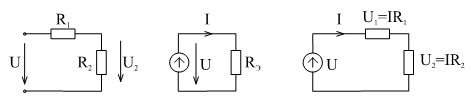
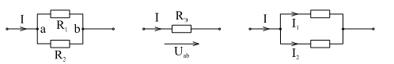
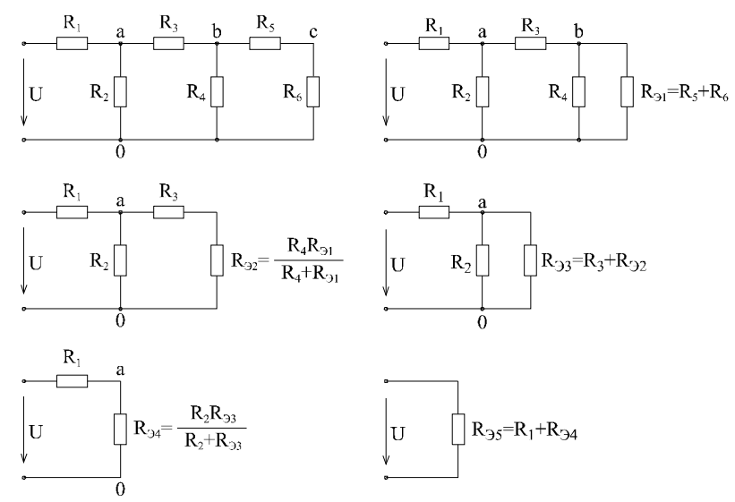

# Лекция №4. Расчет простых цепей при постоянных токах и напряжениях
Система уравнений (дифференциальных), составленная по законам Кирхгофа является достаточной для анализа цепи при любых сигналах. Если $e(t)=E=Const$  и $J(t)=J=Const$ не зависят от времени , то и реакции цепи $i_K(t)=I_K=Const$ , $u_K(t)=U_K=Const$  также будут постоянными, если речь идет об установившемся процессе. В дифференциальных уравнениях 

```math
\frac{di_K}{dt}=0;
```

```math
\frac{du_K}{dt}=0;
```

Поскольку 

```math
u_{LK}=L\frac{di_K}{dt}\pm M\frac{di_M}{dt}
```
то $u_L=0$  , т.е. любая индуктивность должна быть на схеме заменена закороткой $i_C=C\frac{du_C}{dt}=0$ , поэтому любая ветвь с конденсатором должна быть разомкнута. Если в результате анализа требуется определить ток через индуктивность и напряжение на конденсаторе, то надо будет искать ток, протекающий по соответствующей закоротке, и напряжение на разрыве цепи, где был конденсатор.
В результате таких схемных преобразований останутся источники ЭДС и тока и резисторы. Описание преобразованной схемы по Кирхгофу даст систему алгебраических уравнений. Процедура преобразований в схеме конечно проще, чем процедура составления дифференциальных уравнений и затем преобразования их к алгебраическим. Однако идея эквивалентных преобразований схемы имеет гораздо более широкое применение. Ниже приводится широко распространенные приемы преобразований, используемые при анализе цепей.

`Последовательное соединение резисторов`(рис. 3-1)

<p align="center" > </p>
<p align="center" >Рисунок 3-1 </p>

На рисунке показана процедура анализа фрагмента цепи состоящей из двух последовательно соединенных резисторов $R_1$  и $R_2$ .

$$1. R_Э=R_1 +R_2$$ эквивалентная замена.

$$2. I_2=I_1=\frac{E}{R_2}$$ - закон Ома.

$$3. U_1=IR_1, U_2=IR_2$$ - закон Ома.

$$4. U_1=U\frac{R_1}{R_1+R_2}$$

и 

$$U_2=U\frac{R_2}{R_1+R_2}$$

Конечно, практически нет необходимости так подробно это записывать. Обычно для полного анализа сразу вычисляют:

```math
I=\frac{U}{R_1+R_2}
```

```math
U_1=U\frac{R_1}{R_1+R_2}
```

```math
U_2=U\frac{R_2}{R_1+R_2}
```

последние две формулы являются формулами делителя напряжения.

`Параллельное соединение элементов - делитель тока`

При анализа фрагмента цепи, содержащего два параллельно соединенных резистора (рис. 3-2) можно рассуждать в следующем порядке:

<p align="center" > </p>
<p align="center" >Рисунок 3-2 </p>


1. Эквивалентная замена:

```math
\frac{1}{R_Э}=\frac{1}{R_1}+\frac{1}{R_2}$$
```

или 

```math
R_Э=\frac{R_1R_2}{R_1 +R_2}
```

2. По закону Ома:

```math
U_{ab}=IR_Э
```
3. Формулы делителя тока:

 ```math
I_1=\frac{U_ab}{R_1}=I\frac{R_1R_2}{(R_1+R_2)R_1}=I\frac{R_2}{R_1+R_2}
```
 
 ```math
I_2=I\frac{R_1}{R_1+R_2}
```

Используя только эти два приема, можно анализировать довольно сложные схемы.
Например, для лестничной схемы, используя несколько раз преобразования, последовательных и параллельных ветвей можно получить одно эквивалентное сопротивление, как показано на рис. 3-3.

<p align="center" > </p>
<p align="center" >Рисунок 3-3 </p>

Иногда, выразив параллельные ветви проводимостями:$G_2=\frac{1}{R_2};G_4=\frac{1}{R_4}$ и т.д, получают ответ в виде лестничной дроби:

 ```math
   R_{Э5} = R_1+ \cfrac{1}{G_2 + \cfrac{1}{R_3 + \cfrac{1}{G_4 + \cfrac{1}{G_6} } } }
```

Дальнейший анализ проводится в обратной последовательности:
1. Находится ток $I_1=\frac{U}{R_{Э5}}$
2. По формуле делителя напряжения находится напряжение: $U_{a0}=U\frac{R_{Э4}}{R_1+R_{Э4}}$
3. По формуле делителя тока находятся токи: $I_2= I_1 \frac{R_{Э3}}{R_2+R_{Э3}}$ ; $I_3=I_1 \frac{R-2}{R_2+R_{Э3}}$
4. Продолжая подобную процедуру: $U_{b0}=I_3 R_{Э2}$; $I_4=I_3 \frac{R_{Э1}}{R_4+R_{Э1}}$ и т.д. находятся все остальные токи и напряжения

   При известных навыках методом преобразований легко решаются задачи анализа довольно сложных цепей с последовательно-параллельным соединением резисторов.
Существенно расширяются возможности применения метода преобразований, если освоить применение `преобразований треугольника в трехлучевую звезду`.
Например, решить задачу анализа мостовой схемы непосредственно затруднительно. Но если три сопротивления $R_{12}$, $R_{23}$, $R_{31}$   преобразовать в сопротивления  $R_1$,  $R_2$,  $R_3$, то дальше задача решается просто. (См.
рис. 3-4). Часто требуется и обратное преобразование
