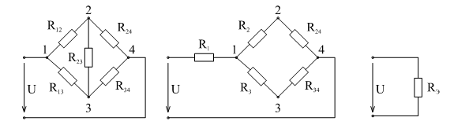
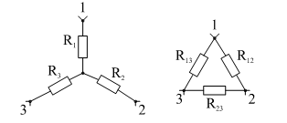
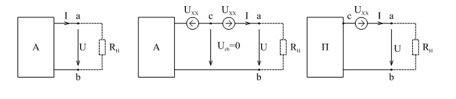
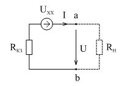
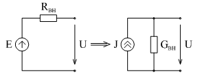
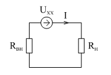
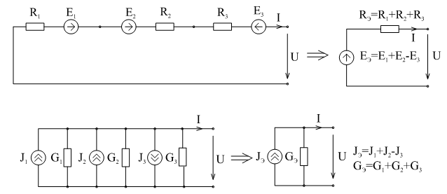
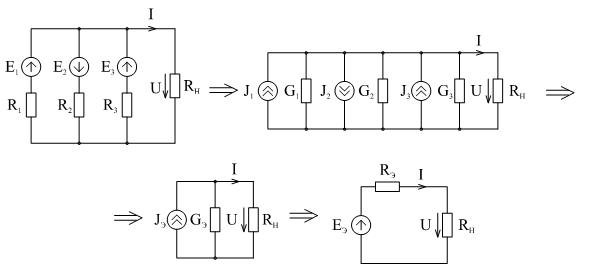

# Лекция №4. Расчет простых цепей при постоянных токах и напряжениях
Система уравнений (дифференциальных), составленная по законам Кирхгофа является достаточной для анализа цепи при любых сигналах. Если $e(t)=E=Const$  и $J(t)=J=Const$ не зависят от времени , то и реакции цепи $i_K(t)=I_K=Const$ , $u_K(t)=U_K=Const$  также будут постоянными, если речь идет об установившемся процессе. В дифференциальных уравнениях 

```math
\frac{di_K}{dt}=0;
```

```math
\frac{du_K}{dt}=0;
```

Поскольку 

```math
u_{LK}=L\frac{di_K}{dt}\pm M\frac{di_M}{dt}
```
то $u_L=0$  , т.е. любая индуктивность должна быть на схеме заменена закороткой $i_C=C\frac{du_C}{dt}=0$ , поэтому любая ветвь с конденсатором должна быть разомкнута. Если в результате анализа требуется определить ток через индуктивность и напряжение на конденсаторе, то надо будет искать ток, протекающий по соответствующей закоротке, и напряжение на разрыве цепи, где был конденсатор.
В результате таких схемных преобразований останутся источники ЭДС и тока и резисторы. Описание преобразованной схемы по Кирхгофу даст систему алгебраических уравнений. Процедура преобразований в схеме конечно проще, чем процедура составления дифференциальных уравнений и затем преобразования их к алгебраическим. Однако идея эквивалентных преобразований схемы имеет гораздо более широкое применение. Ниже приводится широко распространенные приемы преобразований, используемые при анализе цепей.

`Последовательное соединение резисторов`(рис. 3-1)

<p align="center" > </p>
<p align="center" >Рисунок 3-1 </p>

На рисунке показана процедура анализа фрагмента цепи состоящей из двух последовательно соединенных резисторов $R_1$  и $R_2$ .

$$1. R_Э=R_1 +R_2$$ эквивалентная замена.

$$2. I_2=I_1=\frac{E}{R_2}$$ - закон Ома.

$$3. U_1=IR_1, U_2=IR_2$$ - закон Ома.

$$4. U_1=U\frac{R_1}{R_1+R_2}$$

и 

$$U_2=U\frac{R_2}{R_1+R_2}$$

Конечно, практически нет необходимости так подробно это записывать. Обычно для полного анализа сразу вычисляют:

```math
I=\frac{U}{R_1+R_2}
```

```math
U_1=U\frac{R_1}{R_1+R_2}
```

```math
U_2=U\frac{R_2}{R_1+R_2}
```

последние две формулы являются формулами делителя напряжения.

`Параллельное соединение элементов - делитель тока`

При анализа фрагмента цепи, содержащего два параллельно соединенных резистора (рис. 3-2) можно рассуждать в следующем порядке:

<p align="center" > </p>
<p align="center" >Рисунок 3-2 </p>


1. Эквивалентная замена:

```math
\frac{1}{R_Э}=\frac{1}{R_1}+\frac{1}{R_2}$$
```

или 

```math
R_Э=\frac{R_1R_2}{R_1 +R_2}
```

2. По закону Ома:

```math
U_{ab}=IR_Э
```
3. Формулы делителя тока:

 ```math
I_1=\frac{U_ab}{R_1}=I\frac{R_1R_2}{(R_1+R_2)R_1}=I\frac{R_2}{R_1+R_2}
```
 
 ```math
I_2=I\frac{R_1}{R_1+R_2}
```

Используя только эти два приема, можно анализировать довольно сложные схемы.
Например, для лестничной схемы, используя несколько раз преобразования, последовательных и параллельных ветвей можно получить одно эквивалентное сопротивление, как показано на рис. 3-3.

<p align="center" > </p>
<p align="center" >Рисунок 3-3 </p>

Иногда, выразив параллельные ветви проводимостями:$G_2=\frac{1}{R_2};G_4=\frac{1}{R_4}$ и т.д, получают ответ в виде лестничной дроби:

```math
   R_{Э5} = R_1+ \cfrac{1}{G_2 + \cfrac{1}{R_3 + \cfrac{1}{G_4 + \cfrac{1}{G_6} } } }
```

Дальнейший анализ проводится в обратной последовательности:
1. Находится ток $I_1=\frac{U}{R_{Э5}}$
2. По формуле делителя напряжения находится напряжение: $U_{a0}=U\frac{R_{Э4}}{R_1+R_{Э4}}$
3. По формуле делителя тока находятся токи: $I_2= I_1 \frac{R_{Э3}}{R_2+R_{Э3}}$ ; $I_3=I_1 \frac{R-2}{R_2+R_{Э3}}$
4. Продолжая подобную процедуру: $U_{b0}=I_3 R_{Э2}$; $I_4=I_3 \frac{R_{Э1}}{R_4+R_{Э1}}$ и т.д. находятся все остальные токи и напряжения

   При известных навыках методом преобразований легко решаются задачи анализа довольно сложных цепей с последовательно-параллельным соединением резисторов.
Существенно расширяются возможности применения метода преобразований, если освоить применение `преобразований треугольника в трехлучевую звезду`.
Например, решить задачу анализа мостовой схемы непосредственно затруднительно. Но если три сопротивления $R_{12}$, $R_{23}$, $R_{31}$   преобразовать в сопротивления  $R_1$,  $R_2$,  $R_3$, то дальше задача решается просто. (См.
рис. 3-4). Часто требуется и обратное преобразование

<p align="center" > </p>
<p align="center" >Рисунок 3-4 </p>

Рассмотрим это преобразование:

<p align="center" > </p>
<p align="center" >Рисунок 3-5 </p>

Принцип эквивалентности требует, чтобы замена сопротивлений $R_1$, $R_2$, $R_3$  на $R_{12}$, $R_{23}$, $R_{31}$ (рис. 3-5) во фрагменте схемы не повлияла на распределение токов и напряжений в остальной части схемы.
Рассмотрим сопротивление между точкой 2 и 3 в обеих схемах при обрыве первого резистора:

```math
   R_3+R_5=\frac{R_{23}(R_{31}+R_{12})}{R_{12}+R_{23}+R{31}}
```

при обрыве второго:

```math
   R_1+R_3=\frac{R_{31}(R_{12}+R_{23})}{R_{12}+R_{23}+R{31}}
```

при обрыве третьего:

```math
   R_1+R_2=\frac{R_{12}(R_{31}+R_{23})}{R_{12}+R_{23}+R_{31}}
```

Решая систему полученных уравнений (например сложить второе и третье уравнения и вычесть из них первое), получим:

```math
   R_1=\frac{R_{12}R_{31}}{R_{12}+R_{23}+R{31}}
```

Используя соображения симметрии, путем круговой замены индексов:

```math
   R_2=\frac{R_{23}R_{12}}{R_{12}+R_{23}+R{31}}
```

```math
   R_3=\frac{R_{31}R_{32}}{R_{12}+R_{23}+R{31}}
```

Если последовательно вычислить проводимости в обеих схемах при закорачивании зажимов 1-2; 2-3; 3-1, то получим подобные уравнения для проводимостей при обратном переходе от “звезды” к “треугольнику”:

```math
  G_{31}+G_{23}=\frac{G_3(G1+G_2)}{G_1+G_2+G_3}
```

```math
  G_{31}+G_{12}=\frac{G_1(G2+G_3)}{G_1+G_2+G_3}
```

```math
  G_{12}+G_{23}=\frac{G_2(G1+G_3)}{G_1+G_2+G_3}
```

Далее (1+2-3)

```math
  G_{31}=\frac{G_1G_3}{G_1+G_2+G_3};
```

```math
  G_{12}=\frac{G_1G_2}{G_1+G_2+G_3};
```

```math
  G_{23}=\frac{G_2G_3}{G_1+G_2+G_3}.
```

В связи с простотой получения формул преобразования из “треугольника” в “звезду” и обратно, нет особой необходимости запоминать их.

Любой пассивный двухполюсник можно представить как некоторое эквивалентное сопротивление, что с очевидностью доказывается, если представить резистор как отношение $R_Э=\frac{U_{ВХ}}{I_{ВХ}}$ . Отсюда следует, что свертка различным образом соединенных двухполюсников в эксперименте равнозначна измерению входного тока при произвольно выбранном напряжении.

Следующим, часто применяемым преобразованием, является `метод эквивалентного генератора`.

Докажем теорему: любой активный двухполюсник можно заменить реальным источником напряжения с величиной ЭДС равной напряжению холостого хода и внутренним сопротивлением равным сопротивлению короткого замыкания.

<p align="center" > </p>
<p align="center" > </p>
<p align="center" >Рисунок 3-6 </p>

Доказывается эта теорема показом эквивалентности изображенных на рис. 3-6 схем с точки зрения напряжения и тока нагрузки ($R_Н$). Действительно, включение двух одинаковых идеальных источников с разнонаправленным напряжением, в частности равным напряжению холостого хода (при $R_i=\infty$ ) не изменит тока и напряжения нагрузки. При этом $U_{cb}$ , поэтому активный двухполюсник вместе со встречно направленным источником $U_{XX}$  можно заменить пассивным двухполюсником. Последний заменяется сопротивлением короткого замыкания, названным так потому, что в эксперименте оно может быть получено, если измерить ток короткого замыкания ($R_H=0$) $R_{КЗ}=\frac{U_{XX}}{I_{КЗ}}$.

Теорема доказана.

## Преобразования источников
От реального источника ЭДС легко перейти к источнику тока (рис. 3-7).

<p align="center" > </p>
<p align="center" >Рисунок 3-7 </p>


```math
  J=\frac{E}{R_{ен}}
```

```math
  G_{ен}=\frac{1}{R_{ен}} 
```

Пример:
Определить условие передачи максимальной мощности от активного двухполюсника в нагрузку.

По теореме об эквивалентном генераторе схема преобразуется к виду, изображенному на рис. 3-8.

<p align="center" > </p>
<p align="center" >Рисунок 3-8 </p>

$$I=\frac{U_{XX}}{R_{ВН}+R_Н} ; P_Н=I^2 R_Н=\frac{U^2_{XX}R_Н}{(R_{ВН}+R_Н)^2}$$

Максимум $P_H$ при $\frac{ dP_H}{dR_H}=0$

```math
 \frac{ dP_H}{dR_H}=U^2_{XX}\frac{(R_{ВН}+R_H)^2-R_H 2(R_{ВН}+R_H)}{(R_{ВН}+R_H)^4}=0, R_H=R_{ен}
```

Максимум мощности передается в нагрузку при сопротивлении нагрузки равном внутреннему сопротивлению источника (один из вариантов согласования генератора и нагрузки).
Эквивалентные преобразования при последовательном соединении реальных источников ЭДС и параллельном соединении реальных источников тока не представляют трудностей и показаны на рис. 3-9.

<p align="center" > </p>
<p align="center" >Рисунок 3-9 </p>

Если же требуется, например, преобразовать схему при параллельном соединении активных двухполюсников, то здесь полезно перейти предварительно к источникам тока (рис. 3-10).

<p align="center" > </p>
<p align="center" >Рисунок 3-10 </p>

$$J_K=\frac{E_K}{R_K} ; G_K=\frac{1}{R_K} ; J_Э=\sum J_K ; G_Э=\sum G_K$$

Наконец

$$ E_Э=\frac{J_Э}{G_K} ; R_Э=\frac{1}{G_Э}. $$

## Контрольные вопросы к теме 3
1. 	Как преобразовать электрическую цепь, если в ней действуют постоянные токи и напряжения?
2. 	Запишите формулы делителя тока и делителя напряжения.
3. 	В чем сущность метода эквивалентных преобразований при анализе электрических цепей?
4. 	Как выразить эквивалентную замену треугольника в звезду и обратно?
5. 	Докажите теорему об эквивалентном генераторе.
6. 	Как проводится эквивалентная замена при различных соединениях активных двухполюсников?
