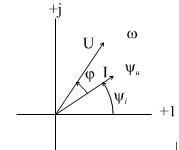
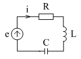
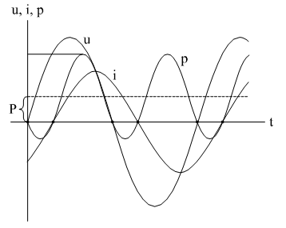
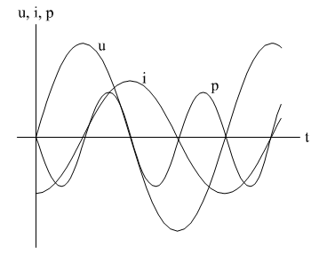

# Тема 4. Анализ простых цепей при синусоидальных токах и напряжения

Синусоидальный сигнал это периодические, изменяющиеся во времени ток, напряжение или ЭДС.

```math
i=I_m\sin(\omega*t+\Psi_i) ;
```

```math
U=U_m\sin(\omega*t+\Psi_u) ;
```

```math
e=E_m\sin(\omega*t+\Psi_e) ;
```

$I_m$, $U_m$, $E_m$ - соответствующие амплитудные значения $\omega=2\pi f=\frac{2\pi}{T}$ - круговая частота.

$f$ - частота.

$T$ - период.

$\Psi_i$, $\Psi_u$, $\Psi_e$ - начальные фазы функции.

<p align="center" > </p>
<p align="center" >Рисунок 4 - 1 </p>

Поскольку анализ цепи проводится в установившемся режиме, допускается, что с момента начала включения сигнала прошло времени достаточно, чтобы амплитуды токов и напряжений перестали изменяться. После этого за начало отсчета можно принять произвольный момент. Неопределенность $\Psi_i$, $\Psi_u$, $\Psi_e$ ликвидируется тем, что одну из начальных фаз сигнала (или реакции) принимают за нулевую. Ось абсцисс градуируют либо в единицах времени $t$, либо в единицах углов - градусах или радианах ($\omega*t$).

Выяснение вопроса: какому постоянному току с энергетической точки зрения соответствует заданный синусоидальный ток, приводит к понятию `среднеквадратичного, эффективного значения` тока (напряжения или ЭДС).

```math
I=\sqrt{\frac{1}{T}\int_0^{T}i^2dt}=\sqrt{\frac{1}{2\pi}\int_0^{2\pi}I^2m\sin^2 \omega t *d(\omega t)}=\sqrt{\frac{I^2m}{2\pi}\int_0^{2\pi}\frac{1}{2} (1-\cos2\omega t)*d(\omega t)}= \frac{Im}{\sqrt{2}}= 0.707Im
```

Этот ток (напряжение) имеют еще наименование `действующих` - важнейшая характеристика синусоидального сигнала. Действующее значение принято обозначать соответствующей буквой без всякого индекса (как постоянный ток и напряжение). Говоря о величине переменного тока или напряжения, если нет специальной оговорки, имеют ввиду именно эту характеристику.
Среднее по модулю значение функции (среднее значение равно нулю):

```math
I_{CP}^`=\frac{2}{T}\int_0^{T/2} I_m \sin \omega t dt= \frac{-2}{T} * \frac{I_mT}{2 \pi} \mid_0^{T/2} \cos \omega t dt= \frac{2}{2 \pi} I_m= 0.636I_m
```

Встречаются характеристики:

•	коэффициент амплитуды:  $K_a=\frac{I_m}{I}= \sqrt{2}=1.41$

•	коэффициент формы:  $K_TM= \frac{I}{I_{CP}^`}= \frac{ \pi}{2 \sqrt{2}} = 1.11$

Из многих свойств синусоидальных функций выделим важнейшие для дальнейшего изложения:

1. Сложение двух (и более) синусоидальных функций одинаковой частоты дает также синусоидальную функцию той же частоты. Действительно, сложим, например, два тока:

```math
I_{m1}\sin(\omega t +\Psi_1)+
I_{m1}\sin(\omega t +\Psi_1)=
I_{m1}\cos\omega t \sin\Psi_1+I_{m2}\cos\omega t \sin\Psi_2+I_{m}\cos\omega t \sin\Psi_2=(I_{m1}\cos \Psi_1 + I_{m2} \cos \Psi_2) \sin \omega t +(I_{m1} \sin \Psi_1+ I_{m2} \sin \Psi_2) \cos \omega t= I_m \sin (\omega t+\Psi)
```

где 
```math
I_m = \sqrt { ( I_{m1} \cos \Psi_1 + I_{m2} \cos \Psi_2 )^2 + ( I_{m1} \sin \Psi_1 + I_{m2} \sin \Psi_2 )^2 } 
```

```math
\Psi=  \arctan \frac{I_{m1} \sin \Psi_1 + I_{m2} \sin \Psi_2}{I_{m1} \cos \Psi_1 + I_{m2} \cos \Psi_2}
```

Заметим, что операция сложения двух токов в таком виде, хотя и доказывает выделенное свойство, оказывается очень громоздкой.

2. Дифференцирование синусоидальной функции даст синусоидальную функцию той же частоты. Если 

```math
 i=I_m \sin ( \omega t + \Psi_i) , то 
```

```math
\frac{di}{dt}= \omega I_m \cos (\omega t + \Psi_i)= \omega I_m \sin(\omega t + \Psi_i + \frac{\pi}{2})= A \sin(\omega t + \Psi)
```

где $A=\omega I_m$

$$ \Psi=(\Psi+\frac{\pi}{2}) $$

3. Интегрирование синусоидальной функции дает синусоидальную функцию той же частоты. Для определенности вычислим напряжение на конденсаторе при синусоидальном токе.

```math
U_c=\frac{1}{C} \int_0^t idt+ U_c(0)=\frac{1}{C} \int_0^t I_m \sin(\omega t + \Psi_i) dt+U_c(0)=\frac{-1}{\omega C} I_m|_0^t \cos(\omega t + \Psi_i)+U_c(0)= \frac{I_m}{\omega C}(\sin(\omega t +\Psi_i-\frac{\pi}{2}))=\frac{I_m}{\omega C} \sin (\omega t+ \Psi)
```

Необходимо принять $\frac{I_m\cos\Psi_i}{\omega C}+ U_c(0)=0 $, т.к. . при синусоидальном токе, протекающем через конденсатор, среднее напряжение равно нулю (заряды не могут накапливаться).
Если вспомнить, что интегро-дифференциальные уравнения по Кирхгофу представляют из себя суммы синусоидальных функций их производных и интегралов, то можно сделать важный вывод: если в цепи действуют источники синусоидального тока одной и той же частоты, то все реакции будут синусоидальными токами и напряжениями той же частоты.
# 2. Изображение синусоидальных функций в виде векторов и комплексных чисел

Изображение синусоидальной функции в виде вращающегося с угловой скоростью $\omega$ вектора заложено в самом определении синуса как ординаты конца радиуса окружности единичного радиуса, проведенной через начало координат

<p align="center" > </p>
<p align="center" >Рисунок 4 - 2 </p>

На рис. 4-2 изображены две синусоидальные функции $u(t)$  и $i(t)$  одинаковой частоты. Слева проведены (из одного центра) две окружности радиусом $I_m$  и $U_m$  и обозначены вращающиеся с угловой скоростью $\omega$ два вектора с учетом начальных фаз $\omega_U$ и $\omega_i$ . Угол между ними равен $\omega_U - \omega_i= \varphi$.

Принято $\varphi>0$ , если $\Psi_U>\Psi_i$. Если подразумевать, что вектора вращаются с угловой скоростью $\omega$ , то они содержат всю информацию о синусоидальных функциях  $i(t)$ и $U(t)$ - их величины равны $I_m$ и $U_m$ , а начальные фазы -  $\Psi_i$ и $\Psi_U$ .

Изобразив не величины $I_m$  и $U_m$,а $\frac{U_m}{\sqrt{2}=U}$ , $\frac{I_m}{\sqrt{2}=I}$  , получим векторную диаграмму, т.е. относительное расположение векторов $\dot{I}$ и $\dot{U}$ , которое сохраняет угол $\varphi$  не зависимо от конкретного значения t. Это называется векторной диаграммой.

Перенесем вектора на комплексную плоскость (рис. 4-3).

<p align="center" > </p>
<p align="center" >Рисунок 4 - 3 </p>

Если иметь ввиду, что оператор $e^{j \alpha}$  означает поворот вектора на комплексной плоскости на угол   против часовой стрелки, то получим для тока $I e^{j(\omega t+ \Psi_i)}= Ie^{j\Psi_i} e^{j\omega t}= \dot{I} e^{j\omega t} $, где $\dot{I}= I e^{j \Psi_i}$, вектор  $\dot{I}$ полностью сохраняет информацию о синусоидальной функции $i(t): I_m=\sqrt{2} I$ - амплитуда, $\psi_i$  - начальная фаза. Это обычно записывается:

```math
i(t)=I_m \sin(\omega t+ \Psi_i)= \dot{I}
```

Множитель $e^{j\omega t}$  можно опускать т.к. эти вектора будут применяться в законах Ома и Кирхгофа (и их комбинациях), и он содержится как в левой, так и в правой части уравнений и в результате сокращения просто излишен.
В тригонометрической форме:

```math
\sqrt{2} \dot{I} e^{j \omega t}= I_m \cos(\omega t +\Psi_I)+j \sin(\omega t+ \Psi_i)
```

поэтому для обратного перехода от комплексного изображения к функции времени достаточно с учетом $\sqrt{2}$ и $e^{j\omega t}$  взять коэффициент при мнимой части комплексного изображения.
Практически применяются комплексные изображения в различных формах:

1) Aлгебраическая
```math
\dot{A}= a+ jb
```

2) Тригонометрическая
   
```math
\dot{A}= A\cos \Psi+jA \sin \Psi
```
3) Показательная

```math
\dot{A}=A e^{j \Psi}
```

где$A=sqrt{a^2+b^2}$ ; $\Psi= \arctan \frac{b}{a}$

Иногда применяют условную запись:

$$\dot{A}=A<\Psi$$

Вспомним операцию дифференцирования:

```math
\frac{di}{dt}= \omega I_m \sin(\omega t + \Psi_i+\frac{\pi}{2})=\frac{\omega \dot{I_m}}{\sqrt{2}} e^{j \omega t} e^{j \Psi} e^{j \frac{\pi}{2}},
```

с учетом того, что 

```math
e^{j \frac{\pi}{2}}=j
```

получим 

```math
\frac{di}{dt}= j \omega I e^{j \Psi} e^{j \omega t}= j \omega \dot{I} e^{j \omega t}
```

т.е. изображению производной на комплексной плоскости соответствует умножение на $j \omega$.
Аналогично интегрированию в области изображений соответствует деление на $j \omega$.

```math
\int idt= \frac{\dot{I}}{j \omega}
```

Эти обстоятельства приводят к алгебраизации интегро-дифференциальных уравнений.
Решим для примера задачу нахождения тока в схеме (рис. 4-4) с применением разного математического аппарата.

<p align="center" > </p>
<p align="center" >Рисунок 4 - 4 </p>

1. Непосредственное интегрирование.
Интегро-дифференциальное уравнение

```math
R_i+L \frac{di}{dt} + \frac{1}{C} \int_0^t idt+ U_c(0)= E_m \sin(\omega t + \Psi_u)
```

Приняв 
```math
i=I_m \sin(\omega t + \Psi_i)
```

получим:

```math
RI_m \sin (\omega t+ \Psi_i)+ \omega LI_m \cos(\omega t + \Psi_i)+ \frac{1}{\omega C} \cos(\omega t + \Psi_i)+ \frac{I_m}{\omega C} +U_c(0)= E_m \sin(\omega t + \Psi_u)
```

т.к. в правой части уравнения синусоидальная функция надо потребовать

```math
\frac{I_m}{\omega C} +U_c(0)=0
```

```math
I_m[R \sin (\omega t+ \Psi_i)+ (\omega L - \frac{1}{\omega C})  \cos(\omega t + \Psi_i) ]= E_m \sin(\omega t + \Psi_u)
```

Дальнейшие преобразования:

```math
I_m \sqrt{R^2+(\omega L - \frac{1}{\omega C})^2}[\cos \alpha \sin(\omega t + \Psi_i) + \sin \alpha \cos(\omega t + \Psi_i) ]= E_m \sin(\omega t + \Psi_u)
```

,где

```math
\tan \alpha=\frac{(\omega L - \frac{1}{\omega C})}{R};
```

```math
 \cos \alpha = \frac{R}{{R^2+(\omega L - \frac{1}{\omega C})^2}} ;
```

 ```math
\sin \alpha= \frac{(\omega L - \frac{1}{\omega C})}{\sqrt{R^2 +(\omega L - \frac{1}{\omega C})^2}}
```

```math
 I_m \sqrt{R^2 +(\omega L - \frac{1}{\omega C})^2} \sin(\omega t+\alpha+\Psi_i)=E_m \sin(\omega t+\Psi_u)
```

Из этого уравнения вытекает:

```math
 I_m \sqrt{R^2 +(\omega L - \frac{1}{\omega C})^2}=E_m; \alpha + \Psi_i= \Psi_u ; \Psi_u - \Psi_i= \alpha=\phi
```

Следовательно

```math
i=\frac{E_m}{R^2+(\omega L - \frac{1}{\omega C})^2} \sin(\omega t + \Psi_i)
```

если $\Psi_u=0$ (выбор начала отсчета времени), то 

```math
i=\frac{E_m}{R^2+(\omega L - \frac{1}{\omega C})^2} \sin(\omega t - \phi)
```
задача решена.

```math
\sqrt{R^2 +(\omega L - \frac{1}{\omega C})^2}=Z
```

Z - имеет размерность сопротивления.
R - активное сопротивление.
X - реактивное сопротивление.

```math
X=(\omega L - \frac{1}{\omega C})
```

$\omega L$ и $\frac{1}{\omega C}$ - соответственно индуктивное и емкостное сопротивления.

$\phi=\arctan\frac{X}{R}$ - сдвиг по фазе между напряжением и током

если $\omega L - \frac{1}{\omega C}>0$,  то $\phi>0$ - ток отстает от напряжения по фазе.

если $\omega L - \frac{1}{\omega C}<0$,  то $\phi<0$ - ток опережает напряжение по фазе.


 Комплексный метод
 
В интегро-дифференциальном уравнении заменим функции времени их комплексными изображениями:

```math
R \dot{I} + j \omega L \dot{I} + \frac{1}{j \omega C} \dot{I}= \dot{E}
```

```math
 \dot{I}[R+ j(\omega L - \frac{1}{\omega C})]= \dot{E}
```

```math
\dot{I}=\frac{\dot{E}}{R^2 +(\omega L - \frac{1}{\omega C})^2} e^{-j \phi}
```

где 

```math
\phi=\arctan\frac{\omega L - \frac{1}{\omega C}}{R}
```

Для принятых выше обозначений

$\dot{I}(R+jX)=\dot{E}$ - закон Ома в комплексной форме

комплекс $R+jX= \overline{Z}$ - комплексное сопротивление

$\overline{Z}= Z e^{j \phi}= Z \cos \phi + jZ \sin \phi$ , т.е.

$R=Z \cos \phi; X=Z\sin \phi$

# Мгновенная, активная, реактивная и полная мощность
Мощность при синусоидальных токах и напряжениях может выражаться по-разному:

`1. Мгновенное значение мощности.`

При синусоидальных токах и напряжениях

$p(t)=ui$ , как и для любой цепи.

Подставив в это выражение синусоидальный ток через какой-либо участок цепи и напряжение на этом участке, получим, приняв, что ток отстает от напряжения на угол $\phi$:

```math
P=U_m  \sin \omega t I_m \sin(\omega t- \phi)=\frac{1}{2}U_mI_m[\cos \phi - \cos(2 \omega t- \phi)]=UI \cos \phi - UI \cos(2 \omega t - \phi)
```

<p align="center" > </p>
<p align="center" >Рисунок 4 - 5 </p>

Из формулы и осциллограммы видно, что мгновенная мощность состоит из двух слагаемых: одно, не зависящее от времени, - постоянная составляющая, а другое - синусоидальная функция времени двойной частоты. График p проходит через ноль в точках, где пересекают ось абсцисс либо ток, либо напряжение (рис. 4-5).

Интересно отметить, что если ток и напряжение сдвинуты по фазе на угол  $\frac{ \pi}{2}$   (чисто емкостная или чисто индуктивная цепь), то первое слагаемое равно нулю (рис. 4-6).

<p align="center" > </p>
<p align="center" >Рисунок 4 - 6 </p>


2. Активная мощность
Это мощность (для любых периодических сигналов) определяется как среднее значение мощности за период.

```math
P=\frac{1}{T} \int_0^T uidt=\frac{1}{T} \int_0^T[UI \cos \phi - UI \cos(r \omega t - \phi) ]dt=UI \cos \phi
```

т.к. интеграл от второго слагаемого равен нулю.
На графике рис. 4-6 легко отыскать значение активной мощности. График рис. 4-6 полностью согласуется с представлением о реактивных элементах, которые не рассеивают энергии (P=0), а только запасают ее и отдают обратно в цепь. В те промежутки времени, когда $p>0$  - реактивный элемент запасает энергию, а когда $p<0$  отдает энергию обратно. Этому колебанию энергии соответствует реактивная мощность, которую можно определить чисто формально:

```math
Q=UI \sin \phi
```

Т.к. для пассивной цепи -$-\frac{\pi}{2}< \phi< \frac{\pi}{2}$ , то активная мощность всегда положительна:

```math
Q=UI \cos \phi=I^2R=U^2G
```

Реактивная мощность может быть как положительна, так и отрицательна

```math
Q=UI \sin \phi=I^2X=U^2B
```

В соответствии в принятым ранее обозначением   $\Psi_U-\Psi_i=\phi>0 - Q<0 $   соответствует индуктивной цепи.

Реактивная мощность индуктивной катушки считается положительной, а конденсатора отрицательной. Это, в числе прочего, означает, что в одной и той же цепи, если катушка индуктивности потребляет реактивную мощность, то конденсатор ее генерирует, и лишь разница передается извне.

Так же в известной мере формально вводится понятие полной или кажущейся мощности, как параметра отражающего предельные возможности устройства по току и напряжению

```math
S=UI=\sqrt{P^2+Q^2}
```

Все три характеристики мощности имеют одинаковую размерность (ватт), но в технике получили разное наименование:
P - выражается в ваттах (ВТ).
Q - в вольт-амперах реактивных (ВАР).
S - в вольт-амперах (ВА).
Поскольку в выражениях для мощности имеет значение разность фаз $\Psi_U-\Psi_i= \phi $  (а не сумма),  в комплексной форме для получения мощности напряжение умножают на сопряженный комплекс тока:

```math
 U \dot{I}=UIe^{j \phi}=UI \cos \phi + jUI \sin \phi= P+jQ=Se^{j \phi}
```

Измерение активной мощности при периодических токах и напряжениях:
Из формулы:

```math
 P=\frac{1}{T} \int_0^Tiudt
```

следует, что для измерения мощности требуется иметь прибор перемножающий две функции времени и вычисляющий среднее значение (постоянную составляющую) такой функцию.
