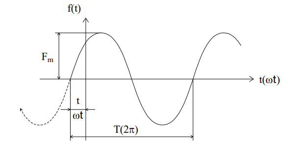

# Тема 4. Анализ простых цепей при синусоидальных токах и напряжения
# Лекция №1. Характеристики и свойства синусоидальных сигналов.
Синусоидальный сигнал это периодические, изменяющиеся во времени ток, напряжение или ЭДС.

```math
i=I_m\sin(\omega*t+\Psi_i) ;
```

```math
U=U_m\sin(\omega*t+\Psi_u) ;
```

```math
e=E_m\sin(\omega*t+\Psi_e) ;
```

$I_m$, $U_m$, $E_m$ - соответствующие амплитудные значения $\omega=2\pi f=\frac{2\pi}{T}$ - круговая частота.

$f$ - частота.

$T$ - период.

$\Psi_i$, $\Psi_u$, $\Psi_e$ - начальные фазы функции.

<p align="center" > </p>
<p align="center" >Рисунок 4 - 1 </p>

Поскольку анализ цепи проводится в установившемся режиме, допускается, что с момента начала включения сигнала прошло времени достаточно, чтобы амплитуды токов и напряжений перестали изменяться. После этого за начало отсчета можно принять произвольный момент. Неопределенность $\Psi_i$, $\Psi_u$, $\Psi_e$ ликвидируется тем, что одну из начальных фаз сигнала (или реакции) принимают за нулевую. Ось абсцисс градуируют либо в единицах времени $t$, либо в единицах углов - градусах или радианах ($\omega*t$).

Выяснение вопроса: какому постоянному току с энергетической точки зрения соответствует заданный синусоидальный ток, приводит к понятию `среднеквадратичного, эффективного значения` тока (напряжения или ЭДС).

```math
I=\sqrt{\frac{1}{T}\int_0^{T}i^2dt}=\sqrt{\frac{1}{2\pi}\int_0^{2\pi}I^2m\sin^2 \omega t *d(\omega t)}=\sqrt{\frac{I^2m}{2\pi}\int_0^{2\pi}\frac{1}{2} (1-\cos2\omega t)*d(\omega t)}= \frac{Im}{\sqrt{2}}= 0.707Im
```

Этот ток (напряжение) имеют еще наименование `действующих` - важнейшая характеристика синусоидального сигнала. Действующее значение принято обозначать соответствующей буквой без всякого индекса (как постоянный ток и напряжение). Говоря о величине переменного тока или напряжения, если нет специальной оговорки, имеют ввиду именно эту характеристику.
Среднее по модулю значение функции (среднее значение равно нулю):

```math
I_{CP}^`=\frac{2}{T}\int_0^{T/2} I_m \sin \omega t dt= \frac{-2}{T} * \frac{I_mT}{2 \pi} \mid_0^{T/2} \cos \omega t dt= \frac{2}{2 \pi} I_m= 0.636I_m
```

Встречаются характеристики:

•	коэффициент амплитуды:  $K_a=\frac{I_m}{I}= \sqrt{2}=1.41$

•	коэффициент формы:  $K_TM= \frac{I}{I_{CP}^`}= \frac{ \pi}{2 \sqrt{2}} = 1.11$

Из многих свойств синусоидальных функций выделим важнейшие для дальнейшего изложения:

1. Сложение двух (и более) синусоидальных функций одинаковой частоты дает также синусоидальную функцию той же частоты. Действительно, сложим, например, два тока:

```math
I_{m1}\sin(\omega t +\Psi_1)+
I_{m1}\sin(\omega t +\Psi_1)=
I_{m1}\cos\omega t \sin\Psi_1+I_{m2}\cos\omega t \sin\Psi_2+I_{m}\cos\omega t \sin\Psi_2=(I_{m1}\cos \Psi_1 + I_{m2} \cos \Psi_2) \sin \omega t +(I_{m1} \sin \Psi_1+ I_{m2} \sin \Psi_2) \cos \omega t= I_m \sin (\omega t+\Psi)
```
