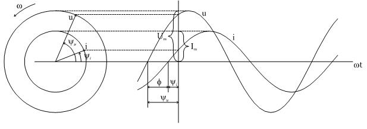

# Тема 4. Анализ простых цепей при синусоидальных токах и напряжения
# Лекция №1. Характеристики и свойства синусоидальных сигналов.
Синусоидальный сигнал это периодические, изменяющиеся во времени ток, напряжение или ЭДС.

```math
i=I_m\sin(\omega*t+\Psi_i) ;
```

```math
U=U_m\sin(\omega*t+\Psi_u) ;
```

```math
e=E_m\sin(\omega*t+\Psi_e) ;
```

$I_m$, $U_m$, $E_m$ - соответствующие амплитудные значения $\omega=2\pi f=\frac{2\pi}{T}$ - круговая частота.

$f$ - частота.

$T$ - период.

$\Psi_i$, $\Psi_u$, $\Psi_e$ - начальные фазы функции.

<p align="center" > </p>
<p align="center" >Рисунок 4 - 1 </p>

Поскольку анализ цепи проводится в установившемся режиме, допускается, что с момента начала включения сигнала прошло времени достаточно, чтобы амплитуды токов и напряжений перестали изменяться. После этого за начало отсчета можно принять произвольный момент. Неопределенность $\Psi_i$, $\Psi_u$, $\Psi_e$ ликвидируется тем, что одну из начальных фаз сигнала (или реакции) принимают за нулевую. Ось абсцисс градуируют либо в единицах времени $t$, либо в единицах углов - градусах или радианах ($\omega*t$).

Выяснение вопроса: какому постоянному току с энергетической точки зрения соответствует заданный синусоидальный ток, приводит к понятию `среднеквадратичного, эффективного значения` тока (напряжения или ЭДС).

```math
I=\sqrt{\frac{1}{T}\int_0^{T}i^2dt}=\sqrt{\frac{1}{2\pi}\int_0^{2\pi}I^2m\sin^2 \omega t *d(\omega t)}=\sqrt{\frac{I^2m}{2\pi}\int_0^{2\pi}\frac{1}{2} (1-\cos2\omega t)*d(\omega t)}= \frac{Im}{\sqrt{2}}= 0.707Im
```

Этот ток (напряжение) имеют еще наименование `действующих` - важнейшая характеристика синусоидального сигнала. Действующее значение принято обозначать соответствующей буквой без всякого индекса (как постоянный ток и напряжение). Говоря о величине переменного тока или напряжения, если нет специальной оговорки, имеют ввиду именно эту характеристику.
Среднее по модулю значение функции (среднее значение равно нулю):

```math
I_{CP}^`=\frac{2}{T}\int_0^{T/2} I_m \sin \omega t dt= \frac{-2}{T} * \frac{I_mT}{2 \pi} \mid_0^{T/2} \cos \omega t dt= \frac{2}{2 \pi} I_m= 0.636I_m
```

Встречаются характеристики:

•	коэффициент амплитуды:  $K_a=\frac{I_m}{I}= \sqrt{2}=1.41$

•	коэффициент формы:  $K_TM= \frac{I}{I_{CP}^`}= \frac{ \pi}{2 \sqrt{2}} = 1.11$

Из многих свойств синусоидальных функций выделим важнейшие для дальнейшего изложения:

1. Сложение двух (и более) синусоидальных функций одинаковой частоты дает также синусоидальную функцию той же частоты. Действительно, сложим, например, два тока:

```math
I_{m1}\sin(\omega t +\Psi_1)+
I_{m1}\sin(\omega t +\Psi_1)=
I_{m1}\cos\omega t \sin\Psi_1+I_{m2}\cos\omega t \sin\Psi_2+I_{m}\cos\omega t \sin\Psi_2=(I_{m1}\cos \Psi_1 + I_{m2} \cos \Psi_2) \sin \omega t +(I_{m1} \sin \Psi_1+ I_{m2} \sin \Psi_2) \cos \omega t= I_m \sin (\omega t+\Psi)
```

где 
```math
I_m = \sqrt { ( I_{m1} \cos \Psi_1 + I_{m2} \cos \Psi_2 )^2 + ( I_{m1} \sin \Psi_1 + I_{m2} \sin \Psi_2 )^2 } 
```

```math
\Psi=  \arctan \frac{I_{m1} \sin \Psi_1 + I_{m2} \sin \Psi_2}{I_{m1} \cos \Psi_1 + I_{m2} \cos \Psi_2}
```

Заметим, что операция сложения двух токов в таком виде, хотя и доказывает выделенное свойство, оказывается очень громоздкой.

2. Дифференцирование синусоидальной функции даст синусоидальную функцию той же частоты. Если 

```math
 i=I_m \sin ( \omega t + \Psi_i) , то 
```

```math
\frac{di}{dt}= \omega I_m \cos (\omega t + \Psi_i)= \omega I_m \sin(\omega t + \Psi_i + \frac{\pi}{2})= A \sin(\omega t + \Psi)
```

где $A=\omega I_m$

$$ \Psi=(\Psi+\frac{\pi}{2}) $$

3. Интегрирование синусоидальной функции дает синусоидальную функцию той же частоты. Для определенности вычислим напряжение на конденсаторе при синусоидальном токе.

```math
U_c=\frac{1}{C} \int_0^t idt+ U_c(0)=\frac{1}{C} \int_0^t I_m \sin(\omega t + \Psi_i) dt+U_c(0)=\frac{-1}{\omega C} I_m|_0^t \cos(\omega t + \Psi_i)+U_c(0)= \frac{I_m}{\omega C}(\sin(\omega t +\Psi_i-\frac{\pi}{2}))=\frac{I_m}{\omega C} \sin (\omega t+ \Psi)
```

Необходимо принять $\frac{I_m\cos\Psi_i}{\omega C}+ U_c(0)=0 $, т.к. . при синусоидальном токе, протекающем через конденсатор, среднее напряжение равно нулю (заряды не могут накапливаться).
Если вспомнить, что интегро-дифференциальные уравнения по Кирхгофу представляют из себя суммы синусоидальных функций их производных и интегралов, то можно сделать важный вывод: если в цепи действуют источники синусоидального тока одной и той же частоты, то все реакции будут синусоидальными токами и напряжениями той же частоты.
# 2. Изображение синусоидальных функций в виде векторов и комплексных чисел

Изображение синусоидальной функции в виде вращающегося с угловой скоростью $\omega$ вектора заложено в самом определении синуса как ординаты конца радиуса окружности единичного радиуса, проведенной через начало координат

<p align="center" > </p>
<p align="center" >Рисунок 4 - 2 </p>

На рис. 4-2 изображены две синусоидальные функции $u(t)$  и $i(t)$  одинаковой частоты. Слева проведены (из одного центра) две окружности радиусом $I_m$  и $U_m$  и обозначены вращающиеся с угловой скоростью $\omega$ два вектора с учетом начальных фаз $\omega_U$ и $\omega_i$ . Угол между ними равен $\omega_U - \omega_i= \varphi$.

Принято $\varphi>0$ , если $\Psi_U>\Psi_i$. Если подразумевать, что вектора вращаются с угловой скоростью $\omega$ , то они содержат всю информацию о синусоидальных функциях  $i(t)$ и $U(t)$ - их величины равны $I_m$ и $U_m$ , а начальные фазы -  $\Psi_i$ и $\Psi_U$ .

Изобразив не величины $I_m$  и $U_m$,а $\frac{U_m}{\sqrt{2}=U}$ , $\frac{I_m}{\sqrt{2}=I}$  , получим векторную диаграмму, т.е. относительное расположение векторов $\dot{I}$ и $\dot{U}$ , которое сохраняет угол $\varphi$  не зависимо от конкретного значения t. Это называется векторной диаграммой.

Перенесем вектора на комплексную плоскость (рис. 4-3).

<p align="center" > </p>
<p align="center" >Рисунок 4 - 3 </p>

Если иметь ввиду, что оператор $e^{j \alpha}$  означает поворот вектора на комплексной плоскости на угол   против часовой стрелки, то получим для тока $I e^{j(\omega t+ \Psi_i)}= Ie^{j\Psi_i} e^{j\omega t}= \dot{I} e^{j\omega t} $, где $\dot{I}= I e^{j \Psi_i}$, вектор  $\dot{I}$ полностью сохраняет информацию о синусоидальной функции $i(t): I_m=\sqrt{2} I$ - амплитуда, $\psi_i$  - начальная фаза. Это обычно записывается:

```math
i(t)=I_m \sin(\omega t+ \Psi_i)= \dot{I}
```

Множитель $e^{j\omega t}$  можно опускать т.к. эти вектора будут применяться в законах Ома и Кирхгофа (и их комбинациях), и он содержится как в левой, так и в правой части уравнений и в результате сокращения просто излишен.
В тригонометрической форме:

```math
\sqrt{2} \dot{I} e^{j \omega t}= I_m \cos(\omega t +\Psi_I)+j \sin(\omega t+ \Psi_i)
```

поэтому для обратного перехода от комплексного изображения к функции времени достаточно с учетом $\sqrt{2}$ и $e^{j\omega t}$  взять коэффициент при мнимой части комплексного изображения.
Практически применяются комплексные изображения в различных формах:

1) Aлгебраическая
```math
\dot{A}= a+ jb
```

2) Тригонометрическая
   
```math
\dot{A}= A\cos \Psi+jA \sin \Psi
```
3) Показательная

```math
\dot{A}=A e^{j \Psi}
```

где$A=sqrt{a^2+b^2}$ ; $\Psi= \arctan \frac{b}{a}$

Иногда применяют условную запись:

$$\dot{A}=A<\Psi$$

Вспомним операцию дифференцирования:

```math
\frac{di}{dt}= \omega I_m \sin(\omega t + \Psi_i+\frac{\pi}{2})=\frac{\omega \dot{I_m}}{\sqrt{2}} e^{j \omega t} e^{j \Psi} e^{j \frac{\pi}{2}},
```

с учетом того, что 

```math
e^{j \frac{\pi}{2}}=j
```

получим 

```math
\frac{di}{dt}= j \omega I e^{j \Psi} e^{j \omega t}= j \omega \dot{I} e^{j \omega t}
```

т.е. изображению производной на комплексной плоскости соответствует умножение на $j \omega$.
Аналогично интегрированию в области изображений соответствует деление на $j \omega$.

```math
\int idt= \frac{\dot{I}}{j \omega}
```

Эти обстоятельства приводят к алгебраизации интегро-дифференциальных уравнений.
Решим для примера задачу нахождения тока в схеме (рис. 4-4) с применением разного математического аппарата.

<p align="center" > </p>
<p align="center" >Рисунок 4 - 4 </p>

1. Непосредственное интегрирование.
Интегро-дифференциальное уравнение

```math
R_i+L \frac{di}{dt} + \frac{1}{C} \int_0^t idt+ U_c(0)= E_m \sin(\omega t + \Psi_u)
```

Приняв 
```math
i=I_m \sin(\omega t + \Psi_i)
```

получим:

```math

```
