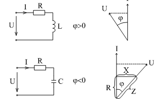
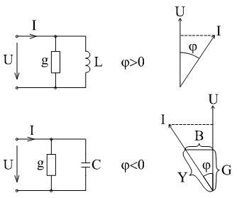
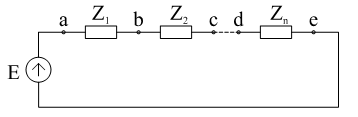
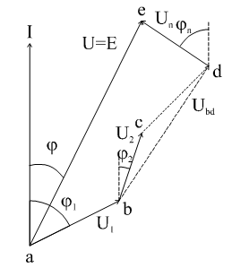
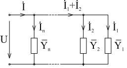
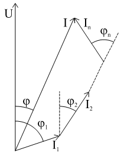
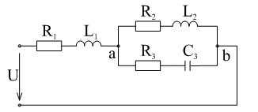
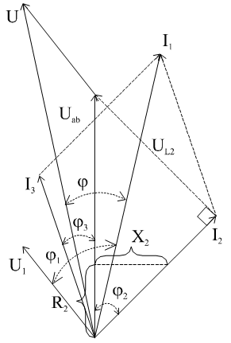

# Лекция №6. Эквивалентные параметры пассивного двухполюсника
Если в двухполюснике неизвестна его внутренняя структура, то можно формально назвать полным эквивалентным сопротивлением отношение действующих значений напряжения и тока:

```math
Z=\frac {U}{I}
```

Потребляемая активная мощность отображается наличием в двухполюснике эквивалентного резистора:

```math
R=\frac{P}{I^2}
```

Реактивное сопротивление будет соответствовать:

```math
X=\pm \sqrt{Z^2-R^2}
```

При этом, если $\phi*>0$, то знак «плюс», а если $\phi*<0$, то знак «минус».
Если известна потребляемая мощность и сдвиг по фазе между током и напряжением, то


```math
R=Z \cos\phi ; X= Z \sin \phi ; \tan \phi=\frac{X}{R}
```

Для того, чтобы эти соотношения соответствовали реальной схеме минимально, необходимо два элемента R и L или С, соединенных последовательно. Это и есть эквивалентная схема.

<p align="center" > </p>
<p align="center" >Рисунок 6 - 1 </p>

На рис. 6-1 представлены два варианта эквивалентных схем и соответствующие векторные диаграммы.
Разложение вектора напряжения по направлению тока на два взаимно перпендикулярных дает напряжение на активном и реактивном элементе схем. Треугольник подобный треугольнику напряжения дает прямоугольный треугольник сопротивлений из которого легко можно получить все приведенные выше соотношения.
Отношение комплексов напряжения и тока дает комплекс сопротивления, содержащий всю информацию об эквивалентных параметрах двухполюсника.

```math
\overline Z= \frac{ \dot U}{ \dot I} = \frac {U e^{j\psi_u} }{ I e^{j\psi_i}} = Z e^{j (\psi_U- \psi_i)} = Z e^{j \phi}= Z \cos \phi + j Z \sin \phi =R + jX
```

Приведенные соотношения (различные формы записи комплексного числа) удобны в различных случаях:

$\overline Z = Z e ^{j \phi}$ - если сопротивление участвует в произведениях.

$\overline Z = R+ jX$ - если сопротивления складываются.

$\overline Z = Z \cos \phi + j Z \sin \phi$ - для перехода от геометрической формы к алгебраической/

Заметим, что в отличие от обозначения комплексных изображений функций времени $\dot I, \dot U, \dot E$   комплексные выражения для сопротивлений обозначаются $\overline Z$  , т.к. они не являются функциями времени, т.е. вращающимися векторами.
Если за основу принять отношение тока к напряжению, то получим аналогичные соотношения для проводимостей.


```math
\overline Y= \frac{ \dot I}{ \dot U} = \frac { I e^{j\psi_i}  }{ U e^{j\psi_u}} = Y e^{-j (\psi_U- \psi_i)} = Y e^{ -j \phi}= Y \cos \phi - j Y \sin \phi =G - jB
```

<p align="center" > </p>
<p align="center" >Рисунок 6 - 2 </p>

Из этого следует:

```math
Y=\sqrt{G^2+B^2}
```

```math
G=Y \cos \phi
```

```math
B=Y \sin \phi
```

```math
\phi =\arctan \frac{B}{G}
```

```math
G=\frac{P}{U^2}
```

```math
Y= \frac{I}{U}
```

```math
B= \pm \sqrt{Y^2-G^2}
```

Параметры параллельных эквивалентных схем удобнее выражать в виде проводимостей, т.к. в таких схемах реально разложение вектора тока по направлению напряжения на две взаимно перпендикулярные составляющие:

```math
\dot I = I e ^{j \phi}= I \cos \phi + j I \sin \phi = I_a+j I_p
```

Треугольник подобный треугольнику токов называют треугольником проводимостей (рис. 6-2).
Практически можно пользоваться любой эквивалентной схемой (последовательной или параллельной) двухполюсника, если соблюдать соотношения:


```math
\overline Y = \frac{1}{Z} ; Y = \frac{1}{Z} ; G= \frac{R}{Z^2}=\frac{R}{R^2+X^2}; B= \frac{X}{R^2+X^2}
```

или при переходе от проводимостей к сопротивлениям:

```math
\overline Z = \frac{1}{Y} ; Z = \frac{1}{Y} ; R= \frac{G}{Z^2}=\frac{G}{G^2+B^2}; X= \frac{B}{G^2+B^2}
```

##. Особенности расчетов электрических цепей при синусоидальных токах и напряжениях
Если в схеме элементы цепи заменить их комплексными сопротивлениями, то полученную схему всегда можно представить как соединение различных пассивных двухполюсников, характеризуемых парой чисел {R;X}  или {G;B} , а источник тока и напряжения выразить в комплексной форме:

```math
\dot J = J e^{j \psi_i}= J_a+jJ_p; \dot E= E e^{j \psi_e}= E_a+jE_p
```

При этом, как изложено выше, сохраняются все соотношения, полученные для схем постоянного тока, но в комплексном виде:
Закон Ома $\dot U= \dot I \overline Z$;

Законы Кирхгофа $\sum \dot I_K \overline Z_K= \sum \dot E; \sum \dot I_K= \sum \dot J_k$

Применяются также все правила знаков. Следовательно можно пользоваться и всеми приемами: преобразования цепей, делитель тока, делитель напряжения, принцип наложения, преобразование «треугольника» в «звезду» , метод эквивалентного генератора и т.д. Пользуясь правилами алгебры комплексных чисел, при анализе получаются результаты так же в комплексном виде:

```math
\overline Z_Э = R_Э + j X_Э ; \dot I_K = I_{a_K} +j I_{p_K} ; \dot U_K= I_{a_K} +j I_{p_K}
```
При необходимости получения результатов вычисления токов и напряжений в виде действительных функций времени записывают сигналы в показательной форме, добавляют множитель вращения вектора $e^{j \phi}$  и $\sqrt{2}$ , выражают комплекс в тригонометрической форме и берут коэффициент при мнимой части. Например:

```math
\sqrt{2} (I_a + j I_p) e^{j \omega t} = \sqrt{2} I e^{j \psi_i} e^{j \omega t}= \sqrt{2} I \cos(\omega t + \psi_i)+j \sqrt{2} i \sin ( \omega t + \psi_i) \doteqdot I_m \sin(\omega t +\psi_i)
```

Баланс мощностей подводится отдельно для активных и реактивных мощностей:

$\sum P_K=0$ и $\sum Q_K=0$

Существенную помощь в расчетах оказывает построение векторных диаграмм, как своеобразной замены потенциальных диаграмм при постоянных токах и напряжениях.

`Примеры:`

I. Последовательное соединение двухполюсников (рис. 6- 3) $e= E_m \sin(\omega t +\psi_e) $ 

<p align="center" > </p>
<p align="center" >Рисунок 6 - 3 </p>

По второму закону Кирхгофа

```math
\dot E= \sum^n_1 \dot U_K= \sum^n_1 \dot I_K \overline Z_K = \dot I \sum^n_1 \overline Z_K
```
где 

```math
Z_K= R_K+jX_K, 
```

значит

```math
\dot E = \dot I_K \left\{\sum^n_1 R_n + j \sum^n_1 X_K \right\} = \dot I_K \overline Z_\dot Y
```

```math
R_{\dot Y}= \sum^n_1 R_K ; X_Э= \sum^n_1 X_K
```

( $X_K$- берется с учетом знака).

```math
\dot I= \frac{\dot E}{Z_Э}= \frac{\dot E}{Ze^{i\phi}}=\frac{E}{Z}e^{j(\psi_e-\phi)},
```

где 

```math
\phi=\arctan \frac{X_{\dot Y}}{R_{\dot Y}}
```

Мощности:

```math
P=I^2R_{\dot Y}= I^2 \sum^n_1 R_K = \sum^n_1 I^2 R_K= \sum^n_1 P_K
```

```math
Q=I^2X_{\dot Y}=I^2 \sum^n_1 X_K= \sum^n_1 I^2 X_K = \sum Q_K
```
Если векторную диаграмму напряжений на двухполюсниках изобразить относительно общего тока в соответствии с топологией схемы, получим т.н. топографическую диаграмму, из которой легко определить напряжения между любыми точками схемы (рис. 6-4).

<p align="center" > </p>
<p align="center" >Рисунок 6 - 4 </p>

Вычислив при произвольном токе (например $\dot I= I e^{j0}$ ) напряжения на каждом элементе $\dot U_K= \dot I \overline Z_K$   и построив векторную диаграмму, можно, изменив масштаб $\dot E$  в соответствии с заданным, получить из геометрических соотношений решение всей задачи анализа.
II. Параллельное соединение двухполюсников (рис. 6-5).

<p align="center" > </p>
<p align="center" >Рисунок 6 - 5 </p>

Здесь удобно пользоваться характеристикой двухполюсников в виде проводимостей:

```math
\overline Y_K= G_K - j B_K
```

По первому закону Кирхгофа

```math
\dot I = \sum^n_1 \dot I_K= \sum^n_1 \dot U_K Y_K = \dot U \sum^n_1 Y_K = \dot U \left\{ \sum^n_1 G_K -j \sum^n_1 B_K\right\}
```

Напомним, что $B_K>0$ , если двухполюсник индуктивный ($\phi>0 $) и $B_K<0$ , если двухполюсник емкостный ( $\phi<0 $).

Таким образом 

```math
G_Э= \sum^n_1 G_K ; B_Э= \sum^N_1 B_K ; \phi= \arctan \frac{B_Э}{G_Э}
```

Топографическая диаграмма токов, построенная относительно общего напряжения, представлена на рис. 

<p align="center" > </p>
<p align="center" >Рисунок 6 - 6 </p>

Из топографической диаграммы удобно находить токи в соответствующих соединениях (например $\dot I_1 + \dot I_2$ ).

Баланс мощности:

```math
P= U^2 G_Э= \sum^n_1 U^2_K G_K = \sum^n_1 P_K
```

```math
Q= U^2 X_{\dot Y}= \sum^n_1 U^2_K X_K = \sum^n_1 Q_K
```

III. Смешанное соединение (рассмотрим поподробнее) (рис. 6 - 7) при  $U=U_m \sin (\omega t + \psi_U)$

<p align="center" > </p>
<p align="center" >Рисунок 6 - 7 </p>

Комплексные сопротивления двухполюсников:

```math
\overline Z_1 = R_1 + j \omega L_1 = R_1 + j X_1
```

```math
\overline Z_2 = R_2 + j \omega L_2 = R_2 + j X_2
```

```math
\overline Z_3 = R_3 - j \frac{1}{\omega C} = R_3 - j X_3
```

Сопротивление двухполюсника аb:

```math
\overline Z_{ab} = \frac {\overline Z_2 \overline Z_3}{\overline Z_2 + \overline Z_3}= \frac {(R_2 + j X_2)(R_3 - j X_3)}{R_2 +R_3 + j(X_2 -X_3)}= R_{ab}+ j X_{ab}
```

Эквивалентное сопротивление всей цепи:

```math
\overline Z_\dot Y = \overline Z_1 + \overline Z_{ab}= R_{ab}+ j X_{\dot Y}
```

Входной ток - ток через первый двухполюсник:

```math
\dot I_1= \frac{\dot U}{\overline Z_Э}= \frac{U}{Z} e^{j(\psi_U -phi)}
```

где $$\phi=\arctan \frac{X_{\dot Y}}{R_{\dot Y}}$$

```math
\dot U_{ab}= \dot I_1 \overline Z_{ab} ; \dot I_2= \frac {\dot U_{ab}}{\overline Z_2} ; \dot I_3 = \frac {\dot U_{ab}}{\overline Z_3}
```

или по формуле делителя тока:

```math
\dot I_2 = \dot I_1 \frac{overline Z_3 }{overline Z_2 + overline Z_3} ; \dot I_3 = \dot I_1 \frac{overline Z_2 }{overline Z_2 + overline Z_3}
```

Мощности:

```math
P_1 = I^2_1 R_1 ; P_2= I^2_2 R_2 ; P_3 = I^3 R_3;
```

```math
Q_1=I^2_1 X_1; Q_2= I^2_2 X_2 ; Q_3= -I^2_3 X_3
```

Мощности источника U:

```math
P_U= P_1 + P_2 + P_3
```

```math
Q_U= Q_1 + Q_2 + Q_3
```

«Успех» построения векторной диаграммы (желательно не зависимо от алгебраического расчета) определяется порядком построения (рис. 6 - 8).

<p align="center" > </p>
<p align="center" >Рисунок 6 - 8 </p>
