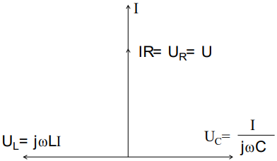
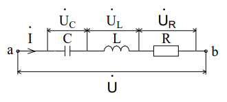
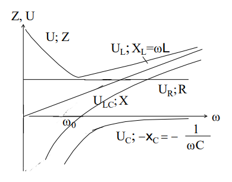
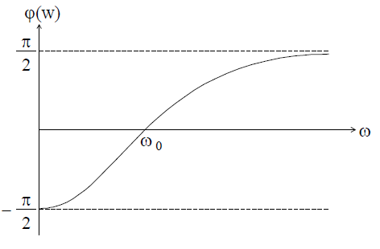
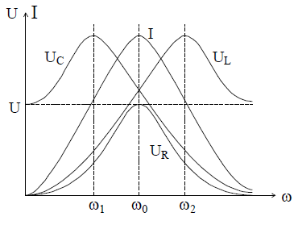
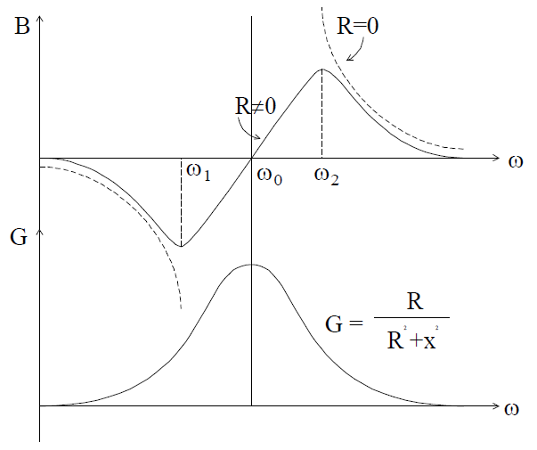
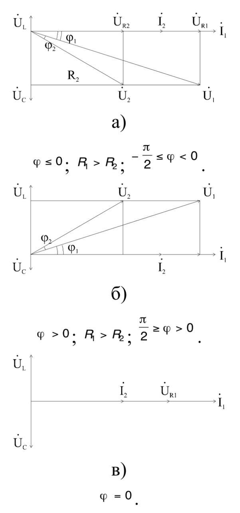
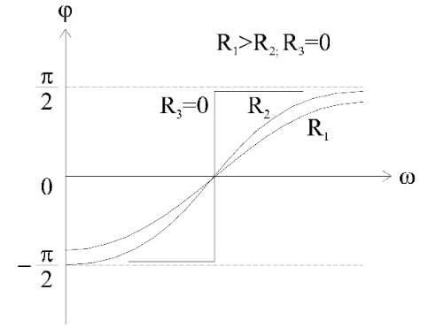

# Лекция №7. Резонанс и частотные свойства
В предыдущих главах введено понятие реактивного сопротивления конденсатора

```math
X_c=\frac{1}{ωC}
```

и катушки индуктивности

```math
X_L=ωL
```

Эти сопротивления зависят от величин C и L и от частоты ω. Отсюда
следует, что распределение токов и напряжений электрической цепи
определяется не только параметрами цепи, но и частотой
возмущающего воздействия. Эти зависимости характеризуют
частотные свойства электрических цепей переменного тока.

## § 1 Резонанс напряжений
Рассмотрим двухполюсники, содержащие L и C. Различные сочетания
индуктивностей и емкостей в цепи при заданной частоте, либо
изменение частоты при заданной схеме могут привести к тому, что
входная проводимость или входное сопротивление двухполюсника
будут иметь чисто активный характер. При этом напряжение и ток на
входе двухполюсника совпадают по фазе. Такое явление называют
резонансом.

`Основное определение резонанса:`
```math
ϕ(ω)=0 \ (на \ входе \ двухполюсника).
```

Рассмотрим некоторые характеристики цепи при резонансе. Для
последовательной RLC-цепи (рис. 6-1) ток и сдвиг по фазе между током
и напряжением равны:

```math
I = \frac{U}{\sqrt{R^2+(ωL-\frac{1}{ωC})^2}}
```

```math
ϕ=arctg\frac{L-\frac{1}{ωC}}{R}
```
<p align="center" > </p>
<p align="center" >Рис. 6-1</p>

Резонанс в цепи возникает при выполнении условий

```math
ωL = \frac{1}{ωC} \ или \ ω_0 = \frac{1}{\sqrt{LC}}
```
Частота в этом случае называется резонансной или собственной, а ток
имеет максимальное значение:

```math
I = \frac{U}{R}
```
Векторная диаграмма цепи при резонансе представлена на рис. 6-2.

<p align="center" > </p>
<p align="center" >Рис. 6-2</p>

Векторы $U_L$ и $U_C$ равны по величине и противоположно направлены.
Поэтому резонанс в последовательной RLC-цепи называют также резонансом напряжений.

`Условие резонанса можно записать в другой форме:`

```math
ω^2LC=1
```
Эта формула удобна для анализа цепи, когда резонанс достигается
изменением одной из трех величин:
$ω$, $L$ или $C$, т.е. при постоянстве
двух величин изменяемая величина должна получить значения:

```math
ω_0=\frac{1}{\sqrt{LC}}; \ L_0=\frac{1}{ω^2C}; \ С_0=\frac{1}{ω^2L};
```

```math
X_{L0} = X_{C0} = ω_0L = \frac{1}{ω_0C} = \sqrt{\frac{L}{C}}=p \ - волновое \ сопротивление.
```

`Действующее значение напряжения на реактивных элементах при резонансе`

```math
U_c = U_L = Iω_0L = \frac{I}{ω_0C} = \frac{ω_0LU}{R} = \frac{p}{R}U
```
может существенно превышать питающее напряжение в зависимости
от добротности контура $Q$:

```math
Q=\frac{p}{R}; \ U_L=U_c=QU
```

`Величина, обратная добротности`

```math
d = \frac{1}{Q} = \frac{R}{p}\ - \ затухание \ контура.
```
Для выяснения физической сущности явления резонанса рассмотрим
мгновенные значения мощностей на элементах $L, R, C$.

```math
p_R = \sqrt{2}Isinωt*\sqrt{2}Usinωt=UI(1-cos2ωt)=I^2R(1-cos2ωt);
```
```math
p_L = \sqrt{2}Isinωt*\sqrt{2}U_Lsin(ωt+Pi/2)=IU_Lsin2ωt;
```
```math
p_C = \sqrt{2}Isinωt*\sqrt{2}U_Csin(ωt-Pi/2)=-IU_Csin2ωt;
```

Поскольку, $U_L=U_C$, то $p_L=− p_C$ . Это значит, что происходит обмен
энергией между магнитным полем катушки и электрическим полем
конденсатора. Источник в этом случае расходует энергию только на
потери в активном сопротивлении $I^2R$. 

`Суммарная энергия магнитного и электрического полей:`

```math
W = W_L + W_C = \frac{LI^2m}{2}sin^2ωt+\frac{CU^2cm}{2}cos^2ωt;
```

учитывая, что
```math
LI^2 = L\frac{U_C^2}{X_C^2}= L\frac{U_C^2}{(\frac{\sqrt{LC}}{C})^2}= CU_C^2
```
получаем
```math
W = \frac{LI_m^2}{2}=\frac{CU_m^2}{2}=const
```
т.е. суммарная энергия полей конденсатора и катушки индуктивности
остается постоянной.

## § 2 Частотные свойства R, L, C двухполюсников
1 Последовательная RLC-цепочка при условии $J = const$ (рис. 6-3).
<p align="center" > </p>
<p align="center" >Рис. 6-3</p>

Напряжение двухполюсника $U$ = $Z$ $I$ , где

```math
Z = R+j(ωL-\frac{1}{ωC}),
```
или в действующих значениях $U$ = $ZI$ , где

```math
Z = \sqrt{R^2+(ωL-\frac{1}{ωC})^2}
```
`Для каждого элемента частотные характеристики`

```math
T_(ω)=\frac{U_(ω)}{I_(ω)}
```
представляют собой зависимости модуля сопротивления элемента от частоты.

`Для АЧХ двухполюсника`
```math
T_1(ω)=\frac{U_(ω)}{I_(ω)}
```

характер зависимости
совпадает с зависимостью модуля сопротивления двухполюсника

```math
Z=f(ω),\ т.е  \ \  T_1(ω)=Z_{ab}(ω)
```

АЧХ элемента и всего двухполюсника представлены на рис. 6-4.
<p align="center" > </p>
<p align="center" >Рис. 6-4</p>

`Реактивное сопротивление двухполюсника`

```math
X= X_L - X_C = ωL-\frac{1}{ωC} = \frac{L}{ω}(ω^2-ω_0^2)
```

изменяется от -∞ до +∞, проходя через 0 в точке $ω_0$.
Используя понятие нуля и полюса системной функции, заметим, что у функции X(ω) два полюса: ω=0 и ω=∞ и один ноль $ω=ω_0$.

```math
X= X_L - X_C = ωL-\frac{1}{ωC} = \frac{L}{ω}(ω^2-ω_0^2)
```
Характерное свойство функции X(ω) состоит в том, что $\frac{dX(ω)}{dω}>0$,
так как при увеличении частоты растут (алгебраически) оба слагаемых. ФЧХ получаем из выражения:

```math
U + Ie^{jϕ_i}Ze^{jarctg\frac{ωL-1/ωC}{R}}= Ue^{jϕ_u};
```

т.е., считая $ϕ_i$ = 0  , имеем

```math
ϕ_u-ϕ_i=ϕ(ω)=arctg\frac{ωL-1/ωC}{R}
```
Зависимость ϕ(ω) показана на рис. 6-5. Если ϕ < 0 (при ω < $ω_0$ ), то цепь имеет емкостный характер; если ϕ > 0 (при ω > $ω_0$  ) - индуктивный характер.

<p align="center" > </p>
<p align="center" >Рис. 6-5</p>

2. 	Последовательная RLC-цепочка; приложенное напряжение постоянно по величине U = const .

`Ток в цепи`

```math
\dot{I}= \dot{U} \overline{Y}\frac{1}{Z}=\frac{1}{R+j(ωL-1/ωc)}
```
```math
\dot{U_R}= R\dot{I}; \ \dot{U_C}=\overline{Z_C}\dot{I}; \ \dot{U_L}=\overline{Z_L}\dot{I}
```

`или для действующих значений:`

```math
I = \frac{U}{\sqrt{R^2+(ωL-\frac{1}{ωC})^2}};
```

```math
U_R = \frac{UR}{\sqrt{R^2+(ωL-\frac{1}{ωC})^2}};
```

```math
U_C = U\frac{1/ωC}{\sqrt{R^2+(ωL-\frac{1}{ωC})^2}};
```

```math
U_L = U\frac{ωL}{\sqrt{R^2+(ωL-\frac{1}{ωC})^2}};
```

```math
U_LC = \frac{U(ωL-1/ωC)}{\sqrt{R^2+(ωL-\frac{1}{ωC})^2}};
```

При построении графиков частотных зависимостей учитывается, что при резонансе X=0, тогда

```math
I=\frac{U}{R}; \ U_C=\frac{U1/ω_0C}{R}; \ U_L = \frac{Uω_0L}{R};
```

```math
U_R = U; \ U_L=U_C
```

При $ω$ = 0 I = 0; $U_R$ = 0; $U_L$ = 0; $U_C$ = U; X = ∞.

При $ω$ = ∞ I = 0; $U_R$ = 0; $U_L$ = U; $U_C$ = 0; X = ∞.

Зависимость тока и напряжений элементов от частоты приведены на рис. 6-6.

<p align="center" > </p>
<p align="center" >Рис. 6-6</p>

Рассмотрим влияние частоты на проводимость данной цепи

```math
\overline{Y}=\frac{1}{Z}=\frac{1}{R+jX}=\frac{R}{Z^2}-j\frac{X}{Z^2}=G-jB.
```

Предположим R = 0  (цепь без потерь), тогда

```math
B=\frac{X}{R^2+X^2}=\frac{1}{X}=\frac{1}{ωL-\frac{1}{ωC}}=\frac{ω}{L}*\frac{1}{ω^2-{ω_0}^2}.
```

Функция B(ω) имеет два нуля ω=0 и ω=∞ и один полюс ω = $ω_0$ . Производная dB(ω)/dω < 0 , т.е. в цепях без потерь проводимость всегда убывает, что соответствует пунктирной кривой рис. 6-7.

<p align="center" > </p>
<p align="center" >Рис. 6-7</p>

В реальной цепи сопротивление  R ≠ 0

```math
B=\frac{X}{R^2+X^2}=\frac{ωL-\frac{1}{ωC}}{R^2+(ωL-\frac{1}{ωC})^2}
```

Полученная зависимость предоставлена на рис. 6-7 сплошной линией. Значения частот $ω_1$ и $ω_2$  можно найти из условия

```math
\frac{dB(ω)}{dω}=0
```

Решение уравнений приводит к соотношению:

```math
R^2=(ωL-\frac{1}{ωC})^2
```

Откуда экстремальные значения 

```math
B_{max} = -B_{min} = \frac{1}{2R}, \ a \ ω_{1,2}=ω_0(\frac{d}{2}±\sqrt{\frac{d^2}{4}+1}), \ где \ d = \frac{1}{Q} \ - \ затухание \ контура.
```

Рассмотрим влияние параметров двухполюсника на частотные характеристики цепи. На рис. 6-8 приведены векторные диаграммы RLC-цепи при $X_C$ > $X_L$  (а); $X_C$ < $X_L$  (б) и $X_C$ = $X_L$  (в). При неизмененных $X_C$  и $X_L$  уменьшение R приводит к увеличению сдвига фаз между током и напряжением всей цепи, при этом сохраняется характер двухполюсника. В точке резонанса величина R не влияет на фазу.

<p align="center" > </p>
<p align="center" >Рис. 6-8</p>

Влияние параметров цепи на частотные характеристики выводится из зависимостей

```math
ω_0=\frac{1}{\sqrt{LC}};
```

```math
Q=\frac{\sqrt{\frac{L}{C}}}{R};
```

Откуда видно, что R не влияет на $ω_0$ , увеличение R уменьшает добротность, т.е. кривые I(ω)  и $U_R$(ω), приведенные на рис. 6-6, будут более пологими. Частота $ω_1$ , при которой  $U_C$(ω) максимальна, уменьшается, а $ω_2$ , соответствующая $U_L$(ω), увеличивается.
Изменение C влияет на резонансную частоту: увеличение C â n раз уменьшает $ω_0$ и добротность Q в $\sqrt{n}$ раз и наоборот.
Изменение L аналогично влияет на резонансную частоту и противоположно на добротность. Если, например, необходимо увеличить $ω_0$ , не уменьшая добротности, то нужно уменьшить величину L. При уменьшении $ω_0$  для сохранения добротности не ниже заданной величины увеличивают L. ФЧХ последовательной RLC-цепи при уменьшении R становится более крутой и при R=0 вырождается в ломаную прямую (рис. 6-9). Изменение L или С в соответствии с формулой

```math
ω_0 ≈ \frac{1}{\sqrt{LC}};
```

смещает и изменяет крутизну кривой. При уменьшении L $ω_0$ смещается вправо и кривая становится более пологой, при уменьшении С кривая смещается в ту же сторону, но становится более крутой.


<p align="center" > </p>
<p align="center" >Рис. 6-9</p>
