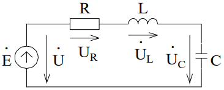

# Лекция №7. Резонанс и частотные свойства
В предыдущих главах введено понятие реактивного сопротивления конденсатора

```math
X_c=\frac{1}{wC}
```

и катушки индуктивности

```math
X_L=ωL
```

Эти сопротивления зависят от величин C и L и от частоты ω. Отсюда
следует, что распределение токов и напряжений электрической цепи
определяется не только параметрами цепи, но и частотой
возмущающего воздействия. Эти зависимости характеризуют
частотные свойства электрических цепей переменного тока.

## § 1 Резонанс напряжений
Рассмотрим двухполюсники, содержащие L и C. Различные сочетания
индуктивностей и емкостей в цепи при заданной частоте, либо
изменение частоты при заданной схеме могут привести к тому, что
входная проводимость или входное сопротивление двухполюсника
будут иметь чисто активный характер. При этом напряжение и ток на
входе двухполюсника совпадают по фазе. Такое явление называют
резонансом.

`Основное определение резонанса:`
```math
'ϕ''(ω)=0 \ (на \ входе \ двухполюсника).
```

Рассмотрим некоторые характеристики цепи при резонансе. Для
последовательной RLC-цепи (рис. 6-1) ток и сдвиг по фазе между током
и напряжением равны:

```math
I = \frac{U}{\sqrt{R^2+(wL-\frac{1}{wC})^2}}
```

```math
ϕ=arctg'\frac{ω'L-\frac{1}{ω'C}}{R}
```
<p align="center" > </p>
<p align="center" >Рис. 6-1</p>

Резонанс в цепи возникает при выполнении условий

```math
ωL = \frac{1}{ωC} \ или \ ω_0 = \frac{1}{\sqrt{LC}}
```
Частота в этом случае называется резонансной или собственной, а ток
имеет максимальное значение:

```math
I = \frac{U}{R}
```
Векторная диаграмма цепи при резонансе представлена на рис. 6-2.

<p align="center" > </p>
<p align="center" >Рис. 6-2</p>

Векторы U_L и U_C равны по величине и противоположно направлены.
Поэтому резонанс в последовательной RLC-цепи называют также резонансом напряжений.

`Условие резонанса можно записать в другой форме:`

```math
ω^2LC=1
```
Эта формула удобна для анализа цепи, когда резонанс достигается
изменением одной из трех величин:
ω, L или C, т.е. при постоянстве
двух величин изменяемая величина должна получить значения:

```math
ω_0=\frac{1}{\sqrt{LC}}; \ L_0=\frac{1}{ω^2C}; \ С_0=\frac{1}{ω^2L};
```

```math
X_{L0} = X_{C0} = ω_0L = \frac{1}{ω_0C} = \sqrt{\frac{L}{C}}=p \ - волновое \ сопротивление.
```
