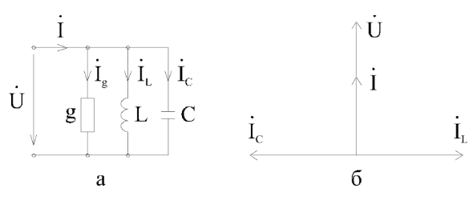
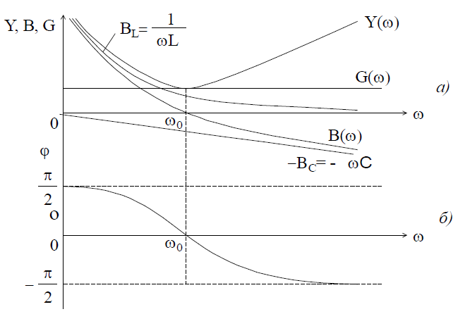
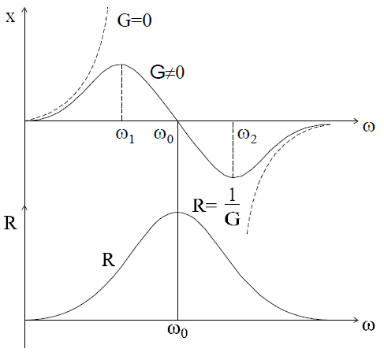
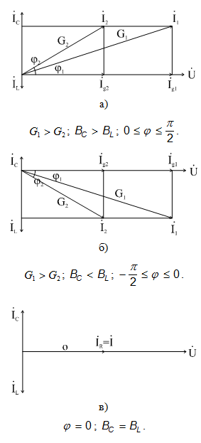
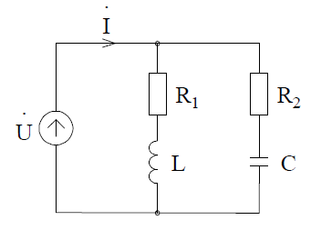
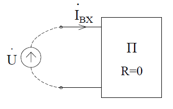
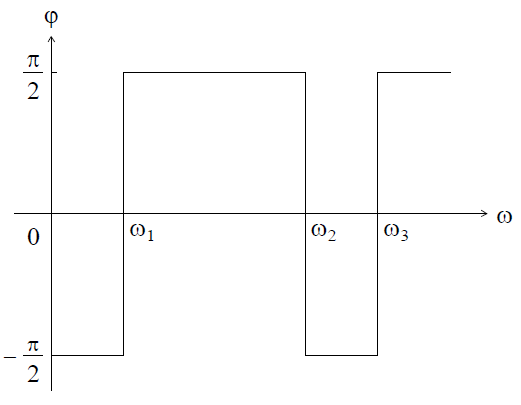
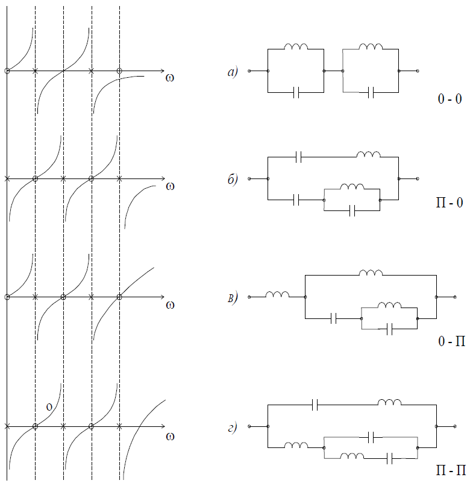

# Тема №8. Резонанс токов и частотные свойства параллельного RLC контура

## § 3 Резонанс токов

Рассмотрим двухполюсник, содержащий параллельно соединенные RLC (GLC) (рис. 6-10,а). Условие резонанса:

```math
{ω_0}^2LC = 1 \ или \ ω_0=\frac{1}{\sqrt{LC}}
```

Значение параметров при резонансе:

```math
L_0 = \frac{1}{{ω_0}^2C}
```

```math
C_0 = \frac{1}{{ω_0}^2L}
```

Векторная диаграмма цепи показана на рис. 6-10,б.

<p align="center" > </p>
<p align="center" >Рис. 6-10</p>

Поскольку в данном случае равны и противоположны по фазе векторы токов, резонанс в параллельной цепи называют резонансом токов.

При резонансе реактивная проводимость двухполюсника равна нулю и полная проводимость минимальна, поэтому полный ток при резонансе минимален.
Величина

```math
ω_0C =\frac{1}{ω_0L} = \sqrt{\frac{C}{L}} = γ \ называется \ волновой \ проводимостью.
```

Если G < γ  , то ток $I_L$ = $I_C$ > $I$.


`Отношение`

```math
Q = \frac{I_{L0}}{I_0} = \frac{I_{C0}}{I_0} = \frac{Uω_0C}{UG} = \frac{ω_0C}{G} = \frac{γ}{G}
```

определяющее степень превышения тока в реактивных элементах суммарного тока при резонансе - добротность контура. 

```math
d = \frac{1}{Q} \ - \ затухание \ контура.
```

Энергетические процессы в параллельном контуре аналогичны процессам в последовательной RLC-цепи. В любой момент времени 

$p_L$ = - $p_C$ , т.е. энергия переходит из катушки в конденсатор и обратно. Источник компенсирует потери энергии в проводимости G.

При построении частотных характеристик параллельной цепи наглядно прослеживается принцип дуальности цепей.

`1.Параллельное соединение GLC.`
Величина тока J = const. Характеристики в этом случае дуальны последовательному соединению RLC при постоянстве приложенного напряжения U = const .

```math
\dot{U}=\frac{\dot{I}}{\overline{Y}}; \ Y = G - j(\frac{1}{ωL} - ωC); \ Y = \sqrt{G^2+{(\frac{1}{ωL} - ωC)}^2}.
```

`Напряжение двухполюсника (действующее значение)`

```math
U=\frac{I}{\sqrt{G^2+{(\frac{1}{ωL} - ωC)}^2}}.
```

`Токи элементов`


```math
I_{LC} =\frac{I(ωC-\frac{1}{ωL})}{\sqrt{G^2+{(\frac{1}{ωL} - ωC)}^2}}
```

```math
I_{L} =\frac{I(\frac{1}{ωL})}{\sqrt{G^2+{(\frac{1}{ωL} - ωC)}^2}}
```

```math
I_{G} =\frac{IG}{\sqrt{G^2+{(\frac{1}{ωL} - ωC)}^2}}
```

```math
I_{C} =\frac{IωC}{\sqrt{G^2+{(\frac{1}{ωL} - ωC)}^2}}
```

При построении АЧХ следует учитывать, что для резонанса:


```math
U = \frac{I}{G}; \ I_C=\frac{I}{G}(ω_0C); \ I_L = \frac{I}{G}(\frac{1}{ω_0L}); \ I_G = I;
```

```math
I_L = I_C; \ ω_0=\frac{1}{\sqrt{LC}}; \ \frac{1}{ω_0L}=\sqrt{\frac{C}{L}};
```

```math
\sqrt{\frac{C}{L}} = \frac{1}{p}=γ;
```

при ω = 0

```math
U = 0; \ I_G = 0; \ I_L = I;
```

при ω = ∞

```math
U = 0; \ I_G = 0; \ I_С = I;
```

График характеристик цепи представлен на рис. 6-11.

<p align="center" > </p>
<p align="center" >Рис. 6-11</p>

`2.Параллельное соединение GLC,` приложенное напряжение постоянно по величине U = const. Частотные характеристики дуальны характеристикам цепи с последовательным соединением RLC при I = const. АЧХ элементов и двухполюсника соответствуют зависимостям проводимостей элементов от частоты (рис. 6-12,а).

<p align="center" > </p>
<p align="center" >Рис. 6-12</p>

Реактивная проводимость, равная

```math
B = B_L-B_C = \frac{1}{ωL}-ωC=\frac{C}{ω}({ω_0}^2-ω^2)
```

имеет два полюса ω = 0 и ω = ∞ и один ноль ω = $ω_0$. Реактивная проводимость с увеличением частоты уменьшается:

```math
\frac{dB}{dω} = -\frac{1}{ω^2L}-C<0.
```

При переходе частоты через точку резонанса изменяется характер проводимости: при ω < $ω_0$   проводимость имеет индуктивный характер B > 0 ; при ω > $ω_0$  проводимость становится емкостной B < 0. ФЧХ представлена на рис. 6-12,б.

Найдем характеристики сопротивления параллельно соединенных RLC. Реактивное сопротивление цепи

```math
\overline{Z} = \frac{1}{\overline{Y}} = \frac{1}{G-jB} = \frac{G}{G^2+B^2} + j\frac{B}{G^2+B^2} = R + jX.
```

Если G=0,

```math
X = \frac{1}{B} = \frac{1}{ωC - \frac{1}{ωL} } = \frac{\frac{ω}{C}}{{ω_0}^2 - ω^2}
```

График зависимостей X(ω) и R(ω) представлены на рис. 6-13.

<p align="center" > </p>
<p align="center" >Рис. 6-13</p>

Заметим, что при G = 0

```math
\frac{dX}{dω} > 0 
```

т.е. с увеличением частоты сопротивление в цепях без потерь всегда возрастает. В момент перехода частоты через точку резонанса сопротивление становится бесконечным и изменяет свой характер от индуктивного к емкостному (пунктирная линия). При G ≠ 0 характер зависимости Х от ω показан сплошной линией. Прохождение X(ω) через ноль не означает, что сопротивление всей цепи равно нулю, так как активное сопротивление, зависящее в этом случае от частоты, имеет максимум в момент резонанса:

```math
R = \frac{G}{G^2+B^2} = \frac{1}{G} 
```

Влияние величины активной проводимости G на характер зависимостей показано векторными диаграммами для различных соотношений $B_C$ ; $B_L$ и G (рис. 6-14,а,б,в).

<p align="center" > </p>
<p align="center" >Рис. 6-14</p>

Влияние G, L, C на АЧХ и ФЧХ исследуется по аналитическим зависимостям.


## § 5. Резонансные эффекты в сложных цепях

В общем случае условие резонанса X = 0 или B = 0. Активное сопротивление зависит от частоты. Условие X = 0 или B = 0 в двухполюсниках произвольной сложности может привести к наличию нескольких корней $ω_p$. Методика отыскания этих корней остается такой же, как и в простых случаях: записывается комплексное выражение для сопротивления или проводимости, приравнивается нулю коэффициент при мнимой части. По полученному уравнению отыскиваются резонансные частоты, а по виду соответствующих функций Z(ω); R(ω); X(ω) строятся частотные характеристики. 

Рассмотрим пример (рис. 6-15).

<p align="center" > </p>
<p align="center" >Рис. 6-15</p>

Комплексная проводимость цепи

```math
\overline{Y} = \overline{Y_1} + \overline{Y_2}=\frac{1}{R_1+jωL} + \frac{1}{R_2-j\frac{1}{ωC}}=   
```

```math
=\frac{R_1}{{R_1}^2+ω^2L^2} + \frac{R_2}{{R_2}^2+\frac{1}{ω^2C^2}}-j(\frac{ωL}{{R_1}^2+ω^2L^2}-\frac{\frac{1}{ωC}}{{R_1}^2++\frac{1}{ω^2C^2}}) = G - jB 
```
Условие резонанса (B = 0)

```math
\frac{ωL}{{R_1}^2 + ω^2L^2} - \frac{\frac{1}{ωC}}{{R_2}^2+\frac{1}{ω^2C^2}}
```

откуда

```math
ω_p = \frac{1}{LC}\sqrt{\frac{\frac{L}{C}-{R_1}^2}{\frac{L}{C}-{R_2}^2}}
```
или

```math
ω_p = {ω_0}^2\sqrt{\frac{p^2-{R_1}^2}{p^2-{R_2}^2}}
```

Рассматривая полученный результат, можно выделить три случая соотношения параметров:

```math
1. \ {R_1}^2 > \frac{L}{C} > {R_2}^2 \ или \ {R_1}^2 < \frac{L}{C} < {R_2}^2 
```

Подкоренное выражение отрицательно. Частоты мнимая, т.е. резонанс невозможен.

```math
2. \ R_1 = R_2 ≠ \sqrt{\frac{L}{C}}; \ ω_p = \frac{1}{\sqrt{LC}} 
```

Частота совпадает с резонансной частотой контура

```math
3. \ R_1 = R_2 = \sqrt{\frac{L}{C}}
```

Резонанс наблюдается на всех частотах, так как R не зависит от ω.
Действительно, пусть $R_1$ = $R_2$ = R, тогда


```math
\overline{Z_э} = \frac{\overline{Z_1}\overline{Z_2}}{\overline{Z_1}+\overline{Z_2}} = \frac{(R+jωL)(R - j\frac{1}{ωC})}{2R+j(ωL-\frac{1}{ωC})}=
```

```math
=\frac{R^2+\frac{L}{C}+j(RωL-\frac{R}{ωC})}{2R+j(ωL-\frac{1}{ωC})}=
```

```math
=R\frac{2R+j(ωL-\frac{1}{ωC})}{2R+j(ωL-\frac{1}{ωC})}=R
```

Для цепей, являющихся пассивными двухполюсниками, можно проследить некоторые общие закономерности в частотных характеристиках.

<p align="center" > </p>
<p align="center" >Рис. 6-16</p>

Составляя систему контурных уравнений, можно предусмотреть, чтобы источник входил в первый контур (рис. 6-16). Тогда входной ток определится


```math
\dot{I_{вх}} = \dot{I_1} = \frac{Δ_{11}}{Δ}\dot{U} = \overline{Y_{вх}}\dot{U} = \frac{\dot{U}}{\overline{Z_{вх}}} = \frac{\dot{U}}{\overline{X_{вх}}}
```

Определитель Δ n-го порядка с элементами типа

```math
\overline{Z_{ki}} = j(ωL_{ki} - \frac{1}{ωC_{ki}})=j\frac{L_{ki}}{ω}(ω^2-\frac{1}{L_{ki}C_{ki}})
```

$Δ_{11}$ - (n-1)-го порядка с такими же элементам.
В общем случае

```math
X = \frac{1}{ω}\frac{a_1ω^{2n}+a_2ω^{2n-n}+...+a_0}{b_1ω^{2n-2}+b_2ω^{2n-4}+...+b_0}
```

Найдя корни полиномов числителя и знаменателя, дробь представим в виде

```math
X = \frac{1}{ω}\frac{(ω^2-ω_1^2)(ω^2-ω_3^2)...(ω^2-ω_{2n}^2)}{(ω^2-ω_2^2)(ω^2-ω_4^2)...(ω^2-ω_{2n-2}^2)}
```

Поскольку в цепях без потерь угол сдвига фаз между током и напряжением может быть только ±pi/2, а в то же время при резонансе φ = 0, так как в момент резонанса φ скачком меняет свой знак (рис. 6-17).

<p align="center" > </p>
<p align="center" >Рис. 6-17</p>

Точками резонанса также будут значения частот ω = 0 и ω = ∞

Далее, поскольку,

```math
\frac{dX(ω)}{dω} > 0,
```

неравенство усиливается, то справедливы соотношения

```math
0<ω_1<ω_2<ω_3<...<ω_{2n}<∞.
```

Для любой цепи без потерь первой резонансной частотой является ω = 0 и последней ω = ∞. Однако в зависимости от того, будет ли при этих частотах ноль или полюс функции, можно представить четыре разновидности характеристик (рис. 6-18).

1. 	Если в двухполюснике существует путь, проходящий только по индуктивности, то зависимость X(ω)   начинается с нуля (рис. 6-18,а,в).
2. 	При отсутствии такого пути X(ω) начинается с полюса (рис. 6-18,б,г).
3. 	Если в двухполюснике существует путь, проходящий только по емкостям, то зависимость X(ω)   заканчивается нулем (рис. 6-18,а,б).
4. При отсутствии такого пути частотная характеристика заканчивается полюсом (рис. 6-18,в,г).

<p align="center" > </p>
<p align="center" >Рис. 6-18</p>	

## Контрольные вопросы к теме
1. 	Каковы условия возникновения резонанса в цепи? Как подсчитать резонансную частоту?
2. 	Как выглядит векторная диаграмма при последовательном соединении RLC цепи? При параллельном 
    соединении?
3. 	Назовите примеры использования резонансных явлений.
4. 	Что такое частотные характеристики?
5. 	Что такое амплитудно-частотная характеристика? Фазо-частотная характеристика?
6. 	Как экспериментально определить резонансную частоту?
7. 	Как изменяются частотные характеристики при изменении добротности?
8. 	Что такое двухполюсник без потерь? Как по виду схемы качественно представить характеристики 
    Z(ω) для двухполюсника без потерь?
