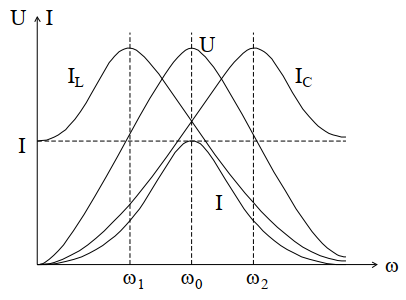

# Лекция №8. Частотные свойства параллельного контура
При построении частотных характеристик параллельной цепи наглядно прослеживается принцип дуальности цепей.

`1.Параллельное соединение GLC.`
Величина тока J = const. Характеристики в этом случае дуальны последовательному соединению RLC при постоянстве приложенного напряжения U = const .

```math
\dot{U}=\frac{\dot{I}}{\overline{Y}}; \ Y = G - j(\frac{1}{ωL} - ωC); \ Y = \sqrt{G^2+{(\frac{1}{ωL} - ωC)}^2}.
```

`Напряжение двухполюсника (действующее значение)`

```math
U=\frac{I}{\sqrt{G^2+{(\frac{1}{ωL} - ωC)}^2}}.
```

`Токи элементов`


```math
I_{LC} =\frac{I(ωC-\frac{1}{ωL})}{\sqrt{G^2+{(\frac{1}{ωL} - ωC)}^2}}
```

```math
I_{L} =\frac{I(\frac{1}{ωL})}{\sqrt{G^2+{(\frac{1}{ωL} - ωC)}^2}}
```

```math
I_{G} =\frac{IG}{\sqrt{G^2+{(\frac{1}{ωL} - ωC)}^2}}
```

```math
I_{C} =\frac{IωC}{\sqrt{G^2+{(\frac{1}{ωL} - ωC)}^2}}
```

При построении АЧХ следует учитывать, что для резонанса:


```math
U = \frac{I}{G}; \ I_C=\frac{I}{G}(ω_0C); \ I_L = \frac{I}{G}(\frac{1}{ω_0L}); \ I_G = I;
```

```math
I_L = I_C; \ ω_0=\frac{1}{\sqrt{LC}}; \ \frac{1}{ω_0L}=\sqrt{\frac{C}{L}};
```

```math
\sqrt{\frac{C}{L}} = \frac{1}{p}=γ;
```

при ω = 0

```math
U = 0; \ I_G = 0; \ I_L = I;
```

при ω = ∞

```math
U = 0; \ I_G = 0; \ I_С = I;
```

График характеристик цепи представлен на рис. 6-11.

<p align="center" > </p>
<p align="center" >Рис. 6-11</p>

`2. 	Параллельное соединение GLC,`


приложенное напряжение постоянно по величине  . Частотные характеристики дуальны характеристикам цепи с последовательным соединением RLC при  . АЧХ элементов и двухполюсника соответствуют зависимостям проводимостей элементов от частоты (рис. 6-11,а).
