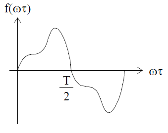
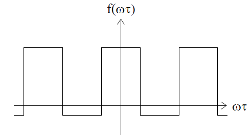
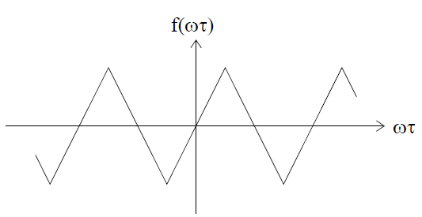
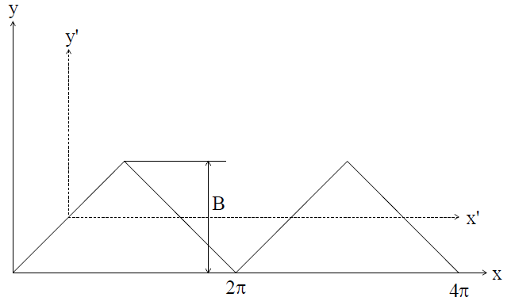
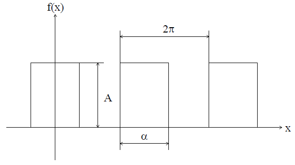
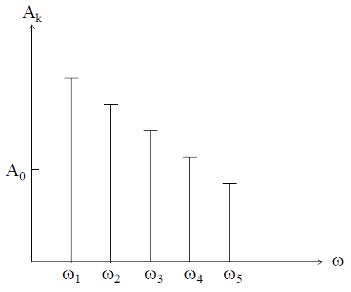

# Лекция №9. Расчет электрических цепей при несинусоидальных периодических токах и напряжения.

В большинстве устройств электроники, радиотехники, автоматики, вычислительной техники токи и напряжения имеют отличную от синусоидальной форму, оставаясь периодическими функциями времени. Расчет цепей при несинусоидальных периодических возмущающих воздействиях в курсе электротехники составляет самостоятельный раздел, не зависимо от того, чем вызвана несинусоидальность. Причиной несинусоидальности могут быть паразитные явления, протекающие в электротехнических установках: несимметричность генераторов, нелинейность характеристик элементов и т.д.
Широко применяются устройства, в которых несинусоидальность возмущающих воздействий создается преднамеренно и несет определенную информацию: вычислительные устройства, системы связи и т.п.
Метод расчета электрических цепей при несинусоидальных периодических токах и напряжениях основан на разложении кривой в гармонический ряд Фурье и применении принципа наложения.

## § 1. Разложение несинусоидальной функции в тригонометрический ряд

Всякая периодическая функция, удовлетворяющая условиям Дирихле, т.е. имеющая на конечном интервале изменения аргумента конечное число разрывов первого рода и конечное число максимумов и минимумов, может быть разложена в тригонометрический ряд:

```math
F(ω t) = A_0 + A_1+sin(ωt+φ_1)+A_2+sin(2ωt+φ_2)+...+A_Ksin(êωt +φ_ê)...
```

или

```math
F(ω t) = \sum^∞_{K=0}A_Ksin(êωt + φ_K).
```

Первый член ряда называют постоянной составляющей, второй член
ряда - основной синусоидальной или первой гармоникой, остальные - высшими гармониками.
Основная частота 

```math
ω = \frac{2π}{T}
```

равна частоте несинусоидальной периодической функции.
Для удобства подсчета коэффициентов ряда, его обычно представляют в форме:

```math
F(ω t) = A_0+B_1sinωt+C_1cosωt+B_2sin2ωt+C_2cos2ωt+...+B_Ksinkωt+C_Kcoskωt+...
```

Эту форму получают, если для каждого члена ряда

```math
sin(kωt+φ_K) = sinkωtcosφ_K+coskωtsinφ_K.
```

Таким образом,

```math
B_K = A_Kcosφ_K; \ C_K = A_Ksinφ_K;
```

```math
A_K=\sqrt{{B^2_K}+{C^2_K}}; \ φ_K = arctg\frac{C_K}{B_K}
```

Коэффициенты вычисляются по следующей формуле:

```math
A_0=\frac{1}{2π}\int^π_{-π}F(ωt)d(ωt).
```

$A_0$  - среднее значение функции за период (постоянная составляющая тока, напряжения или ЭДС).

```math
B_K=\frac{1}{π}\int^π_{-π}F(ωt)sinkωtd(ωt).
```

```math
C_K=\frac{1}{π}\int^π_{-π}F(ωt)coskωtd(ωt).
```

Периодические функции сигналов, используемых в электротехнике, могут обладать различными видами симметрии:

`1. Симметрия относительно оси абсцисс (рис. 7-1):`

<p align="center" > </p>

```math
f(ωt) = -f(ωt+\frac{T}{2})
```

<p align="center" >Рис. 7-1</p>

Такие функции при разложении в гармонический ряд не имеют постоянной составляющей и не содержат четных гармоник.
Эти положения в математике строго доказываются.

`2. Симметрия относительно оси ординат (рис 7-2).`


<p align="center" > </p>

```math
f(ωt) = -f(-ωt)
```

<p align="center" >Рис. 7-2</p>

В этом случае разложение не содержит синусов, так как синус - функция нечетная.

`3. Симметрия относительно начала координат (рис 7-3).`

<p align="center" > </p>
<p align="center" >Рис. 7-3</p>

При этом разложении функции в ряд не содержит косинусов и постоянной составляющей.
Первый вид симметрии не зависит от начала отсчета времени, т.е. является свойством самой кривой. Второй и третий связаны с началом отсчета.
Рассмотрим несколько примеров разложения.


`Пример 1.` Трапеция, симметричная относительно оси абсцисс 

 и начала координат (рис. 7-4).

<p align="center" > </p>
<p align="center" >Рис. 7-4</p>

Учитывая симметрию, можно заключить, что ряд будет состоять из нечетных синусоид. 

Интегрируем функцию f(x) на отрезке, равном четверти периода, умножая интеграл на 4. 

Определим коэффициенты $B_K$ :

```math
B_K = \frac{4}{π}\int^{\frac{π}{2}}_0f(x)sinkxdx=
```

```math
=\frac{L}{π}\int^π_0A\frac{x}{α}sinkxdx+\frac{4}{π}\int^{\frac{π}{2}}_∞Asinkxdx
```

Разделение интеграла на два связано с тем, что значение функции на участке от 0 до α равно $A\frac{x}{α}$;

на участке от α до π/2 равно A.

По таблицам интегралов находим:

```math
\int xsinkxdx=\frac{sinkx}{k^2}-\frac{xcoskx}{k}
```

тогда

```math
B_K = \frac{4A}{α}\int^∞_0{\{}\frac{sinkx}{k^2}-\frac{xcoskx}{k}{\}}-\int^{\frac{π}{2}}_∞\frac{4A}{πk}coskx=
```

```math
=\frac{4A}{παk^2} {\{} sinkα-kαcoskα+kαcoskα {\}} = \frac{4A}{παk^2}sinkα
```

В результате имеем ряд:

```math
f(x)=\frac{4A}{πα} {\{} sinαsinx+\frac{1}{9}sin3αsin3x... {\}}
```

`Пример 2.` Рассмотрим сигнал треугольной формы (рис. 7-5)

<p align="center" > </p>
<p align="center" >Рис. 7-5</p>

Сместим начало координат в точку x = $\frac{π}{2}$; y = $\frac{B}{2}$ и примем α = $\frac{π}{2}$; A = $\frac{B}{2}$

Получим ряд:

```math
y'(x')=\frac{4B}{π^2}(sinx'+\frac{1}{9}sin3x'+\frac{1}{25}sin5x'+...)
```

Для обозначения ряда первоначальных координат необходимо в ряду прибавить $\frac{B}{2}$ и вместо x' записать $(ωt+\frac{π}{2})$:

```math
y(x)=\frac{B}{2}+\frac{4B}{π^2}(cosx+\frac{1}{9}cos3x+\frac{1}{25}cos5x+...)
```

`Пример 3.` Серия прямоугольных импульсов (рис. 7-6.):

<p align="center" > </p>
<p align="center" >Рис. 7-6</p>

Функция симметрична относительно оси ординат, поэтому содержит только члены ряда с косинусами.
Ряд Фурье имеет вид:

```math
f(x)=Ak\frac{2A}{π}(sinπkcosx+\frac{1}{2}sin2πkcos2x...)
```
где $k = \frac{α}{2π}$ - коэффициент импульса.

Из приведенных примеров разложения в ряд Фурье видно, что при отсутствии постоянной составляющей функции полностью определяется величинами амплитуд соответствующих гармоник. Поэтому функцию f(ω) представляют амплитудно-частотным спектром (рис. 7-7).

Если добавить фазочастотный спектр, то эти две характеристики полностью определяют несинусоидальную периодическую функцию.

<p align="center" > </p>
<p align="center" >Рис. 7-7</p>

## § 2. Общие характеристики несинусоидальных токов, напряжений и ЭДС

Несинусоидальные токи, напряжения и ЭДС характеризуются следующими параметрами:

`1. Максимальным значением за период:`

$I_{max}$ $U_{max}$ $E_{max}$

`2. Действующим (эффективным), т.е. среднеквадратичным значением за период:`

```math
I = \sqrt{\frac{1}{T}\int^T_0i^2dt}; \ U = \sqrt{\frac{1}{T}\int^T_0udt}; \ U = \sqrt{\frac{1}{T}\int^T_0e^2dt}.
```

После разложения в ряд (например тока) при k = 0, $φ_k = φ_0=\frac{π}{2}$, получим:

```math
I^2 = \frac{1}{T}\int^T_0i^2dt=\frac{1}{T}\int^T_0(i_0+i_1+i_2+...+i_k+...)^2dt=
```

```math
=\sum^{ė=∞}_{ė=0}\frac{1}{T}\int^T_0i^2_kdt+\sum^{s=∞ \ g=∞}_{g=0 \ s=0 \ g≠s}\frac{1}{T}\int^T_0i_gi_sdt = 
```

```math
=\sum^{ė=∞}_{ė=0}\frac{1}{T}\int^T_0i^2_kdt=\sum^{ė=∞}_{ė=0}I^2_0+I^2_1+I^2_2+...+I^2_K+...
```

так как при g ≠ s:

```math
\int^T_0i_gi_sdt=\int^T_0I_{gm}I_{sm}sin(gωt+φ_g)sin(sωt+φ_s)dt=
```

```math
\frac{1}{2}I_{gm}I_{sm} \ {\{}\int^T_0cos [ (g-s)ωt+φ_g-φ_s ]dt-cos[(g-s)ωt+φ_g-φ_s]dt {\}} = 0
```

тогда:

```math
I^2 = \frac{1}{T}\sum^∞_0i^2_Kdt=\sum^∞_0I^2_K = I^2_0+I^2_1+I^2_2+...+I^2_K+...
```

или

```math
I = \sqrt{I^2_0+I^2_1+I^2_2+...+I^2_K+...}
```

Действующее значение периодического несинусоидального тока равно квадратному корню из суммы квадратов действующих значений всех гармоник и квадрата постоянной составляющей. Аналогично,

```math
U^2 = \sum^∞_0U^2_K; \ E^2 = \sum^∞_0E^2_K.
```

`3. Как указывалось выше, среднее значение равно постоянной составляющей:`

```math
A_{CP} = A_0 = \frac{1}{T}\int^T_0f(t)dt;
```

среднее значение по модулю

```math
A'_{CP} = \frac{1}{T}\int^T_0|f(t)|dt.
```

Указанные характеристики получают непосредственно из приведенных формул, содержащих интегралы, или из их разложения в ряды.
Периодические токи, напряжения и ЭДС характеризуют следующие коэффициенты:
Коэффициент формы кривой - отношение действующего значения к среднему по модулю:

```math
K_Ô= \frac{A}{A'_{CP}},
```

для синусоиды

```math
K_Ô= \frac{1}{\sqrt{2}}:\frac{2}{π}=\frac{π}{2\sqrt{2}}=1,11.
```

Коэффициенты амплитуды - отношение максимального значения к действующему:

```math
K_α= \frac{A_{max}}{A},
```

для синусоиды

```math
K_α = 1: \frac{1}{\sqrt{2}}=\sqrt{2}=1,414,
```

Коэффициент искажения - отношение действующего значения основной гармоники к действующему значению функции:

```math
K_u = \frac{A_1}{A}
```

для синусоиды 

```math
K_u = I
```

Коэффициент гармоник - отношение действующего значения высших гармоник к действующему значению основной гармоники

```math
K_Ä = \frac{\sqrt{ \sum^∞_2 A^2_K }}{A_1}
```

Если постоянная составляющая отсутствует, то

```math
K_Ä = \frac{\sqrt{1-K^2_U}}{K_U}
```
для синусоиды 

```math
K_Ä = 0
```
