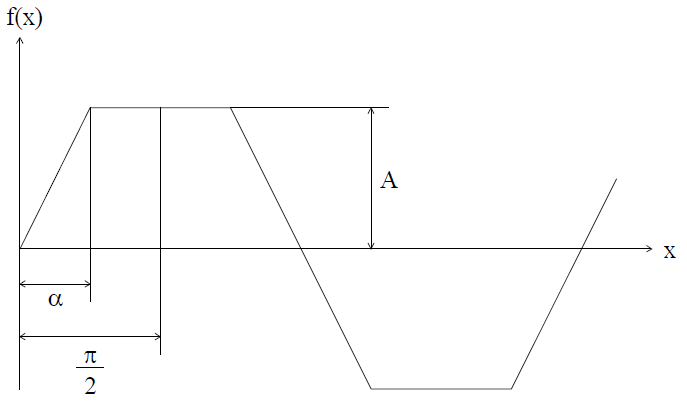

# Лекция №9. Расчет электрических цепей при несинусоидальных периодических токах и напряжения.

В большинстве устройств электроники, радиотехники, автоматики, вычислительной техники токи и напряжения имеют отличную от синусоидальной форму, оставаясь периодическими функциями времени. Расчет цепей при несинусоидальных периодических возмущающих воздействиях в курсе электротехники составляет самостоятельный раздел, не зависимо от того, чем вызвана несинусоидальность. Причиной несинусоидальности могут быть паразитные явления, протекающие в электротехнических установках: несимметричность генераторов, нелинейность характеристик элементов и т.д.
Широко применяются устройства, в которых несинусоидальность возмущающих воздействий создается преднамеренно и несет определенную информацию: вычислительные устройства, системы связи и т.п.
Метод расчета электрических цепей при несинусоидальных периодических токах и напряжениях основан на разложении кривой в гармонический ряд Фурье и применении принципа наложения.

## § 1. Разложение несинусоидальной функции в тригонометрический ряд

Всякая периодическая функция, удовлетворяющая условиям Дирихле, т.е. имеющая на конечном интервале изменения аргумента конечное число разрывов первого рода и конечное число максимумов и минимумов, может быть разложена в тригонометрический ряд:

```math
F(ω t) = A_0 + A_1+sin(ωt+φ_1)+A_2+sin(2ωt+φ_2)+...+A_Ksin(êωt +φ_ê)...
```

или

```math
F(ω t) = \sum^∞_{K=0}A_Ksin(êωt + φ_K).
```

Первый член ряда называют постоянной составляющей, второй член
ряда - основной синусоидальной или первой гармоникой, остальные - высшими гармониками.
Основная частота 

```math
ω = \frac{2π}{T}
```

равна частоте несинусоидальной периодической функции.
Для удобства подсчета коэффициентов ряда, его обычно представляют в форме:

```math
F(ω t) = A_0+B_1sinωt+C_1cosωt+B_2sin2ωt+C_2cos2ωt+...+B_Ksinkωt+C_Kcoskωt+...
```

Эту форму получают, если для каждого члена ряда

```math
sin(kωt+φ_K) = sinkωtcosφ_K+coskωtsinφ_K.
```

Таким образом,

```math
B_K = A_Kcosφ_K; \ C_K = A_Ksinφ_K;
```

```math
A_K=\sqrt{{B^2_K}+{C^2_K}}; \ φ_K = arctg\frac{C_K}{B_K}
```

Коэффициенты вычисляются по следующей формуле:

```math
A_0=\frac{1}{2π}\int^π_{-π}F(ωt)d(ωt).
```

$A_0$  - среднее значение функции за период (постоянная составляющая тока, напряжения или ЭДС).

```math
B_K=\frac{1}{π}\int^π_{-π}F(ωt)sinkωtd(ωt).
```

```math
C_K=\frac{1}{π}\int^π_{-π}F(ωt)coskωtd(ωt).
```

Периодические функции сигналов, используемых в электротехнике, могут обладать различными видами симметрии:

`1. Симметрия относительно оси абсцисс (рис. 7-1):`

<p align="center" > </p>

```math
f(ωt) = -f(ωt+\frac{T}{2})
```

<p align="center" >Рис. 7-1</p>

Такие функции при разложении в гармонический ряд не имеют постоянной составляющей и не содержат четных гармоник.
Эти положения в математике строго доказываются.

`2. Симметрия относительно оси ординат (рис 7-2).`


<p align="center" > </p>

```math
f(ωt) = -f(-ωt)
```

<p align="center" >Рис. 7-2</p>

В этом случае разложение не содержит синусов, так как синус - функция нечетная.

`3. Симметрия относительно начала координат (рис 7-3).`

<p align="center" > </p>
<p align="center" >Рис. 7-3</p>

При этом разложении функции в ряд не содержит косинусов и постоянной составляющей.
Первый вид симметрии не зависит от начала отсчета времени, т.е. является свойством самой кривой. Второй и третий связаны с началом отсчета.
Рассмотрим несколько примеров разложения.


`Пример 1.` Трапеция, симметричная относительно оси абсцисс 

 и начала координат (рис. 7-4).

<p align="center" > </p>
<p align="center" >Рис. 7-4</p>

Учитывая симметрию, можно заключить, что ряд будет состоять из нечетных синусоид. 

Интегрируем функцию f(x) на отрезке, равном четверти периода, умножая интеграл на 4. 

Определим коэффициенты $B_K$ :

```math
B_K = \frac{4}{π}\int^{\frac{π}{2}}_0f(x)sinkxdx=
```

```math
=\frac{L}{π}\int^π_0A\frac{x}{α}sinkxdx+\frac{4}{π}\int^{\frac{π}{2}}_∞Asinkxdx
```

Разделение интеграла на два связано с тем, что значение функции на участке от 0 до α равно $A\frac{x}{α}$;

на участке от α до π/2 равно A.

По таблицам интегралов находим:

```math
\int xsinkxdx=\frac{sinkx}{k^2}-\frac{xcoskx}{k}
```

тогда

```math
B_K = \frac{4A}{α}\int^∞_0{\{}\frac{4A}{α}=
```
