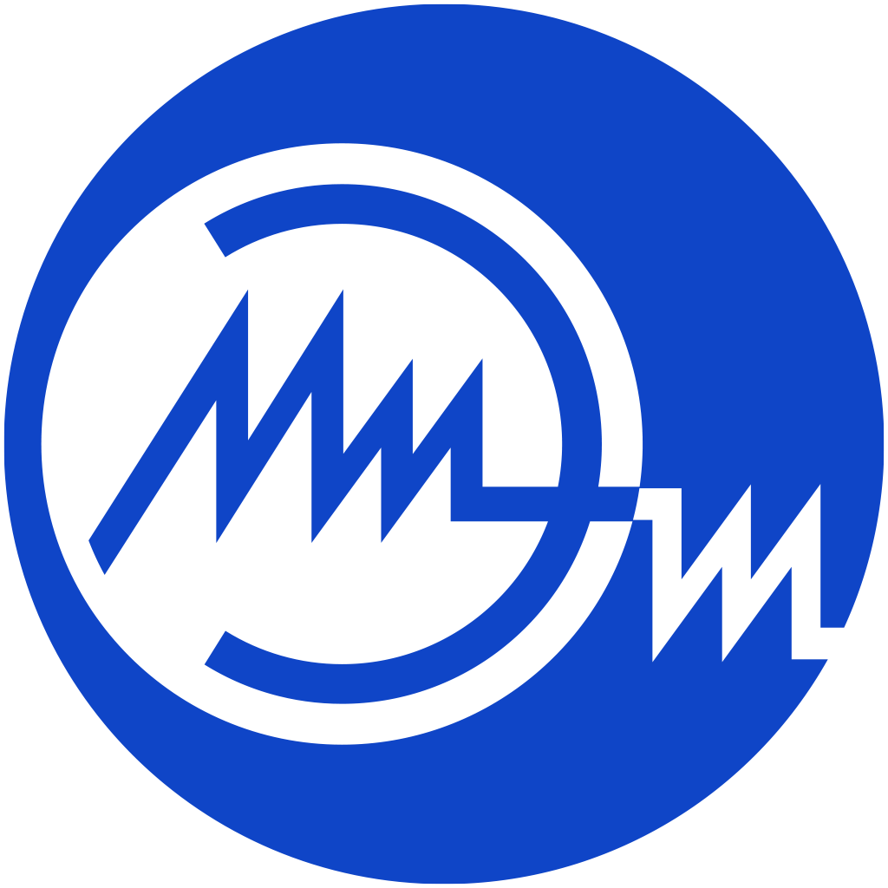

# Электротехника  

          
Этот репозиторий содержит основные материалы по курсу `Электротехника`

---
## О дицсиплине электротехника
---
## Лекции
---
## Лабораторные работы

1. [Лабораторная работа №1. Элементы электрических цепей](./Labs/Lab_1/README.md)
2. 

[Титульник](./Labs/Main_temp.docx)

---
## Практические занятия
---
## Курсовая работа
---
## Промежуточная аттестация
---
## Итоговая аттестация

**[Вопросы к экзамену по электротехнике](./exam/README.md)**

---
## Дополнительные материалы
---
## Полезные ресурсы и материалы в Интернете
---
## Обратная связь и преподаватели
---
## Обзор тематической литературы

